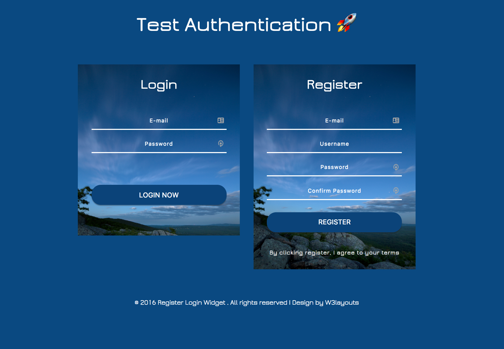

# Starting with Authentication (A tutorial with Node.js and MongoDB)

[](
https://unsplash.com/photos/tGbugCIBaCo)
https://unsplash.com/photos/tGbugCIBaCo

Authentication is an important issue when creating a dynamic web application. This article should clear things up and provide a basic instruction.

[➡️ Github Repo is available here ⬅️](https://github.com/DDCreationStudios/authenticationIntro)


## 📄 Table of contents

  * [Authentication?](#authentication)
  * [What I will use for this introduction](#what-i-will-use-for-this-introduction)
      * [Development Environment](#development-environment)
      * [Dependencies](#dependencies)
      * [Structure](#structure)
  * [User registration](#user-registration)
      * [Connect to MongoDB](#connect-to-mongodb)
      * [Create a schema](#create-a-schema)
      * [Insert data into MongoDB](#insert-data-into-mongodb)
      * [Hashing and salting](#hashing-and-salting)
  * [Sessions and Cookies](#sessions-and-cookies)
      * [Set up Sessions](#set-up-sessions)
  * [Refining the app](#refining-the-app)
  * [Creating custom middleware](#creating-custom-middleware)
  * [A note on scalability with sessions](#a-note-on-scalability-with-sessions)
  * [Wrap up](#wrap-up)
  * [Conclusion](#conclusion)


---

>"For me, privacy and security are really important. We think about it in terms of both: You can't have privacy without security." - Larry Page

---

## Authentication?

Authentication is for identifying users and provide different access rights and content depending on their id.
In most cases the application provides a login form with certain credentials to verify a user.

It's necessary to understand:
- authentication as
- authorization as
- a session
- cookies


## What I will use for this introduction

#### Development Environment
In this example here I will use
- Plain JavaScript
- Node.js
- Express (JS framework)
- MongoDB (Database)
- Yarn (package management)
- Visual Studio Code as editor

for writing the authentication.

For the login mask I will use the awesome [template from w3layouts](https://w3layouts.com/register-login-widget-flat-responsive-widget-template/).

#### Dependencies

Following packages are used
- body-parser (for parsing incoming requests)
- express (to make the application run)
- [nodemon](https://github.com/remy/nodemon) (restarting server when changes occur)
- [mongoose](http://mongoosejs.com/docs/) (object data modeling to simplify interactions with MongoDB)
- [bcrypt](https://www.npmjs.com/package/bcrypt) (for hashing and salting passwords)
- [express session](https://www.npmjs.com/package/express-session) (to handle sessions)
- [connect-mongo](https://www.npmjs.com/package/connect-mongo) (for storing sessions in MongoDB)

#### Structure

The tutorial will be structured in:
- User registration (setting up routes and database)
- Sessions and Cookies (connecting them to login routes)
- Creating custom middleware (to improve the performance)

## User registration

I'll start with a basic express starter setup, which simply creates a webserver and serves the static files from the template on the home route. [(see on Github commit)](https://github.com/DDCSLearning/authenticationIntro/commit/97da94b5b6b52c4f2452d92eb0e92a110a97a1f4)

#### Connect to MongoDB

- install [Mongoose](http://mongoosejs.com/docs/)
- install mondodb
- setup up mongod if you haven't [(tutorial)](https://treehouse.github.io/installation-guides/mac/mongo-mac.html)
- be sure to start nodemon again with the running mongod on localhost!

#### Create a schema

MongoDB is a document database, which stores JSON like objects. The model/schema describes what this objects should contain.

- create a schema according to the [docs](http://mongoosejs.com/docs/guide.html) and store it in an own folder
- the schema should describe the fields we have in our form and specify the data it can expect

It should look something like this:

```javascript
var mongoose = require('mongoose');
var UserSchema = new mongoose.Schema({
  email: {
    type: String,
    unique: true,
    required: true,
    trim: true
  },
  username: {
    type: String,
    unique: true,
    required: true,
    trim: true
  },
  password: {
    type: String,
    required: true,
  },
  passwordConf: {
    type: String,
    required: true,
  }
});
var User = mongoose.model('User', UserSchema);
module.exports = User;
```

#### Insert data into MongoDB

- add [body-parser](https://github.com/expressjs/body-parser) for parsing incoming request bodies in a middleware
- create a POST route for sending the data to the server
- store the values of the filled out form and store the data in the db with the schema
- it should look like this:

```javascript
if (req.body.email &&
  req.body.username &&
  req.body.password &&
  req.body.passwordConf) {

  var userData = {
    email: req.body.email,
    username: req.body.username,
    password: req.body.password,
    passwordConf: req.body.passwordConf,
  }

  //use schema.create to insert data into the db
  User.create(userData, function (err, user) {
    if (err) {
      return next(err)
    } else {
      return res.redirect('/profile');
    }
  });
}
```

- use the [mongo shell](https://docs.mongodb.com/manual/reference/mongo-shell/) to see if your data has been saved to the database (it should show a document in `db.users.find()` )

#### Hashing and salting

**Cryptographic** hash functions take a piece of information and return a string, representing this information. Hash values cannot easily be "unhashed" or decrypted and that's why they are a perfect fit for passwords.

**Salt values** are random data that is included with the input for the hash function.

In this tutorial we are using [bcrypt](https://www.npmjs.com/package/bcrypt).

So next:

- install the [bcrypt](https://www.npmjs.com/package/bcrypt) package
- add a prehook to your mongoose schema. should look like this:

```javascript
//hashing a password before saving it to the database
UserSchema.pre('save', function (next) {
  var user = this;
  bcrypt.hash(user.password, 10, function (err, hash){
    if (err) {
      return next(err);
    }
    user.password = hash;
    next();
  })
});
```
- test with mongod if the new data is inserted with a hashed password (it should work)

Compare with my working [commit](https://github.com/DDCSLearning/authenticationIntro/commit/33ac4662c38f7c3115615983cf60effe2ebbd7ed) if needed.

___
⭐ You have just reached 50% of the whole app and the hardest part is already finished! - Keep up! 🚀
___

## Sessions and Cookies

HTTP is a stateless protocol, which means that web servers don't keep track of who is visiting a page. Displaying specific content to logged-in users require this tracking. Therefore **sessions** with a session ID are created.
**Cookies** are key/value pairs managed by browsers. Those correspond with the sessions of the server.


#### Set up Sessions

- add the [express session](https://www.npmjs.com/package/express-session) package
- add the session middleware in your app. A simple one looks like that:

```javascript
//use sessions for tracking logins
app.use(session({
  secret: 'work hard',
  resave: true,
  saveUninitialized: false
}));
```
- store the MongoDB userId (`_id`) in the `req.session.userId`
- setup the login route the same way you set up the register route (in the login you only have the username and password)
- authenticate the input against the data in the database in the user schema. It should look like this:

```javascript
//authenticate input against database
UserSchema.statics.authenticate = function (email, password, callback) {
  User.findOne({ email: email })
    .exec(function (err, user) {
      if (err) {
        return callback(err)
      } else if (!user) {
        var err = new Error('User not found.');
        err.status = 401;
        return callback(err);
      }
      bcrypt.compare(password, user.password, function (err, result) {
        if (result === true) {
          return callback(null, user);
        } else {
          return callback();
        }
      })
    });
}
```

___
❗ Take your time to understand this block of code, since it is the key function in the whole authentication process in my opinion!
___

⭐ Now at this point your actual authentication is working. Congratulation!
___

Compare with my working [commit](https://github.com/DDCSLearning/authenticationIntro/commit/1564715bf713b89bc622adb314577d509eed51ac) if needed.


https://unsplash.com/photos/qCrocisvGwc

## Refining the app

- make sure to adapt your layout accordingly to the sessions (hiding register fields and providing logout buttons)
- create a middleware to make user IDs available in HTML
- create a logout route that destroys the session id and redirects back to the home route. It can look like this:

```javascript
// GET /logout
router.get('/logout', function(req, res, next) {
  if (req.session) {
    // delete session object
    req.session.destroy(function(err) {
      if(err) {
        return next(err);
      } else {
        return res.redirect('/');
      }
    });
  }
});
```

There is much more to add but logging out and destroying the session is important for each authentication system! That's why I've included it here as well.

## Creating custom middleware

Middleware runs after a request is received, but before a response is sent back. In this example the body-parser package is used as middleware. It converts incoming requests into a format that is easy to use for a JS program.

Middleware functions can be chained after each other and fit into the request/response cycle of the application. When writing custom middleware, `next()` always has to be called at the end of that middleware to move to the next one in the cycle.

Middleware can be used in many cases in this example, however, for simplicity reasons, I just reference an example to give an idea.

Example: Creating middleware that requires a login for certain pages.

```javascript
function requiresLogin(req, res, next) {
  if (req.session && req.session.userId) {
    return next();
  } else {
    var err = new Error('You must be logged in to view this page.');
    err.status = 401;
    return next(err);
  }
}
```
```javascript
router.get('/profile', mid.requiresLogin, function(req, res, next) {
  //...
});
```

Writing your own middleware gives you the freedom for ultimate flexibility when refining authentication routes.

##  A note on scalability with sessions

Currently sessions are stored in RAM. To store have more size we can connect the session store to MongoDB. I'll use the [connect-mongo](https://www.npmjs.com/package/connect-mongo) package for that.

- simply add the store like instructed on their docs. It should now look like this:

```javascript
//use sessions for tracking logins
app.use(session({
  secret: 'work hard',
  resave: true,
  saveUninitialized: false,
  store: new MongoStore({
    mongooseConnection: db
  })
}));
```
- when checking with the mongo shell you should see how the new collection "sessions" is created. When logging in or out the data in that collection changes accordingly.


## Wrap up

- always make sure to transfer credentials in an encrypted way from the browser to the server and backwards
- be sure to add a security certificate to your HTTP (HTTPS)
- keep in mind that this way (with sessions and cookies) was only one way to authenticate, others are for example
  - token based authentication with OAuth or JSON Web Tokens
  - or with the [passport middleware](http://passportjs.org/)



Checkout my [repo on github](https://github.com/DDCreationStudios/authenticationIntro) for the code.

## Conclusion

That's how easy an authentication system can be implemented with Node.js and MongoDB.

If you want to follow along with my Github repo, be aware that I was refactoring my files constantly to fix issues and improve. So I'd suggest to just look at the finished version. Also note that my current develop environment is not optimized - I just started with VS Code and didn't set up a lot, which is why many errors are overseen. It was more of a quick introduction to get the point about authentication across.

This is also covered in more detail on treehouse:
<a href="http://referrals.trhou.se/danieldeutsch3" target="_blank"></a>

If you gained something from this article let me know with a comment or heart. Make sure to follow for more :)


<!-- Written by Daniel Deutsch (deudan1010@gmail.com) -->
