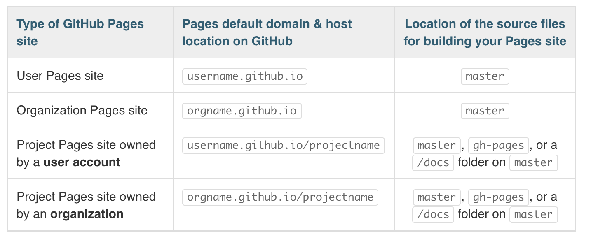
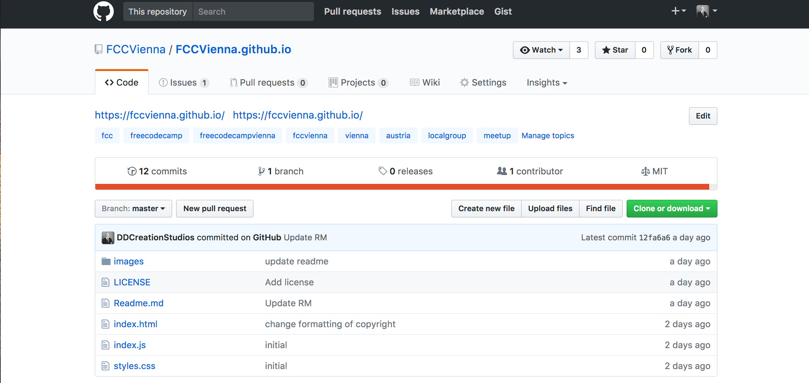
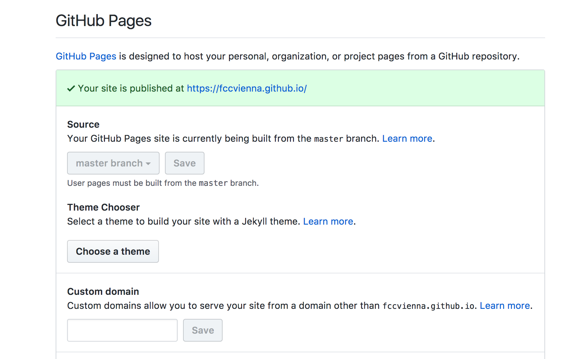
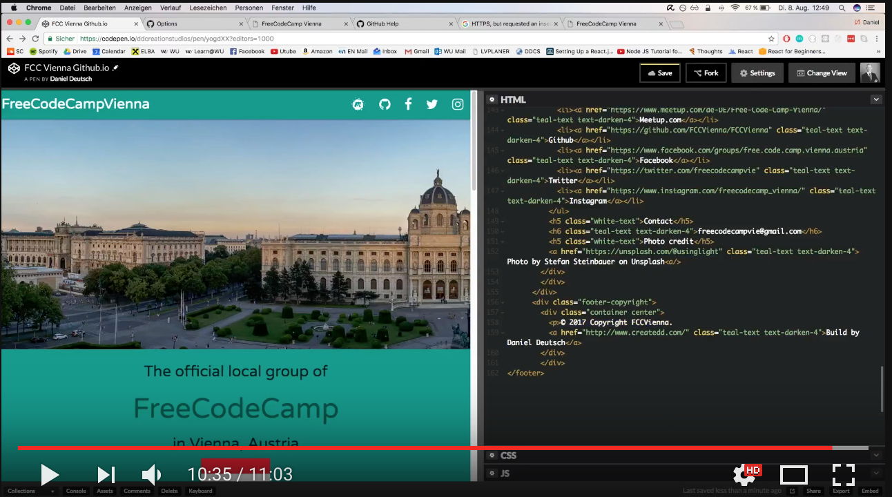

# Publishing an organization homepage on Github Pages

[➡️ Github Repo is available here ⬅️](https://github.com/DDCreationStudios/fccvienna.github.io)

I am organizing a local group meetup of [FreeCodeCamp](https://www.freecodecamp.org/) called [FreeCodeCamp Vienna](https://www.meetup.com/Free-Code-Camp-Vienna/). Months ago we decided to create a simple homepage to represent the group and it's progress online, but we never seemed to find the time to do it. Following the idea "better a quick homepage than no homepage at all" I decided to create one and publish it on Github Pages. Not only does it allow us to host our static page, but also serves as a perfect example for how easy something can be published online.

## 📄 Table of contents

- [Name your repository](#name-your-repository)
- [Build your Homepage](#build-your-homepage)
- [Put your Code on Github](#put-your-code-on-github)
- [Set the source for your Github Pages](#set-the-source-for-your-github-pages)
- [See your amazing homepage at the provided link](#see-your-amazing-homepage-at-the-provided-link)
- [See the result for FreeCodeCamp Vienna](#see-the-result-for-freecodecamp-vienna)
- [See the building process on Youtube](#see-the-building-process-on-youtube)

---
>"Opportunities Don’t Come Knocking On The Door. They Present Themselves When You Knock The Door Down!" – Greg Plitt
---

## Name your repository

When publishing to Github Pages choosing the right repository name is crucial. 

[This page](https://help.github.com/articles/user-organization-and-project-pages/) from Github explains it perfectly:

Therefore you need to name the repository exactly like the organization with ".github.io" at the end.

## Build your Homepage

After creating the repository build your homepage with HTML, CSS and Javascript. 

>Tip: I was using [codepen](https://codepen.io/ddcreationstudios/pen/yogdXX) during development. It is REPL and allows you to receive instant feedback from the code you are writing. 

In order to speed up the layout process and add cool features I was using [Materializecss](http://materializecss.com/getting-started.html). I have used it in the past and always had been happy with the results.

## Put your Code on Github

Next, put your files on Github follwing the instructions.

>Be sure to have the files on your "Master" branch

And choose the source of your Github Pages for the master branch.

>Organization pages need the source files in the Master branch according to Github.

## Set the source for your Github Pages

Your settings should look like this:

 

## See your amazing homepage at the provided link

Follow the provided link or type your organization name with ".github.io" in the URL bar. 

## See the result for FreeCodeCamp Vienna

<a href="https://fccvienna.github.io/">
https://fccvienna.github.io/
</a>

## See the building process on Youtube

Thanks for reading my article! Feel free to leave any feedback! 

<!-- Written by Daniel Deutsch (deudan1010@gmail.com) -->
