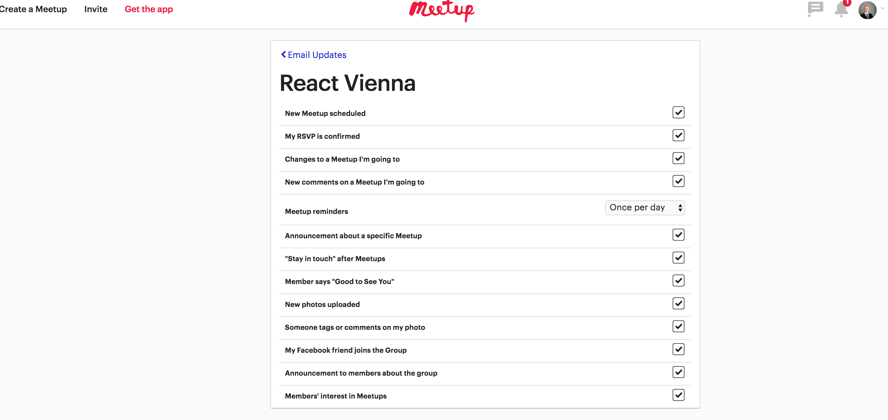

# Reduce your time clicking elements on the web

https://unsplash.com/photos/7nsqPSnYCoY by <a style="background-color:black;color:white;text-decoration:none;padding:4px 6px;font-family:-apple-system, BlinkMacSystemFont, &quot;San Francisco&quot;, &quot;Helvetica Neue&quot;, Helvetica, Ubuntu, Roboto, Noto, &quot;Segoe UI&quot;, Arial, sans-serif;font-size:12px;font-weight:bold;line-height:1.2;display:inline-block;border-radius:3px;" href="http://unsplash.com/@acharki95?utm_medium=referral&amp;utm_campaign=photographer-credit&amp;utm_content=creditBadge" target="_blank" rel="noopener noreferrer"><svg xmlns="http://www.w3.org/2000/svg" style="height:12px;width:auto;position:relative;vertical-align:middle;top:-1px;fill:white;" viewBox="0 0 32 32"><path d="M20.8 18.1c0 2.7-2.2 4.8-4.8 4.8s-4.8-2.1-4.8-4.8c0-2.7 2.2-4.8 4.8-4.8 2.7.1 4.8 2.2 4.8 4.8zm11.2-7.4v14.9c0 2.3-1.9 4.3-4.3 4.3h-23.4c-2.4 0-4.3-1.9-4.3-4.3v-15c0-2.3 1.9-4.3 4.3-4.3h3.7l.8-2.3c.4-1.1 1.7-2 2.9-2h8.6c1.2 0 2.5.9 2.9 2l.8 2.4h3.7c2.4 0 4.3 1.9 4.3 4.3zm-8.6 7.5c0-4.1-3.3-7.5-7.5-7.5-4.1 0-7.5 3.4-7.5 7.5s3.3 7.5 7.5 7.5c4.2-.1 7.5-3.4 7.5-7.5z"></path></svg>Aziz Acharki</a>

Since I am an organizer of a meetup ([FCC Vienna](https://www.meetup.com/de-DE/Free-Code-Camp-Vienna/)) in need to spend time on their platform [meetup.com](meetup.com). I think their website could use an update in terms of user experience, but I really like the functionality and concept. However, one thing that really bothers me are the limited options to regulate your email notification settings. In the today's fast moving world I don't have time to click hundreds of checkboxes just in order to be safe from SPAM, so I found a faster solution using JavaScript.

## 📄 Table of contents

  * [Using the power of JavaScript on the web](#using-the-power-of-javascript-on-the-web)
    * [The problem](#the-problem)
    * [The solution](#the-solution)
    * [If a developer of meetup.com is reading this](#if-a-developer-of-meetupcom-is-reading-this)
  * [Useful links & credits](#useful-links-credits)

---
>"The less effort, the faster and more powerful you will be." - Bruce Lee
---

## Using the power of JavaScript on the web

The fact that all webpages are or can be controlled by JavaScript provides additional opportunities for those who are capable of using it in the console.

### The problem

In order to change the email notification settings for each meetup you have to click on each meetup and the uncheck each of those boxes. When I am now a member of many groups I have to go through the process many times, which offends me in some way since my time is very valueable.

So to solve that task programmatically, I identify the checkbox element in the chrome inspector:

After that I am using the `document.querySelector` to grab those elements and store it in an array:

`[...document.querySelectorAll('.icon-s')]`

### The solution

Now use `.foreach` on the array and click each item.

`[...document.querySelectorAll(".icon-s")].forEach(box=> {
  box.click();
})`

___
🚀 That's how fast and easy you can solve that problem
___

These 3 lines of code save you a lot of time when you have to click many times. Be sure to use your powerful knowledge of JavaScript in your day-to-day work. 😃

### If a developer of meetup.com is reading this

please adapt the UX of the homepage. Thanks a lot :D

## Useful links & credits
- [MDN querySelectors](https://developer.mozilla.org/en/docs/Web/API/Document/querySelector)
- [Wes Bos fights recruiter SPAM programmatically](https://www.youtube.com/watch?v=Ddu1T3BdATg)

If you gained something from this article let me know with a comment or heart. Make sure to follow for more :)

<!-- Written by Daniel Deutsch (deudan1010@gmail.com) -->
