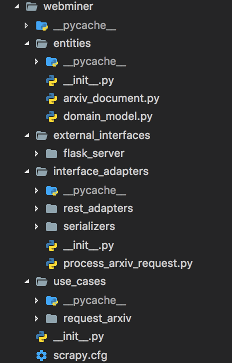

# Clean architecture in short

Photo by Rubén García on Unsplash - https://unsplash.com/photos/R-wQExeiGrc

In an [open source project](https://github.com/Keep-Current) I started to contribute to, the concept of "clean architecture" was brought to me.

First, it was pretty overwhelming, but after some reading it made sense. I thought it might be helpful for others to write down my findings.

## Table of Contents

- [Clean architecture in short](#clean-architecture-in-short)
	- [Table of Contents](#table-of-contents)
	- [Visual representations](#visual-representations)
	- [The concept - presented in bullet points](#the-concept---presented-in-bullet-points)
			- [The value it can provide](#the-value-it-can-provide)
			- [Entities](#entities)
			- [Use Cases](#use-cases)
			- [Interfaces / Adapters](#interfaces--adapters)
			- [External Interfaces](#external-interfaces)
	- [Code example](#code-example)
	- [Resources](#resources)

## Visual representations

I think it's always good to start with some visualization.

Here are the most common pictures of this concept.

Source and credit: https://8thlight.com/blog/uncle-bob/2012/08/13/the-clean-architecture.html

---

Source and credit: https://www.codingblocks.net/podcast/clean-architecture-make-your-architecture-scream/

---

Source and credit: Mattia Battiston, under CC BY 4.0, https://github.com/mattia-battiston/clean-architecture-example

---

Source and credit: https://marconijr.com/posts/clean-architecture-practice/

## The concept - presented in bullet points

Extended from Source and credit: [Mattia Battiston, under CC BY 4.0](https://github.com/mattia-battiston/clean-architecture-example)

#### The value it can provide

- Effective testing strategy that follows the testing pyramid
- Frameworks are isolated in individual modules so that when (not if) we change our mind we only have to change one place, with the rest of the app not even knowing about The app has use cases rather than being tied to a CRUD system
- Screaming architecture a.k.a. it screams its intended usage. When you look at the package structure you get a feel for what the application does rather than seeing technical details
- All business logic is in a use case so it's easy to find and it's not duplicated anywhere else
- Hard to do the wrong thing because modules enforce compilation dependencies. If you try to use something that you're not meant to, the app doesn't compile
- It is always ready to deploy by leaving the wiring up of the object for last or by using feature flags, so we get all the benefits of continuous integration
- Multiple works on stories so that different pairs can easily work on the same story at the same time to complete it quicker
- Good monolith with clear use cases that you can split in microservices later one, once you've learnt more about them

#### Entities

- Represent your domain object
- Apply only logic that is applicable in general to the whole entity (e.g. validating the format of an hostname)
- Plain objects: no frameworks, no annotations

#### Use Cases

- Represent your business actions, it’s what you can do with the application. Expect one use case for each business action
- Pure business logic, plain code (expect maybe some utils libraries)
- The use case doesn't know who triggered it and how the results are going to be presented (e.g. could be on a web page, or - returned as json, or simply logged, etc.)
- Throws business exceptions

#### Interfaces / Adapters

- Retrieve and store data from and to a number of sources (database, network devices, file system, 3rd parties, etc.)
- Define interfaces for the data that they need in order to apply some logic. One or more dataproviders will implement the - interface, but the use case doesn’t know where the data is coming from
- Implement the interfaces defined by the use case
- Are ways to interact with the application, and typically involve a delivery mechanism (e.g. REST APIs, scheduled jobs, GUI, other systems)
- Trigger a use case and convert the result to the appropriate format for the delivery mechanism
- the controller for a MVC

#### External Interfaces

- Use whatever framework is most appropriate (they are going to be isolated here anyway)

## Code example

See the structure on [GitHub](https://github.com/Createdd/web-miner/tree/master/webminer).

First of all, it is important to understand that the clean architecture is a bundle of organising principles. So therefore everything is open to personal adjustments as long as core ideas are kept.
The linked repository is a fork of the original project that brought this architecture design idea to me. Feel free to check out the original project as well, as it reflects further improvements.

The webminer folder is structured into the basic layers:

1.  entities
2.  use_cases
3.  interfaces_adapters
4.  external_interfaces

It shall reflect the very basic approach for the design pattern.

- Starting from `entities` you can see that the core model of this project is the `arxiv_document`
- The next folder, `use_cases` shows our use case, namely to request the arxiv page
- After that we go through the `interface_adapters` folder that provides adapters for process requests in a REST application or for serializing
- The final and last layer is `external_interfaces`, where we use the flask server and implement the REST functionality

All of those layers are dependent on the core layers but not the other way around.

---

Do you agree? If not, why?
Thanks for reading my article! Feel free to leave any feedback!

---

## Resources

Here are some articles I found helpful understanding the concept "clean architecture":

- https://8thlight.com/blog/uncle-bob/2012/08/13/the-clean-architecture.html
- https://www.codingblocks.net/podcast/clean-architecture-make-your-architecture-scream/
- https://github.com/mattia-battiston/clean-architecture-example
- https://medium.com/@tiagoflores_23976/how-choose-the-appropriate-ios-architecture-mvc-mvp-mvvm-viper-or-clean-architecture-2d1e9b87d48
- https://de.slideshare.net/HimanshuDudhat1/mvp-clean-architecture
- https://softwareengineering.stackexchange.com/questions/336677/what-is-the-difference-between-mvp-and-clean-architecture
- https://engineering.21buttons.com/clean-architecture-in-django-d326a4ab86a9
- https://gist.github.com/ygrenzinger/14812a56b9221c9feca0b3621518635b
- https://medium.freecodecamp.org/how-to-write-robust-apps-consistently-with-the-clean-architecture-9bdca93e17b
- https://marconijr.com/posts/clean-architecture-practice/

---

Daniel is a LL.M. student in business law, working as a software engineer and organizer of tech related events in Vienna.
His current personal learning efforts focus on machine learning.

Connect on:

- [LinkedIn](https://www.linkedin.com/in/createdd)
- [Github](https://github.com/Createdd)
- [Medium](https://medium.com/@ddcreationstudi)
- [Twitter](hhttps://twitter.com/_createdd)
- [Steemit](https://steemit.com/@createdd)
- [Hashnode](https://hashnode.com/@DDCreationStudio)

<!-- Written by Daniel Deutsch (deudan1010@gmail.com) -->
