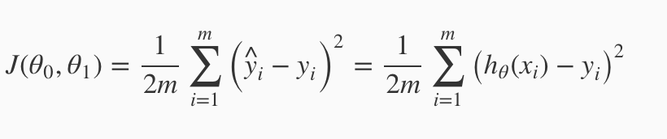

# The concept of regression - use the power in everyday life

fsdgsdgsdgsdgds

[Open Source Code on Github](asdfasdf)

## 📄 Table of contents

---
>"dsasfasfasf"  - Bezos
---

## What Regression analysis is all about 

The Regression analysis is a statistical method evaluating the relationship between different variables. 

This can be a very powerful tool in decision making. If you think certain variables in your everyday life, for example profits and sales, have a relationship, this method helps evaluate your assumptions and provide additional information for future actions. The benefits apply to as well for business men of highest rank deciding future plans in their businesses but also for ordinary people trying to improve their day-to-day decisions.

# How to apply this concept

### Find variables

For simplicity reasons I want to explain the simple linear regression concept, because it is already effective and easy to apply.

In this case we need to find a one(!) variable, which is dependent on another variable. An easy example would be sales and profit. 
The Profit variable is directly dependent on the sales variable. 

An important factor is linearity, which means that the factor follows the linear equation.

As wikipedia defines it: 
>"A linear equation is an algebraic equation in which each term is either a constant or the product of a constant and (the first power of) a single variable (however, different variables may occur in different terms)."

Or simple: When scatter plotted on a graph, the relationship can be illustrated on a straight line.

### Create and test the model

The most common technique to for evaluating the model is called "ordinary least squares". 

Basically, the formula tries to use the slope and the intercept of the regression equation to measure the relationship between the 2 variables and minimize the distance from further dependent variables.

Test the model with a null hypothesis measuring if there is a relationship between the variables. If the null hypothesis equals zero and can't be rejected, there is no relationship between variables. 

## Math behind the model

Testing the accuracy of the null hypothesis can be done with the "cost function".

This function compares the average of the predicted and real values.
The goal is to choose the parameters so that the difference of the null hypothesis of x to the actual y is as small as possible.

## Useful links & credits
- [📄 "Begin"](afgafgadgads)

---

Thanks for reading my article! Feel free to leave any feedback! 

---

<!-- Written by Daniel Deutsch (deudan1010@gmail.com) -->
