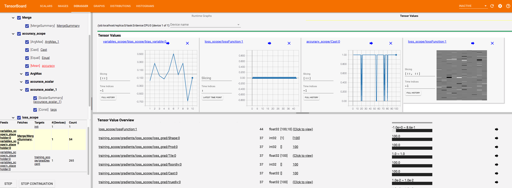
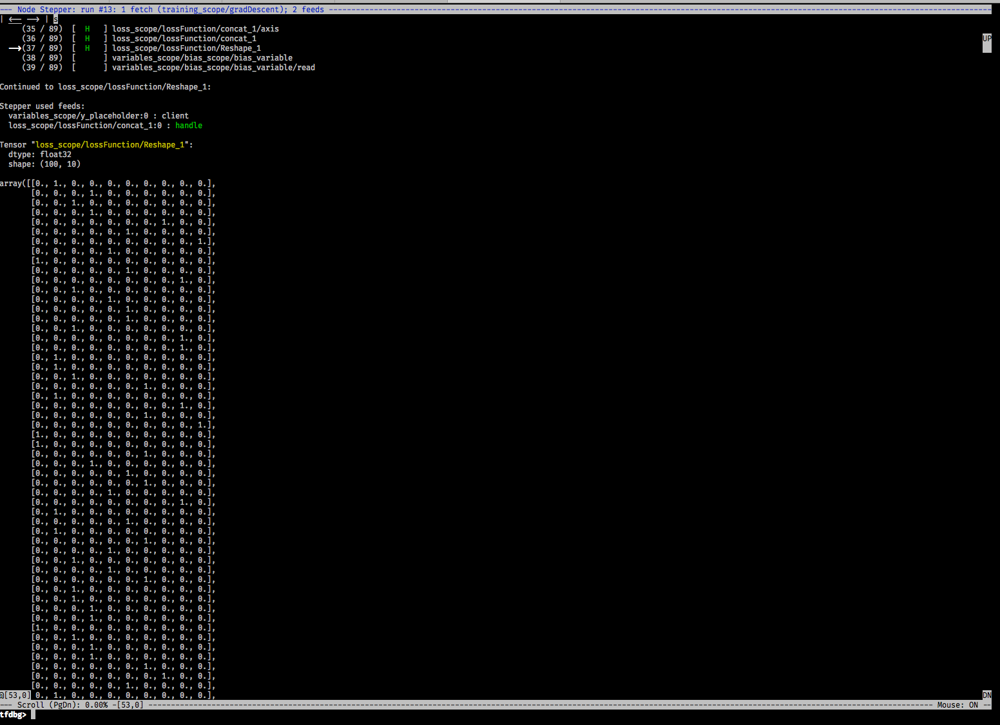

# Debugging TensorFlow - A starter

[](https://unsplash.com/photos/5brvJbR1Pn8)
Photo by Matthew Kane on Unsplash - https://unsplash.com/photos/5brvJbR1Pn8

## Table of Contents

- [Debugging TensorFlow - A starter](#debugging-tensorflow---a-starter)
	- [Table of Contents](#table-of-contents)
	- [What this is about](#what-this-is-about)
	- [The reference code base](#the-reference-code-base)
	- [1. Fetch and print values within Session.run](#1-fetch-and-print-values-within-sessionrun)
	- [2. Use the tf.Print operation](#2-use-the-tfprint-operation)
	- [3. Use Tensorboard visualization for monitoring](#3-use-tensorboard-visualization-for-monitoring)
		- [a) clean the graph with proper names and name scopes](#a-clean-the-graph-with-proper-names-and-name-scopes)
		- [b) Add tf.summaries](#b-add-tfsummaries)
		- [c) Add a tf.summary.FileWriter to create log files](#c-add-a-tfsummaryfilewriter-to-create-log-files)
		- [d) Start the tensorboard server from your terminal](#d-start-the-tensorboard-server-from-your-terminal)
	- [4. Use the Tensorboard debugger](#4-use-the-tensorboard-debugger)
	- [5. Use the TensorFlow debugger](#5-use-the-tensorflow-debugger)
	- [Conclusio](#conclusio)

## What this is about

> Debugging is twice as hard as writing the code in the first place. Therefore, if you write the code as cleverly as possible, you are, by definition, not smart enough to debug it. - BRIAN W. KERNIGHAN

Debugging in general is sometimes a tedious and challenging task. Nevertheless it is absolutely necessary to be comfortable to go through the written code and be able to identify problems.
Normally there are many guides and the process of debugging is often well documented for many languages and frameworks.

When it comes to TensorFlow however, some new challenges arise because of the way it works.

As the [official documentation](https://www.tensorflow.org/guide/low_level_intro) states:

A TensorFlow Core programs as consisting of two discrete sections:

1.  Building the computational graph (a tf.Graph).
1.  Running the computational graph (using a tf.Session).


Source and credit to https://www.tensorflow.org/guide/graphs

The actual computation is done with `session.run()`, which means that we need to find a way to inspect values inside this function.

## The reference code base

As a reference I will provide my Github repository with the corresponding code [here](https://github.com/Createdd/tensorFlowTest/blob/debug/mnistPlain/mnistBasic.py).

We will use a basic neural network to classify handwritten digits from the MNIST dataset, using:

- `tf.nn.softmax_cross_entropy_with_logits_v2` as TF classification operation for defining the loss
- `tf.train.GradientDescentOptimizer` for minimizing the loss

Running this small neural network shows, that it can already achieve a Accuracy of **~92%**

Gist: https://gist.github.com/Createdd/e438507adc368a78286caede4622aedb

Now for debugging, there are basically 5 (pragmatic) ways on how to achieve this.

> As a side note: It is often useful to assert shapes to ensure everything works together as intended.

## 1. Fetch and print values within Session.run

This is probably the fastest and easiest way to get the information you need.

- easy and fast
- any evaluation can be fetched from everywhere
- it's necessary to hold the reference to the tensor which is bad in complex models

In essence, you run the session in a print statement and feed it the dictionary, like `print( f"The bias parameter is: {sess.run(b, feed_dict={x: mnist.test.images, y_: mnist.test.labels})}" )`


If the code gets more complex, the [partial_run execution of a session](https://www.tensorflow.org/api_docs/python/tf/Session#partial_run) could be used. But since this is an experimental feature I will not implement this for demonstration.

Additionally, don't forget the [`.eval()`](https://www.tensorflow.org/api_docs/python/tf/Tensor#eval) method for evaluating tensors in specific.

Gist: https://gist.github.com/Createdd/8dad9440d71a841a7e753420891ecea7

[See full code here on Github.](https://github.com/Createdd/tensorFlowTest/blob/debug/fetchValuesInSession/mnistBasic.py)

## 2. Use the tf.Print operation

The [tf.Print method](https://www.tensorflow.org/api_docs/python/tf/Print) comes in handy during run-time evaluation when we don't want to explicitly fetch the code with session.run(). It is an identity op that prints data when evaluating.

- it allows to see the development of values during evaluation
- it has limited configuration and therefore can easily clog the terminal


Yufeng G created a fantastic video and [article about how to use the tf.Print statement](https://towardsdatascience.com/using-tf-print-in-tensorflow-aa26e1cff11e). And as he points out, it is vital to structure the print node the way that it is used further. As he says:

> It is vitally important that you actually use this returned node, because if you don’t, it will be dangling.

In my code I added a print statement that fetches the values within the session to illustrate how both methods perform differently in execution.

With runtime evaluation comes the possibility of [runtime assertion](https://www.tensorflow.org/api_guides/python/check_ops#asserts-and-boolean-checks) with `tf.Assert` .

Gist: https://gist.github.com/Createdd/7bdac64d96192462b3a5018c048ce770

[See full code code here.](https://github.com/Createdd/tensorFlowTest/blob/debug/tfPrint/mnistBasic.py)

## 3. Use Tensorboard visualization for monitoring

Before diving into this debugging method, be aware that there is the **Tensorboard** and the **Tensorboard debugger**!

The [TF website](https://www.tensorflow.org/guide/summaries_and_tensorboard) offers a great tutorial for implementing and using the board.

Key for the usage is the serializing of the data. TensorFlow provides the summary operations, which allow to export condensed information about the model. They are like anchors telling the visualization board what to plot.

### a) clean the graph with proper names and name scopes

First we need to organize all the variables and operations with the [`scope` methods](https://www.tensorflow.org/guide/graph_viz#name_scoping_and_nodes) that TF provides.

```python
with tf.name_scope("variables_scope"):
    x = tf.placeholder(tf.float32, shape=[None, 784], name="x_placeholder")
    y_ = tf.placeholder(tf.float32, shape=[None, 10], name="y_placeholder")
```

### b) Add tf.summaries

For example (from the TF website):

```python
with tf.name_scope("weights_scope"):
    W = tf.Variable(tf.zeros([784, 10]), name="weights_variable")
    tf.summary.histogram("weight_histogram", W)
```

### c) Add a tf.summary.FileWriter to create log files

Tipp: Make sure to create sub folders for each log to avoid accumulation of graphs

### d) Start the tensorboard server from your terminal

For example: `tensorboard --logdir=./tfb_logs/ --port=8090 --host=127.0.0.1`

Navigating to the tensorboard server (in this case `http://127.0.0.1:8090`) shows the following:


Now the full power and use of tensorboard becomes clear. It allows you very easily to spot errors in your machine learning model. My code example is a very simple one. Imagine a model with multiple layers and more variables and operations!

Gist: https://gist.github.com/Createdd/a47e630e052a70c34cb845ad52cead58

[See full code here on Github.](https://github.com/Createdd/tensorFlowTest/blob/debug/tensorboard/mnistBasic.py)

## 4. Use the Tensorboard debugger

As the [Tensorboard Github repository](https://github.com/tensorflow/tensorboard/tree/master/tensorboard/plugins/debugger) states:

> This dashboard is in its alpha release. Some features are not yet fully functional.

However, this does not mean that it can already be used and provides cool debugging features. Please check out the Github repository to get an adequate overview and also see their [video](https://www.youtube.com/watch?v=XcHWLsVmHvk) to get a deeper understanding. They have done a great job.

To accomplish this there are 3 things to add to our previous example:

1.  Import `from tensorflow.python import debug as tf_debug`
2.  Add your session with `tf_debug.TensorBoardDebugWrapsperSession`
3.  Add to your tensorboard server the `debugger_port`

Now you have the possibility to debug the whole visualized model like with any other debugger but with a beautiful map.
You are able to select certain nodes and inspect them, control execution with the "step" and "continue" buttons and visualizing tensors and their values.



There is much more to talk about this unique feature of Tensorflow but I will probably dedicate an own article to that.

Gist: https://gist.github.com/Createdd/d34e252b6f1ff33d3eb39a7c8b963eeb

[See my full code here on Github.](https://github.com/Createdd/tensorFlowTest/blob/debug/tensorboardDebugger/mnistBasic.py)

## 5. Use the TensorFlow debugger

The last method, but also very powerful is the [CLI TensorFlow debugger](https://www.tensorflow.org/guide/debugger).

This debugger focuses on the command-line interface (CLI) of tfdbg, as opposed to the graphical user interface (GUI) of tfdbg, i.e., the TensorBoard Debugger Plugin.

You simply wrap the session with `tf_debug.LocalCLIDebugWrapperSession(sess)` and then you start the debugging with executing the file. (maybe it's necessary to add the `--debug` flag)

It basically allows to run and step through the execution of your model, while providing evaluation metrics.

I think the [official documention](https://www.tensorflow.org/guide/debugger#frequently_asked_questions) could be improved, but they also have created a [video](https://www.youtube.com/watch?v=CA7fjRfduOI&t=53s) which introduces the feature in a good way.

So the key feature here are the commands `invoke_stepper` and then pressing `s` to step through each operation. It is the basic debugger functionality of a debugger but in the CLI. It looks like this:



Gist: https://gist.github.com/Createdd/83fd4241a94a9164737602134a4e243e

[See full code here on Github.](https://github.com/Createdd/tensorFlowTest/blob/debug/tfdbg/mnistBasic.py)

## Conclusio

As shown, there are many ways on how to debug a TensorFlow application. Each method has its own strengths and weaknesses.
I didn't mention the Python debugger, because it is not TensorFlow specific, but keep in mind that the simple Python debugger already provides some good insights!

There is a great [presentation by Wookayin](https://wookayin.github.io/tensorflow-talk-debugging/#74) who talks about those concepts as well but also freshes up some general debugging advise, which is:

- name tensors properly
- check and sanitize input
- logging
- assertions
- proper use of exceptions
- failing fast -> immediately abort if something is wrong
- don't repeat yourself
- organize your modules and code

I am really excited for all the n

---

Thanks for reading my article! Feel free to leave any feedback!

---

Daniel is a LL.M. student in business law, working as a software engineer and organizer of tech related events in Vienna.
His current personal learning efforts focus on machine learning.

Connect on:

- [LinkedIn](https://www.linkedin.com/in/createdd)
- [Github](https://github.com/Createdd)
- [Medium](https://medium.com/@ddcreationstudi)
- [Twitter](https://twitter.com/DDCreationStudi)
- [Steemit](https://steemit.com/@createdd)
- [Hashnode](https://hashnode.com/@DDCreationStudio)

<!-- Written by Daniel Deutsch (deudan1010@gmail.com) -->
