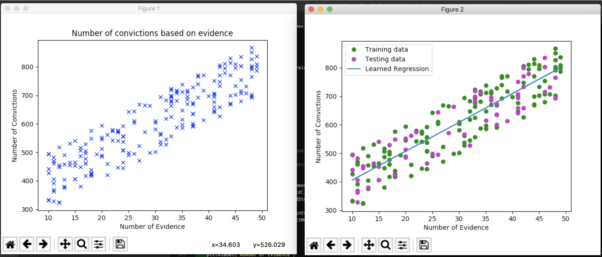

# Law and Statistics - A beginner example using TensorFlow
[](
https://unsplash.com/photos/bD5lzOBx-Cs)
Photo by Steve Roe on Unsplash - https://unsplash.com/photos/bD5lzOBx-Cs


- [Law and Statistics - A beginner example using TensorFlow](#law-and-statistics---a-beginner-example-using-tensorflow)
    - [What we will use](#what-we-will-use)
        - [TensorFlow](#tensorflow)
        - [Numpy (as np)](#numpy-as-np)
        - [Matplotlib](#matplotlib)
    - [Get started](#get-started)
        - [Shell commands for installing everything you need](#shell-commands-for-installing-everything-you-need)
    - [Get data and draw a plot](#get-data-and-draw-a-plot)
        - [Import everything you need](#import-everything-you-need)
        - [Create and plot some numbers](#create-and-plot-some-numbers)
    - [Build a TensorFlow model](#build-a-tensorflow-model)
        - [Prepare data](#prepare-data)
        - [Set up variables and operations for TensorFlow](#set-up-variables-and-operations-for-tensorflow)
        - [Start the calculations with TensorFlow session](#start-the-calculations-with-tensorflow-session)
    - [Visualize the result and the process](#visualize-the-result-and-the-process)

---
## What we will use

### TensorFlow

[Tensors](https://www.tensorflow.org/programmers_guide/tensors)
- tf.placeholders
- tf.Variables

[Helper function](https://www.tensorflow.org/programmers_guide/variables#initializing_variables)
- tf.global_variables_initializer

[Math Operations](https://www.tensorflow.org/api_guides/python/math_ops)
- tf.add
- tf.multiply
- tf.reduce_sum
- tf.pow

[Building a graph](https://www.tensorflow.org/programmers_guide/graphs#building_a_tfgraph)
- tf.train.GradientDescentOptimizer

[Session](https://www.tensorflow.org/programmers_guide/graphs#executing_a_graph_in_a_tfsession)
- tf.Session

### Numpy (as np)

- np.random.seed
- np.random.zeros
- np.random.randint
- np.random.randn
- np.random.asanyarray

### Matplotlib


## Get started

Install TensorFlow with virtualenv. See the [guide](https://www.tensorflow.org/install/install_mac) on the TF website.

### Shell commands for installing everything you need

```shell
sudo easy_install pip

pip3 install --upgrade virtualenv 

virtualenv --system-site-packages <targetDirectory>

cd <targetDirectory>

source ./bin/activate 

easy_install -U pip3

pip3 install tensorflow 

pip3 install matplotlib

```
## Get data and draw a plot

### Import everything you need

```python
import tensorflow as tf
import numpy as np
import math
import matplotlib
matplotlib.use('TkAgg')
import matplotlib.pyplot as plt
import matplotlib.animation as animation
```

### Create and plot some numbers

```python
# Generate evidence numbers between 10 and 20
# Generate a number of convictions from the evidence with a random noise added
np.random.seed(42)
sampleSize = 200
numEvid = np.random.randint(low=10, high=50, size=sampleSize)
numConvict = numEvid * 10 + np.random.randint(low=200, high=400, size=sampleSize)

# Plot the data to get a feeling
plt.title("Number of convictions based on evidence")
plt.plot(numEvid, numConvict, "bx")
plt.xlabel("Number of Evidence")
plt.ylabel("Number of Convictions")
plt.show(block=False)  # Use the keyword 'block' to override the blocking behavior
```

## Build a TensorFlow model

To build a basic machine learning model, we need to prepare the data, make predictions, measure the loss and optimize by minimizing the loss.

### Prepare data

```python
# create a fumnction for normalizing values
# use 70% of the data for training (the remaining 30% shall be used for testing)
def normalize(array):
    return (array - array.mean()) / array.std()


numTrain = math.floor(sampleSize * 0.7)

# convert list to an array and normalize arrays
trainEvid = np.asanyarray(numEvid[:numTrain])
trainConvict = np.asanyarray(numConvict[:numTrain])
trainEvidNorm = normalize(trainEvid)
trainConvictdNorm = normalize(trainConvict)

testEvid = np.asanyarray(numEvid[numTrain:])
testConvict = np.asanyarray(numConvict[numTrain:])
testEvidNorm = normalize(testEvid)
testConvictdNorm = normalize(testConvict)
```

### Set up variables and operations for TensorFlow

```python
# define placeholders  and variables
tfEvid = tf.placeholder(tf.float32, name="Evid")
tfConvict = tf.placeholder(tf.float32, name="Convict")
tfEvidFactor = tf.Variable(np.random.randn(), name="EvidFactor")
tfConvictOffset = tf.Variable(np.random.randn(), name="ConvictOffset")

# define the operation for predicting the conviction based on evidence by adding both values
# define a loss function (mean squared error)
tfPredict = tf.add(tf.multiply(tfEvidFactor, tfEvid), tfConvictOffset)
tfCost = tf.reduce_sum(tf.pow(tfPredict - tfConvict, 2)) / (2 * numTrain)

# set a learning rate and a gradient descent optimizer
learningRate = 0.1
gradDesc = tf.train.GradientDescentOptimizer(learningRate).minimize(tfCost)
```

Use "feeding" as it, lets you inject data into any Tensor in a computation graph. More on reading data [here](https://www.tensorflow.org/api_guides/python/reading_data#Feeding).

### Start the calculations with TensorFlow session

```python
# initialize variables
init = tf.global_variables_initializer()

with tf.Session() as sess:
    sess.run(init)

    # set up iteration parameters
    displayEvery = 2
    numTrainingSteps = 50

    # Calculate the number of lines to animation
    # define variables for updating during animation
    numPlotsAnim = math.floor(numTrainingSteps / displayEvery)
    evidFactorAnim = np.zeros(numPlotsAnim)
    convictOffsetAnim = np.zeros(numPlotsAnim)
    plotIndex = 0

    # iterate through the training data
    for i in range(numTrainingSteps):

        # ======== Start training by running the session and feeding the gradDesc
        for (x, y) in zip(trainEvidNorm, trainConvictdNorm):
            sess.run(gradDesc, feed_dict={tfEvid: x, tfConvict: y})

        # Print status of learning
        if (i + 1) % displayEvery == 0:
            cost = sess.run(
                tfCost, feed_dict={tfEvid: trainEvidNorm, tfConvict: trainConvictdNorm}
            )
            print(
                "iteration #:",
                "%04d" % (i + 1),
                "cost=",
                "{:.9f}".format(cost),
                "evidFactor=",
                sess.run(tfEvidFactor),
                "convictOffset=",
                sess.run(tfConvictOffset),
            )

            # store the result of each step in the animation variables
            evidFactorAnim[plotIndex] = sess.run(tfEvidFactor)
            convictOffsetAnim[plotIndex] = sess.run(tfConvictOffset)
            plotIndex += 1

    # log the optimized result
    print("Optimized!")
    trainingCost = sess.run(
        tfCost, feed_dict={tfEvid: trainEvidNorm, tfConvict: trainConvictdNorm}
    )
    print(
        "Trained cost=",
        trainingCost,
        "evidFactor=",
        sess.run(tfEvidFactor),
        "convictOffset=",
        sess.run(tfConvictOffset),
        "\n",
    )
```

## Visualize the result and the process

```python
    # denormalize variables to be plottable again
    trainEvidMean = trainEvid.mean()
    trainEvidStd = trainEvid.std()
    trainConvictMean = trainConvict.mean()
    trainConvictStd = trainConvict.std()
    xNorm = trainEvidNorm * trainEvidStd + trainEvidMean
    yNorm = (
        sess.run(tfEvidFactor) * trainEvidNorm + sess.run(tfConvictOffset)
    ) * trainConvictStd + trainConvictMean

    # Plot the result graph
    plt.figure()

    plt.xlabel("Number of Evidence")
    plt.ylabel("Number of Convictions")

    plt.plot(trainEvid, trainConvict, "go", label="Training data")
    plt.plot(testEvid, testConvict, "mo", label="Testing data")
    plt.plot(xNorm, yNorm, label="Learned Regression")
    plt.legend(loc="upper left")

    plt.show()

    # Plot an animated graph that shows the process of optimization
    fig, ax = plt.subplots()
    line, = ax.plot(numEvid, numConvict)

    plt.rcParams["figure.figsize"] = (10, 8) # adding fixed size parameters to keep animation in scale
    plt.title("Gradient Descent Fitting Regression Line")
    plt.xlabel("Number of Evidence")
    plt.ylabel("Number of Convictions")
    plt.plot(trainEvid, trainConvict, "go", label="Training data")
    plt.plot(testEvid, testConvict, "mo", label="Testing data")

    # define an animation functon that changes the ydata
    def animate(i):
        line.set_xdata(xNorm)
        line.set_ydata(
            (evidFactorAnim[i] * trainEvidNorm + convictOffsetAnim[i]) * trainConvictStd
            + trainConvictMean
        )
        return (line,)

    # Initialize the animation with zeros for y
    def initAnim():
        line.set_ydata(np.zeros(shape=numConvict.shape[0]))
        return (line,)

    # call the animation
    ani = animation.FuncAnimation(
        fig,
        animate,
        frames=np.arange(0, plotIndex),
        init_func=initAnim,
        interval=200,
        blit=True,
    )

    plt.show()
```


---

Check out this [Pluralsight course](https://www.pluralsight.com/courses/tensorflow-getting-started) for a similar project but with more explanation. :)


```python

```

---

Thanks for reading my article! Feel free to leave any feedback!

---

Daniel is a LL.M. student in business law, working as a software engineer and organizer of tech related events in Vienna.
His current personal learning efforts focus on machine learning.

Connect on:
- [LinkedIn](https://www.linkedin.com/in/createdd)
- [Github](https://github.com/Createdd)
- [Medium](https://medium.com/@ddcreationstudi)
- [Twitter](https://twitter.com/DDCreationStudi)
- [Steemit](https://steemit.com/@createdd)
- [Hashnode](https://hashnode.com/@DDCreationStudio)

<!-- Written by Daniel Deutsch (deudan1010@gmail.com) -->