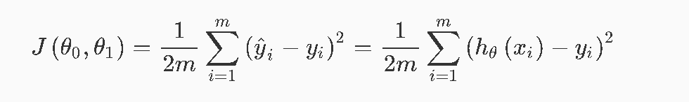
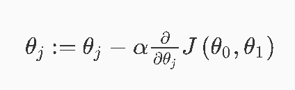
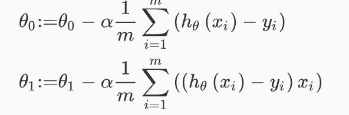
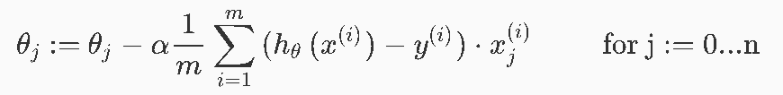

# Machine Learning Basics - Part 1

Photo by Andre Benz on Unsplash - https://unsplash.com/photos/cXU6tNxhub0

The sdfdsfsdf

## Table of Contents

## Definition

>A computer program is said to learn from experience E with respect to some class of tasks T and performance measure P, if its performance at tasks in T, as measured by P, improves with experience E. - Tom Mitchell

- Supervised Learning
- Unsupervised Learning
- Reinforcement Learning
- Recommender Systems

## Linear regression with one variable

### Model representation

Create a prediction for a certain value by applying a hypothesis ( formed with the learned algorithm ) to a set of other variables. 

Plot data with hypothesis as linear regression.

### Cost function

We want to set the parameters in order to achieve a minimal difference between the predicted and the real values.

> We can measure the accuracy of our hypothesis function by using a cost function. This takes an average difference (actually a fancier version of an average) of all the results of the hypothesis with inputs from x's and the actual output y's.

### Gradient Descent

Keeps changing the Parameters to reduce the cost function gradually. With each iteration we shall come closer to a minimum. With each iteration the parameters must be adapted simultaneously! The size of a "step"/iteration is determined by the parameter alpha (the learning rate).

>The way we do this is by taking the derivative (the tangential line to a function) of our cost function. The slope of the tangent is the derivative at that point and it will give us a direction to move towards. We make steps down the cost function in the direction with the steepest descent.

Choosing the value of alpha is crucial. If it is too small the algorithm will be slow, if it is too large it will fail to converge. 

When specifically applied to the case of linear regression, a new form of the gradient descent equation can be derived, where m is the size of the training set. Again both paramters must be updated simultaneously.

>Note that, while gradient descent can be susceptible to local minima in general, the optimization problem we have posed here for linear regression has only one global, and no other local, optima; thus gradient descent always converges (assuming the learning rate α is not too large) to the global minimum.

## Linear regression with multiple variables

Now, instead of one feature/variable that is responsible for a certain outcome we have multiple ones.

Therefore the hypothesis changes accordingly and takes multiple parameters into account. The same applies for the gradient descent.

---

Thanks for reading my article! Feel free to leave any feedback! 

---

Daniel is a LL.M. student in business law, working as a software engineer and organizer of tech related events in Vienna. 
His current personal learning efforts focus on machine learning. 

Connect on:
- [LinkedIn](https://www.linkedin.com/in/createdd) 
- [Github](https://github.com/DDCreationStudios)
- [Medium](https://medium.com/@ddcreationstudi)
- [Twitter](https://twitter.com/DDCreationStudi)
- [Steemit](https://steemit.com/@createdd)
- [Hashnode](https://hashnode.com/@DDCreationStudio)

<!-- Written by Daniel Deutsch (deudan1010@gmail.com) -->