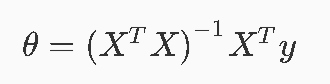
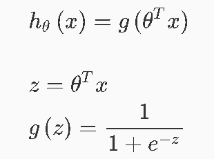
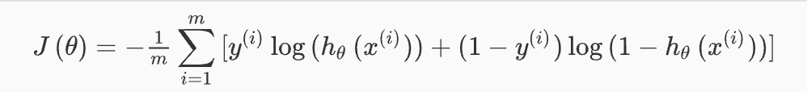
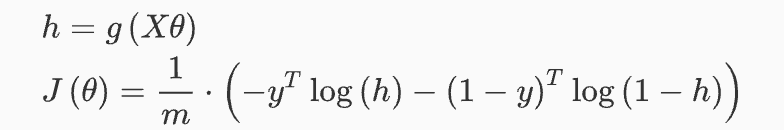
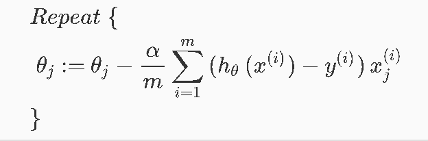
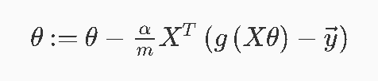
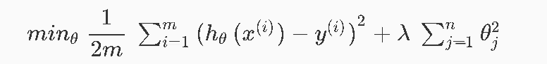
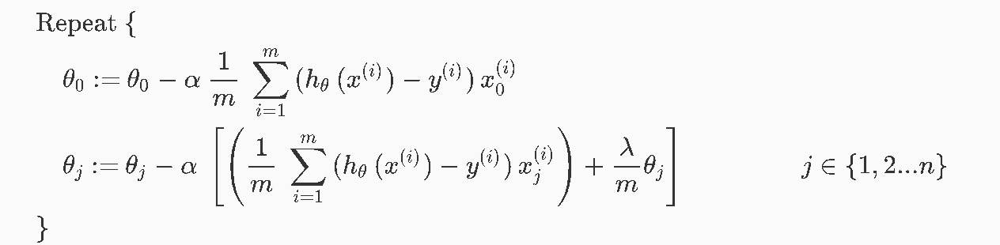

# Machine Learning Basics - Part 1 - Concept of Regression

Photo by Andre Benz on Unsplash - https://unsplash.com/photos/cXU6tNxhub0

In this article I revisit the learned material from the amazing [machine learning course by Andre Ng on coursera](https://www.coursera.org/learn/machine-learning) and create an overview about the concepts. All quotes refer to the material from the course if not explicitly stated otherwise.

## Table of Contents

- [Definition](#definition)
- [Linear regression with one variable](#linear-regression-with-one-variable)
  - [Model representation](#model-representation)
  - [Cost function](#cost-function)
  - [Gradient Descent](#gradient-descent)
- [Linear regression with multiple variables](#linear-regression-with-multiple-variables)
  - [Feature Scaling and Mean Normalization](#feature-scaling-and-mean-normalization)
  - [Learning Rate](#learning-rate)
  - [Polynomial Regression](#polynomial-regression)
  - [Normal equation (for analytical computing)](#normal-equation-for-analytical-computing)
- [Logistic Regression](#logistic-regression)
  - [Classification](#classification)
  - [Adapted cost function and gradient descent](#adapted-cost-function-and-gradient-descent)
  - [Alternatives to gradient descent](#alternatives-to-gradient-descent)
  - [Multiclass Classification](#multiclass-classification)
- [Problem of overfitting and the use of regularization](#problem-of-overfitting-and-the-use-of-regularization)
  - [Regularization](#regularization)

## Definition

>A computer program is said to learn from experience E with respect to some class of tasks T and performance measure P, if its performance at tasks in T, as measured by P, improves with experience E. - Tom Mitchell

## Linear regression with one variable

### Model representation

Linear regression tries to fit points to a line generated by an algorithm. This optimized line (the model) is capable of predicting values for certain input values and can be plotted.

### Cost function

We want to set the parameters in order to achieve a minimal difference between the predicted and the real values.

> We can measure the accuracy of our hypothesis function by using a cost function. This takes an average difference (actually a fancier version of an average) of all the results of the hypothesis with inputs from x's and the actual output y's.

### Gradient Descent

Gradient descent keeps changing the Parameters to reduce the cost function gradually. With each iteration we shall come closer to a minimum. With each iteration the parameters must be adapted simultaneously! The size of a "step"/iteration is determined by the parameter alpha (the learning rate).

>The way we do this is by taking the derivative (the tangential line to a function) of our cost function. The slope of the tangent is the derivative at that point and it will give us a direction to move towards. We make steps down the cost function in the direction with the steepest descent.

Choosing the value of alpha is crucial. If it is too small the algorithm will be slow, if it is too large it will fail to converge. 

When specifically applied to the case of linear regression, a new form of the gradient descent equation can be derived, where m is the size of the training set. Again both parameters must be updated simultaneously.

>Note that, while gradient descent can be susceptible to local minima in general, the optimization problem we have posed here for linear regression has only one global, and no other local, optima; thus gradient descent always converges (assuming the learning rate α is not too large) to the global minimum.

## Linear regression with multiple variables

Now, instead of one feature/variable that is responsible for a certain outcome we have multiple ones.

Therefore the hypothesis changes accordingly and takes multiple parameters into account. The same applies for the gradient descent. It simply is an extension by the additional parameters, which must be updated.

### Feature Scaling and Mean Normalization

To make sure that all values of features are on a same scale and have the same mean it's necessary to use Feature Scaling and Mean Normalization.

>Feature scaling involves dividing the input values by the range (i.e. the maximum value minus the minimum value) of the input variable, resulting in a new range of just 1. Mean normalization involves subtracting the average value for an input variable from the values for that input variable resulting in a new average value for the input variable of just zero.

### Learning Rate

To choose a suitable learning rate, gradient descent has to be plotted and "debugged".

> Make a plot with number of iterations on the x-axis. Now plot the cost function, J(θ) over the number of iterations of gradient descent. If J(θ) ever increases, then you probably need to decrease α.

If J(0) stops to decrease significantly in an iteration step convergence can be declared.

### Polynomial Regression

Features can be improved by re-defining the hypothesis function into a quadratic, cubic or square root function.

In this case, extra emphasize must be applied to feature scaling!

### Normal equation (for analytical computing)

Instead of using gradient descent for gradually minimizing the cost function, the normal equation sets the derivatives to zero. 

The normal equation doesn't need a learning rate alpha and no iteration at all, but requires the transpose of the design matrix. When you have a large number of features (eg 10000) the calculation will take longer than the iterative process with gradient descent. To improve the quality of the normal equation algorithm features should be regularized and redundant features deleted. 

## Logistic Regression

### Classification

To classify data the result shall eiter be 0 or 1 (binary classification). From a regression point of view this can mean to classify output, that is >= 0.5 as 1 and output that is < 0.5 as 0 (whereas 0,5 is the decision boundary).

The adapted hypothesis, using the logistic/sigmoid function, would now be:

It returns the probability for the output being 1!

### Adapted cost function and gradient descent

Due to the use of the sigmoid function, the cost function has to be adapted accordingly by using the logarithm. Since the goal is now not to minimize the distance from a predicted value, but rather to minimize the distance between the output by the hypothesis and y (0 or 1). 

Or for a vectorized implementation:

However, gradient descent stays the same because the formula uses the derivative part of the hypothesis!

Or for a vectorized implementation:

### Alternatives to gradient descent

More complex optimization algorithms like 
- Conjugate Gradient, 
- BFGS or 
- L-BFGS 

often allow faster computation with no need for picking a learning rate alpha.

### Multiclass Classification

The previously described classification problem solving only works for binary classification. Having more possible outcome than n=2 is called multiclass classification. To apply the concept on multiple classes the "one-vs-all" method is used, which is essentially applying the binary classification on each class (one class is positive, all the rest is negative). Instead of setting y to either 0 or 1, y is set to i, which itself is tested against all the other classes. Basically the process is twofold: 
1. Setting the logistic classifier to y. (if y is 3, we create 3 classifiers) 
2. New input is tested against all classifiers and choose the one with the highest probability.

## Problem of overfitting and the use of regularization

In the case of overfitting, the model captures the data structure perfectly, whereas in underfitting the model captures not enough of the data structure (ie. the graph of the model barely touches all of the data points).

To solve the problem of overfitting either the features can be reduced or the magnitude of their values can be regularized.

### Regularization

For regularizing a model, a parameter (lambda) has to be added to the cost function. It de- or inflates the parameter Theta.

Consequently applying it to the logistic regression looks like this:

Note how the regularizing parameter starts at 1 - not regularizing the [bias term Theta 0](https://stackoverflow.com/questions/2480650/role-of-bias-in-neural-networks). 

---

This wraps up the first part. In the next one, neural networks will be described. Stay tuned!

---

Thanks for reading my article! Feel free to leave any feedback! 

---

Daniel is a LL.M. student in business law, working as a software engineer and organizer of tech related events in Vienna. 
His current personal learning efforts focus on machine learning. 

Connect on:
- [LinkedIn](https://www.linkedin.com/in/createdd) 
- [Github](https://github.com/DDCreationStudios)
- [Medium](https://medium.com/@ddcreationstudi)
- [Twitter](https://twitter.com/DDCreationStudi)
- [Steemit](https://steemit.com/@createdd)
- [Hashnode](https://hashnode.com/@DDCreationStudio)

<!-- Written by Daniel Deutsch (deudan1010@gmail.com) -->