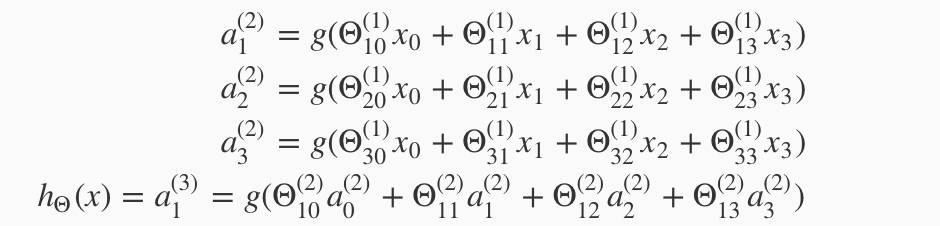
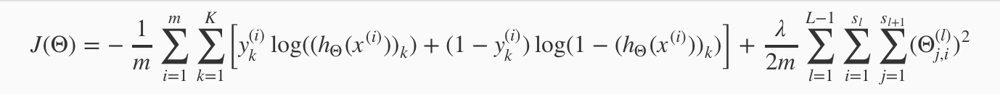
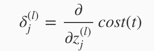
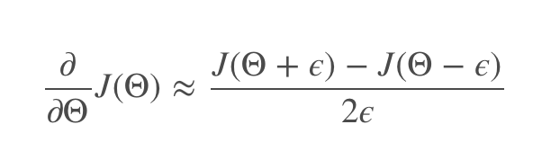

# Machine Learning Basics - Part 2 - Concept of 

Photo by Matteo Catanese on Unsplash - https://unsplash.com/photos/PI8Hk-3ZcCU

In this article I revisit the learned material from the amazing [machine learning course by Andre Ng on coursera](https://www.coursera.org/learn/machine-learning) and create an overview about the concepts. All quotes refer to the material from the course if not explicitly stated otherwise.

## Table of Contents

<!-- TOC -->

- [Machine Learning Basics - Part 2 - Concept of](#machine-learning-basics---part-2---concept-of)
  - [Table of Contents](#table-of-contents)
  - [Neural Networks Model Representation](#neural-networks-model-representation)
  - [Cost function in neural networks](#cost-function-in-neural-networks)
    - [Backpropagation](#backpropagation)
    - [Unrolling parameters](#unrolling-parameters)
    - [Gradient checking](#gradient-checking)
    - [Random initialization](#random-initialization)
  - [Checklist on training a neural network](#checklist-on-training-a-neural-network)

<!-- /TOC -->

## Neural Networks Model Representation

For neural networks we take the findings from exploring the statistical regression and try to put it in brain-like architecture.

The used terms change a little as the logistic function is often referred to as the sigmoid activation function and the theta parameters as weights. The underlying concept stays the same. Instead of the [bias term theta 0, now a bias unit with the value of 1 is used.](https://stackoverflow.com/questions/2480650/role-of-bias-in-neural-networks)

The neural network architecture is made of at least 3 layers. That is
- input,
- hidden, 
- output 

layer. (Many neural networks have more than 1 hidden layer though)

In an activation unit, the weighted input of each unit in the previous layer is re-calculated and re-measured. You can say that neural networks can basically implement the concept of a statistical regression multiple times with more and more advanced input.

Of course this concept can also be applied using vectorization. Therefore we use a new variable, that encompasses the weight parameters inside our g function as an activation unit. Here it is really important to track and visualize the dimensions of your matrices, since it can get quickly very complex (depending on your neural network architecture).

Check out [this incredible article](http://www.ebc.cat/2017/01/08/understanding-neural-networks-part-2-vectorized-forward-propagation/), that explains the concept very good with nice graphics.

A great introduction example is the XOR Problem. [This article](https://medium.com/@jayeshbahire/the-xor-problem-in-neural-networks-50006411840b) explains it well.

## Cost function in neural networks

For a logistic regression to be used in a neural network, the cost function has to be extend to hold the output units K and the regularization part needs the number of layers, the number of nodes in the current layer (plus the bias term) and the number of nodes in the next layers to localized the theta value correctly.

Cost function for logistic regression:

Cost function for logistic regression in a neural network:

### Backpropagation

>"Backpropagation" is neural-network terminology for minimizing our cost function, just like what we were doing with gradient descent in logistic and linear regression.

Whereas forward propagation (activation of nodes) takes in the theta parameters of each node in the previous layer, backpropagation does basically the opposite. An error for each node is calculated by comparing the activation node's output with the calculated output of the node. Afterwards this error is minimized gradually by adapting the used parameter theta. 

The formula for calculating the error is:

### Unrolling parameters

Since some, more advanced, algorithms need vectorized versions for computation. Unrolling matrices into vectors is a great way for calculating the cost function and getting the vector of the calculated parameters and reshaping the result back into matrices.

### Gradient checking

To ensure that your backpropagation works as intended you should check your gradient. This is done calculating an approximation in respect to theta with the following formula:

If the result is similar to the gradient vector the implementation works correct.

### Random initialization

To use gradient descent in a neural network the initial values for theta cannot be symmetrical and must be initialized randomly. Using symmetrical initialization always lead to the same learning result, since the is no variety provided.

## Checklist on training a neural network

1. Randomly initialize weights
1. Implement forward propagation to get the hypothesis
1. Compute the cost function to get the errors
1. Implement backpropagation to compute partial derivatives (optimizing the parameters through errors)
1. Apply gradient checking (comparing backpropagation with numerical estimate)
1. Disable gradient checking
1. Use an optimization method to minimize the cost function with it's corresponding parameters

---

This wraps up the second part. In the next one, neural networks will be described. Stay tuned!

---

Thanks for reading my article! Feel free to leave any feedback! 

---

Daniel is a LL.M. student in business law, working as a software engineer and organizer of tech-related events in Vienna. 
His current personal learning efforts focus on machine learning. 

Connect on:
- [LinkedIn](https://www.linkedin.com/in/createdd) 
- [Github](https://github.com/DDCreationStudios)
- [Medium](https://medium.com/@ddcreationstudi)
- [Twitter](https://twitter.com/DDCreationStudi)
- [Steemit](https://steemit.com/@createdd)
- [Hashnode](https://hashnode.com/@DDCreationStudio)
