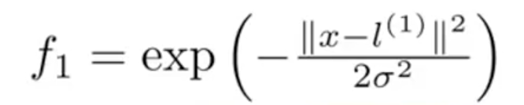
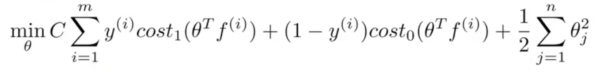
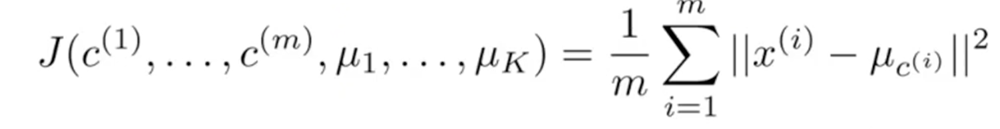
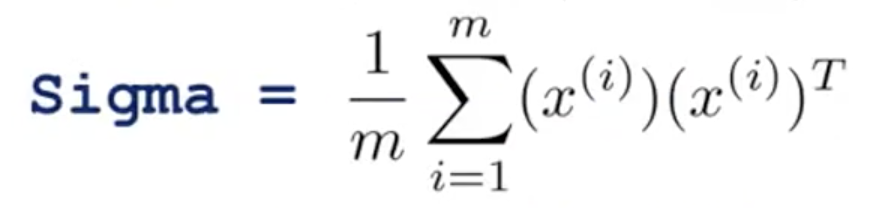
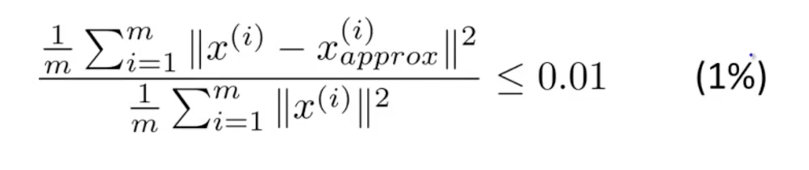
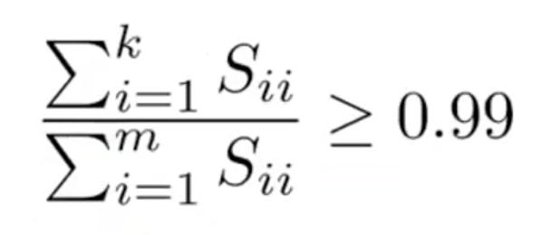

# Machine Learning Basics - Part 3 - Vector Machines, Unsupervised Learning

Photo by Anders Jildén on Unsplash - https://unsplash.com/photos/cYrMQA7a3Wc

In this article I revisit the learned material from the amazing [machine learning course by Andre Ng on coursera](https://www.coursera.org/learn/machine-learning) and create an overview about the concepts. All quotes refer to the material from the course if not explicitly stated otherwise.

## Table of Contents

<!-- TOC -->

- [Machine Learning Basics - Part 3 - Vector Machines, Unsupervised Learning](#machine-learning-basics---part-3---vector-machines-unsupervised-learning)
  - [Table of Contents](#table-of-contents)
  - [Support Vector Machines](#support-vector-machines)
    - [Mathematical Definition](#mathematical-definition)
    - [Large Margin Classifier](#large-margin-classifier)
    - [Kernels](#kernels)
      - [How to choose the landmarks](#how-to-choose-the-landmarks)
    - [SVM Parameters](#svm-parameters)
    - [Tips for practice and how to choose the right system](#tips-for-practice-and-how-to-choose-the-right-system)
  - [Clustering](#clustering)
    - [K-means algorithm](#k-means-algorithm)
      - [Optimization Objective](#optimization-objective)
  - [Dimensionality Reduction and Principal Component Analysis (PCA)](#dimensionality-reduction-and-principal-component-analysis-pca)
    - [PCA](#pca)
      - [Practical Tips](#practical-tips)

<!-- /TOC -->

## Support Vector Machines

### Mathematical Definition

Instead of regularizing the second term with lambda like we did in the original cost function:

Now we want to regularize the first term with the parameter C and adding a new cost function (cost1 and cost0) for transpose theta:

Plotting the cost1 and cost0 function looks something like this:

Hence, if we want a result y = 1 theta transpose X must be greater than 1 and if y = 0 theta transpose X must be smaller than -1.

In essence we just simplified the cost function to use geometry for the further steps.

### Large Margin Classifier

In case of linearly separable data, the SVM algorithm chooses the line that separates the classes with the largest margin.

Using calculus the length of a parameter can easily be retrieved from the initial formula.

By Martin Thoma - Own work, CC BY 3.0, https://commons.wikimedia.org/w/index.php?curid=20159892

Basically the projection of vector X is multiplied by the length of parameter theta and optimized to be a maximum/minimum. This results in always returning a line that seems to separate 2 classes evenly.

Note that, in order to neglect outliners it helps to decrease the value of C (regularizing).

### Kernels

Since polynomial features can be computational expensive, common practice introduces Kernels. For this, new features, which depend on similarity of features and examples. It is like putting landmarks on the plot and calculating the similarity with the Gaussian Kernel formula. If the similarity is 1, the training example is close to the picked landmark. 

The choose for the value of the parameter sigma determines the boundary for similarity.

Introducing the landmark-similarity system allows to classify data that is not linear.

#### How to choose the landmarks

To compute the landmarks we adapt the cost function to the following:

Keep in mind that for the regularizing part, instead of n (number of features) m (training examples) should be used. This makes sense, since we want to calculate the landmarks which are related to the examples.

Also note, that you can implement the concept of Kernels on logistic regression as well but the mathematical benefits of SVM cannot be utilized properly and the implementation will likely be slower. 

Another term for kernel is "similarity-function".

### SVM Parameters

To address over- and underfitting, the parameters lambda (in C) and sigma can be used.

Increasing C (essentially minimizing lambda) or decreasing sigma squared improves underfitting (high C leads to higher variance).

### Tips for practice and how to choose the right system

- use SVM packages instead of trying to write your own SVM calculation 
- the most common kernel functions are the linear kernel (using no kernel) or the Gaussian Kernel
- there are other kernels as well, but be check if it is able to satisfy the "Mercer's Theorem"
- if n is much larger than m, use logistic regression or SVM with a linear kernel
- if n is in a adequate range of m, use a Gaussian Kernel
- if n is smaller than m, use logistic regression or SVM with a linear kernel or add more features
- neural networks works well for all of those settings but might be slower to train

## Clustering

### K-means algorithm

To put this algorithm in simple terms:
- initialize randomly the "centroids" (marks in the middle of the data)
- assign the data the each centroid, which is the closest to the data point
- move the centroid to the center (mean) of the data points
- repeat the 2 previous steps until there is no change in the clusters

#### Optimization Objective

The cost function, which tries to minimize the mean of the squared distance between an example point and the location of the corresponding cluster centroid, looks like the following: 

In order to avoid local optima, the following steps should be implemented multiple times:
1. Randomly initialize K-means
1. Run the K-means algorithm to get the index of a cluster and the cluster centroids
1. Compute the cost function

To choose the number of clusters k the "elbow method" can be used, which plots the cost function to the number of clusters and uses the number where the curve shows an "elbow". However, since this method can be difficult to use on certain graphs, another way would be to simply select the number according to a later/downstream purpose (like desired product sizes - small, medium, large).

## Dimensionality Reduction and Principal Component Analysis (PCA)

Reducing data from multiple dimensions to 2 or 3 dimensions through data compression allows to plot data and give valuable additional insight. Simply reducing data can speed up the running time of a learning algorithm and reduces the space needed for storage.

### PCA

The most common algorithm is principal component analysis. The idea behind it is to reduce a dimension by finding a direction (vector) onto which to project the data to minimize the projection error. When plotted, the algorithm might look similar to the linear regression model. However, it is important to note that in linear regression the variable y is predicted by the variable x, whereas in PCA the different variables x are treated equally.

To implement a PCA algorithm, you normally
1. perform mean normalization and feature scaling
1. calculate a covariance matrix (sigma) with the following formula
1. use singular value decomposition (svd) on sigma
1. multiply the transpose of the first k columns of the resulting U matrix with the feature vector x that shall be reduced and return the resulting z feature vector

To decompress the data and harness the real power of this concept, it is possible to reconstruct the (approximated) original by simply multiplying the U matrix with the z vector again.

To actually choose the variable k (number of principal components) the following formula can be used:

The idea is to divide the average squared projection error (which we try to minimize) by the total variation in the data.

The practical implementation would be to try the PCA algorithm with k = 1 and test if the condition for the retained variance is fulfilled, and if not the procedere with an increased k should be continued. Or to take the S matrix, which resulted from using the singular value decomposition on sigma and testing it like the following:

(Is essentially the equivalent to the previous formula)

#### Practical Tips

To actually speed up a supervised learning case, you should
1. extract only the inputs (to have an unlabeled training set)
2. perform the PCA algorithm
3. create a new training set by substituting your previous x with the new input z
4. train your algorithm with the new data set

Note that, PCA should only be applied to the training set and not the cross validation or testing set. Afterwards the result mapping from x to z can be applied to the cross validation and testing set as well. 

Be careful to NOT use PCA when your model has a problem of overfitting. Although reducing features helps in addressing the problem 

---
 
This wraps up the second part. In the next one, support vector machines and unsupervised learning will be described. Stay tuned!

---

Thanks for reading my article! Feel free to leave any feedback! 

---

Daniel is a LL.M. student in business law, working as a software engineer and organizer of tech-related events in Vienna. 
His current personal learning efforts focus on machine learning. 

Connect on:
- [LinkedIn](https://www.linkedin.com/in/createdd) 
- [Github](https://github.com/DDCreationStudios)
- [Medium](https://medium.com/@ddcreationstudi)
- [Twitter](https://twitter.com/DDCreationStudi)
- [Steemit](https://steemit.com/@createdd)
- [Hashnode](https://hashnode.com/@DDCreationStudio)
