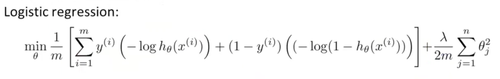
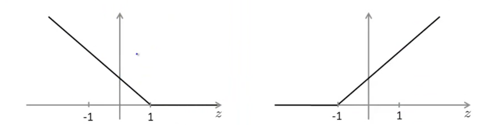
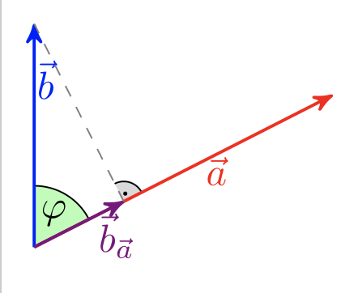

# Machine Learning Basics - Part 3 - Vector Machines, Unsupervised Learning

Photo by Anders Jildén on Unsplash - https://unsplash.com/photos/cYrMQA7a3Wc

In this article I revisit the learned material from the amazing [machine learning course by Andre Ng on coursera](https://www.coursera.org/learn/machine-learning) and create an overview about the concepts. All quotes refer to the material from the course if not explicitly stated otherwise.

## Table of Contents

<!-- TOC -->

- [Machine Learning Basics - Part 3 - Vector Machines, Unsupervised Learning](#machine-learning-basics---part-3---vector-machines-unsupervised-learning)
  - [Table of Contents](#table-of-contents)
  - [Support Vector Machines](#support-vector-machines)
    - [Mathematical Definition](#mathematical-definition)
    - [Large Margin Classifier](#large-margin-classifier)
  - [Kernels](#kernels)

<!-- /TOC -->

## Support Vector Machines

### Mathematical Definition

Instead of regularizing the second term with lambda like we did in the original cost function:

Now we want to regularize the first term with the parameter C and adding a new cost function (cost1 and cost0) for transpose theta:

Plotting the cost1 and cost0 function looks something like this:

Hence, if we want a result y = 1 theta transpose X must be greater than 1 and if y = 0 theta transpose X must be smaller than -1.

In essence we just simplified the cost function to use geometry for the further steps.

### Large Margin Classifier

In case of linearly separable data, the SVM algorithm chooses the line that separates the classes with the largest margin.

Using calculus the length of a parameter can easily be retrieved from the initial formula.

By MartinThoma - Own work, CC BY 3.0, https://commons.wikimedia.org/w/index.php?curid=20159892

Basically the projection of vector X is multiplied by the length of parameter theta and optimized to be a maximum/minimum. This results in always returning a line that seems to separate 2 classes evenly.

Note that, in order to neglect outliners it helps to decrease the value of C (regularizing).

## Kernels

Since polynomial features can be computational expensive, common practice introduces Kernels. For this, new features, which depend on similarity of features and examples. It is like putting landmarks on the plot and calculating the similarity with the Gaussian Kernel formula.

---
 
This wraps up the second part. In the next one, support vector machines and unsupervised learning will be described. Stay tuned!

---

Thanks for reading my article! Feel free to leave any feedback! 

---

Daniel is a LL.M. student in business law, working as a software engineer and organizer of tech-related events in Vienna. 
His current personal learning efforts focus on machine learning. 

Connect on:
- [LinkedIn](https://www.linkedin.com/in/createdd) 
- [Github](https://github.com/DDCreationStudios)
- [Medium](https://medium.com/@ddcreationstudi)
- [Twitter](https://twitter.com/DDCreationStudi)
- [Steemit](https://steemit.com/@createdd)
- [Hashnode](https://hashnode.com/@DDCreationStudio)
