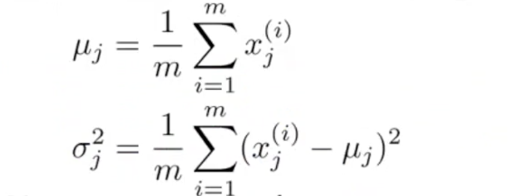
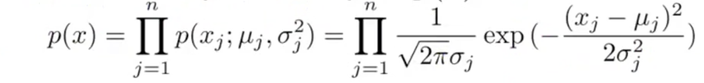
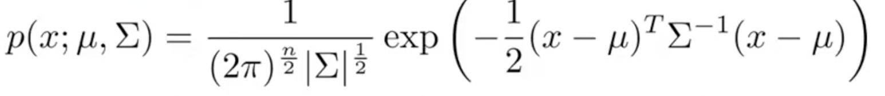
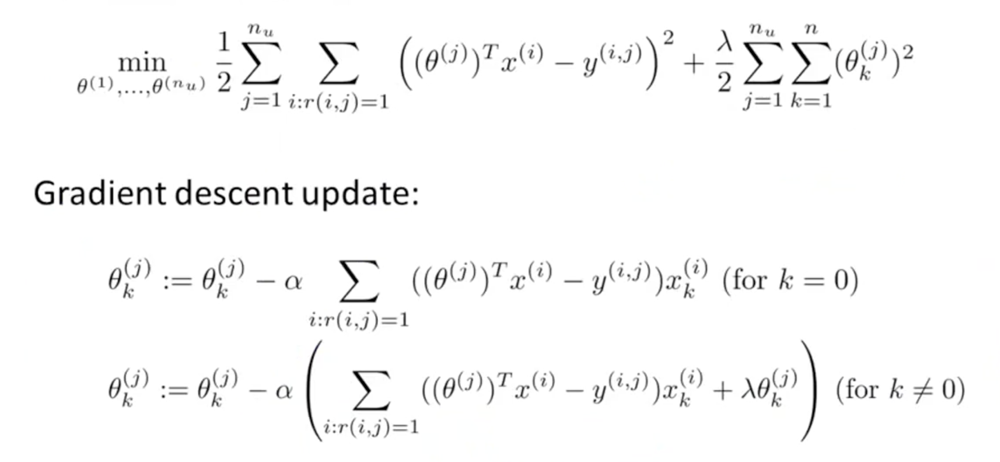
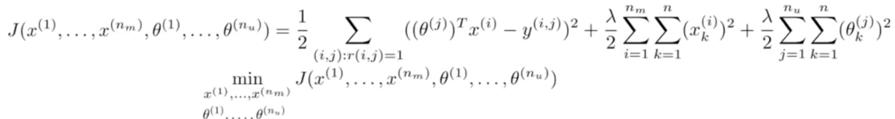
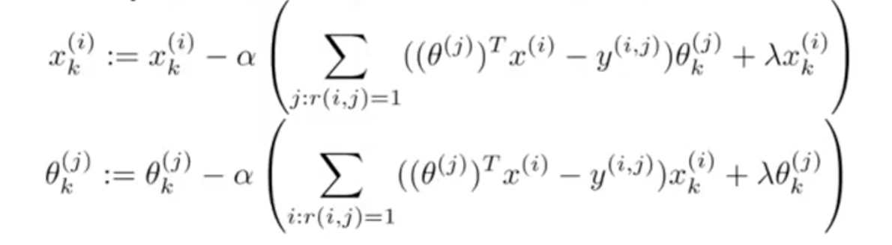
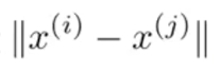
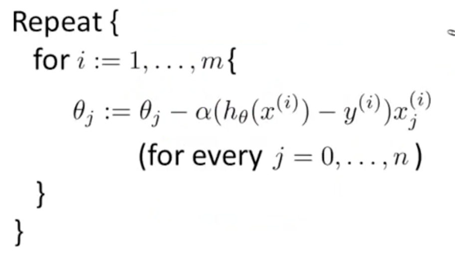
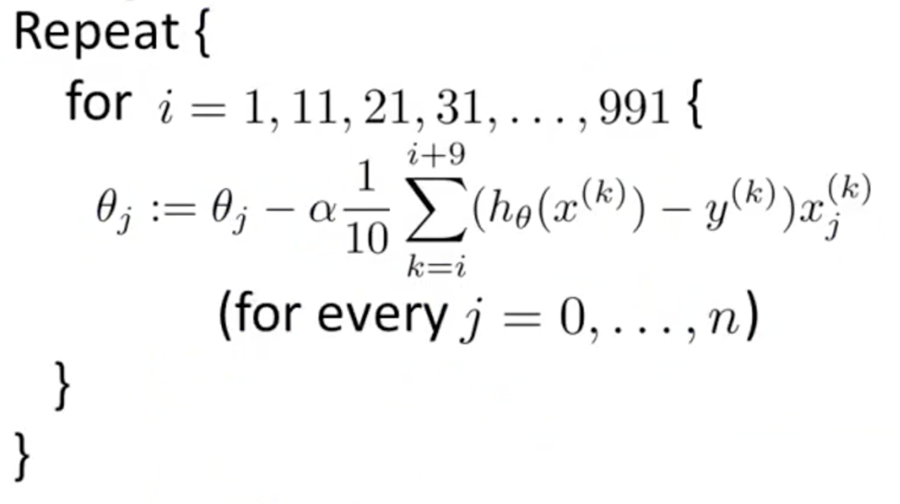

# Machine Learning Basics - Part 4 - Anomaly Detection, Recommender Systems and Scaling

Photo by Fahrul Azmi on Unsplash - https://unsplash.com/photos/vR-Nb0bncOY

In this article I revisit the learned material from the amazing [machine learning course by Andre Ng on Coursera](https://www.coursera.org/learn/machine-learning) and create an overview about the concepts. The article is not designed as a tutorial but rather to fresh up on the basic ideas.

All quotes refer to the material from the course if not explicitly stated otherwise.

## Table of Contents

- [Anomaly detection](#anomaly-detection)
  - [Develop a Anomaly Detection system](#develop-a-anomaly-detection-system)
  - [Practical Tips and difference to a supervised learning system](#practical-tips-and-difference-to-a-supervised-learning-system)
  - [Multivariat Gaussian distribution](#multivariat-gaussian-distribution)
- [Recommender Systems](#recommender-systems)
  - [Feature learning with collaborative filtering](#feature-learning-with-collaborative-filtering)
  - [Further usage](#further-usage)
- [Scaling machine learning systems](#scaling-machine-learning-systems)
  - [Stochastic gradient descent](#stochastic-gradient-descent)
  - [Mini-batch gradient descent](#mini-batch-gradient-descent)
  - [Test for convergence](#test-for-convergence)
  - [Online learning](#online-learning)
  - [Map-reduce and data parallelism](#map-reduce-and-data-parallelism)
- [Tricks for use on applications](#tricks-for-use-on-applications)
  - [Create a pipeline for your problem](#create-a-pipeline-for-your-problem)
  - [Getting more data](#getting-more-data)
  - [Ceiling analysis](#ceiling-analysis)

## Anomaly detection

Anomaly detection tests a new example against the behavior of other examples in that range. This idea is often used in fraud detection, manufacturing or monitoring of machines. It is always useful if the goal is to detect certain outliners.

Using a Gaussian distribution algorithm implies that the example x is distributed with a mean Mu and variance Sigma squared.

The formula for Mu and Sigma squared are:

The formula for calculating the probability is:

The steps to build the algorithm are
1. Choose the features x that might be indicative of anomalous examples
1. Calculate the parameters Mu and Sigma
1. Compute the probability p of x
1. Test against your set probability boundary Epsilon

### Develop a Anomaly Detection system

When the algorithm is implemented it is important to introduce a real-number evaluation metric.

As always, it is advisable to split the data set into a training, cross-validation and testing set (60-20-20). 

The steps to build the system would be:
1. Fit the model p(x) on the training set
1. Predict y on the resulting probabilities of your cross-validation and testing sets
1. Evaluate the result using a contingency table (true positives, false positives, ...), precision/recall methods or the F1-score
1. Change values of Epsilon (if necessary)

### Practical Tips and difference to a supervised learning system

An anomaly detection system should be used if
- a large number of negative examples but a small number of positives examples are available
- the anomalies themselves cannot be classified and may vary in future examples
- eg. fraud detection, monitoring machines, etc.

If a classification can easily be done, ie having large numbers of positive and negative examples and future examples will be similar, it is advisable to use a supervised learning algorithm. (eg SPAM, cancer classification)

To analyse errors it makes sense to plot the features and see if they behave Gaussian. If not, constants (like log(x)) can be added, to try to make it look as Gaussian as possible. 

The basic assumption for using anomaly detection system is to have few anomalous examples and many normal ones. If this is not met, the misclassified example should be inspected for behavior that allows to come up with a new feature.

### Multivariat Gaussian distribution

In certain cases the normal Gaussian distribution is not enough the accurately flag anomalies. 
A multivariat Gaussian distribution calculates the probability model of x at once, instead of modelling the probabilities for each feature alone. It uses a covariance matrix instead of Sigma squared.

The formula looks like:

Whereas: 

The multivariate Gaussian model is worth to be considered when the number of examples is much larger than the number of features. It captures correlations between features but is computational expensive. When it is obvious what feature combinations can capture the anomalies, it is advisable to  first implement those with the original Gaussian model.

## Recommender Systems

A recommendation system is one of the most common and most successful practical examples for applying a machine learning algorithm in real life. 

Assuming you have a content-based recommender system. First, a problem has to be formulated. This can be something like predicting the rating of a certain product of a certain user. 

Given the ratings of a movie, to learn the parameter Theta for a certain user, the optimization algorithm can look like this:

- the parameters Theta denote a vector for a certain user
- the feature x denotes a vector for a movie 
- y denotes the rating by a certain user on a certain movie
- n denotes the number of users

This is the basic cost function of a squared error with regularization summed up for different users (Theta j).

And using gradient descent (multiplying the learning rate alpha with the partial derivative with respect to your parameter of the optimization objective) to gradually minimize the result. Note, that Theta 0 for k = 0 should not be regularized (as explained in linear regression). 

### Feature learning with collaborative filtering

Given the parameters Theta of each user for a certain movie, the feature vector of a movie can be estimated with the optimization algorithm:

One way to address the problem of what vector to calculate first (feature vector of a movie or the parameter vector fo a user), is to guess the parameter vector for a user and then use the estimation to define a (better) feature vector for a movie.

This implementation is called collaborative filtering because with each rating of a user the algorithm is able to define better movie feature vectors and improves the output for all users.

To use collaborative filtering simultaneously (updating Theta and x at the same time), the following formula can be used: 

This leads to the following gradient descent implementation:

To implement this formula, you have to 
1. Initialize all Thetas and xs with small random values
1. Minimize the cost function with the provided gradient descent formula
1. Predict the movie rating of a user with the parameter Theta with the learned feature x.

### Further usage

After implementing the collaborative filtering system another step can be to suggest related movies/products.

This is easily done since we have already calculated a feature vector x. Now to find related movies/products, we simply have to find the ones with the smallest distance, like:

Note, that if you have a user or movie/product with no rating at all, you should perform mean normalization before implementing the learning algorithm. To accomplish this, first the mean should be subtracted from the result matrix and re-added when predicting the rating. But you should always ask yourself if it makes sense to recommend something to a completely undefined unit anyways.

## Scaling machine learning systems

When having a case with very large numbers of examples (~100 Mio) always ask yourself if it is possible to reduce the dataset with keeping the results.

One way is to plot a learning curve for a range of values of m and verify that the algorithm has high variance when m is small. When th algorithm already has a high bias, increasing the dataset does not help.

### Stochastic gradient descent

On large training sets gradient descent becomes very computational expensive. A way to address this problem is to use stochastic gradient descent. 

Instead of iterating through all trainings examples at once, you shuffle your dataset randomly and perform gradient descent on a single example as follows:

This allows to improve the parameters on every single example and therefore takes much less time than improving them on all examples at once. (On the cost that it might not converge at all - but ends up close enough for most practical use cases).

### Mini-batch gradient descent

As a middle way between going through all examples or just 1 example in each gradient descent iteration, mini-batch allows to set a certain number b of examples per iteration. The adapted loop could look like this:

### Test for convergence

To test if either mini-batch or stochastic gradient descent are converging the cost function can be plotted and checked.

Whereas for mini-batch gradient descent the cost function of the number of iterations can just be plotted, for stochastic gradient descent the cost function (on a certain example) has to be plotted on the average of multiple examples.

If the algorithm fails to converge try to slowly decrease the learning rate Alpha.

### Online learning

In the idea of online learning data is considered to be endless and free. For example getting a stream of user data on a website. In this case, gradient descent can be performed on one example at each time for endless times. With each incoming example the algorithm is improved and this way the algorithm can also adapt according to changes in user preference.

### Map-reduce and data parallelism

Another way to address huge data sets is to use batch gradient descent but splitting it to different sub sets, allowing multiple machines to work on their own set of data. Afterwards the results can simply be added together to fit the original formula (basically using the sums of functions).

## Tricks for use on applications

### Create a pipeline for your problem

For example
- detect text
- segment characters
- classify characters

### Getting more data

- try to create additional data by adding distortions to your already available data set (artificial data synthesis)
- try collecting/labelling data yourself
- crowd source data

### Ceiling analysis

Analyse what part of your pipeline is worth spending time for improvements by comparing the accuracy improvements.

---
 
This wraps up the fourth part. What an incredible course! :) 

---

Thanks for reading my article! Feel free to leave any feedback! 

---

Daniel is a LL.M. student in business law, working as a software engineer and organizer of tech-related events in Vienna. 
His current personal learning efforts focus on machine learning. 

Connect on:
- [LinkedIn](https://www.linkedin.com/in/createdd) 
- [Github](https://github.com/DDCreationStudios)
- [Medium](https://medium.com/@ddcreationstudi)
- [Twitter](https://twitter.com/DDCreationStudi)
- [Steemit](https://steemit.com/@createdd)
- [Hashnode](https://hashnode.com/@DDCreationStudio)
