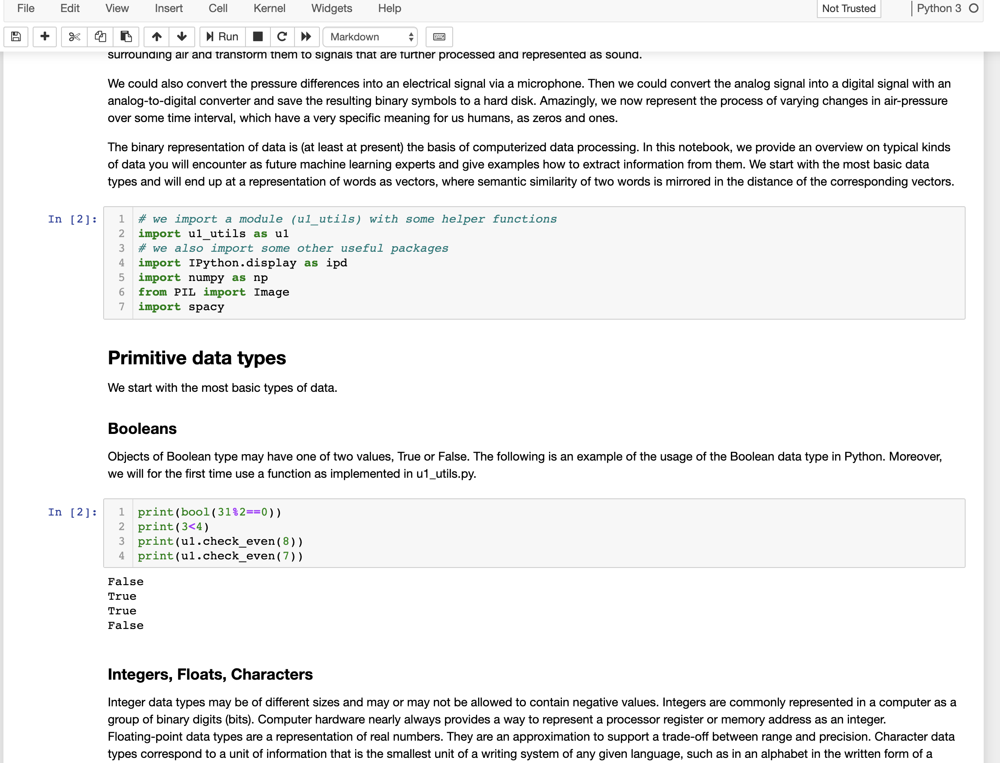
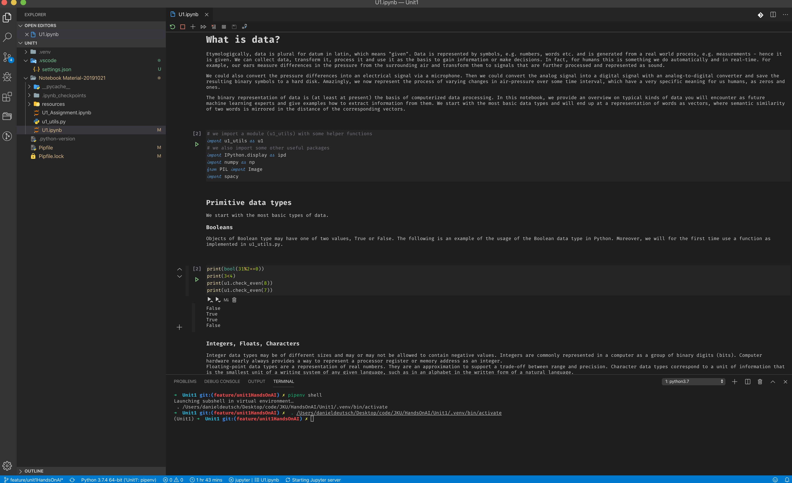

# How to use Pipenv with Jupyter and VSCode


Currently I study **Artificial Intelligence** at the JKU university and for some exercises we need to use [jupyter notebooks](https://jupyter.org/). Having worked a little bit with Python the package manager [pipenv](https://pipenv-fork.readthedocs.io/en/latest/) proofed to be valuable. Now, I encountered some problems using it with jupyter notebooks and within vscode. Therefore, a short guide on how I solved it.

## Table of Contents
- [How to use Pipenv with Jupyter and VSCode](#how-to-use-pipenv-with-jupyter-and-vscode)
  - [Table of Contents](#table-of-contents)
  - [The Issue](#the-issue)
  - [Developing with Jupyter Notebook in the browser](#developing-with-jupyter-notebook-in-the-browser)
  - [Develop with Jupyter Notebook in VSCode](#develop-with-jupyter-notebook-in-vscode)
  - [About](#about)
  - [Support and Mails](#support-and-mails)

## The Issue

As I described in my last article [Working with Jupyter and VSCode](https://towardsdatascience.com/working-with-vscode-and-jupyter-notebook-style-5ecaf47f9f84) I use **pyenv** and **pipenv** for managing all packages in my python development. I also referenced some articles why this way is helpful and easy to use.
Now, it is necessary to dive a little more into it. There are two ways you would want to develop with jupyter notebook. Either you work with it directly in the browser or inside VSCode. In both use cases there can emerge problems.

## Developing with Jupyter Notebook in the browser



Let's say you already have the proper python environment on your system and now you want to create a specific one for a project.

1. First, create the Pipenv environment.
2. Make sure to navigate into the correct directory.
3. Use `pipenv install <packages>` to install all your packages.
4. Then use `pipenv shell` to activate your shell.
5. Then use `pipenv install jupyter` and afterwards `pipenv run jupyter notebook`.

Now the jupyter server is started and your notebook will have access to the correct environment.


## Develop with Jupyter Notebook in VSCode



Now for the workflow within VSCode.
Here, it is import to be aware of different shells. I often use a separate terminal (iterm2) and sometimes an activated shell is not recognized by VSCode or you are in a wrong directory or it is not activated. All of this causes problems. Therefore my workflow is as follows:


1. First, create the Pipenv environment.
2. Make sure to navigate into the correct directory.
3. Use `pipenv install <packages>` to install all your packages.
4. Then, be sure to have a proper settings file in your vscode folder with content like this:

```json
{
    "python.venvPath": "${workspaceFolder}/.venv/bin/python",
    "python.pythonPath": ".venv/bin/python",
}
```
- Afterwards you can choose the proper python environment within VSCode. ( It should be the one created with pipenv!)
Now the correct environment is recognized for python files.

Normally this should be sufficient for VSCode and you can start the jupyter server in it.

But sometimes you change the environment, or there is an issue in the settings file.
If this is the case you need to open the VSCode terminal and run `pipenv shell` to activate the shell. (Check if the correct environment is still selected in VSCode):


Now, after opening the **.ipynb** file, you will be able to run the cells and not get the error `"... was not able to start jupyter server in environment xxx"`

Let me know if it helps or if you have other issues or solutions working with **Pipenv** in **VSCode** and **Jupyter** **Notebook**.

---

## About

I consider myself a problem solver. My strengths are to navigate in complex environments, provide solutions and breaking them down.
My knowledge and interests evolve around business law and programming machine learning applications.
I provide services in building data analysis and evaluating business-related concepts.

Connect on:
- [LinkedIn](https://www.linkedin.com/in/createdd)
- [Github](https://github.com/Createdd)
- [Medium](https://medium.com/@createdd)
- [Twitter](https://twitter.com/_createdd)
- [Patreon](https://www.patreon.com/createdd)
- [Instagram](https://www.instagram.com/create.dd/)

## Support and Mails

[](https://www.patreon.com/createdd)
https://www.patreon.com/createdd

https://upscri.be/481d76

<!-- Written by Daniel Deutsch -->