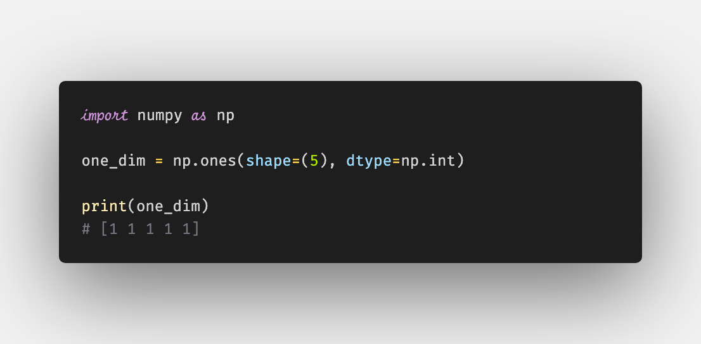
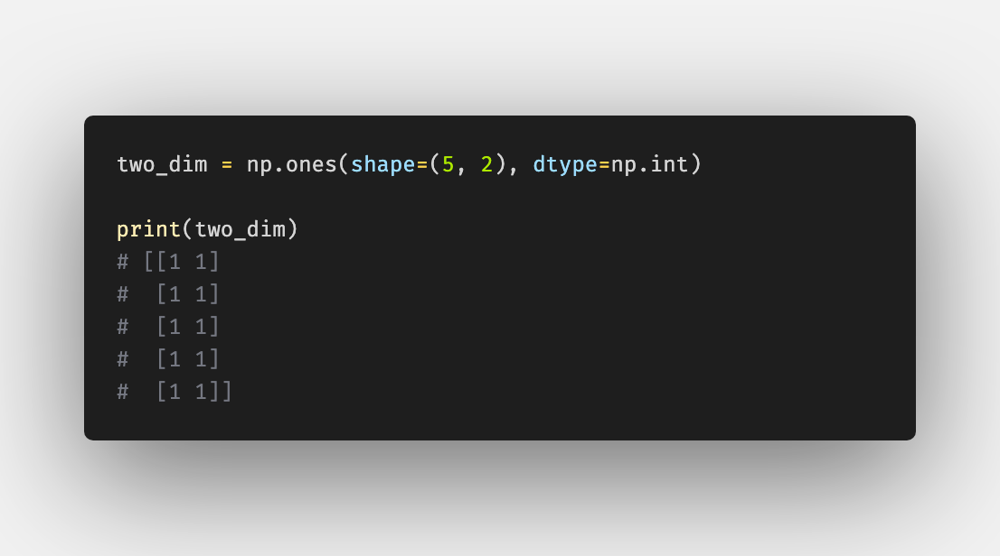
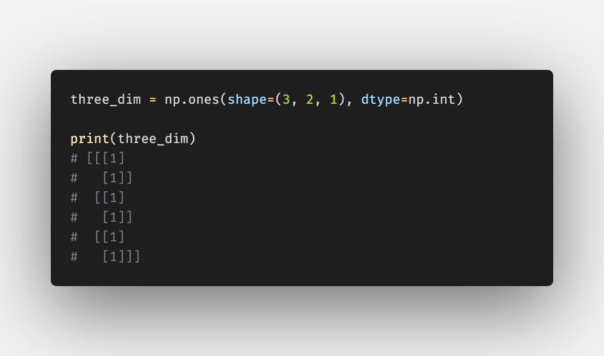

# Numpy Shapes and Slices in Overview

Photo by Hunter Harritt - https://unsplash.com/photos/Ype9sdOPdYc

## Table of Contents

## Shapes

Shape 1 Dim

##

---

## About

Daniel is an entrepreneur, software developer, and lawyer.
His knowledge and interests evolve around business law and programming machine learning applications.
To the core, he considers himself a problem solver of complex environments, which is reflected in his various projects.
Don't hesitate to get in touch if you have ideas, projects or problems.

**Connect on:**
- [LinkedIn](https://www.linkedin.com/in/createdd)
- [Github](https://github.com/Createdd)
- [Medium](https://medium.com/@createdd)
- [Twitter](https://twitter.com/_createdd)
- [Instagram](https://www.instagram.com/create.dd/)

<!-- Written by Daniel Deutsch -->