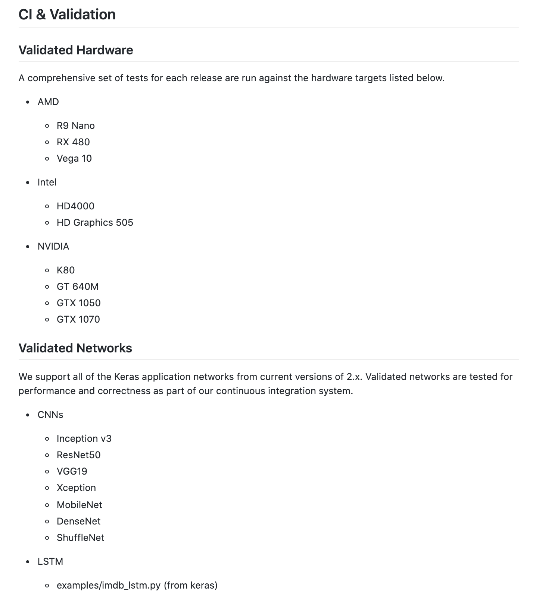
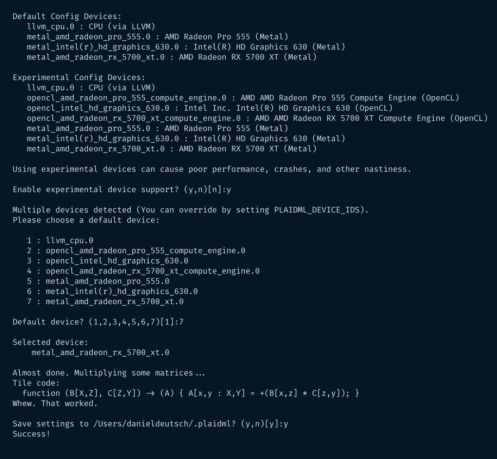
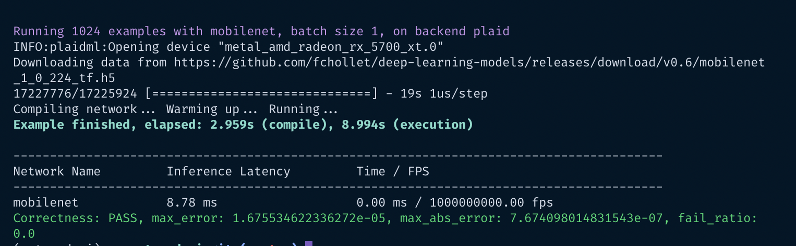

# Use an AMD GPU for your Mac to accelerate Deeplearning


*Photo https://unsplash.com/photos/aVeKubCF-48*

Every machine learning engineer these days will come to the point where he wants to use a GPU to speed up his deeplearning calculations. I happen to got an AMD Radeon from a friend. Unfortunately I saw that there is a big difference between AMD and Nvidia GPUs, whereas only the later is supported greatly in deeplearning libraries like Tensorflow. I came across some articles and made my mac+amd gpu setup work anyways. :rocket:

This can be seen as a comprehension of other articles (see "additional reading") and some additional solutions from my side during implementation.

## Disclaimer

I am not associated with any of the services I use in this article.

I do not consider myself an expert. If you have the feeling that I am missing important steps or neglected something, consider pointing it out in the comment section or get in touch with me.

I am always happy for constructive input and how to improve.


**This article was written on 02-10-2020**
I cannot monitor all my articles. There is a high probability that, when you read this article the tipps are outdated and the processes have changed.

If you need more information on certain parts, feel free to point it out in the comments.


## Table of Contents
- [Use an AMD GPU for your Mac to accelerate Deeplearning](#use-an-amd-gpu-for-your-mac-to-accelerate-deeplearning)
  - [Disclaimer](#disclaimer)
  - [Table of Contents](#table-of-contents)
  - [The problem - the answer](#the-problem---the-answer)
  - [Pre-requisits](#pre-requisits)
  - [My setup](#my-setup)
    - [MacOS Catalina](#macos-catalina)
    - [External GPU](#external-gpu)
    - [Library versions](#library-versions)
  - [Connect external GPU to Mac](#connect-external-gpu-to-mac)
    - [Install packages](#install-packages)
    - [plaidml-setup](#plaidml-setup)
    - [plaidbench keras mobilenet](#plaidbench-keras-mobilenet)
  - [Actual implementation](#actual-implementation)
    - [Add deep learning code](#add-deep-learning-code)
  - [Additional reading and common problems](#additional-reading-and-common-problems)
  - [About](#about)


## The problem - the answer

Tensorflow, which is used at the core for Keras calculations, supports local GPU acceleration using Nvidia graphic cards via CUDA. Unfortunately there is nothing like this for AMD yet.

The answer for this problem is PlaidML, a python library and tensor complier that allows to speed up vector calculations.

> PlaidML is an advanced and portable tensor compiler for enabling deep learning on laptops, embedded devices, or other devices where the available computing hardware is not well supported or the available software stack contains unpalatable license restrictions.

> PlaidML sits underneath common machine learning frameworks, enabling users to access any hardware supported by PlaidML. PlaidML supports Keras, ONNX, and nGraph.

> As a component within the nGraph Compiler stack, PlaidML further extends the capabilities of specialized deep-learning hardware (especially GPUs,) and makes it both easier and faster to access or make use of subgraph-level optimizations that would otherwise be bounded by the compute limitations of the device.

> As a component under Keras, PlaidML can accelerate training workloads with customized or automatically-generated Tile code. It works especially well on GPUs, and it doesn't require use of CUDA/cuDNN on Nvidia hardware, while achieving comparable performance.

*Source https://github.com/plaidml/plaidml*

As of time of writing, the following Hardware and networks are validated:

*Source official docs https://github.com/plaidml/plaidml/tree/plaidml-v1*


As PlaidML helps with tensor calculations on Keras models, it will not speed up independent tensor calculations using Numpy for example. This can be done using [OpenCL](https://www.khronos.org/opencl/),  which will not be covered in this article. Check out the "additional reading" section for more.

## Pre-requisits

If you want to follow along, you should have
- a Mac OS
- an external AMD GPU
- [Keras](https://keras.io/), as deep learning library


## My setup

### MacOS Catalina

```sh
System Version: macOS 10.15.6 (19G2021)
Kernel Version: Darwin 19.6.0
Boot Volume: Macintosh HD
Boot Mode: Normal
Secure Virtual Memory: Enabled
System Integrity Protection: Enabled
```

### External GPU

Runnning

```sh
system_profiler SPDisplaysDataType
```

will give you the Graphics/Display output.

It shows my external GPU:

```sh

    Radeon RX 5700 XT:

      Chipset Model: Radeon RX 5700 XT
      Type: External GPU
      Bus: PCIe
      PCIe Lane Width: x4
      VRAM (Total): 8 GB
      Vendor: AMD (0x1002)
      Device ID: 0x731f
      Revision ID: 0x00c1
      ROM Revision: 113-D1990103-O09
      Automatic Graphics Switching: Supported
      gMux Version: 4.0.29 [3.2.8]
      Metal: Supported, feature set macOS GPUFamily2 v1
      GPU is Removable: Yes
```

### Library versions

```sh
keras=2.2.4=pypi_0
keras-applications=1.0.8=py_1
keras-preprocessing=1.1.0=py_0

plaidbench=0.7.0=pypi_0
plaidml=0.7.0=pypi_0
plaidml-keras=0.7.0=pypi_0
```

#

## Connect external GPU to Mac

### Install packages

```sh
pip install pyopencl plaidml-keras plaidbench
```


### plaidml-setup

```sh
plaidml-setup
```




### plaidbench keras mobilenet

```sh
plaidbench keras mobilenet
```



This shows that the GPU setup should work. Now lets get into an actual implementation.

## Actual implementation

For making it work you need to add this to the notebook/file:

```py
import plaidml.keras
import os
plaidml.keras.install_backend()
os.environ["KERAS_BACKEND"] = "plaidml.keras.backend"
```

There are other suggestions on how to add the backend. However, it worked for me only in this order. First installing the backend, then setting the environment. (For other suggestions see "additional reading")

Afterward, doing

```py
from keras import backend as K
K
```

should give you something like:

```sh
<module 'plaidml.keras.backend' from '/Users/XXXX/opt/anaconda3/envs/XXX/lib/python3.7/site-packages/plaidml/keras/backend.py'>
```

If you are not sure if the GPU is really used there are several commands available like `K._get_available_gpus()`. But they didn't work for me. If you are getting the backend message like the one above it should work. You will see during calculation anyways if your GPU is running or your Mac ;)

### Add deep learning code

To test it you can use basic Keras example code from their docs: https://github.com/keras-team/keras/tree/master/examples

For example the [neural style transfer](https://github.com/keras-team/keras/blob/master/examples/neural_style_transfer.py).

Running it on the base image from my header (credits to [Nana Dua](https://unsplash.com/photos/aVeKubCF-48)) and adding some special flavor, leads to:


## Additional reading and common problems

- [Use an external graphics processor with your Mac](https://support.apple.com/en-ug/HT208544)
- [GPU Acceleration on AMD with PlaidML for training and using Keras models](https://medium.com/@bamouh42/gpu-acceleration-on-amd-with-plaidml-for-training-and-using-keras-models-57a9fce883b9)
- [GPU-Accelerated Machine Learning on MacOS](https://towardsdatascience.com/gpu-accelerated-machine-learning-on-macos-48d53ef1b545)
- [Where you can benefit using a GPU in deep learning](https://medium.com/@apundhir/gpu-for-deep-learning-7f4ef099b702)
- [Stackoverflow on make mac work with GPU](https://stackoverflow.com/questions/60016868/anyway-to-work-with-keras-in-mac-with-amd-gpu)


---

## About

Daniel is an entrepreneur, software developer and lawyer. He has worked at various IT companies, tax advisory, management consulting and at the Austrian court.

His knowledge and interests currently revolve around programming machine learning applications and all its related aspects. To the core, he considers himself a problem solver of complex environments, which is reflected in his various projects.

Don't hesitate to get in touch if you have ideas, projects, or problems.


You can support me on https://www.buymeacoffee.com/createdd


**Connect on:**
- [LinkedIn](https://www.linkedin.com/in/createdd)
- [Github](https://github.com/Createdd)
- [Medium](https://medium.com/@createdd)
- [Twitter](https://twitter.com/_createdd)
- [Instagram](https://www.instagram.com/create.dd/)
- [createdd.com](https://www.createdd.com/)
