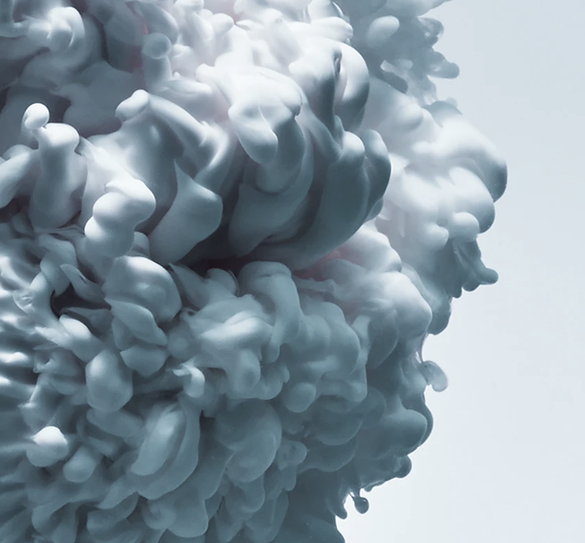
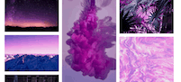

# Analyzing Art from AI

## Table of Contents

- [Analyzing Art from AI](#analyzing-art-from-ai)
  - [Table of Contents](#table-of-contents)
- [Disclaimer](#disclaimer)
  - [The original](#the-original)
  - [The styling process](#the-styling-process)
  - [Result](#result)
  - [Process on Video](#process-on-video)
  - [About](#about)

# Disclaimer

I am not associated with any of the services I use in this article.

I do not consider myself an expert. I am not a blogger or something. I merely document things beside doing other things. Therefore the content does not represent the quality of any of my work, nor does it fully reflect my view on things. If you have the feeling that I am missing important steps or neglected something, consider pointing it out in the comment section or get in touch with me.

I am always happy for constructive input and how to improve.

This was written on XXXXXXXDATEXXXXXXXXXX.
I cannot monitor all of my articles. There is a high probability that when you read this article the tips are outdated and the processes have changed.

If you need more information on certain parts, feel free to point it out in the comments.

## The original

*Original by benjamin henon on https://unsplash.com/photos/RfJX9jGKG84*

This is a very interesting photo. Amazing quality and very creative building process.

The photographer seems to be quite creative in multiple endeavors. I encourage you to check out his content. Here is his website: https://www.benjaminhenon.com/about/

In my opinion it serves perfectly as a ground image for AI based neural style transfer. It is very aesthetic. Providing a great balance between clean edges and details.

Extremely satisfying to look at this.

## The styling process

In the next steps we need to find suitable inspiration for the AI to learn some styles.

I wrote about the algorithmic approach here in my article [Neural Style Transfer — A high-level approach](https://towardsdatascience.com/neural-style-transfer-a-high-level-approach-250d4414c56b).

And more about the object identification within AI in [The structure behind an award-winning photo — a deep learning approach](https://towardsdatascience.com/the-essence-behind-an-award-winning-photo-an-ai-approach-f044d908d412)

Of course there is much more to my processing of images. However this is a starter.

## Result

As you can see there are clearly resolution cuts. Those are due to training cost of the algorithm, as the styles are transferred over pixels, which is quite calculation expensive, and therefore cost real GPU computation power. This is also the reason why you see most of the results in very low resolution and low images size.

However, one can clearly see the artistic transfer to create a new image. Styles are not merely transfered and layed over the original image. The new image is created in the algorithm.

## Process on Video

https://www.youtube.com/watch?v=2wKLaQHG5kE&t=380s&ab_channel=Createdd

---

## About

Daniel is an entrepreneur, software developer, and business law graduate. He has worked at various IT companies, tax advisory, management consulting, and at the Austrian court.

His knowledge and interests currently revolve around programming machine learning applications and all their related aspects. To the core, he considers himself a problem solver of complex environments, which is reflected in his various projects.

Don't hesitate to get in touch if you have ideas, projects, or problems.

You can support me on https://www.buymeacoffee.com/createdd or with crypto https://etherdonation.com/d?to=0xC36b01231a8F857B8751431c8011b09130ef92eC

**Connect on:**
- [LinkedIn](https://www.linkedin.com/in/createdd)
- [Github](https://github.com/Createdd)
- [Medium](https://medium.com/@createdd)
- [Twitter](https://twitter.com/_createdd)
- [Instagram](https://www.instagram.com/create.dd/)
- [createdd.com](https://www.createdd.com/)

Art-related:
- [Medium/the-art-of-art](https://medium.com/the-art-of-art)
- [Instagram/art_and_ai](https://www.instagram.com/art_and_ai/)

<!-- Written by Daniel Deutsch -->