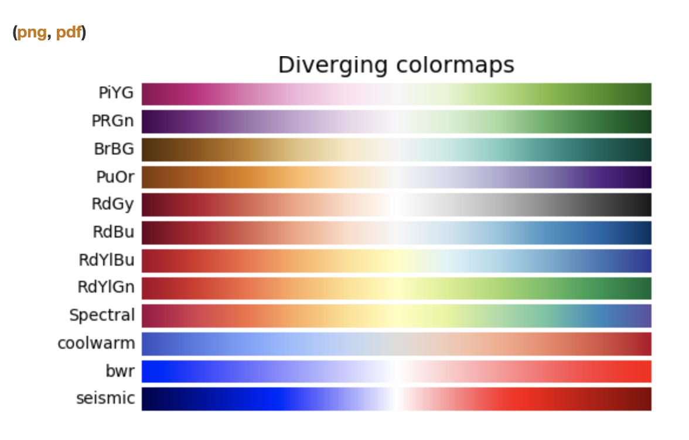
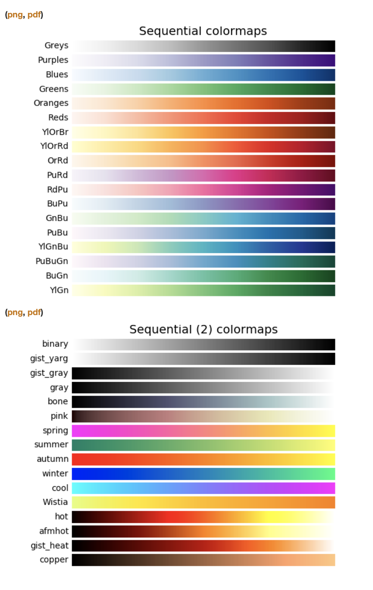

# Correlations and Visualizations

xxxxxxx - httpsasdfafasfasfdasf

## Table of Contents

## A note before reading

It is common to use the terms correlation and association interchangeably. Technically, association refers to any relationship between two variables, whereas correlation is often used to refer only to a linear relationship between two variables. Correlation coefficients are on a -1 to 1 scale.

In this article I use them interchangeably.

## Thoughts on heatmaps and what color to choose

Depending on your method of calculation for the association you will have different output. For uncertainty coefficients, like Theil's U, the result ranges from 0 to 1, inclusive.
This is of course very different to the correlation coefficient of Person, which has a value between +1 and −1.

Depending on the range of result, a different colormap should be used.
Always have the audience in mind when you think about visualization of a result.

Matplot lib offers a [variety of colormaps](https://matplotlib.org/examples/color/colormaps_reference.html).

They have for example diverging colormaps:

Or sequential ones:

Make sure to use a colormap that fits the result of the association calculation.
Diverging maps are great for values between -1 and +1, as 0 is most a very light center opposed to the colorful ends. For results from 0 to 1 it is better to use a sequential colormap to illustrate the "density" of an association.

- https://towardsdatascience.com/the-search-for-categorical-correlation-a1cf7f1888c9
- https://mlwhiz.com/blog/2019/04/19/awesome_seaborn_visuals/
- https://rpubs.com/hoanganhngo610/558925
- https://medium.com/@jaimejcheng/data-exploration-and-visualization-with-seaborn-pair-plots-40e6d3450f6d

- https://matplotlib.org/examples/color/colormaps_reference.html
-

---

## About

Daniel is an entrepreneur, software developer, and lawyer.
His knowledge and interests evolve around business law and programming machine learning applications.
To the core, he considers himself a problem solver of complex environments, which is reflected in his various projects.
Don't hesitate to get in touch if you have ideas, projects or problems.

**Connect on:**
- [LinkedIn](https://www.linkedin.com/in/createdd)
- [Github](https://github.com/Createdd)
- [Medium](https://medium.com/@createdd)
- [Twitter](https://twitter.com/_createdd)
- [Instagram](https://www.instagram.com/create.dd/)

<!-- Written by Daniel Deutsch -->