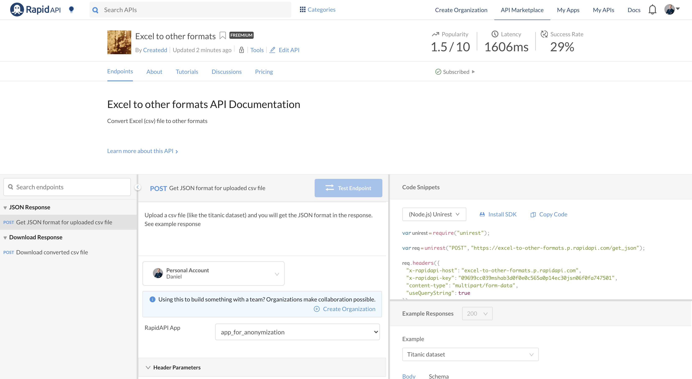

# Develop and sell a Machine Learning API - from start to end tutorial


*Source *


# Table of Contents

- [Develop and sell a Machine Learning API - from start to end tutorial](#develop-and-sell-a-machine-learning-api---from-start-to-end-tutorial)
- [Table of Contents](#table-of-contents)
- [About this article](#about-this-article)
- [Disclaimer](#disclaimer)
- [Stack used](#stack-used)
- [1. Create project formalities](#1-create-project-formalities)
- [2. Create a solution for a problem](#2-create-a-solution-for-a-problem)
  - [Install packages](#install-packages)
  - [Develop solution to problem](#develop-solution-to-problem)
    - [Download data](#download-data)
    - [Create functionality](#create-functionality)
  - [Build server to execute function with REST](#build-server-to-execute-function-with-rest)
- [3. Deploy to AWS](#3-deploy-to-aws)
  - [Set up zappa](#set-up-zappa)
  - [Set up AWS](#set-up-aws)
    - [AWS credentials](#aws-credentials)
      - [Set up credentials with users and roles in IAM](#set-up-credentials-with-users-and-roles-in-iam)
      - [Add credentials in your project](#add-credentials-in-your-project)
  - [AWS API Gateway](#aws-api-gateway)
- [4. Set up Rapidapi](#4-set-up-rapidapi)
  - [Create API on Rapidapi](#create-api-on-rapidapi)
  - [Test your own API](#test-your-own-api)
    - [Create private plan for testing](#create-private-plan-for-testing)
    - [Test endpoint with rapidapi](#test-endpoint-with-rapidapi)
    - [Create code to consume API](#create-code-to-consume-api)
- [End result](#end-result)
- [Inspiration](#inspiration)
- [About](#about)

# About this article

In this article I take the ideas from my previous article ["How to sell a Python API from start to end"](https://towardsdatascience.com/develop-and-sell-a-python-api-from-start-to-end-tutorial-9a038e433966) further and build a machine learning application. If the steps described here are to rough consider reading my previous article first.

There are a number of new and more complicated issues to cover in this project:
1. Machine Learning content. The application takes basic steps of building a Machine Learning model. This covers the preparation, but also the prediction.
2. In time evaluation (not in time training) of the prediction. This means that the dataset is freshly fetched and the prediction is performed on the latest data.
3. Deployment. Deploying a Machine Learning app has various challenges. In this article we met and solved the issue of outsourcing the trained model on AWS.
4. It is not only an API but also has a minor frontend.

It paints a picture for developing a Python API from start to finish and provides help in more difficult areas like the setup with AWS Lambda.

There were various difficulties, which allowed me to learn more about the deployment and building process. It is also a great way to build side projects and maybe even make some money.

As the Table of content shows, it consists of 4 major parts, namely:
1. Setting up the environment
2. Creating a problem solution with Python
3. Setting up AWS
4. Setting up Rapidapi

You will find all my code open sourced on Github:

- https://github.com/Createdd/ml_api_covid

You will find the end result here on Rapidapi:

- https://rapidapi.com/Createdd/api/covid_new_cases_prediction

If you found this article helpful let me know and/or buy the functionality on Rapidapi to show support.


# Disclaimer

I am not associated with any of the services I use in this article.

I do not consider myself an expert. If you have the feeling that I am missing important steps or neglected something, consider pointing it out in the comment section or get in touch with me. Also, always make sure to monitor your AWS costs to not pay for things you do not know about.

I am always happy for constructive input and how to improve.

There are numerous things to improve and build upon. For example the machine learning part has very low effort. The preparation was very rough and many steps are missing. From my professional work I know this. However, I cannot cover every detail in one article. Nevertheless, I am curious to hear your suggestions on improvement in the comments. :)


# Stack used

We will use

- Github (Code hosting),
- Anaconda (Dependency and environment management),
- Docker (for possible further usage in microservices)
- Jupyter Notebook (code development and documentation),
- Python (programming language),
- AWS, especiall AWS Lambda and S3(for deployment),
- Rapidapi (market to sell)

---


# 1. Create project formalities

It's always the same but necessary. I do it along with these steps:

1. Create a local folder `mkdir NAME`
2. Create a new repository on Github with `NAME`
3. Create conda environment `conda create --name NAME python=3.7`
4. Activate conda environment `conda activate PATH_TO_ENVIRONMENT`
5. Create git repo `git init`
6. Connect to Github repo. Add Readme file, commit it and

```sh
git remote add origin URL_TO_GIT_REPO
git push -u origin master
```

# 2. Create a solution for a problem


## Install packages

Install jupyter notebook and jupytext:

```sh
pip install notebook jupytext
```

sets a hook in  `.git/hooks/pre-commit` for tracking the notebook changes in git properly:

```sh
#!/bin/sh

jupytext --from ipynb --to jupytext_conversion//py:light --pre-commit
```

## Develop solution to problem

```sh
pip install pandas requests
```


### Download data


### Create functionality


## Build server to execute function with REST


# 3. Deploy to AWS


## Set up zappa

After we created the app locally we need to start setting up the hosting on a real server.
We will use [zappa](https://github.com/Miserlou/Zappa).

> Zappa makes it super easy to build and deploy server-less, event-driven Python applications (including, but not limited to, WSGI web apps) on AWS Lambda + API Gateway. Think of it as "serverless" web hosting for your Python apps. That means infinite scaling, zero downtime, zero maintenance - and at a fraction of the cost of your current deployments!

```sh
pip install zappa
```


As we are using a conda environment we need to specify it:
```sh
which python
```

will give you `/Users/XXX/opt/anaconda3/envs/XXXX/bin/python` (for Mac)

remove the `bin/python/` and export

```sh
export VIRTUAL_ENV=/Users/XXXX/opt/anaconda3/envs/XXXXX/
```

Now we can do

```sh
zappa init
```

to set up the config.

Just click through everything and you will have a `zappa_settings.json` like

```json
{
    "dev": {
        "app_function": "app.app",
        "aws_region": "eu-central-1",
        "profile_name": "default",
        "project_name": "pandas-transform-format",
        "runtime": "python3.7",
        "s3_bucket": "zappa-pandas-transform-format"
    }
}
```

Note that we are not yet ready to deploy. First, we need to get some AWS credentials.

## Set up AWS

### AWS credentials

First, you need te get an AWS `access key id` and `access key`

You might think it is as easy as:

To get the credentials you need to
- Go to: http://aws.amazon.com/
- Sign Up & create a new account (they'll give you the option for 1 year trial or similar)
- Go to your AWS account overview
- Account menu; sub-menu: Security Credentials

But no. There is more to permissions in AWS!


#### Set up credentials with users and roles in IAM


**My Custom policy:**


#### Add credentials in your project

Create a `.aws/credentials` folder in your root with

```sh
mkdir ~/.aws
code ~/.aws/credentials
```
and paste your credentials from AWS
```py
[dev]
aws_access_key_id = YOUR_KEY
aws_secret_access_key = YOUR_KEY
```
Same with the `config`
```sh
code ~/.aws/config
```

```py
[default]
region = YOUR_REGION (eg. eu-central-1)
```

Note that `code` is for opening a folder with vscode, my editor of choice.


Save the AWS access key id and secret access key assigned to the User you created in the file ~/.aws/credentials. Note the .aws/ directory needs to be in your home directory and the credentials file has no file extension.

Now you can do deploy your API with

```sh
zappa deploy dev
```


There shouldn't be any errors anymore. However, if there are still some, you can debug with:

```sh
zappa status
zappa tail
```

The most common errors are permission related (then check your permission policy) or about python libraries that are incompatible. Either way, zappa will provide good enough error messages for debugging.

If you update your code don't forget to update the deployment as well with

```sh
zappa update dev
```

## AWS API Gateway


# 4. Set up Rapidapi


## Create API on Rapidapi


## Test your own API

### Create private plan for testing


### Test endpoint with rapidapi


### Create code to consume API


# End result



https://rapidapi.com/Createdd/api/excel-to-other-formats


# Inspiration


---

# About

Daniel is an entrepreneur, software developer, and lawyer. He has worked at various IT companies, tax advisory, management consulting, and at the Austrian court.

His knowledge and interests currently revolve around programming machine learning applications and all its related aspects. To the core, he considers himself a problem solver of complex environments, which is reflected in his various projects.

Don't hesitate to get in touch if you have ideas, projects, or problems.


**Connect on:**
- [LinkedIn](https://www.linkedin.com/in/createdd)
- [Github](https://github.com/Createdd)
- [Medium](https://medium.com/@createdd)
- [Twitter](https://twitter.com/_createdd)
- [Instagram](https://www.instagram.com/create.dd/)
- [createdd.com](https://www.createdd.com/)

<!-- Written by Daniel Deutsch -->