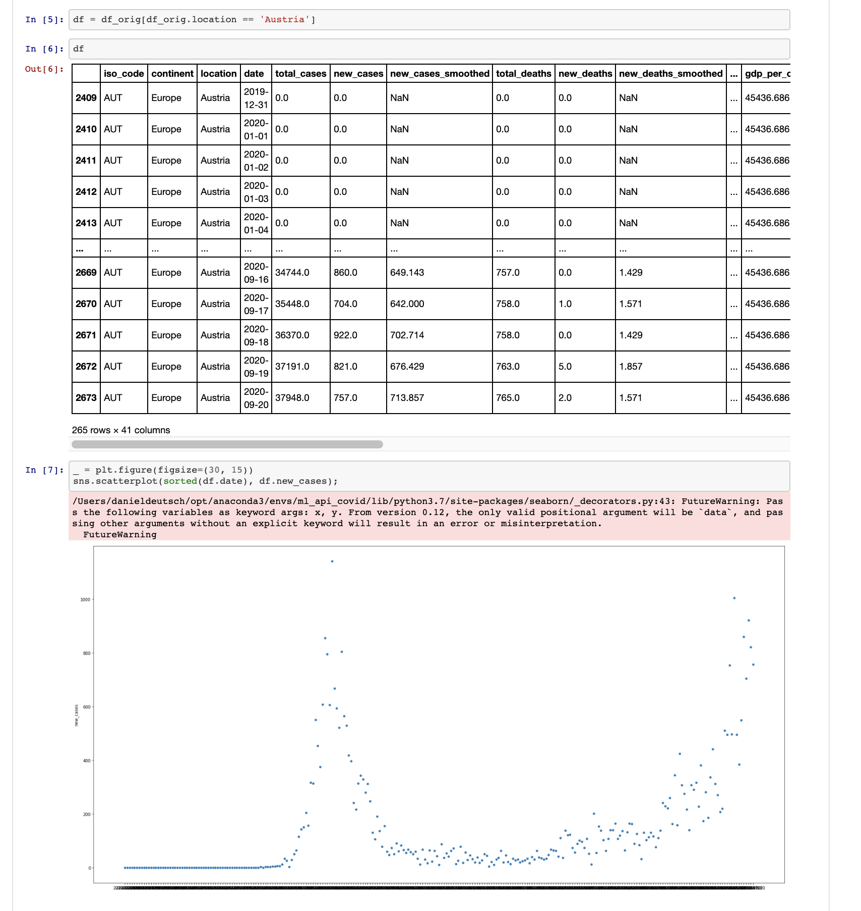
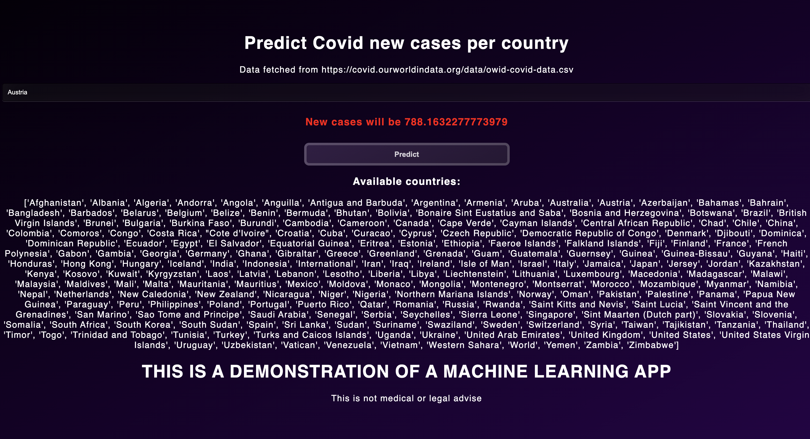
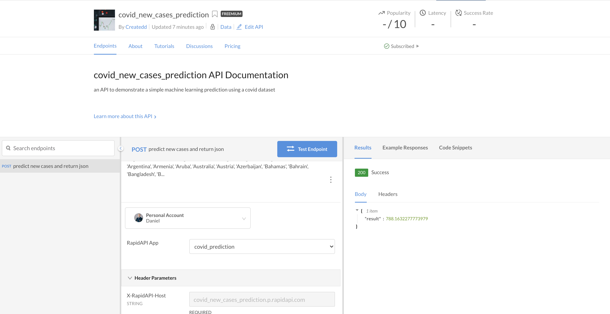

# Develop and sell a Machine Learning app - from start to end tutorial


*Photo by Daniel Korpai https://unsplash.com/photos/HyTwtsk8XqA*

After developing and selling a Python API, I now want to expand the idea with a machine learning solution. So I decided to quickly write a covid-19 prediction algorithm, deploy it and make it sellable. If you want to see how I did it, check out the post for a step by step tutorial.


# Table of Contents

- [Develop and sell a Machine Learning app - from start to end tutorial](#develop-and-sell-a-machine-learning-app---from-start-to-end-tutorial)
- [Table of Contents](#table-of-contents)
- [About this article](#about-this-article)
- [Disclaimer](#disclaimer)
  - [Regarding the term "tutorial"](#regarding-the-term-tutorial)
- [Stack used](#stack-used)
- [1. Create project formalities](#1-create-project-formalities)
- [2. Develop a solution for a problem](#2-develop-a-solution-for-a-problem)
  - [Install packages and track jupyter files properly](#install-packages-and-track-jupyter-files-properly)
  - [Develop solution to problem](#develop-solution-to-problem)
    - [The goal](#the-goal)
    - [Download data](#download-data)
    - [Preparation](#preparation)
    - [Create classifier and predict](#create-classifier-and-predict)
  - [Build server to execute function with REST](#build-server-to-execute-function-with-rest)
    - [Serve basic frontend](#serve-basic-frontend)
    - [Load prediction](#load-prediction)
  - [BONUS: Make reproducible with Docker](#bonus-make-reproducible-with-docker)
    - [Create Dockerfile](#create-dockerfile)
- [3. Deploy to AWS](#3-deploy-to-aws)
  - [Set up zappa](#set-up-zappa)
  - [Set up AWS](#set-up-aws)
    - [AWS credentials](#aws-credentials)
      - [Set up credentials with users and roles in IAM](#set-up-credentials-with-users-and-roles-in-iam)
      - [Add credentials in your project](#add-credentials-in-your-project)
    - [Deploy](#deploy)
      - [Reduce uploading size](#reduce-uploading-size)
      - [Load model to S3 Bucket](#load-model-to-s3-bucket)
      - [Debugging and updates](#debugging-and-updates)
    - [AWS API Gateway - restrict access](#aws-api-gateway---restrict-access)
- [4. Set up Rapidapi](#4-set-up-rapidapi)
- [End result](#end-result)
- [Inspiration](#inspiration)
  - [Common issues](#common-issues)
  - [Additional reading](#additional-reading)
- [Final links](#final-links)
- [About](#about)

# About this article

In this article I take the ideas from my previous article ["How to sell a Python API from start to end"](https://towardsdatascience.com/develop-and-sell-a-python-api-from-start-to-end-tutorial-9a038e433966) further and build a machine learning application. If the steps described here are to rough consider reading my previous article first.

There are a number of new and more complicated issues to cover in this project:
1. Machine Learning content. The application takes basic steps of building a Machine Learning model. This covers the preparation, but also the prediction.
2. In time evaluation (not in time training) of the prediction. This means that the dataset is freshly fetched and the prediction is performed on the latest data.
3. Deployment. Deploying a Machine Learning app has various challenges. In this article we met and solved the issue of outsourcing the trained model on AWS.
4. It is not only an API but also has a minor frontend.

It paints a picture for developing a Python API from start to finish and provides help in more difficult areas like the setup with AWS Lambda.

There were various difficulties, which allowed me to learn more about the deployment and building process. It is also a great way to build side projects and maybe even make some money.

As the Table of content shows, it consists of 4 major parts, namely:
1. Setting up the environment
2. Creating a problem solution with Python
3. Setting up AWS
4. Setting up Rapidapi

You will find all my code open on Github:

- https://github.com/Createdd/ml_api_covid

You will find the end result here on Rapidapi:

- https://rapidapi.com/Createdd/api/covid_new_cases_prediction


# Disclaimer

I am not associated with any of the services I use in this article.

I do not consider myself an expert. If you have the feeling that I am missing important steps or neglected something, consider pointing it out in the comment section or get in touch with me. Also, always make sure to monitor your AWS costs to not pay for things you do not know about.

I am always happy for constructive input and how to improve.

There are numerous things to improve and build upon. For example the machine learning part has very low effort. The preparation was very rough and many steps are missing. From my professional work I am aware of this fact. However, I cannot cover every detail in one article. Nevertheless I am curious to hear your suggestions on improvement in the comments. :)

If you need more information on certain parts, feel free to point it out in the comments.

## Regarding the term "tutorial"

I consider this as a step by step tutorial. However, as I am already too long working as a developer, I assume some knowledge of certain tools. This makes the tutorial probably an intermediate/advanced app.

I assume knowledge of:
- Python
- Git
- Jupyter Notebook
- Terminal/Shell/Unix commands

# Stack used

We will use

- Github (Code hosting),
- Anaconda (Dependency and environment management),
- Docker (for possible further usage in microservices)
- Jupyter Notebook (code development and documentation),
- Python (programming language),
- AWS, especially AWS Lambda and S3(for deployment),
- Rapidapi (market to sell)

---


# 1. Create project formalities

It's always the same but necessary. I do it along with these steps:

1. Create a local folder `mkdir NAME`
2. Create a new repository on Github with `NAME`
3. Create conda environment `conda create --name NAME python=3.7`
4. Register new environment in jupyter `ipython kernel install --name NAME--user`
5. Activate conda environment `conda activate PATH_TO_ENVIRONMENT`
6. Create git repo `git init`
7. Connect to Github repo. Add Readme file, commit it and

```sh
git remote add origin URL_TO_GIT_REPO
git push -u origin master
```

# 2. Develop a solution for a problem

- [Install packages and track jupyter files properly](#install-packages-and-track-jupyter-files-properly)
- [Develop solution to problem](#develop-solution-to-problem)
- [Build server to execute function with REST](#build-server-to-execute-function-with-rest)
- [BONUS: Make reproducible with Docker](#bonus-make-reproducible-with-docker)

As we will develop a Machine Learning solution, a Jupyter Notebook will be very useful.


## Install packages and track jupyter files properly

Install jupyter notebook and jupytext:

```sh
pip install notebook jupytext
```

set a hook in  `.git/hooks/pre-commit` for tracking the notebook changes in git properly:

```sh
touch .git/hooks/pre-commit
code  .git/hooks/pre-commit
```

copy this in the file
```sh
#!/bin/sh
# For every ipynb file in the git index, add a Python representation
jupytext --from ipynb --to py:light --pre-commit
```

afterwards for making the hook executable (on mac)
```sh
chmod +x .git/hooks/pre-commit
```

## Develop solution to problem

### The goal

As currently the world is in a pandemic I thought I use one of the multiple datasets for Covid-19 cases.
Given the structure of the dataset we want to predict the new cases of infections per day for a country.


```py
pip install -r requirements.txt
```

This will install all packages we need. Have a look in the `/development/predict_covid.ipynb` notebook to see what libraries are used.

Most important are the libraries
- **pandas** for transforming the dataset and
-  **sklearn** for machine learning

For the following sub headings please check out the jupyter notebook for more details:
- https://github.com/Createdd/ml_api_covid/blob/master/development/predict_covid.ipynb




### Download data

We will use the dataset from https://ourworldindata.org/coronavirus-source-data in csv format.

- License of data is [Attribution 4.0 International (CC BY 4.0)](https://creativecommons.org/licenses/by/4.0/)
- Source code available on [Github](https://github.com/owid/covid-19-data/tree/master/public/data)

### Preparation

In short I did:
1. Check for missing data
2. Remove columns with more than 50% missing data
3. Remove rows with remaining missing content like continent or isocode. (Not useful for my app solution which requires a country)
4. Encode categorical data with labels
5. Fill in remaining numerical missing data with the mean of the column
6. Split into training and test set

### Create classifier and predict

1. Create a Random Forest Regressor
2. Train it on the data and evaluate
3. Perform hyperparameter tuning with RandomizedSearchCV
4. Save trained model
5. Predict the new cases by providing a country name


## Build server to execute function with REST

For the API functionality we will use a Flask server (in `app.py`)
- https://github.com/Createdd/ml_api_covid/blob/master/app.py

### Serve basic frontend

```py
@app.route('/')
def home():
    return render_template("home.html")
```

Which serves a basic html and css file.

```html
<!DOCTYPE html>
<html>
<head>
  <meta charset="UTF-8">
  <title>Predict Covid</title>

<link type="text/css" rel="stylesheet" href="{{ url_for('static', filename='./style.css') }}">

</head>

<body>
 <div class="page">
     <form if="form" action="{{ url_for('predict')}}"method="POST">
         <input type="text" name="country" placeholder="Country" required="required" /><br>
         <h3 class='res'>{{pred}}</h3>
         <button id="button" type="submit" class="btn btn-primary btn-block btn-large">Predict</button>
        </form>
 </div>
</body>
</html>
```



### Load prediction

This is a little more complex.

Key route is this:

```py
@app.route('/predict',methods=['POST'])
def predict():
    input_val = [x for x in request.form.values()][0]
    rf = load_model(BUCKET_NAME, MODEL_FILE_NAME, MODEL_LOCAL_PATH)

    if input_val not in available_countries:
        return f'Country {input_val} is not in available list. Try one from the list! Go back in your browser', 400

    to_pred = get_prediction_params(input_val, url_to_covid)
    prediction = rf.predict(to_pred)[0]

    return render_template('home.html',pred=f'New cases will be {prediction}')
```
But before we can return the prediction result we need to get the latest data and pre-process it again.
This is done with

```py

def pre_process(df):
    cols_too_many_missing = ['new_tests',
                             'new_tests_per_thousand',
                             'total_tests_per_thousand',
                             'total_tests',
                             'tests_per_case',
                             'positive_rate',
                             'new_tests_smoothed',
                             'new_tests_smoothed_per_thousand',
                             'tests_units',
                             'handwashing_facilities']
    df = df.drop(columns=cols_too_many_missing)

    nominal = df.select_dtypes(include=['object']).copy()
    nominal_cols = nominal.columns.tolist()

    for col in nominal_cols:
        col
        if df[col].isna().sum() > 0:
            df[col].fillna('MISSING', inplace=True)
        df[col] = encoder.fit_transform(df[col])

    numerical = df.select_dtypes(include=['float64']).copy()

    for col in numerical:
        df[col].fillna((df[col].mean()), inplace=True)

    X = df.drop(columns=['new_cases'])
    y = df.new_cases

    return X, y


def get_prediction_params(input_val, url_to_covid):
    df_orig = pd.read_csv(url_to_covid)
    _ = encoder.fit_transform(df_orig['location'])
    encode_ind = (encoder.classes_).tolist().index(input_val)
    df_orig[df_orig.location == input_val]

    X, _ = pre_process(df_orig)
    to_pred = X[X.location == encode_ind].iloc[-1].values.reshape(1,-1)

    return to_pred
```

`Pre-process` again transforms the downloaded dataset for machine learning purposes, whereas `get_prediction_params` takes the input value (which is the country to be predicted) and the url to the latest dataset.

Those processes make the prediction true for the latest data, but also slows down the app.

You might wonder why we do `rf = load_model(BUCKET_NAME, MODEL_FILE_NAME, MODEL_LOCAL_PATH)`.
The reason for this is that we need to load the pre-trained model from a AWS S3 bucket to save memory when executing everything with AWS Lambda. Scroll down for more details.

But if we do not want to deploy it in the cloud we can simply do something like `joblib.load(PATH_TO_YOUR_EXPORTED_MODEL)`. In the [notebook](https://github.com/Createdd/ml_api_covid/blob/master/development/predict_covid.ipynb) we export the the model with `joblib.dump`.
More info on model exports in the [sklearn docs](https://scikit-learn.org/stable/modules/model_persistence.html)

But that is the mere functionality of the FLAK server. Providing a route for serving the html template and a route for prediction. Quite simple!

Running now

```sh
env FLASK_APP=app.py FLASK_ENV=development flask run
```

will start the server.


## BONUS: Make reproducible with Docker

Maybe you want to scale the app or allow other people to test it more easily. For this we can create a Docker container. I will not explain in detail how it works but if you are interested check one of the links in my "Inspiration" section.

Building a Docker container is not necessary for making this application work!

### Create Dockerfile

```docker
FROM python:3.7

ENV PYTHONDONTWRITEBYTECODE=1
ENV PYTHONUNBUFFERED=1

ENV FLASK_APP=app.py
ENV FLASK_ENV=development

# install system dependencies
RUN apt-get update \
    && apt-get -y install gcc make \
    && rm -rf /var/lib/apt/lists/*s

RUN python3 --version
RUN pip3 --version

RUN pip install --no-cache-dir --upgrade pip

WORKDIR /app

COPY ./requirements.txt /app/requirements.txt

RUN pip3 install --no-cache-dir -r requirements.txt

COPY . .

EXPOSE 8080

CMD ["gunicorn", "--bind", "0.0.0.0:8080", "app:app"]
```

Note: the last line is for starting the Flask server

After creating the `Dockerfile` run

```sh
docker build -t YOUR_APP_NAME .
```
and afterwards

```sh
docker run -d -p 80:8080 YOUR_APP_NAME
```

Afterwards you will see your app running on `http://localhost/`


# 3. Deploy to AWS

- [Set up zappa](#set-up-zappa)
- [Set up AWS](#set-up-aws)
  - [AWS credentials](#aws-credentials)
  - [Deploy](#deploy)
  - [AWS API Gateway - restrict access](#aws-api-gateway---restrict-access)

Until now this was a rather easy path. Nothing too complicated, nothing too fancy. Now that we come to deployment it gets interesting and challenging.

Again, I would strongly encourage you to check out my previous article https://towardsdatascience.com/develop-and-sell-a-python-api-from-start-to-end-tutorial-9a038e433966 if you have any issues with Zappa and AWS.

I will not go so much in detail here anymore but rather point out pain points.

## Set up zappa

After we created the app locally we need to start setting up the hosting on a real server.
We will use [zappa](https://github.com/Miserlou/Zappa).

> Zappa makes it super easy to build and deploy server-less, event-driven Python applications (including, but not limited to, WSGI web apps) on AWS Lambda + API Gateway. Think of it as "serverless" web hosting for your Python apps. That means infinite scaling, zero downtime, zero maintenance - and at a fraction of the cost of your current deployments!

```sh
pip install zappa
```


As we are using a conda environment we need to specify it:
```sh
which python
```

will give you `/Users/XXX/opt/anaconda3/envs/XXXX/bin/python` (for Mac)

remove the `bin/python/` and export

```sh
export VIRTUAL_ENV=/Users/XXXX/opt/anaconda3/envs/XXXXX/
```

Now we can do

```sh
zappa init
```

to set up the config.

Just click through everything and you will have a `zappa_settings.json` like

```json
{
    "dev": {
        "app_function": "app.app",
        "aws_region": "eu-central-1",
        "profile_name": "default",
        "project_name": "ml-api-covid",
        "runtime": "python3.7",
        "s3_bucket": "zappa-eyy4wkd2l",
        "slim_handler": true,
        "exclude": [
            "*.joblib", "development", "models"
        ]
    }
}
```

NOTA BENE! Do not enter name for s3 bucket as it cannot be found. I really don't know what the problem with naming your s3 bucket is, but it never worked. There very multiple error statements and I could not resolve this. Just leave the suggested one and everything works fine. ;)

Note that we are NOT yet ready to deploy. First, we need to get some AWS credentials.

## Set up AWS

Note: This takes quite some effort. Do not be discouraged by the complexity of AWS and its policy management.

### AWS credentials

First, you need te get an AWS `access key id` and `access key`


#### Set up credentials with users and roles in IAM

I break it down as simple as possible:

1. Within the AWS Console, type IAM into the search box. IAM is the AWS user and permissions dashboard.
2. Create a group
3. Give your group a name (for example zappa_group)
4. Create our own specific inline policy for your group
5. In the Permissions tab, under the Inline Policies section, choose the link to create a new Inline Policy
6. In the Set Permissions screen, click the Custom Policy radio button and click the "Select" button on the right.
7. Create a Custom Policy written in json format
8. Read through and copy a policy discussed here: [https://github.com/Miserlou/Zappa/issues/244](https://github.com/Miserlou/Zappa/issues/244)
9. Scroll down to "My Custom policy" see a snippet of my policy.
10. After pasting and modifying the json with your AWS Account Number, click the "Validate Policy" button to ensure you copied valid json. Then click the "Apply Policy" button to attach the inline policy to the group.
11. Create a user and add the user to the group
12. Back at the IAM Dashboard, create a new user with the "Users" left-hand menu option and the "Add User" button.
13. In the Add user screen, give your new user a name and select the Access Type for Programmatic access. Then click the "Next: Permissions" button.
14. In the Set permissions screen, select the group you created earlier in the Add user to group section and click "Next: Tags".
15. Tags are optional. Add tags if you want, then click "Next: Review".
16. Review the user details and click "Create user"
17. Copy the user's keys
18. Don't close the AWS IAM window yet. In the next step, you will copy and paste these keys into a file. At this point, it's not a bad idea to copy and save these keys into a text file in a secure location. Make sure you don't save keys under version control.

**My Custom policy:**

```json
{
    "Version": "2012-10-17",
    "Statement": [
        {
            "Effect": "Allow",
            "Action": [
                "iam:AttachRolePolicy",
                "iam:GetRole",
                "iam:CreateRole",
                "iam:PassRole",
                "iam:PutRolePolicy"
            ],
            "Resource": [
                "arn:aws:iam::XXXXXXXX:role/*-ZappaLambdaExecutionRole"
            ]
        },
        {
            "Effect": "Allow",
            "Action": [
                "apigateway:DELETE",
                "apigateway:GET",
                "apigateway:PATCH",
                "apigateway:POST",
                "apigateway:PUT",
                "events:DeleteRule",
                "events:DescribeRule",
                "events:ListRules",
                "events:ListRuleNamesByTarget",
                "events:ListTargetsByRule",
                "events:PutRule",
                "events:PutTargets",
                "events:RemoveTargets",
                "lambda:AddPermission",
                "lambda:CreateFunction",
                "lambda:DeleteFunction",
                "lambda:DeleteFunctionConcurrency",
                "lambda:GetAlias",
                "lambda:GetFunction",
                "lambda:GetFunctionConfiguration",
                "lambda:GetPolicy",
                "lambda:InvokeFunction",
                "lambda:ListVersionsByFunction",
                "lambda:RemovePermission",
                "lambda:UpdateFunctionCode",
                "lambda:UpdateFunctionConfiguration",
                "cloudformation:CreateStack",
                "cloudformation:DeleteStack",
                "cloudformation:DescribeStackResource",
                "cloudformation:DescribeStacks",
                "cloudformation:ListStackResources",
                "cloudformation:UpdateStack",
                "cloudfront:UpdateDistribution",
                "logs:DeleteLogGroup",
                "logs:DescribeLogStreams",
                "logs:FilterLogEvents",
                "route53:ListHostedZones"
            ],
            "Resource": [
                "*"
            ]
        },
        {
            "Effect": "Allow",
            "Action": [
                "s3:CreateBucket",
                "s3:ListBucket",
                "s3:ListBucketMultipartUploads",
                "s3:ListAllMyBuckets",
                "s3:GetObject"
            ],
            "Resource": [
                "arn:aws:s3:::zappa-*",
                "arn:aws:s3:::*"
            ]
        },
        {
            "Effect": "Allow",
            "Action": [
                "s3:DeleteObject",
                "s3:GetObject",
                "s3:PutObject",
                "s3:AbortMultipartUpload",
                "s3:ListMultipartUploadParts"
            ],
            "Resource": [
                "arn:aws:s3:::zappa-*/*"
            ]
        }
    ]
}
```

As you can see in the policy, I added S3 related policies. This is because we want to download our pre-trained model from S3. More infos on that later.

#### Add credentials in your project

Create a `.aws/credentials` folder in your root with

```sh
mkdir ~/.aws
code ~/.aws/credentials
```
and paste your credentials from AWS
```py
[dev]
aws_access_key_id = YOUR_KEY
aws_secret_access_key = YOUR_KEY
```
Same with the `config`
```sh
code ~/.aws/config
```

```py
[default]
region = YOUR_REGION (eg. eu-central-1)
```

Note that `code` is for opening a folder with vscode, my editor of choice.


Save the AWS access key id and secret access key assigned to the User you created in the file ~/.aws/credentials. Note the .aws/ directory needs to be in your home directory and the credentials file has no file extension.


### Deploy

Now you can do deploy your API with

```sh
zappa deploy dev
```

However, there are a few things to consider:
1. Zappa will pack your entire environment and whole root content. This will be quite large.
2. There is a [upload limit for AWS Lambda](https://docs.amazonaws.cn/en_us/lambda/latest/dg/gettingstarted-limits.html)

#### Reduce uploading size

There are several discussions on how to reduce the upload size with zappa. Check out the Inspiration section for links.


First we need to reduce the package size for the upload.

We will put all exploratory content to an own folder. I named it "development". Afterwards you can specify excluded files and folder in zappa_settings.json with exclude:

```json
{
    "dev": {
        ...
        "slim_handler": true,
        "exclude": [
            "*.ipynb", "*.joblib", "jupytext_conversion/", ".ipynb_checkpoints/",
            "predict_covid.ipynb", "development", "models"
        ]
    }
}

```

You can add everything that doesn't need to be packaged for deployment.

Another issue is the environment dependencies. In our case we have multiple dependencies, which we don't need for deployment.
To solve this I created a new "requirements_prod.txt" file. This shall only have dependencies which are needed on AWS.

Make sure to export your current packages with

```sh
pip freeze > requirements.txt
```

Afterwards uninstall all packages

```sh
pip uninstall -r requirements.txt -y
```

Install new packages for deplyoment and save them in the file

```sh
pip install Flask pandas boto3 sklearn zappa
```

```sh
pip freeze > requirements_prod.txt
```

When you hit `zappa deploy dev` there should be considerably less size to package.

You will note that I also set `slim_handler=true`. This allows us to upload more than 50MB. Behind the scenes zappa already puts content into an own S3 bucket. Read the zappa docs for more info.


#### Load model to S3 Bucket

Since we excluded our model from the AWS Lambda upload we need to get the model from somewhere else. We will use a AWS S3 Bucket.

During the development process I tried to upload it there programmatically as well but I just uploaded it by hand as it was just faster now. (But you can still try to upload it - I still have a outcommented file in the repo)

Go to https://console.aws.amazon.com/s3/


1. "create bucket"
2. give name and leave rest as default. check for sufficient permissions.
3. "create bucket"


check if you have a sufficient policy for interacting with the bucket and boto3. You should have something similar to

```sh
{
      "Effect": "Allow",
      "Action": [
        "s3:CreateBucket",
        "s3:ListBucket",
        "s3:ListBucketMultipartUploads",
        "s3:ListAllMyBuckets",
        "s3:GetObject"
      ],
      "Resource": [
        "arn:aws:s3:::zappa-*",
        "arn:aws:s3:::*"
      ]
    }
```


#### Debugging and updates

Finally, there shouldn't be any errors anymore. However, if there are still some, you can debug with:

```sh
zappa status

# and

zappa tail
```

The most common errors are permission related (then check your permission policy) or about python libraries that are incompatible. Either way, zappa will provide good enough error messages for debugging. Top list of errors from my experience are:
1. Policy issues with your user from IAM
2. Zappa and size issues
3. Boto3 and permission/location of files issues


If you update your code don't forget to update the deployment as well with

```sh
zappa update dev
```

### AWS API Gateway - restrict access

To set up the API on a market we need to first restrict its usage with an API-key and then set it up on the market platform.

To break it down:

1. go to your AWS Console and go to API gateway
2. click on your API
3. we want to create an x-api-key to restrict undesired access to the API and also have a metered usage
4. create a Usage plan for the API, with the desired throttle and quota limits
5. create an associated API stage
6. add an API key
7. in the API key overview section, click "show" at the API key and copy it
8. then associate the API with the key and discard all requests that come without the key
9. go back to the API overview. under resources, click the "/ any" go to the "method request". then in settings, set "API key required" to true
10. do the same for the "/{proxy+} Methods"

Now you have restricted access to your API.

# 4. Set up Rapidapi

- Add new API
- Test endpoint with rapidapi
- Create code to consume API

I will not go into detail in this article anymore. Again, check my previous https://towardsdatascience.com/develop-and-sell-a-python-api-from-start-to-end-tutorial-9a038e433966 for setting everything up. There is no big difference to my new machine learning model.


# End result



https://rapidapi.com/Createdd/api/covid_new_cases_prediction


# Inspiration

My main motivation this time came from [Moez Ali](https://towardsdatascience.com/@moez_62905), who provides great articles on deplying machine learning systems. I also enjoy follow him on his social media. I can recommend his articles:
- https://towardsdatascience.com/build-and-deploy-your-first-machine-learning-web-app-e020db344a99
- https://towardsdatascience.com/deploy-machine-learning-pipeline-on-aws-fargate-eb6e1c50507

Also François Marceau with
- https://towardsdatascience.com/how-to-deploy-a-machine-learning-model-on-aws-lambda-24c36dcaed20


## Common issues

- https://github.com/Miserlou/Zappa/issues/1927 Package Error: python-dateutil
- https://stackabuse.com/file-management-with-aws-s3-python-and-flask/
- https://ianwhitestone.work/zappa-zip-callbacks/ remove unnecessary files in zappa
- https://stackoverflow.com/questions/62941174/how-to-write-load-machine-learning-model-to-from-s3-bucket-through-joblib

## Additional reading

- https://www.freecodecamp.org/news/what-we-learned-by-serving-machine-learning-models-using-aws-lambda-c70b303404a1/
- https://ianwhitestone.work/slides/serverless-meetup-feb-2020.html
- https://read.iopipe.com/the-right-way-to-do-serverless-in-python-e99535574454
- https://www.bluematador.com/blog/serverless-in-aws-lambda-vs-fargate aws lambda vs fargate
- https://docs.aws.amazon.com/AmazonCloudWatch/latest/monitoring/monitor_estimated_charges_with_cloudwatch.html billing alarm


# Final links

Open source code:
- https://github.com/Createdd/ml_api_covid

On Rapidapi:
- https://rapidapi.com/Createdd/api/covid_new_cases_prediction

---

# About

Daniel is an entrepreneur, software developer, and lawyer. He has worked at various IT companies, tax advisory, management consulting, and at the Austrian court.

His knowledge and interests currently revolve around programming machine learning applications and all its related aspects. To the core, he considers himself a problem solver of complex environments, which is reflected in his various projects.

Don't hesitate to get in touch if you have ideas, projects, or problems.


**Connect on:**
- [LinkedIn](https://www.linkedin.com/in/createdd)
- [Github](https://github.com/Createdd)
- [Medium](https://medium.com/@createdd)
- [Twitter](https://twitter.com/_createdd)
- [Instagram](https://www.instagram.com/create.dd/)
- [createdd.com](https://www.createdd.com/)

If this was helpful for you consider showing support:
<a href="https://www.buymeacoffee.com/createdd" target="_blank"></a>


<!-- Written by Daniel Deutsch -->