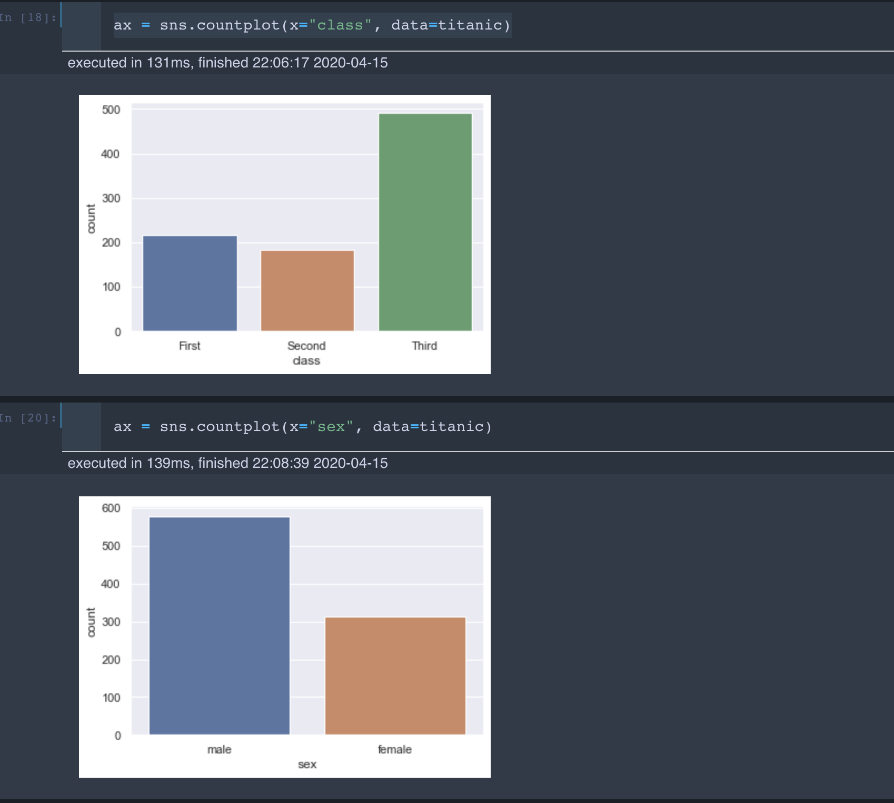

# Dynamic subplot layout in Seaborn


Seaborn is one of the most used visualization libraries and I enjoy working with it. In my latest projects I wanted to visualize multiple subplots in a dynamic way. To my surprise I didn't find a straight forward solution anywhere online, so I want to share my way of doing it. It can be quite useful in any data analysis endeavor.

## Table of Contents

  - [The problem](#the-problem)
  - [The approach](#the-approach)
  - [The solution](#the-solution)
    - [Changing it to 2 columns it will look like this](#changing-it-to-2-columns-it-will-look-like-this)
    - [Changing it to 4 columns it will look like this](#changing-it-to-4-columns-it-will-look-like-this)
  - [About](#about)


## The problem

Let's see the titanic dataset for example:


There are multiple categorical variables, which we might like to visualize with countplots.
Doing this by copying the code in every new cell is not optimal:



There is a FacetGrid option for seaborn:


However, I would like to have different subplots, on which I can set each plot for myself.

## The approach
Thankfully there is the subplot functionality:

```python
categorical_vars = ['survived', 'pclass', 'sex', 'age', 'sibsp', 'parch',
       'embarked', 'class', 'who', 'adult_male', 'deck', 'embark_town',
       'alive', 'alone']


fig, axs = plt.subplots(nrows=2, ncols=2)

for i, var in enumerate(categorical_vars):
    row = i//2
    pos = i % 2

    plot = sns.countplot(x=var, data=titanic, ax=axs[row][pos])
```

Which leads to:


This demonstrates the issues I always encountered. For multiple variables I always need to set the number of rows and columns manually. (`fig, axs = plt.subplots(nrows=2, ncols=2)`)

## The solution

To solve this I, changed it to:

```python
categorical_vars = ['survived', 'pclass', 'sex', 'age', 'sibsp', 'parch',
       'embarked', 'class', 'who', 'adult_male', 'deck', 'embark_town',
       'alive', 'alone']


num_plots = len(categorical_vars)
total_cols = 3
total_rows = num_plots//total_cols + 1

fig, axs = plt.subplots(nrows=total_rows, ncols=total_cols,
                        figsize=(7*total_cols, 7*total_rows), constrained_layout=True)

for i, var in enumerate(categorical_vars):
    row = i//total_cols
    pos = i % total_cols

    plot = sns.countplot(x=var, data=titanic, ax=axs[row][pos])
```

Which leads to this:


### Changing it to 2 columns it will look like this


### Changing it to 4 columns it will look like this


Now I can define the layout of the plots to my wishes and also can decide what to plot. Even though it seems quite easy, I didn't find anything related online. So maybe this helps some of you ;)

---

## About

Daniel is an entrepreneur, software developer, and lawyer.
His knowledge and interests evolve around business law and programming machine learning applications.
To the core, he considers himself a problem solver of complex environments, which is reflected in his various projects.
Don't hesitate to get in touch if you have ideas, projects or problems.


**Connect on:**
- [LinkedIn](https://www.linkedin.com/in/createdd)
- [Github](https://github.com/Createdd)
- [Medium](https://medium.com/@createdd)
- [Twitter](https://twitter.com/_createdd)
- [Instagram](https://www.instagram.com/create.dd/)


<!-- Written by Daniel Deutsch -->