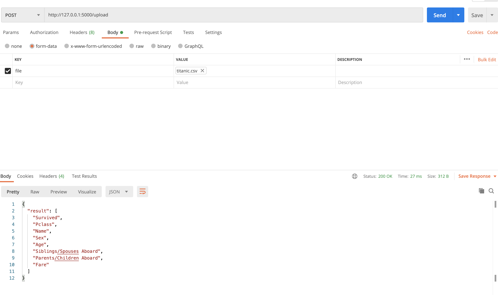

# Develop and sell a Python API. From start to end tutorial.

[](
httpsasdfafasfasfdasf)
xxxxxxx - httpsasdfafasfasfdasf


I recently read a blog post about setting up your own API and selling it.

I was quite inspired and wanted to test if it works. In just 5 days I was able to create a product from start to end. So I thought I share issues I came across, elaborate on concepts that the article was introducing, and provide a quick checklist to build something yourself.


# Table of Contents

- [Develop and sell a Python API. From start to end tutorial.](#develop-and-sell-a-python-api-from-start-to-end-tutorial)
- [Table of Contents](#table-of-contents)
- [Stack used](#stack-used)
- [1. Create project formalities](#1-create-project-formalities)
- [2. Create a solution for a problem](#2-create-a-solution-for-a-problem)
  - [Install packages](#install-packages)
  - [Develop solution to problem](#develop-solution-to-problem)
    - [Download data](#download-data)
    - [Create functionality](#create-functionality)
  - [Build server to execute function with REST](#build-server-to-execute-function-with-rest)
- [3. Deploy to AWS](#3-deploy-to-aws)
  - [Set up zappa](#set-up-zappa)
  - [Set up AWS](#set-up-aws)
- [4. Set up rapidAPI](#4-set-up-rapidapi)
- [Inspiration](#inspiration)
  - [About](#about)

# Stack used

We will use

- Github (Code hosting),
- Anaconda (Dependency and environment management),
- Jupyter Notebook (code development and documentaion),
- Python (programming language),
- AWS (deployment),
- RapidAPI (market to sell)

# 1. Create project formalities

This is always an annoying step. It's always the same but necessary.

1. Create local folder `mkdir NAME`
2. Create new repository on Github with `NAME`
3. Create conda environment `conda create --name NAME python=3.7`
4. Activate conda environment `conda activate PATH_TO_ENVIRONMENT`
5. Create git repo `git init`
6. Connect to Github repo. Add Readme file, commit it and
```sh
git remote add origin URL_TO_GIT_REPO
git push -u origin master
```

Now we have:
- [x] local folder
- [x] github repository
- [x] anaconda virtual environment
- [x] git version control


# 2. Create a solution for a problem

## Install packages

Install jupyter notebook and jupytext:

```sh
pip install notebook jupytext
```

sets a hook in  `.git/hooks/pre-commit` for tracking the notebook changes in git properly:

```sh
#!/bin/sh

jupytext --from ipynb --to jupytext_conversion//py:light --pre-commit
```

## Develop solution to problem

```sh
pip install pandas requests
```

Add a `.gitignore` file and add the data folder (`data/`) to not upload the data to the hosting.

### Download data

Download an example dataset (titanic dataset) and save it into a data folder:

```py
def download(url: str, dest_folder: str):
    if not os.path.exists(dest_folder):
        os.makedirs(dest_folder)

    filename = url.split('/')[-1].replace(" ", "_")
    file_path = os.path.join(dest_folder, filename)

    r = requests.get(url, stream=True)
    if r.ok:
        print("saving to", os.path.abspath(file_path))
        with open(file_path, 'wb') as f:
            for chunk in r.iter_content(chunk_size=1024 * 8):
                if chunk:
                    f.write(chunk)
                    f.flush()
                    os.fsync(f.fileno())
    else:
        print("Download failed: status code {}\n{}".format(r.status_code, r.text))


url_to_titanic_data = 'https://web.stanford.edu/class/archive/cs/cs109/cs109.1166/stuff/titanic.csv'

download(url_to_titanic_data,'./data')
```

### Create functionality

Transform format

```py
df = pd.read_csv('./data/titanic.csv')
df.to_json(r'./data/titanic.json')
```

## Build server to execute function with REST

After developing the functionality in jupyter notebook we want to actually provide the functionality in a python app.

There are ways to use parts of the jupyter notebook, but for the sake of simplicity we create it again now.

Add a `app.py` file.

We want the user to upload an excel file and return the file converted into JSON for example.

Browsing through the internet we can see that there are already packages that work with flask and excel. So lets use them.

```sh
pip install Flask Flask-Excel
```


Start Flask server with

```sh
env FLASK_APP=app.py FLASK_ENV=development flask run
```


Tipp: Test your backend functionality with [Postman](https://www.postman.com/). It is easy to setup and allows to test the backend functionality quickly. Uploading an excel is done in the "form-data" tab:

Here you can see the uploaded titanic csv file and the returned column names of the dataset.

Now we simply write the function to transform the excel into json, like:

```py
import json
import pandas as pd
import flask_excel as excel
from flask import Flask, request, jsonify

app = Flask(__name__)

@app.route('/upload', methods=['GET', 'POST'])
def upload_file():
    if request.method == 'POST':
        provided_data = request.files.get('file')
        if provided_data is None:
            return 'Please enter valid excel format ', 400

        data = provided_data
        df = pd.read_csv(data)
        transformed = df.to_json()

        result = {
            'result': transformed,
        }
        json.dumps(result)

        return result


if __name__ == '__main__':
    excel.init_excel(app)
    app.run()
```


Now we have the functionality to transform csv files into json for example.

# 3. Deploy to AWS

## Set up zappa

After we created the app locally we need to start setting up the hosting on a real server.
We will use [zappa](https://github.com/Miserlou/Zappa).

> Zappa makes it super easy to build and deploy server-less, event-driven Python applications (including, but not limited to, WSGI web apps) on AWS Lambda + API Gateway. Think of it as "serverless" web hosting for your Python apps. That means infinite scaling, zero downtime, zero maintenance - and at a fraction of the cost of your current deployments!

```sh
pip install zappa
```


As we are using a conda environment we need to specify it:
```sh
which python
```

will give you `/Users/XXX/opt/anaconda3/envs/XXXX/bin/python`

remove the `bin/python/` and export

```sh
export VIRTUAL_ENV=/Users/XXXX/opt/anaconda3/envs/XXXXX/
```

Now we can do

```sh
zappa init
```

to set up the config.

Just click through everything and you will have a `zappa_settings.json` like

```json
{
    "dev": {
        "app_function": "app.app",
        "aws_region": "eu-central-1",
        "profile_name": "default",
        "project_name": "pandas-transform-format",
        "runtime": "python3.7",
        "s3_bucket": "zappa-pandas-transform-format"
    }
}
```

## Set up AWS


Save the AWS access key id and secret access key assigned to the User you created in the file ~/.aws/credentials. Note the .aws/ directory needs to be in your home directory and the credentials file has no file extension.


# 4. Set up rapidAPI


# Inspiration

The article ["API as a product. How to sell your work when all you know is a back-end"](https://towardsdatascience.com/api-as-a-product-how-to-sell-your-work-when-all-you-know-is-a-back-end-bd78b1449119) by Artem provided a great idea, namely to

> - Make an API that solves a problem
> - Deploy it with a serverless architecture
> - Distribute through an API Marketplace

For the setting everything I found the articles from Nagesh Bansal very helpful:
- https://medium.com/@bansalnagesh/how-to-sell-your-apis-b4b5c9a273f8
- https://medium.com/@bansalnagesh/launch-your-api-on-aws-with-0-upfront-cost-using-zappa-in-10-minutes-eb6d00623842


I encourage you to have a look at those articles as well.

---

## About

Daniel is an entrepreneur, software developer and lawyer. He has worked at various IT companies, tax advisory, management consulting and at the Austrian court.

His knowledge and interests currently revolve around programming machine learning applications and all its related aspects. To the core, he considers himself a problem solver of complex environments, which is reflected in his various projects.

Don't hesitate to get in touch if you have ideas, projects, or problems.


**Connect on:**
- [LinkedIn](https://www.linkedin.com/in/createdd)
- [Github](https://github.com/Createdd)
- [Medium](https://medium.com/@createdd)
- [Twitter](https://twitter.com/_createdd)
- [Instagram](https://www.instagram.com/create.dd/)


<!-- Written by Daniel Deutsch -->