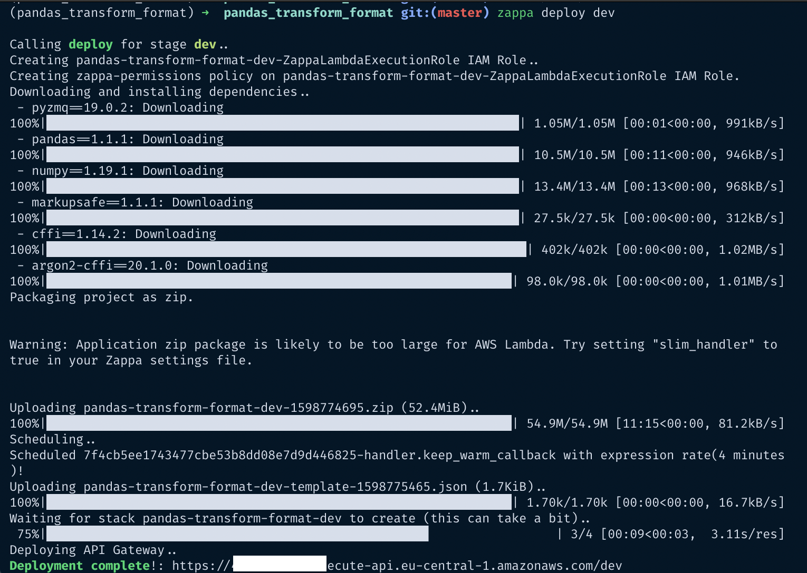
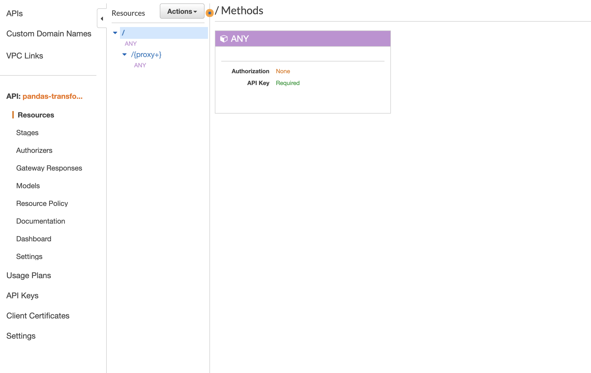
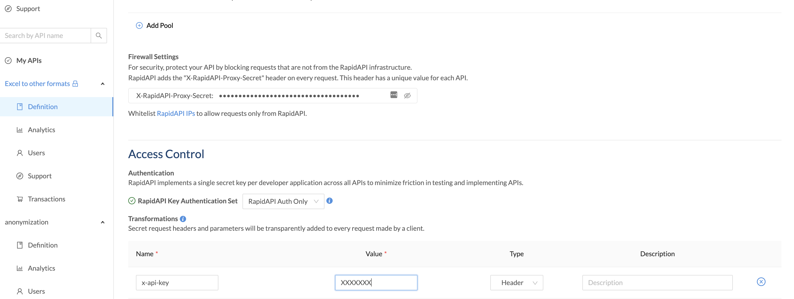
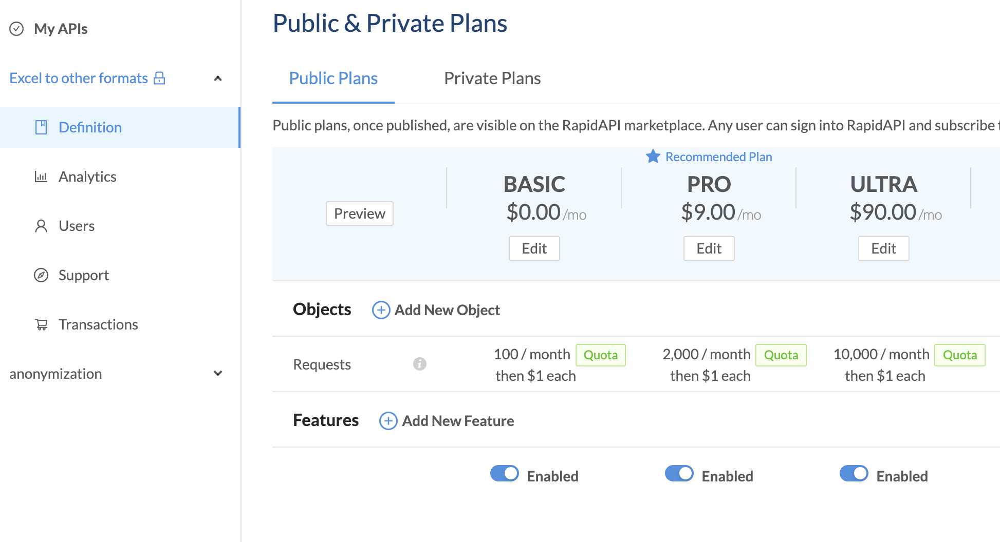
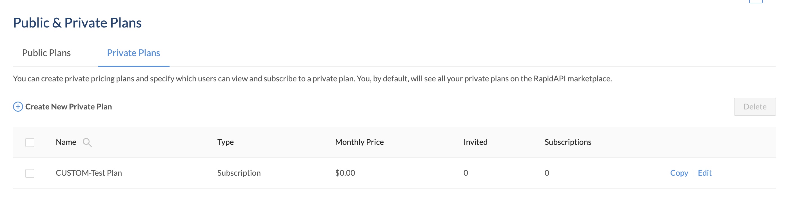
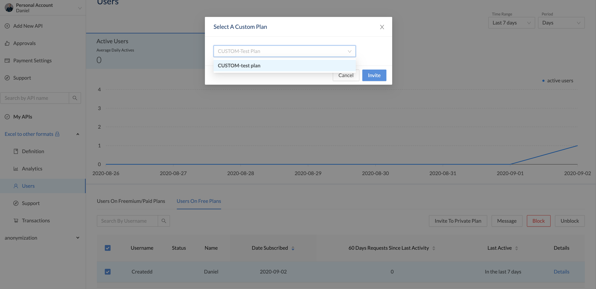

# Develop and sell a Python API. From start to end tutorial.

[](
httpsasdfafasfasfdasf)
xxxxxxx - httpsasdfafasfasfdasf


I recently read a blog post about setting up your own API and selling it.

I was quite inspired and wanted to test if it works. In just 5 days I was able to create a product from start to end. So I thought I share issues I came across, elaborate on concepts that the article was introducing, and provide a quick checklist to build something yourself.


# Table of Contents

- [Develop and sell a Python API. From start to end tutorial.](#develop-and-sell-a-python-api-from-start-to-end-tutorial)
- [Table of Contents](#table-of-contents)
- [About this article](#about-this-article)
- [Disclaimer](#disclaimer)
- [Stack used](#stack-used)
- [1. Create project formalities](#1-create-project-formalities)
- [2. Create a solution for a problem](#2-create-a-solution-for-a-problem)
  - [Install packages](#install-packages)
  - [Develop solution to problem](#develop-solution-to-problem)
    - [Download data](#download-data)
    - [Create functionality](#create-functionality)
  - [Build server to execute function with REST](#build-server-to-execute-function-with-rest)
- [3. Deploy to AWS](#3-deploy-to-aws)
  - [Set up zappa](#set-up-zappa)
  - [Set up AWS](#set-up-aws)
    - [AWS credentials](#aws-credentials)
      - [Set up credentials with users and roles in IAM](#set-up-credentials-with-users-and-roles-in-iam)
      - [Add credentials in your project](#add-credentials-in-your-project)
  - [AWS API Gateway](#aws-api-gateway)
- [4. Set up Rapidapi](#4-set-up-rapidapi)
  - [Create API on Rapidapi](#create-api-on-rapidapi)
  - [Test your own API](#test-your-own-api)
    - [Create private plan for testing](#create-private-plan-for-testing)
    - [Create code to consume API](#create-code-to-consume-api)
- [Inspiration](#inspiration)
  - [About](#about)

# About this article

This article can be considered as a tutorial and comprehension of other articles (listed in my "Inspiration" section).

It paints a picture for developing a Python API from start to finish and provides help in more difficult areas like the setup with AWS and RapidAPI.

I thought it will be useful for other people trying to do the same but elaborating on issues I had along the way. It is also a great way to build side projects and maybe even make some money.

As the Table of content shows it consists of 4 major parts, namely:
1. Setting up environment
2. Creating a solution with Python
3. Setting up AWS
4. Setting up RapidAPI

You will find all my code open sourced on Github: https://github.com/Createdd/pandas_transform_format

You will find the endresult here on RapidAPI: TODO

If you found this article helpful let me know and/or buy the functionality on rapidAPI to show support.

# Disclaimer

TODO


# Stack used

We will use

- Github (Code hosting),
- Anaconda (Dependency and environment management),
- Jupyter Notebook (code development and documentaion),
- Python (programming language),
- AWS (deployment),
- RapidAPI (market to sell)

# 1. Create project formalities

This is always an annoying step. It's always the same but necessary.

1. Create local folder `mkdir NAME`
2. Create new repository on Github with `NAME`
3. Create conda environment `conda create --name NAME python=3.7`
4. Activate conda environment `conda activate PATH_TO_ENVIRONMENT`
5. Create git repo `git init`
6. Connect to Github repo. Add Readme file, commit it and
```sh
git remote add origin URL_TO_GIT_REPO
git push -u origin master
```

Now we have:
- [x] local folder
- [x] github repository
- [x] anaconda virtual environment
- [x] git version control


# 2. Create a solution for a problem

## Install packages

Install jupyter notebook and jupytext:

```sh
pip install notebook jupytext
```

sets a hook in  `.git/hooks/pre-commit` for tracking the notebook changes in git properly:

```sh
#!/bin/sh

jupytext --from ipynb --to jupytext_conversion//py:light --pre-commit
```

## Develop solution to problem

```sh
pip install pandas requests
```

Add a `.gitignore` file and add the data folder (`data/`) to not upload the data to the hosting.

### Download data

Download an example dataset (titanic dataset) and save it into a data folder:

```py
def download(url: str, dest_folder: str):
    if not os.path.exists(dest_folder):
        os.makedirs(dest_folder)

    filename = url.split('/')[-1].replace(" ", "_")
    file_path = os.path.join(dest_folder, filename)

    r = requests.get(url, stream=True)
    if r.ok:
        print("saving to", os.path.abspath(file_path))
        with open(file_path, 'wb') as f:
            for chunk in r.iter_content(chunk_size=1024 * 8):
                if chunk:
                    f.write(chunk)
                    f.flush()
                    os.fsync(f.fileno())
    else:
        print("Download failed: status code {}\n{}".format(r.status_code, r.text))


url_to_titanic_data = 'https://web.stanford.edu/class/archive/cs/cs109/cs109.1166/stuff/titanic.csv'

download(url_to_titanic_data,'./data')
```

### Create functionality

Transform format

```py
df = pd.read_csv('./data/titanic.csv')
df.to_json(r'./data/titanic.json')
```

## Build server to execute function with REST

After developing the functionality in jupyter notebook we want to actually provide the functionality in a python app.

There are ways to use parts of the jupyter notebook, but for the sake of simplicity we create it again now.

Add a `app.py` file.

We want the user to upload an excel file and return the file converted into JSON for example.

Browsing through the internet we can see that there are already packages that work with flask and excel. So lets use them.

```sh
pip install Flask Flask-Excel
```


Start Flask server with

```sh
env FLASK_APP=app.py FLASK_ENV=development flask run
```


Tipp: Test your backend functionality with [Postman](https://www.postman.com/). It is easy to setup and allows to test the backend functionality quickly. Uploading an excel is done in the "form-data" tab:

Here you can see the uploaded titanic csv file and the returned column names of the dataset.

Now we simply write the function to transform the excel into json, like:

```py
import json
import pandas as pd
import flask_excel as excel
from flask import Flask, request, jsonify

app = Flask(__name__)

@app.route('/upload', methods=['GET', 'POST'])
def upload_file():
    if request.method == 'POST':
        provided_data = request.files.get('file')
        if provided_data is None:
            return 'Please enter valid excel format ', 400

        data = provided_data
        df = pd.read_csv(data)
        transformed = df.to_json()

        result = {
            'result': transformed,
        }
        json.dumps(result)

        return result


if __name__ == '__main__':
    excel.init_excel(app)
    app.run()
```


Now we have the functionality to transform csv files into json for example.

# 3. Deploy to AWS

## Set up zappa

After we created the app locally we need to start setting up the hosting on a real server.
We will use [zappa](https://github.com/Miserlou/Zappa).

> Zappa makes it super easy to build and deploy server-less, event-driven Python applications (including, but not limited to, WSGI web apps) on AWS Lambda + API Gateway. Think of it as "serverless" web hosting for your Python apps. That means infinite scaling, zero downtime, zero maintenance - and at a fraction of the cost of your current deployments!

```sh
pip install zappa
```


As we are using a conda environment we need to specify it:
```sh
which python
```

will give you `/Users/XXX/opt/anaconda3/envs/XXXX/bin/python`

remove the `bin/python/` and export

```sh
export VIRTUAL_ENV=/Users/XXXX/opt/anaconda3/envs/XXXXX/
```

Now we can do

```sh
zappa init
```

to set up the config.

Just click through everything and you will have a `zappa_settings.json` like

```json
{
    "dev": {
        "app_function": "app.app",
        "aws_region": "eu-central-1",
        "profile_name": "default",
        "project_name": "pandas-transform-format",
        "runtime": "python3.7",
        "s3_bucket": "zappa-pandas-transform-format"
    }
}
```

Note that we are not yet ready to deploy. First we need to get some AWS credentials.

## Set up AWS

### AWS credentials

First you need te get an AWS `access key id` and `access key`

You might think it is as easy as:

To get the credentials you need to
- Go to: http://aws.amazon.com/
- Sign Up & create a new account (they'll give you the option for 1 year trial or similar)
- Go to your AWS account overview
- Account menu in the upper-right (has your name on it)
sub-menu: Security Credentials

But be aware. There is more to permissions in AWS!


#### Set up credentials with users and roles in IAM

I found this [article](https://pythonforundergradengineers.com/deploy-serverless-web-app-aws-lambda-zappa.html) from Peter Kazarinoff to be very helpful. He explains the next section in great detail. My following bullet point approach is a quick summary and I often quote his steps. Please check out his article for more details if you are stuck somewhere.

https://pythonforundergradengineers.com/deploy-serverless-web-app-aws-lambda-zappa.html

I break it down as simple as possible:

1. Within the AWS Console, type IAM into the search box. IAM is the AWS user and permissions dashboard.
2. Create a group
3. Give your group a name (for example zappa_group)
4. Create our own specific inline policy for your group
5. In the Permissions tab, under the Inline Policies section, choose the link to create a new Inline Policy
6. In the Set Permissions screen, click the Custom Policy radio button and click the "Select" button on the right.
7. Create a Custom Policy written in json format
8. Read through and copy a policy discussed here: [https://github.com/Miserlou/Zappa/issues/244](https://github.com/Miserlou/Zappa/issues/244)
9. Scroll down to "My Custom policy" see a snippet of my policy.
10. After pasting and modifying the json with your AWS Account Number, click the [Validate Policy] button to ensure you copied valid json. Then click the [Apply Policy] button to attach the inline policy to the group.
11. Create a user and add the user to the group
12. Back at the IAM Dashboard, create a new user with the [Users] left-hand menu option and the [Add User] button.
13. In the Add user screen, give your new user a name and select the Access Type for Programmatic access. Then click the [Next: Permissions] button.
14. In the Set permissions screen, select the group you created earlier in the Add user to group section and click [Next: Tags].
15. Tags are optional. Add tags if you want, then click [Next: Review].
16. Review the user details and click [Create user]
17. Copy the user's keys
18. Don't close the AWS IAM window yet. In the next step, you will copy and paste these keys into a file. At this point, it's not a bad idea to copy and save these keys into a text file in a secure location. Make sure you don't save keys under version control.


**My Custom policy:**
```
{
  "Version": "2012-10-17",
  "Statement": [
    {
      "Effect": "Allow",
      "Action": [
        "iam:AttachRolePolicy",
        "iam:GetRole",
        "iam:CreateRole",
        "iam:PassRole",
        "iam:PutRolePolicy"
      ],
      "Resource": [
        "arn:aws:iam::XXXXXXXXXXXXXXXX:role/*-ZappaLambdaExecutionRole"
      ]
    },
    {
      "Effect": "Allow",
      "Action": [
        "lambda:CreateFunction",
        "lambda:ListVersionsByFunction",
        "logs:DescribeLogStreams",
        "events:PutRule",
        "lambda:GetFunctionConfiguration",
        "cloudformation:DescribeStackResource",
        "apigateway:DELETE",
        "apigateway:UpdateRestApiPolicy",
        "events:ListRuleNamesByTarget",
        "apigateway:PATCH",
        "events:ListRules",
        "cloudformation:UpdateStack",
        "lambda:DeleteFunction",
        "events:RemoveTargets",
        "logs:FilterLogEvents",
        "apigateway:GET",
        "lambda:GetAlias",
        "events:ListTargetsByRule",
        "cloudformation:ListStackResources",
        "events:DescribeRule",
        "logs:DeleteLogGroup",
        "apigateway:PUT",
        "lambda:InvokeFunction",
        "lambda:GetFunction",
        "lambda:UpdateFunctionConfiguration",
        "cloudformation:DescribeStacks",
        "lambda:UpdateFunctionCode",
        "lambda:DeleteFunctionConcurrency",
        "events:DeleteRule",
        "events:PutTargets",
        "lambda:AddPermission",
        "cloudformation:CreateStack",
        "cloudformation:DeleteStack",
        "apigateway:POST",
        "lambda:RemovePermission",
        "lambda:GetPolicy"
      ],
      "Resource": "*"
    },
    {
      "Effect": "Allow",
      "Action": [
        "s3:ListBucketMultipartUploads",
        "s3:CreateBucket",
        "s3:ListBucket"
      ],
      "Resource": "arn:aws:s3:::zappa-*"
    },
    {
      "Effect": "Allow",
      "Action": [
        "s3:PutObject",
        "s3:GetObject",
        "s3:AbortMultipartUpload",
        "s3:DeleteObject",
        "s3:ListMultipartUploadParts"
      ],
      "Resource": "arn:aws:s3:::zappa-*/*"
    }
  ]
}
```
NOTE: Replace XXXXXXXXXXX in the inline policy by your AWS Account Number.

Your AWS Account Number can be found by clicking [Support] → [Support Center]. Your Account Number is listed in the Support Center on the upper left-hand side.
The json above is what worked for me. But, I expect this set of security permissions may be too open. To increase security, you could slowly pare down the permissions and see if Zappa still deploys. The settings above are the ones that finally worked for me. You can dig through this discussion on GitHub if you want to learn more about specific AWS permissions needed to run Zappa: https://github.com/Miserlou/Zappa/issues/244.


#### Add credentials in your project

Create a `.aws/credentials` folder in your root with

```sh
mkdir ~/.aws
code open ~/.aws/credentials
```
and paste your credentials from AWS
```py
[dev]
aws_access_key_id = YOUR_KEY
aws_secret_access_key = YOUR_KEY
```
Same with the `config`
```sh
code open ~/.aws/config
```

```py
[default]
region = YOUR_REGION (eg. eu-central-1)
```

Note that `code` is for opening a the folder with vscode, my editor of choice.


Save the AWS access key id and secret access key assigned to the User you created in the file ~/.aws/credentials. Note the .aws/ directory needs to be in your home directory and the credentials file has no file extension.

Now you can do deploy your API with

```sh
zappa deploy dev
```


There shouldn't be any errors anymore. However, if there are still some, you can debug with:

```sh
zappa status
zappa tail
```

The most common errors are permission related (then check your permission policy) or about python libraries that are incompatible. Either way, zappa will provide good enough error messages for debugging.

If you update your code don't forget to update the deployment as well with

```sh
zappa update dev
```

## AWS API Gateway

To set up the API on a market we need to first restrict its usage with an API-key and then set it up on the market platform.

I found this [article](https://medium.com/@bansalnagesh/how-to-sell-your-apis-b4b5c9a273f8) from Nagesh Bansal to be  helpful. He explains the next section in great detail. My following bullet point approach is a quick summary and I often quote his steps. Please check out his article for more details if you are stuck somewhere.

https://medium.com/@bansalnagesh/how-to-sell-your-apis-b4b5c9a273f8

Again, I break it down:

1. Go to your AWS Console and go to API gateway
2. Click on your API
3. we want to create an x-api-key to restrict undesired access to the API and also have a metered usage
4. create a Usage plan for the API, with the desired throttle and quota limits
5. create an associated API stage
6. add an API key
7. in the API key overview section, click "show" at the API key and copy it
8. then associate the API with the key and discard all requests that come without the key
9. go back to the API overview. under resources, click the "/ any" go to the "method request". then in settings, set "API key required" to true
10. do the same for the "/{proxy+} Methods"

it looks like this



Now you have restricted the access to your API.

# 4. Set up Rapidapi


## Create API on Rapidapi

1. Go to "My APIs" and "Add new API"
2. Add name, description and category. Note that you cannot change your API name afterwards anymore.
3. In settings, add the url of your AWS API (it was displayed when you deployed with zappa)
4. In the section "Access Control" under "Transformations", add the API key you added in AWS



5. In the security tab you can check everything
6. Then go to "endpoints" to add the routes from you Python app by clicking "create REST endpoint"
7. TODO add screenshot
8. Add an image
9. Set a pricing plan. Rapidapi published an own [article](https://rapidapi.com/blog/how-to-monetize-your-api/) on the pricing options and strategies. As they conclude, it is up to your preferences and product how to price it.
10. I created a freemium pricing plan. Reason for that is that I want to give the chance to test it without cost, but add a price for using it regularly. Also I want to create a plan for supporting my work.



11. Create some docs and a tutorial. This is pretty self explaining. It is encouraged to do so as it is easier for people to use your API if it is documented properly.
12. The last step is to make your API publicly available. But before you do that it is useful to test it for yourself.


## Test your own API

### Create private plan for testing

Having set up everything, you of course should test it with the provided snippets. This step is not trivial and I had to contact the support to understand it. Now I am simplifying it here.

Create a private plan for yourself, by setting no limits.


The go to the "Users" section of your API, then to "Users on free plans", select yourself and "invite" you to the private plan.



Now you are subscribed to your own private plan and can test the functionality with the provided snippets.

### Create code to consume API


# Inspiration

The article ["API as a product. How to sell your work when all you know is a back-end"](https://towardsdatascience.com/api-as-a-product-how-to-sell-your-work-when-all-you-know-is-a-back-end-bd78b1449119) by Artem provided a great idea, namely to

> - Make an API that solves a problem
> - Deploy it with a serverless architecture
> - Distribute through an API Marketplace

For the setting everything I found the articles from Nagesh Bansal very helpful:
- https://medium.com/@bansalnagesh/how-to-sell-your-apis-b4b5c9a273f8
- https://medium.com/@bansalnagesh/launch-your-api-on-aws-with-0-upfront-cost-using-zappa-in-10-minutes-eb6d00623842

Also this article from Peter Kazarinoff: https://pythonforundergradengineers.com/deploy-serverless-web-app-aws-lambda-zappa.html

I encourage you to have a look at those articles as well.

---

## About

Daniel is an entrepreneur, software developer and lawyer. He has worked at various IT companies, tax advisory, management consulting and at the Austrian court.

His knowledge and interests currently revolve around programming machine learning applications and all its related aspects. To the core, he considers himself a problem solver of complex environments, which is reflected in his various projects.

Don't hesitate to get in touch if you have ideas, projects, or problems.


**Connect on:**
- [LinkedIn](https://www.linkedin.com/in/createdd)
- [Github](https://github.com/Createdd)
- [Medium](https://medium.com/@createdd)
- [Twitter](https://twitter.com/_createdd)
- [Instagram](https://www.instagram.com/create.dd/)


<!-- Written by Daniel Deutsch -->