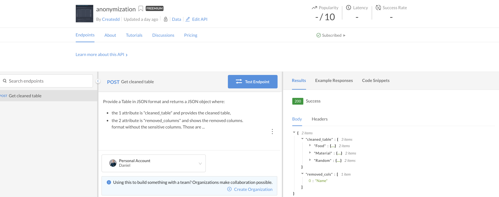
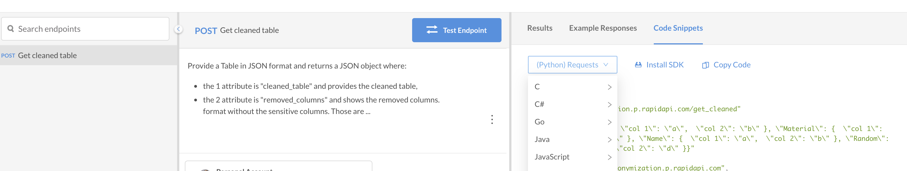

# How to use the anonymization API

This is a small overview on how to use the API.

## Subscribe to a plan

Navigate to the [pricing tab](https://rapidapi.com/Createdd/api/anonymization/pricing) and select a plan for your desired usage.

The first on is free to a certain limit of calls.

## Test endpoint

At the [endpoint tab](https://rapidapi.com/Createdd/api/anonymization/endpoints) there is button to test the endpoint. Currently, there is only one endpoint (POST, for getting the table.)



There is already an example in the request body:
```json
{
 "Food": {
  "col 1": "a",
  "col 2": "b"
 },
 "Material": {
  "col 1": "c",
  "col 2": "d"
 },
 "Name": {
  "col 1": "a",
  "col 2": "b"
 },
 "Random": {
  "col 1": "c",
  "col 2": "d"
 }
}
```

The resulting json has the "name" column removed.

## Connect to your app

Also the [endpoint tab](https://rapidapi.com/Createdd/api/anonymization/endpoints) there is section with code snippets.



They provide several snippets. For Python and the requests library it looks like this:

```py
# XXXXXXXXXX needs to be replaces by your personal x-rapidapi-key

import requests

url = "https://anonymization.p.rapidapi.com/get_cleaned"

payload = "{ \"Food\": {  \"col 1\": \"a\",  \"col 2\": \"b\" }, \"Material\": {  \"col 1\": \"c\",  \"col 2\": \"d\" }, \"Name\": {  \"col 1\": \"a\",  \"col 2\": \"b\" }, \"Random\": {  \"col 1\": \"c\",  \"col 2\": \"d\" }}"
headers = {
    'x-rapidapi-host': "anonymization.p.rapidapi.com",
    'x-rapidapi-key': "XXXXXXXXXX",
    'content-type': "application/json",
    'accept': "application/json"
    }

response = requests.request("POST", url, data=payload, headers=headers)

print(response.text)

```

The response looks like this:

```json
{
  "cleaned_table": {
    "Food": {
      "col 1": "a",
      "col 2": "b"
    },
    "Material": {
      "col 1": "c",
      "col 2": "d"
    },
    "Random": {
      "col 1": "c",
      "col 2": "d"
    }
  },
  "removed_cols": [
    "Name"
  ]
}
```

Now it can be used for further processing.

Hope this helps. In case of questions let me know ;)