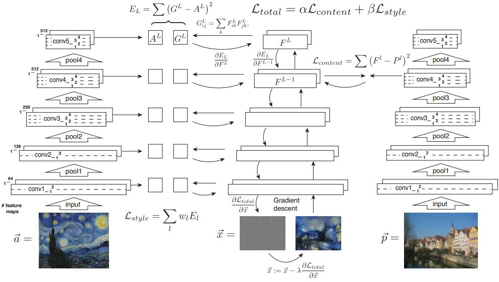
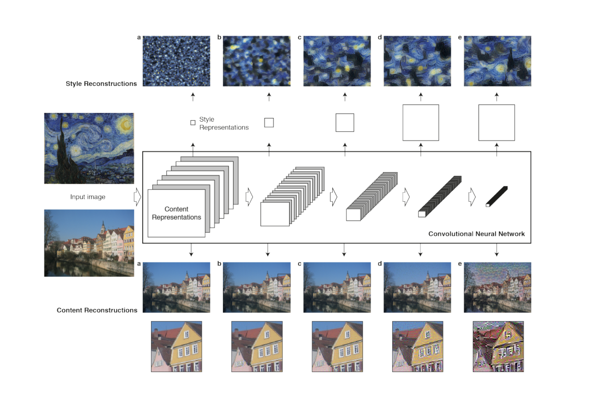
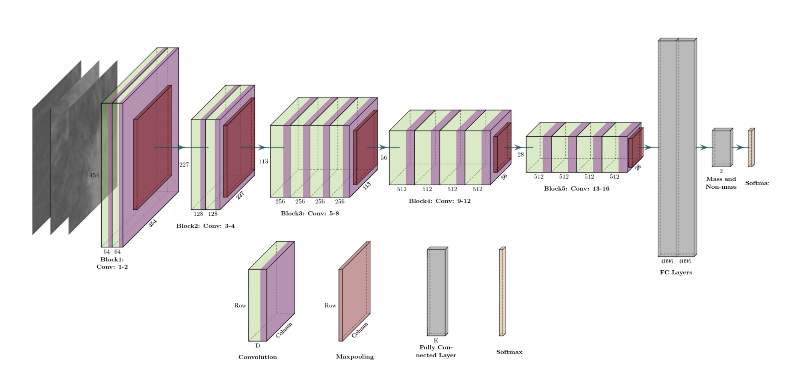
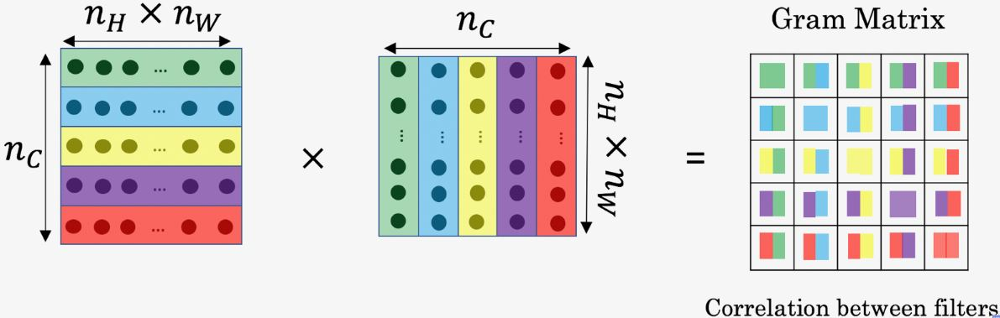

# Neural Style Transfer - A high level approach

by Paolo Bendandi https://unsplash.com/photos/hZUlyk-EeuU

Today I want to talk about CNNs used in Neural Style Transfer. There are already quite a few articles and tutorials available. Sometimes content is just copied, some provide a novel implementation. What all have in common is a very fast dive into specifics. Too specific in my opinion. Not only that, but there are often implementation details that make it harder to focus on the main concept as a whole.

This article can be considered as an overview and comprehension of other articles (listed in my "Inspiration" section), to understand the concept on a higher level. My intention is to strip away some implementation details, being high level enough for beginners and sparking curiosity for the original research paper and subsequent implementations.

## Table of Contents

- [Neural Style Transfer - A high level approach](#neural-style-transfer-a-high-levelapproach)
  - [Table of Contents](#table-of-contents)
- [Disclaimer](#disclaimer)
  - [Requirements](#requirements)
  - [Neural Style Transfer](#neural-style-transfer)
  - [Architectural and process overview](#architectural-and-process-overview)
  - [Transfer learning and style transfer](#transfer-learning-and-style-transfer)
    - [1. Transfer learning](#1-transfer-learning)
    - [2. Style Transfer](#2-style-transfer)
  - [Style and content](#style-and-content)
  - [Cost calculation](#cost-calculation)
    - [Content cost](#content-cost)
    - [Style cost](#style-cost)
    - [Total variation cost](#total-variation-cost)
  - [Inspiration](#inspiration)
  - [About](#about)

# Disclaimer

I am not associated with any of the services I use in this article.

I do not consider myself an expert. If you have the feeling that I am missing important steps or neglected something, consider pointing it out in the comment section or get in touch with me.

I am always happy for constructive input and how to improve.

This was written on 2020-10-17.
I cannot monitor all my articles. There is a high probability that, when you read this article the tipps are outdated and the processes have changed.

If you need more information on certain parts, feel free to point it out in the comments.

## Requirements

I assume an understanding of **convolutional neural networks (CNNs)**. This architecture is very crucial for many things in computer vision and deep learning. There are many resources online available. As a refresher, I suggest this [article](https://medium.com/@himadrisankarchatterjee/a-basic-introduction-to-convolutional-neural-network-8e39019b27c4).

## Neural Style Transfer

> In fine art, especially painting, humans have mastered the skill to create unique visual experiences through composing a complex interplay between the content and style of an image. Thus far the algorithmic basis of this process is unknown and there exists no artificial system with similar capabilities. However, in other key areas of visual perception such as object and face recognition near-human performance was recently demonstrated by a class of biologically inspired vision models called Deep Neural Networks. Here we introduce an artificial system based on a Deep Neural Network that creates artistic images of high perceptual quality.

Research paper [A Neural Algorithm of Artistic Style](https://arxiv.org/pdf/1508.06576.pdf) - by Leon A. Gatys, Alexander S. Ecker, Matthias Bethge

> The system uses neural representations to separate and recombine content and style of arbitrary images, providing a neural algorithm for the creation of artistic images. Moreover, in light of the striking similarities between performance-optimised artificial neural networks and biological vision, our work offers a path forward to an algorithmic understanding of how humans create and perceive artistic imagery.

## Architectural and process overview

There are many good visualizations of how the CNN works with neural style transfer.
I wanted to draw it myself, but then I realized that there are already very nice ones available. So I will just show those and reference the creators for credit.

The following I consider to be fantastic.

First this one. It shows very beautifully how the loss is calculated, and how it fits together in the overall result.

from Mike Goas [blog](https://www.mikegao.net/graphics/summary/neural_style.html) und the [creative commons license](https://creativecommons.org/licenses/by-nc/4.0/)

This one is also good. Showing the reconstruction process over different layers.

from the [original research paper](https://arxiv.org/pdf/1508.06576.pdf) under [arxiv license requirements](https://arxiv.org/help/license)

It is necessary to say what the different layers of a CNN represent in order to understand the subsequent calculations.

- The shallower layers of a CNN tend to detect lower-level features such as edges and simple textures.
- The deeper layers tend to detect higher-level features such as more complex textures as well as object classes.

As the generated image shall have similar content as the input image. It is advisable to use a layer in the middle, representing content to a high degree.

VGG19 architecture from research paper [Automatic Mass Detection in Breast Using Deep Convolutional Neural Network and SVM Classifier](https://www.researchgate.net/publication/334388209_Automatic_Mass_Detection_in_Breast_Using_Deep_Convolutional_Neural_Network_and_SVM_Classifier) und the [creative commons license](https://creativecommons.org/licenses/by/4.0/)

## Transfer learning and style transfer

Another important concept is that a pre-trained network is used. Most often VGG-19. It is noteworthy that we make use of so called "transfer learning".

We have 2 concepts here to distinguish:
1. Transfer learning
2. Style transfer

Though, both use the word "transfer" they are quite different from an implementation standpoint.

### 1. Transfer learning

The concept itself is extremely interesting and potent to create new solutions through the use of established models.

For a fantastic introduction, I can recommend this article: https://machinelearningmastery.com/transfer-learning-for-deep-learning/. However, it is crucial to understand how it is used in the concept of style transfer.

In short, we can say
> Transfer learning and domain adaptation refer to the situation where what has been learned in one setting … is exploited to improve generalization in another setting

This is especially useful in computer vision, as the computation and training of those models are quite resource hungry. Using a model that has been trained on a huge dataset, where the result is now freely available is actually very nice for individual experimentation.

You can use transfer learning as:
1. direct use of a pre-trained model
2. feature extraction of pre-trained models
3. changing weights of the last layer of a pre-trained model

In our case, we will use the second approach. Using feature extraction, where, the output of the model from a layer prior to the output layer is used as input for a new classifier.

### 2. Style Transfer

From the original paper:

> Conceptually most closely related are methods using texture transfer to achieve artistic style transfer. However, these previous approaches mainly rely on non-parametric techniques to directly manipulate the pixel representation of an image. In contrast, by using Deep Neural Networks trained on object recognition, we carry out manipulations in feature spaces that explicitly represent the high level content of an image.

So this means that the specialty of the deep learning approach is to extract the style of an image not with mere pixel observation of the style picture, but rather the extracted features of the pre-trained model combined with the content of the style image. So, in essence, to discover the style of an image, we
1. process the style image by analyzing its pixels
2. feeding this information to the layer of a pre-trained model to "understand"/classify the provided input as objects

How this is done we will explore in the section "style cost".

## Style and content

The basic idea is to transfer the style of an image to the content of an image.

Therefore we need to understand two things:
1. What is the content of an image
2. What is the style of an image

Loosely speaking the content of an image is what we humans identify as objects in an image. A car, a bridge, houses, etc.
Style is harder to define. It heavily depends on the image. It is overall texture, color selection, contrast, etc.

Those definitions need to be expressed in a mathematical way to be implemented in the world of machine learning.

## Cost calculation

First, why cost/loss calculation?
It is important to understand that in this context the cost is the mere difference between the original and the generated image. There are multiple ways on how to calculate it (MSE, euclidean distance, etc). By minimizing the differences of the images we are able to transfer styles.

When we start out with big differences in the loss, we will see that the style transfer is not that good. We can see that styles are transferred, but it seems rough and unintuitive. With each cost minimization step, we go in the direction of a better merger of the style and content and ultimately a better resulting image.

As we can see the central element for this process is the loss calculation. There are 3 costs that need to be caluclated:

1. Content cost
2. Style cost
3. Total (variation) cost

Those steps are in my opinion the hardest to understand, so let's dive into it one by one.

**Always keep in mind that we are comparing the original input with the generated image. Those differences are the cost. And this cost we want to minimize.**

It is so important to understand this because in the process other differences will also be calculated.

### Content cost

What is content cost?

As we found out before, we define the content of an image by its objects. Things that we as humans can recognize as things.

Having understood the structure of a CNN, it now becomes apparent that at the end of the neural network we can access a layer, that represents the objects (the content) quite well. Going through the pooling layers we lose the stylistic parts of the image, but in terms of getting the content, this is desired.

Now the feature maps in higher layers of the CNN are activated in the presence of different objects. So if two images have the same content, they should have similar activations in the higher layers.

That is the premise for defining the cost function.

The following image helps to understand how the layer is rolled out to be prepared for calculations (which are not covered in this article):

from [Aditya Guptas article](https://github.com/Adi-iitd/AI-Art) under [MIT License](https://github.com/Adi-iitd/AI-Art/blob/add-license-1/LICENSE)

### Style cost

Now it is getting sophisticated.

Make sure to understand the difference between the style of an image and style loss of an image. Both calculations are different. One is to detect the "style representation" (texture, colors, etc), the other is to compare the style of the original image with the style of the generated image.

The **total** style cost is calculated in two steps:
1. the style cost of all convolutional layers. Identifying the style of the style image
   a. Getting the feature vectors from a convolutional layer
   b. Comparing those vectors with feature vectors from another layer (finding its correlation)
2. the style cost between the original (the original style image!) and the generated image.

To find the style the correlation is captured by multiplying the feature map to its transpose, resulting in the gram matrix.

from [Aditya Guptas article](https://github.com/Adi-iitd/AI-Art) under [MIT License](https://github.com/Adi-iitd/AI-Art/blob/add-license-1/LICENSE)

Luckily the CNN provides us with multiple layers we can choose to find its styles correctly. Comparing various layers and their correlations we can identify the style of an image.

So instead of using a layer’s raw output, we use the gram matrix of the feature map of an individual layer to identify the style of an image.

The first cost is the difference between those gram matrices, ie the difference of correlations. The second cost is again the difference between the original image and the generated one. This is in essence, the "style transfer".

### Total variation cost

It acts like a regularizer that improves smoothness in the generated image.
This was not used in the original paper but sometimes improves the results. In essence we smooth out the differences between style and content transferal within the generated image.

## Inspiration

This section provides reading material that was used when writing this article. It is a selection of articles related to style transfer.

- https://towardsdatascience.com/light-on-math-machine-learning-intuitive-guide-to-neural-style-transfer-ef88e46697ee
- https://towardsdatascience.com/what-is-deep-transfer-learning-and-why-is-it-becoming-so-popular-91acdcc2717a
- https://towardsdatascience.com/neural-networks-intuitions-2-dot-product-gram-matrix-and-neural-style-transfer-5d39653e7916
- https://towardsdatascience.com/art-with-ai-neural-style-transfer-63d0ef76596a
- https://medium.com/@sanjivgautamofficial/understanding-neural-style-transfer-from-another-medium-post-c61d19afdf1d
- https://machinelearningmastery.com/transfer-learning-for-deep-learning/
- https://machinelearningmastery.com/how-to-use-transfer-learning-when-developing-convolutional-neural-network-models/
- https://github.com/aleju/papers/blob/master/neural-nets/A_Neural_Algorithm_for_Artistic_Style.md summary of publication paper
- https://www.mikegao.net/graphics/summary/neural_style.html by [Mike Gao](https://www.mikegao.net/)
- https://github.com/Adi-iitd/AI-Art

Implementations with code:

- https://towardsdatascience.com/neural-style-transfer-4d7c8138e7f6
- http://ziqingguan.net/index.php/2020/05/30/deep-learning-art-neural-style-transfer/
- https://www.tensorflow.org/tutorials/generative/style_transfer
- https://medium.com/tensorflow/neural-style-transfer-creating-art-with-deep-learning-using-tf-keras-and-eager-execution-7d541ac31398
- https://medium.com/analytics-vidhya/nst-creating-artworks-with-the-help-of-machine-56ebd3eb780c
- https://keras.io/examples/generative/neural_style_transfer/
- https://medium.com/gradientcrescent/neural-art-style-transfer-with-keras-theory-and-implementation-91b7fb08ee81

Research papers:

- https://arxiv.org/pdf/1508.06576.pdf A Neural Algorithm of Artistic Style
- https://arxiv.org/pdf/1701.01036.pdf Demystifying Neural Style Transfer

---

## About

Daniel is an entrepreneur, software developer, and business law graduate. He has worked at various IT companies, tax advisory, management consulting, and at the Austrian court.

His knowledge and interests currently revolve around programming machine learning applications and all its related aspects. To the core, he considers himself a problem solver of complex environments, which is reflected in his various projects.

Don't hesitate to get in touch if you have ideas, projects, or problems.

You can support me on https://www.buymeacoffee.com/createdd

**Connect on:**
- [LinkedIn](https://www.linkedin.com/in/createdd)
- [Github](https://github.com/Createdd)
- [Medium](https://medium.com/@createdd)
- [Twitter](https://twitter.com/_createdd)
- [Instagram](https://www.instagram.com/create.dd/)
- [createdd.com](https://www.createdd.com/)

<!-- Written by Daniel Deutsch -->