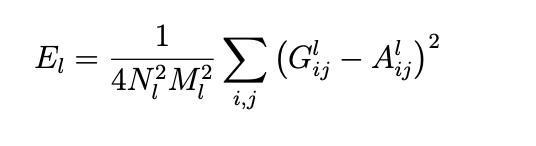
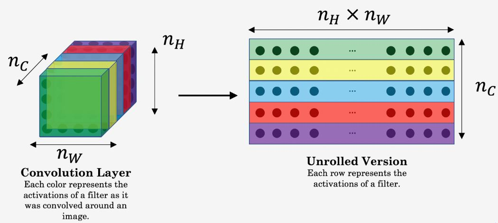

# Understanding Neural Style Transfer with CNNs better

Today I want to talk about CNNs used in Neural Style Transfer. There are great tutorials available online. However, I struggle sometimes with grasping the main concepts. The reason for that is that there are always different implementation details.

This article can be considered as an overview and comprehension of other articles (listed in my "Inspiration" section), to understand the concept on a higher level. My intention is to strip away some implemenation details, but being high level enough for beginners. (And sparking curiosity for the original research paper and subsequent implementations)

## Table of Contents

- [Understanding Neural Style Transfer with CNNs better](#understanding-neural-style-transfer-with-cnns-better)
  - [Table of Contents](#table-of-contents)
- [Disclaimer](#disclaimer)
  - [Requirements](#requirements)
  - [Neural Style Transfer](#neural-style-transfer)
  - [Overview on how it works](#overview-on-how-it-works)
  - [Transfer learning and style transfer](#transfer-learning-and-style-transfer)
    - [1. Transfer learning](#1-transfer-learning)
    - [2. Style Transfer](#2-style-transfer)
  - [Style and content](#style-and-content)
  - [Loss calculation](#loss-calculation)
    - [Content cost](#content-cost)
    - [Style cost](#style-cost)
  - [Starting point for implementation](#starting-point-for-implementation)
  - [Inspriation](#inspriation)
  - [About](#about)

# Disclaimer

I am not associated with any of the services I use in this article.

I do not consider myself an expert. If you have the feeling that I am missing important steps or neglected something, consider pointing it out in the comment section or get in touch with me.

I am always happy for constructive input and how to improve.

This was written on XXXXXXXDATEXXXXXXXXXX.
I cannot monitor all my articles. There is a high probability that, when you read this article the tipps are outdated and the processes have changed.

If you need more information on certain parts, feel free to point it out in the comments.

## Requirements

Even though I want to explain everything from the ground, I assume understanding of **convolutional neural networks (CNNs)**. The principle concept is very crucial for many things in computer vision and deep learning. There are many resources online available. As a refresher, I suggest this [article](https://medium.com/@himadrisankarchatterjee/a-basic-introduction-to-convolutional-neural-network-8e39019b27c4)

## Neural Style Transfer

> In fine art, especially painting, humans have mastered the skill to create unique visual experiences through composing a complex interplay between the content and style of an image. Thus far the algorithmic basis of this process is unknown and there exists no artificial system with similar capabilities. However, in other key areas of visual perception such as object and face recognition near-human performance was recently demonstrated by a class of biologically inspired vision models called Deep Neural Networks. Here we introduce an artificial system based on a Deep Neural Network that creates artistic images of high perceptual quality.

Research paper [A Neural Algorithm of Artistic Style](https://arxiv.org/pdf/1508.06576.pdf) - by Leon A. Gatys, Alexander S. Ecker, Matthias Bethge

> The system uses neural representations to separate and recombine content and style of arbitrary images, providing a neural algorithm for the creation of artistic images. Moreover, in light of the striking similarities between performance-optimised artificial neural networks and biological vision, our work offers a path forward to an algorithmic understanding of how humans create and perceive artistic imagery.

## Overview on how it works

There are many good visualizations on how the cnn works with neural style transfer.
I wanted to draw it myself, but then I realised that there are already very nice ones available. So I will just show those and reference the creators for credit.

The following I consider to be fantastic.

First this one. It shows very beautifully how the loss is calculated, and how it fits together in the overall result.

from his [blog](https://www.mikegao.net/graphics/summary/neural_style.html) und the [creative commons licnece](https://creativecommons.org/licenses/by-nc/4.0/)

This one is also good. Showing the reconstructions development over the different layers.

from the [original research paper](https://arxiv.org/pdf/1508.06576.pdf) under [arxiv licenses requirements](https://arxiv.org/help/license)

It is necessary to say what the different layers of a CNN represent in order to understand the subsquent calculations.

- The shallower layers of a CNN tend to detect lower-level features such as edges and simple textures.
- The deeper layers tend to detect higher-level features such as more complex textures as well as object classes.

As the generated image shall have similar content as the input image. It is advisable to use a layer in the middle, representing content to a high degree.

## Transfer learning and style transfer

Another important concept is that a pre-trained network is used. Most often VGG-19. It is noteworthy that we make use of so called "transfer learning".

We have 2 concepts here to distinguish:
1. Transfer learning
2. Style transfer

Though, both use the word "transfer" they are quite different from an implementation standpoint.

### 1. Transfer learning

The concept itself is extremely interesting and potent to create new solutions by the use of established models.

I do not want to expand on this concept in this article. For a fantastic introduction I can recommend this article: https://machinelearningmastery.com/transfer-learning-for-deep-learning/. However, it is crucial to understand how it is used in the concept of style transfer.

In short we can say
> Transfer learning and domain adaptation refer to the situation where what has been learned in one setting … is exploited to improve generalization in another setting

This is especially useful in computer vision, as the computation and training of those models are quite resource hungry. Using a model that has been trained on a huge dataset, where the result is now freely available is actually very nice for inidvidual experimentation.

You can use transfer learning as:
1. direct use of a pre-trained model
2. feature extraction of pre-trained models
3. changing weights of the last layer of a pre-trained model

In our case we will use the second approach. Using feature extraction, where, the output of the model from a layer prior to the output layer is used as input for a new classifier.

### 2. Style Transfer

From the original paper:

> Conceptually most closely related are methods using texture transfer to achieve artistic style transfer. However, these previous approaches mainly rely on non-parametric techniques to directly manipulate the pixel representation of an image. In contrast, by using Deep Neural Networks trained on object recognition, we carry out manipulations in feature spaces that explicitly represent the high level content of an image.

So this means that the spcialty of the deep learning approach is to extract the style of an image not with mere pixel observation of the style picture, but rather the extracted features of the pre-trained model combined with the content of the style image. So, in essence, to discover the style of an image, we
1. process the style image by analyzing its pixels
2. feeding this information to the layer of a pre-trained model to "understand"/classify the provided input as objects

How this is done we will explore in the section "style cost".

## Style and content

The basic idea is to transfer the style of an image on the content of an image.

Therefore we need to understand two things:
1. What is the content of an image
2. What is the style of an image

Loosely speaking the content of an image is what we humans identify as objects in an image. A car, a bridge, houses, etc.
Style is a harder to define. It heavily depends on the image. It is overall texture, color selection, contrast, etc.

Those definitions need to be expressed in a mathematical way to be implemented in the world of machine learning.

## Loss calculation

As we can see the central element for this process is the loss calculation. There are 3 costs that need to be caluclated:

1. Content cost
2. Style cost
3. Total variation cost

This is in my understing the hardest part to understand when starting. So lets dive into it one by one.

### Content cost

What is content cost?

When we visualize a CNN, feature maps in higher layers are activated in the presence of different objects. So if two images to have the same content, they should have similar activations in the higher layers.

That is the premise for defining the cost function.

The formula represents that as:

from the [original research paper](https://arxiv.org/pdf/1508.06576.pdf) under [arxiv licenses requirements](https://arxiv.org/help/license)

> where F is the activation of the i th filter at position j in layer l.
> So let ~p and ~x be the original image and the image that is generated and P l and F l their respective feature representation in layer l.

it is in fact just the root mean squared error between the feature representation of the generated image and the content image.

The question is how we get the feature representation?

from the [original research paper](https://arxiv.org/pdf/1508.06576.pdf) under [arxiv licenses requirements](https://arxiv.org/help/license)

> This is done by minimising the mean-squared distance between the entries of the Gram matrix from the original image and the Gram matrix of the image to be generated

> Gl ij is the inner product between the vectorised feature map i and j in layer l:
> So let ~a and ~x be the original image and the image that is generated and Al and Gl their respective style representations in layer l.
> A layer with Nl distinct filters has Nl feature maps each of size Ml , where Ml is the height times the width of the feature map

The following image helps to understand how N and M are calculated.

from [Aditya Guptas article](https://github.com/Adi-iitd/AI-Art) under [MIT License](https://github.com/Adi-iitd/AI-Art/blob/add-license-1/LICENSE)

So why is it divided by 4?

### Style cost

Again, make sure to understand the difference between what the style is in this context, and what the style loss is. Both calculations are different. One is to detect the "style representation" (meaning to classify the input pixels under the pre-trained classifications), the other is to compare the style of the original image with the style of the generated image.

What is meant by style?

From the original paper:
> On top of the CNN responses in each layer of the network we built a style representation that computes the correlations between the different filter responses, where the expectation is taken over the spatial extend of the input image.

In this context it is measured as the amount of correlation present between feature maps in a layer. The cost again is the difference between those correlation matrices.

The interesting approach is how the correlation is captuered. This is done via the gram matrix.

from [Aditya Guptas article](https://github.com/Adi-iitd/AI-Art) under [MIT License](https://github.com/Adi-iitd/AI-Art/blob/add-license-1/LICENSE)

## Starting point for implementation

We will start with the tutorial from [Keras](https://keras.io/examples/generative/neural_style_transfer/).

- Github Source: https://github.com/keras-team/keras-io/blob/master/examples/generative/neural_style_transfer.py
- License: https://github.com/keras-team/keras-io/blob/master/LICENSE

Gist: https://gist.github.com/Createdd/2fa6fa0770135a34a8f1f022007dda69

## Inspriation

Absolutely great work by Thushan Ganegedara in his article: https://towardsdatascience.com/light-on-math-machine-learning-intuitive-guide-to-neural-style-transfer-ef88e46697ee

- https://www.mikegao.net/graphics/summary/neural_style.html by [Mike Gao](https://www.mikegao.net/)
- https://medium.com/tensorflow/neural-style-transfer-creating-art-with-deep-learning-using-tf-keras-and-eager-execution-7d541ac31398 original tutorial from tensorflow
- https://machinelearningmastery.com/transfer-learning-for-deep-learning/
- https://machinelearningmastery.com/how-to-use-transfer-learning-when-developing-convolutional-neural-network-models/
- https://towardsdatascience.com/what-is-deep-transfer-learning-and-why-is-it-becoming-so-popular-91acdcc2717a
- https://arxiv.org/pdf/1701.01036.pdf Demystifying Neural Style Transfer
- https://towardsdatascience.com/neural-networks-intuitions-2-dot-product-gram-matrix-and-neural-style-transfer-5d39653e7916
- https://github.com/aleju/papers/blob/master/neural-nets/A_Neural_Algorithm_for_Artistic_Style.md summary of publication paper

Implementations with code:

- https://towardsdatascience.com/neural-style-transfer-4d7c8138e7f6

---

## About

Daniel is an entrepreneur, software developer, and business law graduate. He has worked at various IT companies, tax advisory, management consulting, and at the Austrian court.

His knowledge and interests currently revolve around programming machine learning applications and all its related aspects. To the core, he considers himself a problem solver of complex environments, which is reflected in his various projects.

Don't hesitate to get in touch if you have ideas, projects, or problems.

You can support me on https://www.buymeacoffee.com/createdd

**Connect on:**
- [LinkedIn](https://www.linkedin.com/in/createdd)
- [Github](https://github.com/Createdd)
- [Medium](https://medium.com/@createdd)
- [Twitter](https://twitter.com/_createdd)
- [Instagram](https://www.instagram.com/create.dd/)
- [createdd.com](https://www.createdd.com/)

<!-- Written by Daniel Deutsch -->