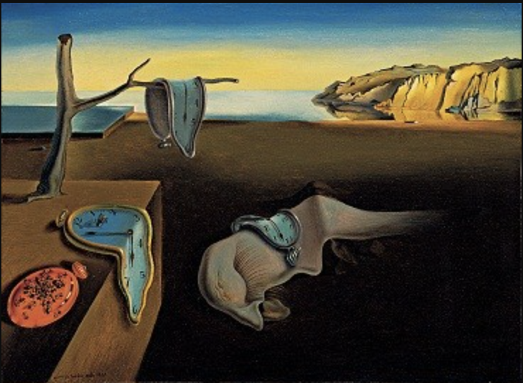
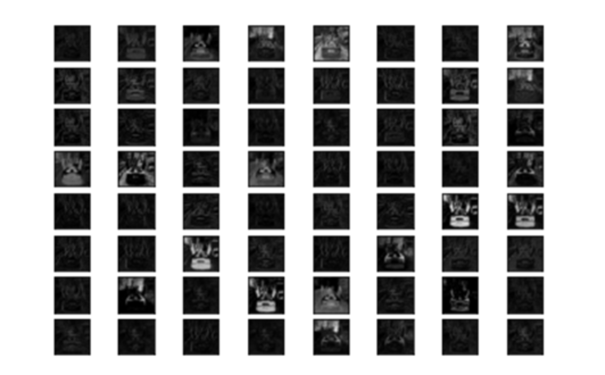
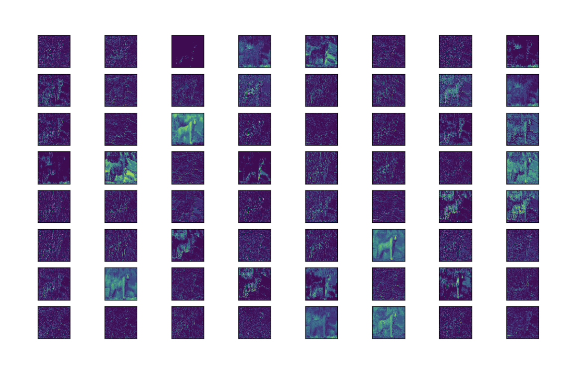
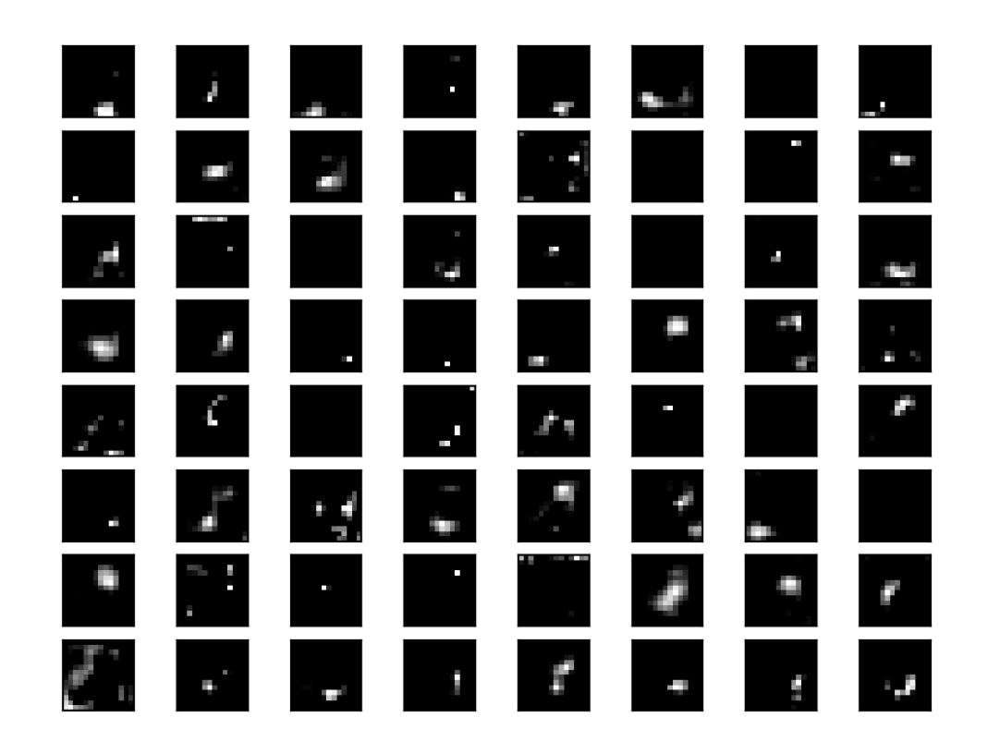

# Behind famous pictures - The esence of pictures - An AI approach


Convolutional neural networks (CNNs) allow the computer to classify images. Apart from classifiying objects they also are able to give us insights on what makes a picture. What is the essence of a picture? By visualizing the layers of CNN architecturs we dive into the understanding of how machines process images. This gives provides also insights on how the human "sees" pictures.

The article shall on one side present what elements build a picture and also provide code for python implementation with Keras.

## Table of Contents

- [Behind famous pictures - The esence of pictures - An AI approach](#behind-famous-pictures---the-esence-of-pictures---an-ai-approach)
  - [Table of Contents](#table-of-contents)
- [Disclaimer](#disclaimer)
  - [Base Image and style image](#base-image-and-style-image)
  - [Visualize with code](#visualize-with-code)
  - [Inspiration](#inspiration)
  - [About](#about)


# Disclaimer

I am not associated with any of the services I use in this article.

I do not consider myself an expert. If you have the feeling that I am missing important steps or neglected something, consider pointing it out in the comment section or get in touch with me.

I am always happy for constructive input and how to improve.


This was written on XXXXXXXDATEXXXXXXXXXX.
I cannot monitor all my articles. There is a high probability that, when you read this article the tipps are outdated and the processes have changed.

If you need more information on certain parts, feel free to point it out in the comments.

## Base Image and style image

Base image


*Source https://unsplash.com/photos/hJKkyoG8_ng by Hadi Yazdi Aznaveh - Unsplash Award 2019 selected in "Current events"*

To explain why I chose this image I quote directly Joel Tellier, Design Director of Vice (from Unplash Awards page):
> Compositionally this photo is incredible. There are layers story and history in every element. The casual nature of the subject suggests that she is completely comfortable in a place where she and her gender have never been welcome in history. Her injury and therefore struggle to attend that day, adds to the relaxed nature of her patriotic celebration alluding to a much more involved story. The numbers on the seats help to suggest the history, leaving me to wonder how many men sat where she is sitting before one (the first) woman was allowed.

Style image

*Soruce https://en.wikipedia.org/wiki/File:The_Persistence_of_Memory.jpg under free use license (low quality for the use of critical commentary on technique of the work of art*

For the image I chose "The Persistence of Memory" (Spanish: La persistencia de la memoria), a 1931 painting by artist Salvador Dalí and one of the most recognizable works of Surrealism.

It is by far one of my favorit paintings and a great image for implementing style.


## Visualize with code

On my research to visualize feature maps of CNN layers I often came to find tutorials and implemenations that offer insight on how to approach visualization but not following through to really see and understand what the images are showing.

Multiple times you can things like those:


from https://towardsdatascience.com/extract-features-visualize-filters-and-feature-maps-in-vgg16-and-vgg19-cnn-models-d2da6333edd0


from https://towardsdatascience.com/visualising-filters-and-feature-maps-for-deep-learning-d814e13bd671#:~:text=The%20feature%20maps%20of%20a,what%20features%20our%20CNN%20detects


https://machinelearningmastery.com/how-to-visualize-filters-and-feature-maps-in-convolutional-neural-networks/

The approach to extract the images are great. I need them bigger for proper examination though.

so if you follow already available solutions, you can do something like this:

```py
size = 224

image = load_img(image_path).resize((size, size))
image = img_to_array(image)
image = np.expand_dims(image, axis=0)
image = preprocess_input(image)

model = vgg19.VGG19()

layer_dict = dict([(layer.name, layer) for layer in model.layers])

layer_name = 'block1_conv1'

model = Model(inputs=model.inputs, outputs=layer_dict[layer_name].output)

feature_maps = model.predict(image)

square = 8
index = 1
fig, ax = plt.subplots(figsize=(size, size))
for _ in range(square):
    for _ in range(square):


        ax = plt.subplot(square, square, index)
        ax.set_xticks([])
        ax.set_yticks([])

        plt.imshow(feature_maps[0, :, :, index-1], aspect='auto', cmap='gray')
        index += 1

plt.tight_layout()
plt.show()
```

This is useful if you want to display multiple visualizations over different layers. Like

```py
for layer in layer_names:
    print(f'{"-"*100}\nLayer {layer}')
    model = Model(inputs=model.inputs, outputs=layer_dict[layer].output)

    feature_maps = model.predict(image)
    print(feature_maps.shape)

    square = 4
    index = 1
    fig, ax = plt.subplots(figsize=(size, size))
    for _ in range(square):
        for _ in range(square):


            ax = plt.subplot(square, square, index)
            ax.set_xticks([])
            ax.set_yticks([])

            plt.imshow(feature_maps[0, :, :, index-1], aspect='auto', cmap='gray')
            index += 1

    plt.tight_layout()
    plt.show()
```


## Inspiration

On visualization of CNN layers:
- https://towardsdatascience.com/visualising-filters-and-feature-maps-for-deep-learning-d814e13bd671#:~:text=The%20feature%20maps%20of%20a,what%20features%20our%20CNN%20detects.
- https://towardsdatascience.com/extract-features-visualize-filters-and-feature-maps-in-vgg16-and-vgg19-cnn-models-d2da6333edd0


---

## About

Daniel is an entrepreneur, software developer, and business law graduate. He has worked at various IT companies, tax advisory, management consulting, and at the Austrian court.

His knowledge and interests currently revolve around programming machine learning applications and all its related aspects. To the core, he considers himself a problem solver of complex environments, which is reflected in his various projects.

Don't hesitate to get in touch if you have ideas, projects, or problems.


You can support me on https://www.buymeacoffee.com/createdd


**Connect on:**
- [LinkedIn](https://www.linkedin.com/in/createdd)
- [Github](https://github.com/Createdd)
- [Medium](https://medium.com/@createdd)
- [Twitter](https://twitter.com/_createdd)
- [Instagram](https://www.instagram.com/create.dd/)
- [createdd.com](https://www.createdd.com/)

<!-- Written by Daniel Deutsch -->