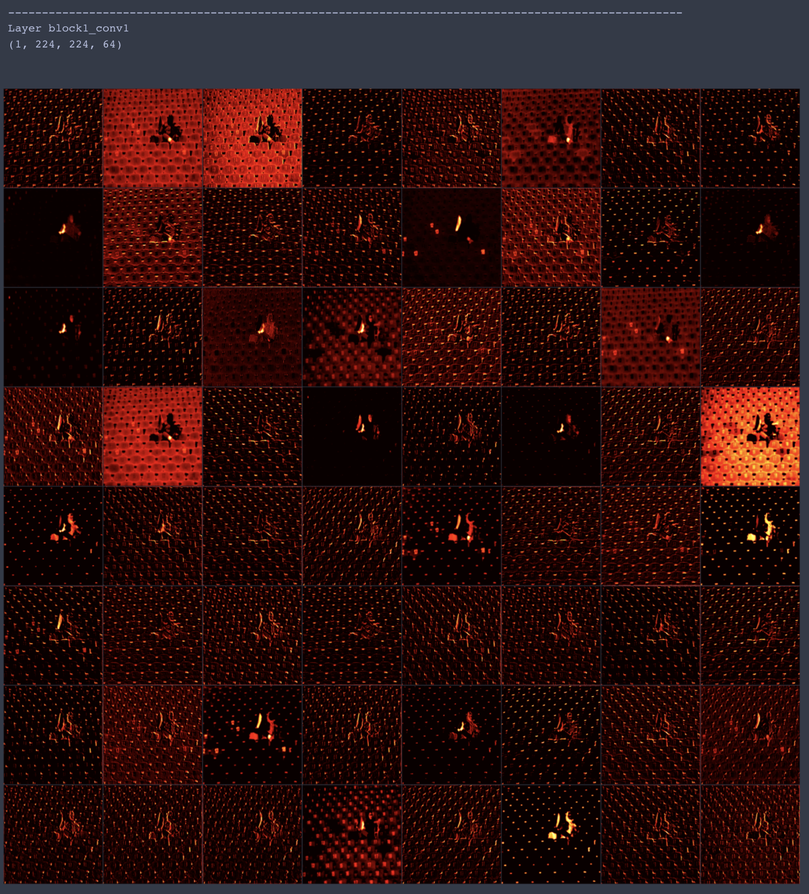
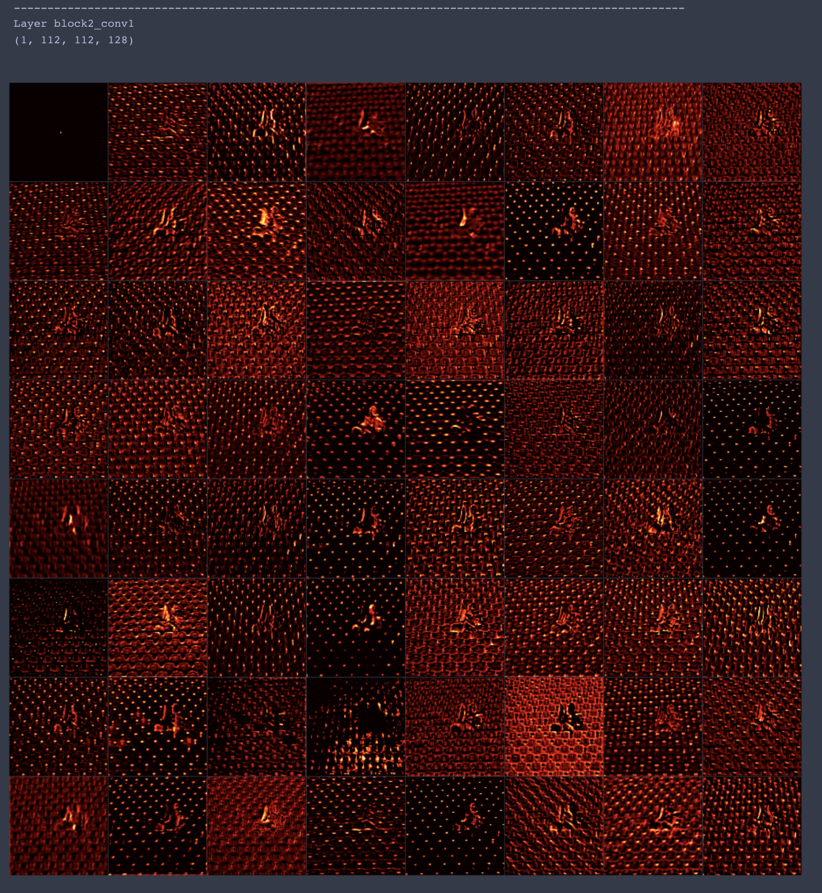
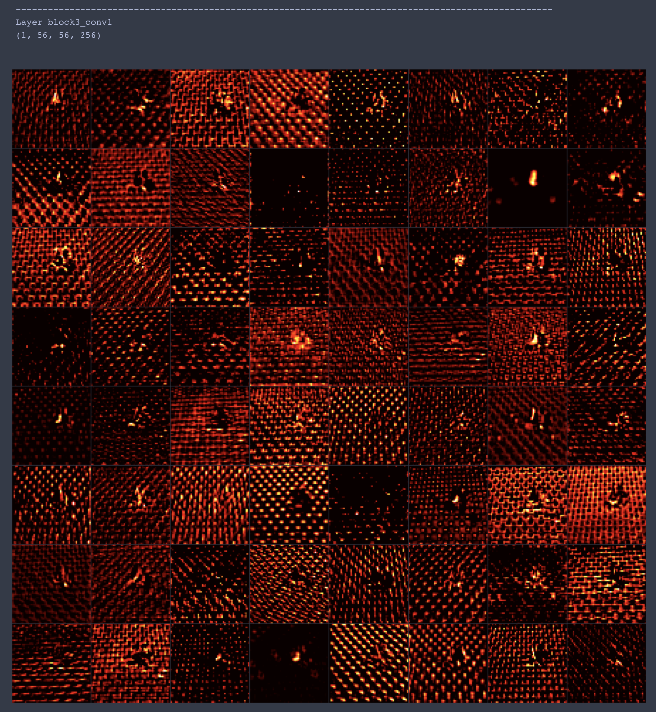
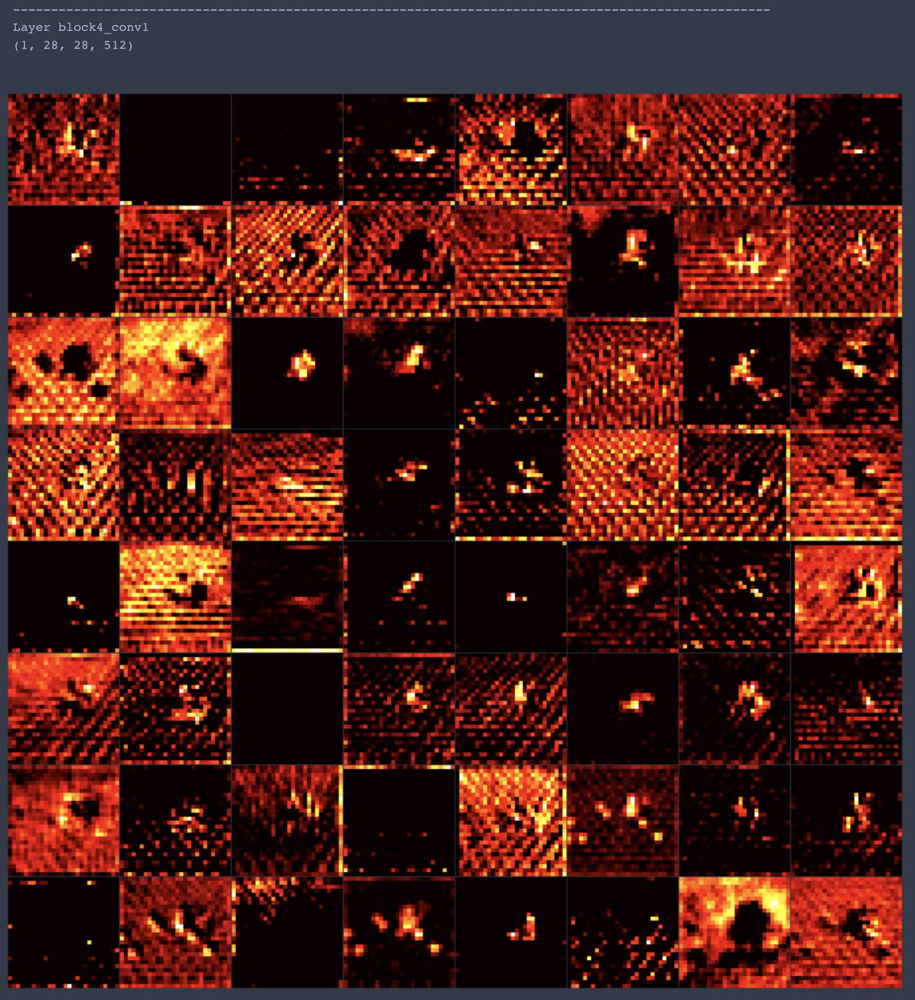
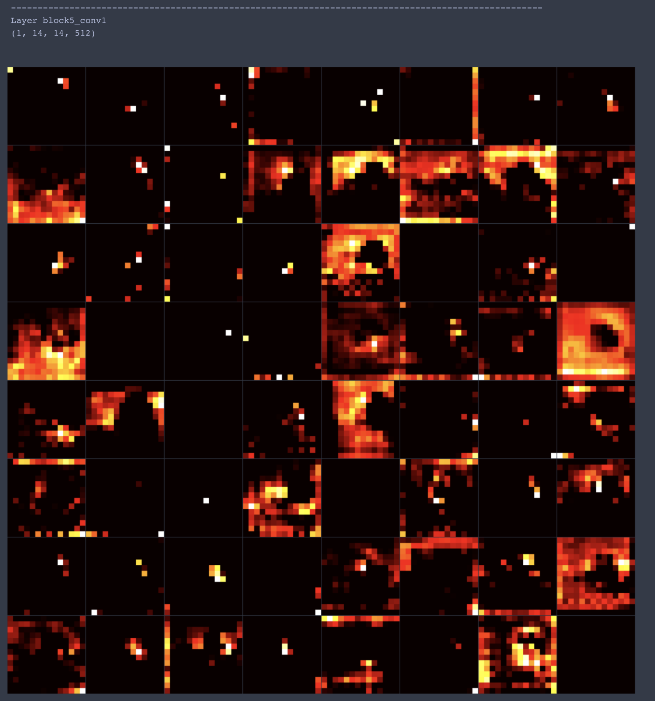
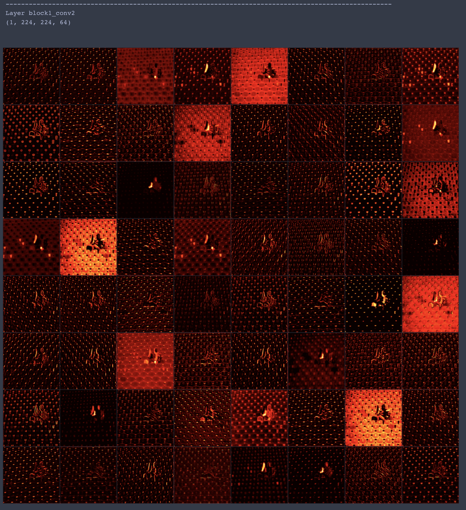
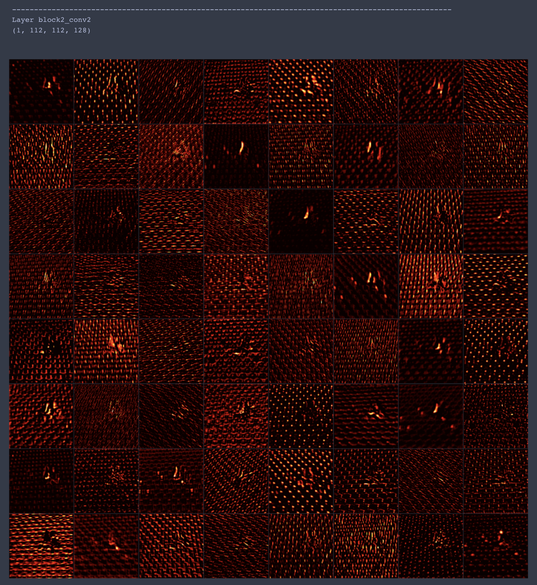
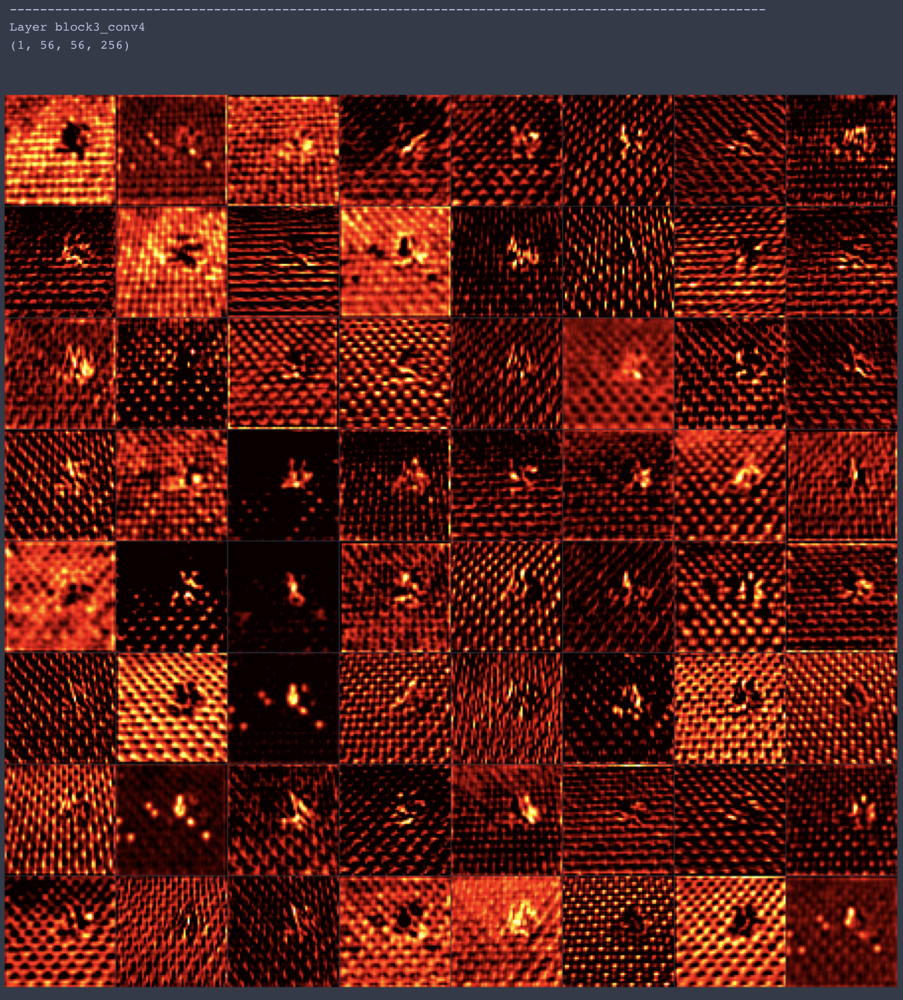
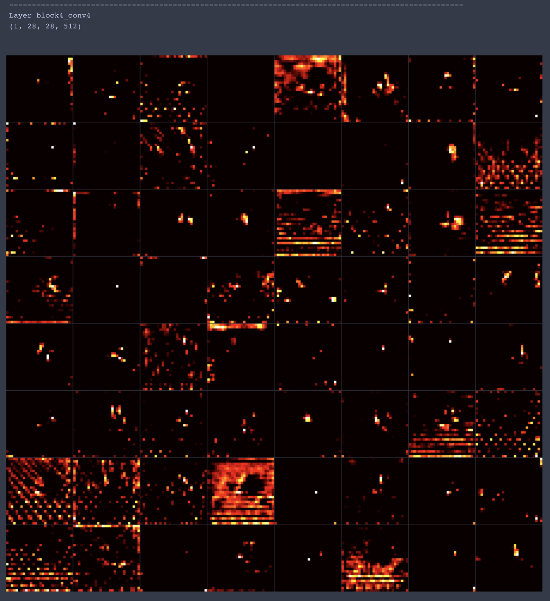
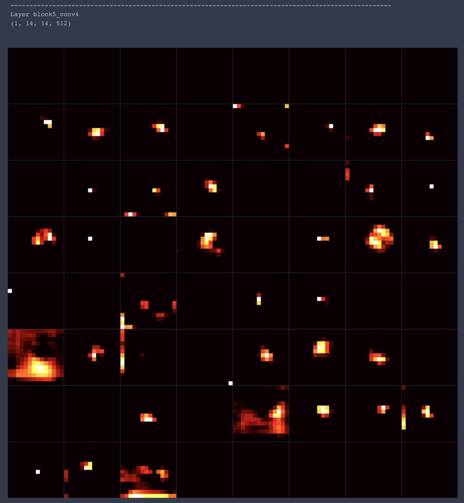

# The structure behind an award-winning photo - a deep learning approach


*Source https://unsplash.com/photos/hJKkyoG8_ng by Hadi Yazdi Aznaveh - Unsplash Award 2019 selected in "Current events"*

Convolutional neural networks (CNNs) allow the computer to classify images. Apart from classifying objects they also are able to give us insights on what makes a picture. What is the essence of a picture? By visualizing the layers of CNN architectures we dive into the understanding of how machines process images. This gives provides also insights on how the human "sees" pictures.

The article shall on one side present what elements build a picture and also provide code for a Python implementation with Keras.

## Table of Contents

- [The structure behind an award-winning photo - a deep learning approach](#the-structure-behind-an-award-winning-photo-a-deep-learningapproach)
  - [Table of Contents](#table-of-contents)
  - [Disclaimer](#disclaimer)
  - [The base image](#the-base-image)
  - [Using a VGG network](#using-a-vgg-network)
  - [Convolutional Layer Feature Maps](#convolutional-layer-feature-maps)
    - [What can we observe?](#what-can-we-observe)
  - [Visualize with code](#visualize-with-code)
    - [Features in grid](#features-in-grid)
    - [Features with notebook display](#features-with-notebook-display)
  - [Bonus - a neural transfer approach](#bonus---a-neural-transfer-approach)
  - [Inspiration](#inspiration)
  - [About](#about)


## Disclaimer

I am not associated with any of the services I use in this article.

I do not consider myself an expert. If you have the feeling that I am missing important steps or neglected something, consider pointing it out in the comment section or get in touch with me.

I am always happy for constructive input and how to improve.


This was written on 25-10-2020.
I cannot monitor all my articles. There is a high probability that, when you read this article the tipps are outdated and the processes have changed.

If you need more information on certain parts, feel free to point it out in the comments.

## The base image

Base image


*Source https://unsplash.com/photos/hJKkyoG8_ng by Hadi Yazdi Aznaveh - Unsplash Award 2019 selected in "Current events"*

I like this image because it has a story, which sparks emotion but also provides rich structure on a photographic level.

To explain why I chose this image I quote directly Joel Tellier, Design Director of Vice (from [Unplash Awards page](https://awards.unsplash.com/2019/#/current-events)):
> Compositionally this photo is incredible. There are layers story and history in every element. The casual nature of the subject suggests that she is completely comfortable in a place where she and her gender have never been welcome in history. Her injury and therefore struggle to attend that day, adds to the relaxed nature of her patriotic celebration alluding to a much more involved story. The numbers on the seats help to suggest the history, leaving me to wonder how many men sat where she is sitting before one (the first) woman was allowed.

This makes it a very interesting image for extracting information with a CNN.

## Using a VGG network


I assume an understanding of **convolutional neural networks (CNNs)**. This architecture is very crucial for many things in computer vision and deep learning. There are many resources online available. As a refresher, I suggest this [article](https://medium.com/@himadrisankarchatterjee/a-basic-introduction-to-convolutional-neural-network-8e39019b27c4).


It is necessary to say what the different layers of a CNN represent in order to understand the subsequent visualizations.

- The shallower layers of a CNN tend to detect lower-level features such as edges and simple textures.
- The deeper layers tend to detect higher-level features such as more complex textures as well as object classes.


VGG19 architecture from research paper [Automatic Mass Detection in Breast Using Deep Convolutional Neural Network and SVM Classifier](https://www.researchgate.net/publication/334388209_Automatic_Mass_Detection_in_Breast_Using_Deep_Convolutional_Neural_Network_and_SVM_Classifier) und the [creative commons license](https://creativecommons.org/licenses/by/4.0/)


It is possible to visualize both the filter and the feature maps. The filters are also an image that depicts a particular feature. Applying those filters lead to the feature maps. In essence, the shallower the layer is the more the feature map looks like the original input. In this article, I want to focus on the feature maps and their visualization as those give a nice impression on what the CNN "sees" and learns.


## Convolutional Layer Feature Maps


The VGG19 model has the following structure and layers:

```py
_________________________________________________________________
Layer (type)                 Output Shape              Param #
=================================================================
input_1 (InputLayer)         (None, None, None, 3)     0
_________________________________________________________________
block1_conv1 (Conv2D)        (3, 800, 1199, 64)        1792
_________________________________________________________________
block1_conv2 (Conv2D)        (3, 800, 1199, 64)        36928
_________________________________________________________________
block1_pool (MaxPooling2D)   (3, 400, 599, 64)         0
_________________________________________________________________
block2_conv1 (Conv2D)        (3, 400, 599, 128)        73856
_________________________________________________________________
block2_conv2 (Conv2D)        (3, 400, 599, 128)        147584
_________________________________________________________________
block2_pool (MaxPooling2D)   (3, 200, 299, 128)        0
_________________________________________________________________
block3_conv1 (Conv2D)        (3, 200, 299, 256)        295168
_________________________________________________________________
block3_conv2 (Conv2D)        (3, 200, 299, 256)        590080
_________________________________________________________________
block3_conv3 (Conv2D)        (3, 200, 299, 256)        590080
_________________________________________________________________
block3_conv4 (Conv2D)        (3, 200, 299, 256)        590080
_________________________________________________________________
block3_pool (MaxPooling2D)   (3, 100, 149, 256)        0
_________________________________________________________________
block4_conv1 (Conv2D)        (3, 100, 149, 512)        1180160
_________________________________________________________________
block4_conv2 (Conv2D)        (3, 100, 149, 512)        2359808
_________________________________________________________________
block4_conv3 (Conv2D)        (3, 100, 149, 512)        2359808
_________________________________________________________________
block4_conv4 (Conv2D)        (3, 100, 149, 512)        2359808
_________________________________________________________________
block4_pool (MaxPooling2D)   (3, 50, 74, 512)          0
_________________________________________________________________
block5_conv1 (Conv2D)        (3, 50, 74, 512)          2359808
_________________________________________________________________
block5_conv2 (Conv2D)        (3, 50, 74, 512)          2359808
_________________________________________________________________
block5_conv3 (Conv2D)        (3, 50, 74, 512)          2359808
_________________________________________________________________
block5_conv4 (Conv2D)        (3, 50, 74, 512)          2359808
_________________________________________________________________
block5_pool (MaxPooling2D)   (3, 25, 37, 512)          0
=================================================================
Total params: 20,024,384
Trainable params: 20,024,384
Non-trainable params: 0
_________________________________________________________________
```
So this is the original picture:


Going through the different layers of the CNN we can observe the results of different filters being applied to the original. I will display it in a "hot" colormap. Simply because I think it highlights the features better than other colormaps.

Note that the dimensions and number of filters change over the number of blocks. For simplicity, I will plot only the 8*8 grids.

Lets have a look at the first convolutional layer of each block:












Lets have a look at the last convolutional layer of each block:












### What can we observe?

Two things:
1. we can clearly see that in deeper layers objects are detected. For , the isolated woman, but also a seat, the flag, or even the colored seats stand out.
2. A big part of what makes the image appealing is its structure itself. We can see how the woman in the picture brings softness in the very structured surroundings. It seems to be appealing to the eye because the structure is broken with roundness. Elements of roundness that allow the observer to focus on this unique object rather than the similar seats.

In essence, we can see a quite interesting composition of an image. We have a lot of texture and structure provided through seats in the arena, but a distortion of that structure in form of a human being. This guides the eyes of the observer directly to the protagonist of the image, namely the woman. It fits perfectly the storyline. I would say this is what distinguishes a good picture from an excellent one. Backing up a storyline through visualization.

It is like a video that has perfectly cut music to its visual expression. See what I mean with this video:
https://www.youtube.com/watch?v=pvK9bTsoaO0&ab_channel=ArthurMoore


At least those are my observations. What do you think? Let me know in the comments.


## Visualize with code

### Features in grid

In my research to visualize feature maps of CNN layers I often came to find tutorials and implementations that offer insight on how to approach visualization but not following through to really see and understand what the images are showing.

Under my "inspiration" section you can find various implementations of visualizing the images. Often the approach to extract the images is great. I just always found them to be too small for actually making their point.

If you follow already available solutions, you can do something like this:

```py
import numpy as np
from keras.preprocessing.image import save_img, load_img, img_to_array
from PIL import Image
from keras.applications.vgg19 import preprocess_input
from keras.models import Model
from keras.applications import vgg19
import matplotlib.pyplot as plt


size = 224

image = load_img(image_path).resize((size, size))
image = img_to_array(image)
image = np.expand_dims(image, axis=0)
image = preprocess_input(image)

model = vgg19.VGG19()

layer_dict = dict([(layer.name, layer) for layer in model.layers])

layer_name = 'block1_conv1'

model = Model(inputs=model.inputs, outputs=layer_dict[layer_name].output)

feature_maps = model.predict(image)

tiles = 8
index = 1
fig, ax = plt.subplots(figsize=(size, size))
for _ in range(tiles):
    for _ in range(tiles):
        ax = plt.subplot(tiles, tiles, index)
        ax.set_xticks([])
        ax.set_yticks([])

        plt.imshow(feature_maps[0, :, :, index-1], aspect='auto', cmap='hot')
        index += 1

plt.tight_layout()
plt.show()
```

This is useful if you want to display multiple visualizations over different layers. Like

```py
for layer in layer_names:
    print(f'{"-"*100}\nLayer {layer}')
    model = Model(inputs=model.inputs, outputs=layer_dict[layer].output)

    feature_maps = model.predict(image)
    print(feature_maps.shape)

    tiles = 8
    index = 1
    fig, ax = plt.subplots(figsize=(size, size))
    for _ in range(tiles):
        for _ in range(tiles):
            ax = plt.subplot(tiles, tiles, index)
            ax.set_xticks([])
            ax.set_yticks([])

            plt.imshow(feature_maps[0, :, :, index-1], aspect='auto', cmap='hot')
            index += 1

    plt.tight_layout()
    plt.show()
```

This leads to the 8*8 grid per layer:


The images are bigger and can quickly spot what type you want to inspect in more detail. Especially in a jupyter notebook. One word of caution: If you render too many images with too many details in the grid, at some point, your notebook will crash.

### Features with notebook display

Let's say you want to display each image in full size image per image. Then the following would be helpful:

```py
for index in range(feature_maps.shape[-1]):
    display(Image.fromarray(np.uint8(feature_maps[0, :, :, index])).convert(
        'RGB').resize(display_size))
```

This would display the images in grayscale.
If you want a specific color map you would need to do something like:

```py
from keras.preprocessing.image import img_to_array
from IPython.display import display
from PIL import Image
from matplotlib import cm

cmap = cm.get_cmap('hot')
display_size = 1000, 1000

for index in range(feature_maps.shape[-1]):
    im = Image.fromarray(np.uint8(feature_maps[0, :, :, index])).convert('L').resize(display_size)
    im = np.array(im)
    im = cmap(im)
    im = np.uint8(im * 255)
    im = Image.fromarray(im).resize(display_size)
    display(im)
```

Scrolling through them looks like this (as a .gif file):


With the resize functionality it is possible to inspect all images at a proper size.


## Bonus - a neural transfer approach

In my previous article [Neural Style Transfer — A high-level approach ](https://towardsdatascience.com/neural-style-transfer-a-high-level-approach-250d4414c56b) I provided an overview of neural style transfer. Using the ideas with the following style image.


*Source https://unsplash.com/photos/Cj8h7-b47ko by JOSHUA COLEMAN*

would lead to an image like this:


## Inspiration

Reading list on the visualization of CNN layers (in no particular order):

- https://towardsdatascience.com/visualising-filters-and-feature-maps-for-deep-learning-d814e13bd671#:~:text=The%20feature%20maps%20of%20a,what%20features%20our%20CNN%20detects.
- https://towardsdatascience.com/extract-features-visualize-filters-and-feature-maps-in-vgg16-and-vgg19-cnn-models-d2da6333edd0
- https://debuggercafe.com/visualizing-filters-and-feature-maps-in-convolutional-neural-networks-using-pytorch/
- https://towardsdatascience.com/how-to-visualize-convolutional-features-in-40-lines-of-code-70b7d87b0030 understand how a neural network recognizes a certain pattern
- https://arxiv.org/pdf/1804.11191.pdf HOW CONVOLUTIONAL NEURAL NETWORKS SEE THE WORLD — A SURVEY OF CONVOLUTIONAL NEURAL NETWORK VISUALIZATION METHODS
- https://www.deeplearningbook.org/contents/convnets.html
- https://www.analyticsvidhya.com/blog/2019/05/understanding-visualizing-neural-networks/
- https://towardsdatascience.com/convolutional-neural-network-feature-map-and-filter-visualization-f75012a5a49c


---

## About

Daniel is an entrepreneur, software developer, and business law graduate. He has worked at various IT companies, tax advisory, management consulting, and at the Austrian court.

His knowledge and interests currently revolve around programming machine learning applications and all its related aspects. To the core, he considers himself a problem solver of complex environments, which is reflected in his various projects.

Don't hesitate to get in touch if you have ideas, projects, or problems.


You can support me on https://www.buymeacoffee.com/createdd


**Connect on:**
- [LinkedIn](https://www.linkedin.com/in/createdd)
- [Github](https://github.com/Createdd)
- [Medium](https://medium.com/@createdd)
- [Twitter](https://twitter.com/_createdd)
- [Instagram](https://www.instagram.com/create.dd/)
- [createdd.com](https://www.createdd.com/)

<!-- Written by Daniel Deutsch -->