# Connect your AWS app with a domain

*Source:*

# Table of Contents

- [Connect your AWS app with a domain](#connect-your-aws-app-with-a-domain)
- [Table of Contents](#table-of-contents)
- [All out of one box](#all-out-of-one-box)
- [Buy domain](#buy-domain)
- [Connect domain with your AWS public IP address](#connect-domain-with-your-aws-public-ip-address)
- [Enable HTTPS](#enable-https)
  - [Add Rules to cluster](#add-rules-to-cluster)
  - [Get certificate](#get-certificate)
- [Add load balancer](#add-load-balancer)
- [Update Route53](#update-route53)
- [Create Service of cluster](#create-service-of-cluster)
- [See your result with https loadbalancer](#see-your-result-with-https-loadbalancer)
- [Disclaimer](#disclaimer)
- [About](#about)

# All out of one box

I came to use many services from AWS. The more I use it the more I tend to like it. It is very straight-forward to set up everything and you find great official and unofficial documentation. I realized however that most articles cover launching of apps but not how to tie it to an own domain name. This is nice for testing, but if you want to launch a prototype you would of course need your own domain. Especially as the domain itself is often quite cheap.

In my last articles, I talked about creating an own web app with python and also how to deploy it. TODO: Link articles

So now I want to show how to buy and register a domain within AWS for your web app.

One official documentation you can find [here](https://aws.amazon.com/getting-started/hands-on/get-a-domain/).

I will illustrate how I did it with some personal points.

# Buy domain

The first thing is of course to buy a domain.

Be aware that buying a domain is not included in the AWS free tier system. Domains cost from 10 dollars up.

Just go to the domain section through the AWS dashboard and click on "register domain".

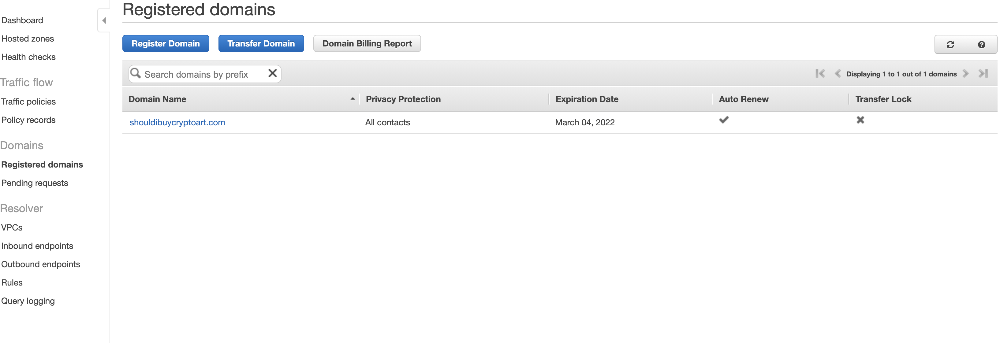

Then you will be guided through the process where you select your domain name.

Make sure beforehand to have a valid payment method setup. If this is not the case the buy process will be cancelled, but your purchase will be on the billing sheet. I actually think this is a bug. I filed a report to AWS and hope that this will be resolved for further usage. To avoid this make sure your payment method works. You can find it in your account settings.

After everything worked you will receive an email and your registered domain will be available under the corresponding tab. (See my screenshot above).

# Connect domain with your AWS public IP address

There are multiple ways on how to do this. I will just show one way.

Go to the Route 53 menu and navigate to the "hosted zones" page to  create a new record for your domain.

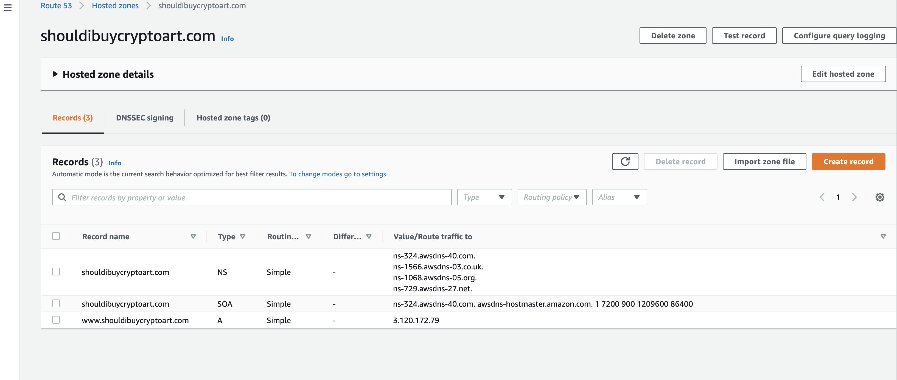

Then create a new record.

Get the public address from your ec2 task overview page and add it as static value for your domain. For the record name simple add a "www" to the name:

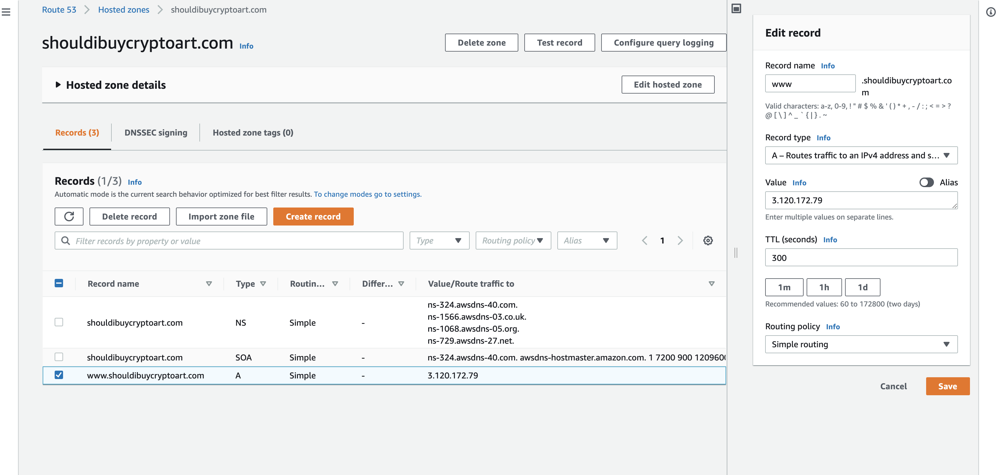

Couple of things to keep in mind:
- this is a static link, which means if the IP address changes then you need to update this entry
- this requires your application to send its content to the IP address and not some other port (often 8080). You can not specify a port here. You must change this in your EC instance/cluster/task where you set up your Docker container.
- When we add a loadbalancer and enable https this entry will be changed! (See below)

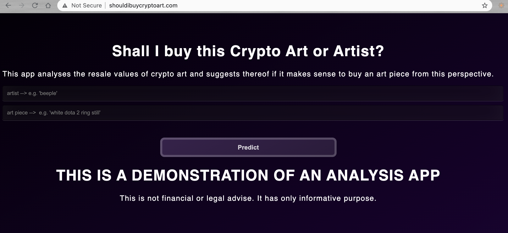

However, as you can see, the webpage is served over HTTP instead HTTPS. So the next step is to add a security certificate.

# Enable HTTPS

This was honestly more work than I expected in the beginning. It is important to know why.

## Add Rules to cluster

Go to the security group of your EC2 cluster and make sure you add (or have added) the corresponding inbound rules to allow for https setting.

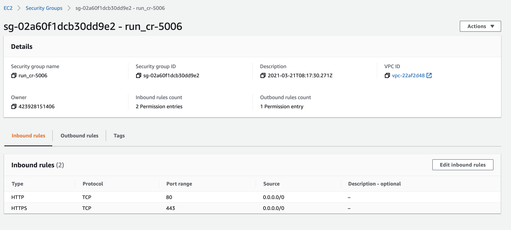

## Get certificate

Navigate to the AWS Certificate Manager

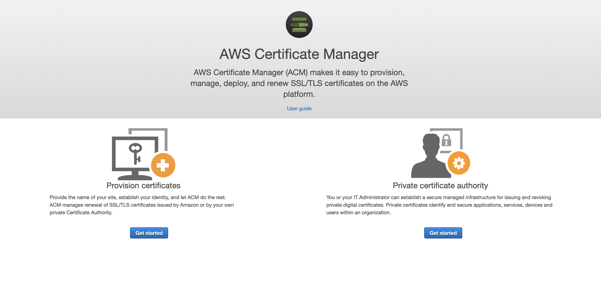

Add your domain

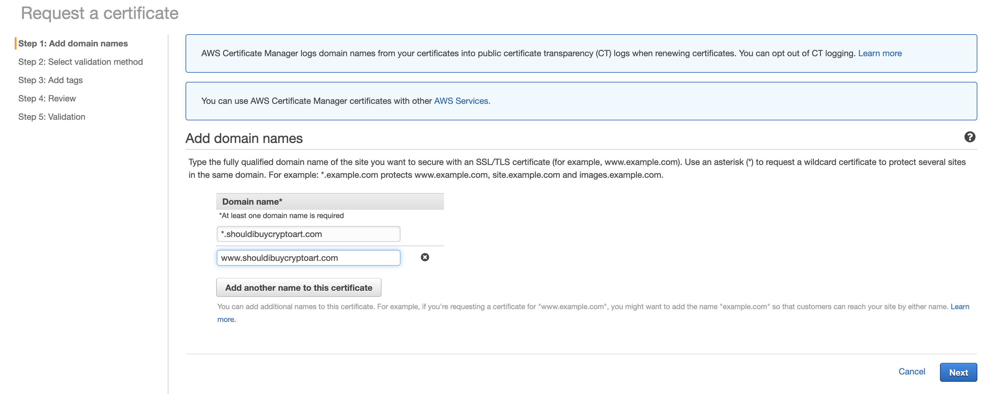

and fill out the remaining questions as you see fit.

I chose validation by email. After approving this mail you will have succcessfully issued the certificate.

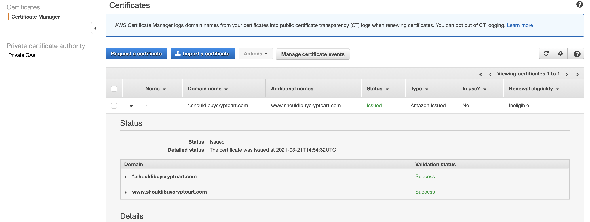

# Add load balancer

Just type in Load Balancer and select the EC2 feature:

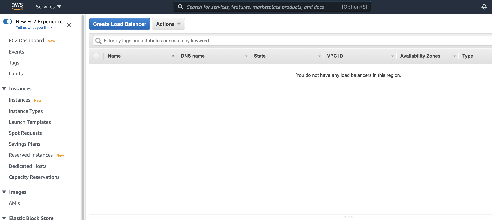

then we select application load balancer:

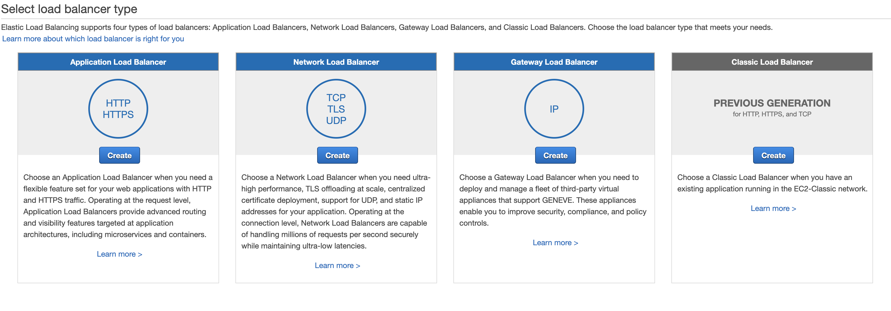

1. Give your load balancer a name
2. The scheme will be internet facing, and
3. select https,
4. select available subnets

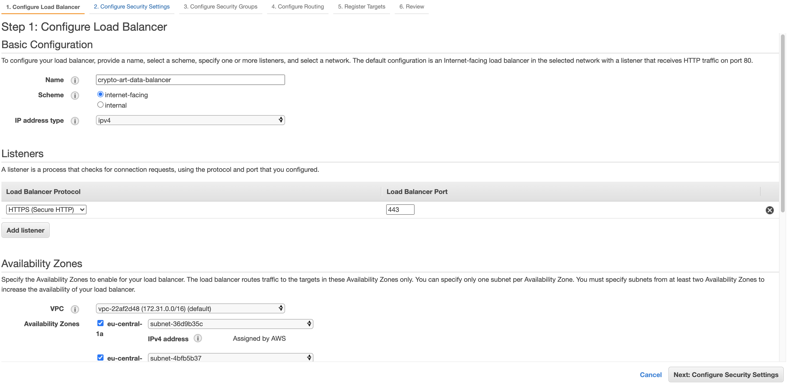

In the security settings tab you will be able to choose your certificate you have set up previously (fromn ACM)

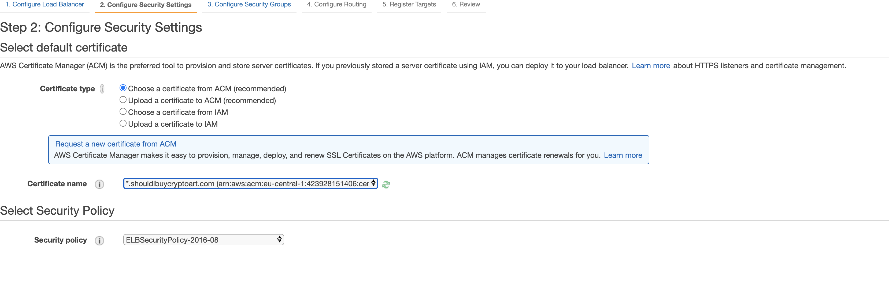

- Set up a security group. Make sure to allow https and http traffic

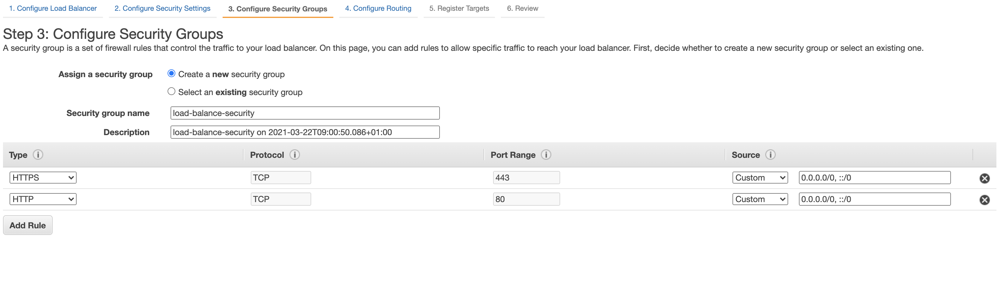

- Configure routing. Make sure to use target [type "IP" for Fargate](https://docs.aws.amazon.com/AmazonECS/latest/userguide/create-application-load-balancer.html)

WTONG:

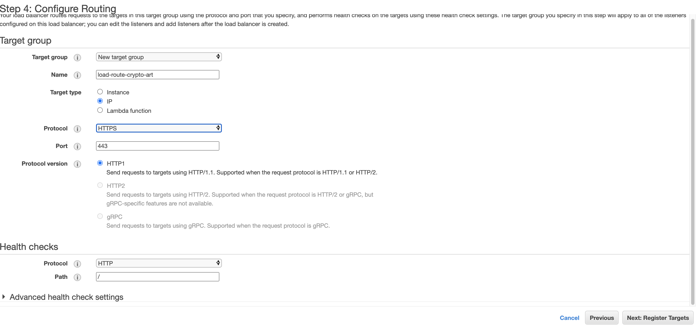

Correct: Listen for HTTP port!

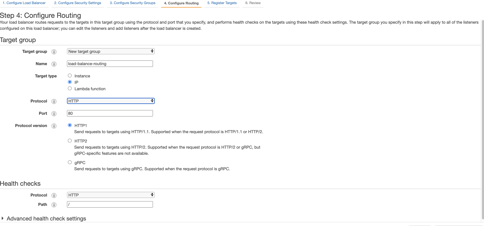

- leave default in targets as it will be allocated automatically!

- Review everything and create your load balancer
- in case you want to set the route directly to the dns address you can copy the DNS name of your load balancer

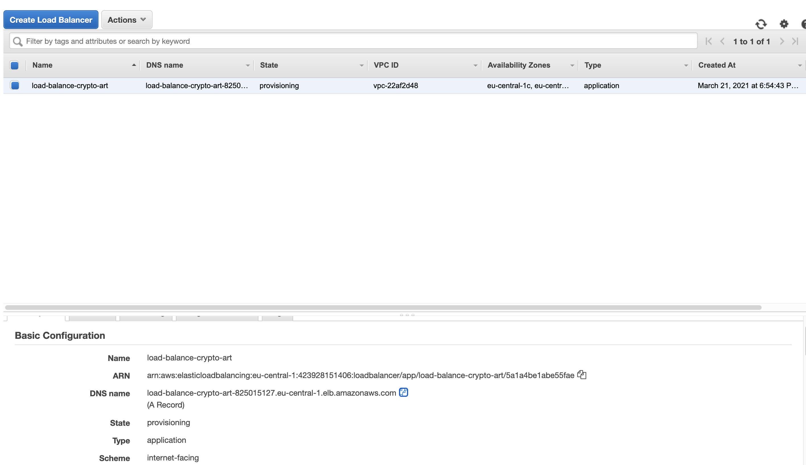

# Update Route53

- Go to Route 53 > Routes Zones > click on the domain name >
- Go to Records Sets
- create a hosted zone with Domain Name
- create/edit record set with name empty, type A,
- alias to application load balancer and select your created dns

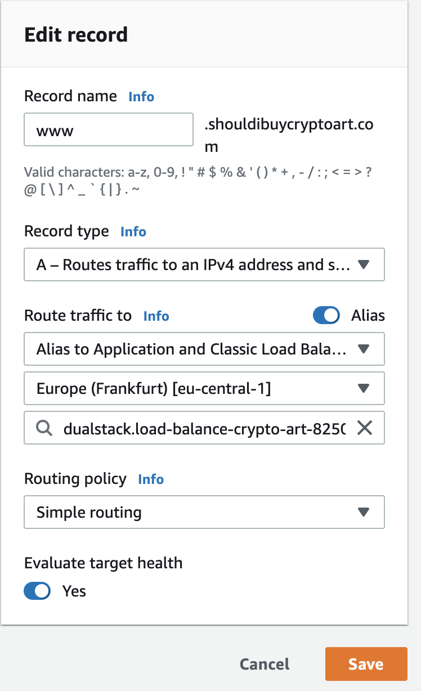

If you have problems in this process check out [this SO question.](https://stackoverflow.com/questions/5309910/https-setup-in-amazon-ec2)

# Create Service of cluster

Within a service you can add the previous defined load balancer.

- Go to the service tab in your ECS Cluster
- Fill everything out as desired

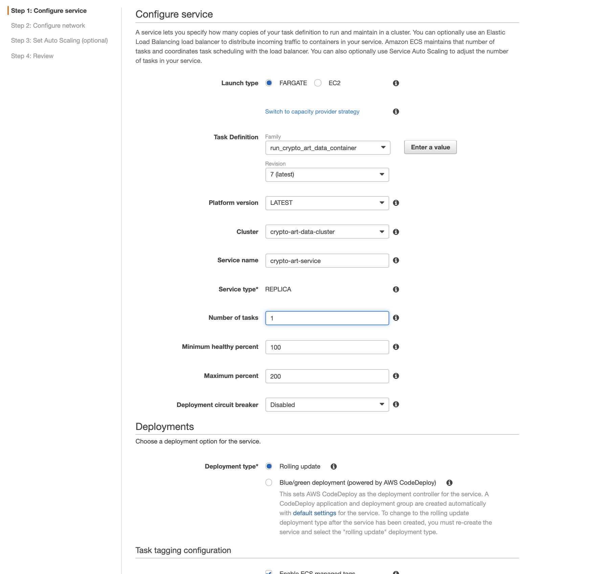

- in the next step (network setting), use the defaults for VPCs
- add application load balancer and set the listener to https (Port 443) and specify your target group ( you had defined in routing of the load balancer)

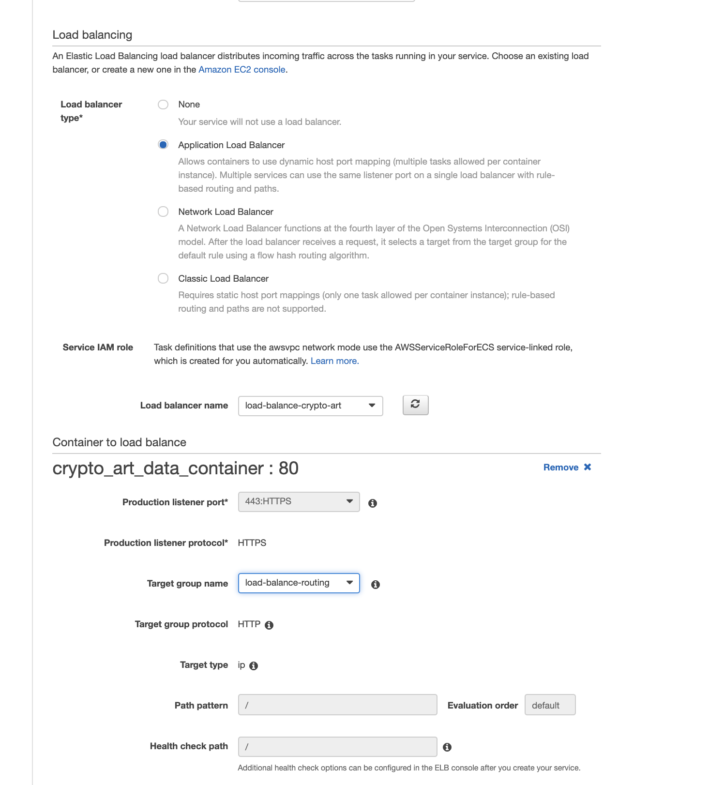

- finish the steps and create the service

Now you will have to wait a bit until everything is set up and running.

# See your result with https loadbalancer

Now you can navigate to the public IP of your task:

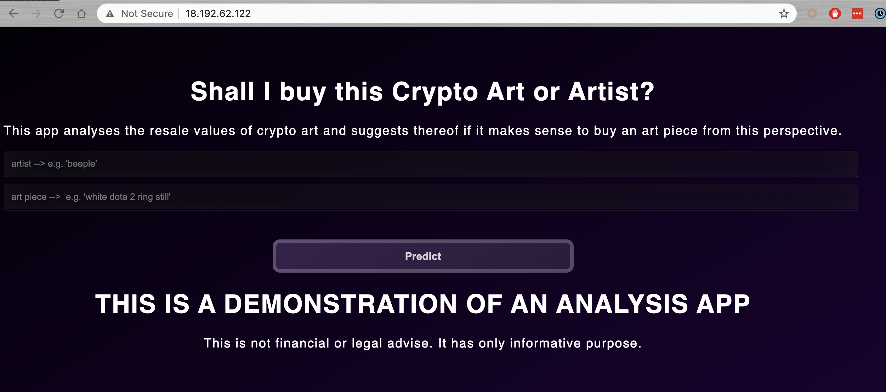

And of course to your https domain:

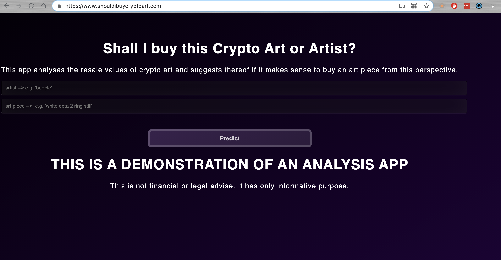

Note: As this application is under development it might be that the domain is not reachable. This is desired as I am still playing around with AWS archtitecture setups and want to avoid too much costs.

# Disclaimer

I am not associated with any of the services I use in this article.

I do not consider myself an expert. I merely document things besides doing other things. Therefore the content does not represent the quality of any of my professional work, nor does it fully reflect my view on things. If you have the feeling that I am missing important steps or neglected something, consider pointing it out in the comment section or get in touch with me.

This was written on XXXXXXXDATEXXXXXXXXXX.
I cannot monitor all of my articles. There is a high probability that when you read this article the tips are outdated and the processes have changed.

I am always happy for constructive input and how to improve.

---

# About

Daniel is an artist, entrepreneur, software developer, and business law graduate. His knowledge and interests currently revolve around programming machine learning applications and all their related aspects. To the core, he considers himself a problem solver of complex environments, which is reflected in his various projects.

You can support me on https://www.buymeacoffee.com/createdd or with crypto https://etherdonation.com/d?to=0xC36b01231a8F857B8751431c8011b09130ef92eC

**Connect on:**

- [Allmylinks](https://allmylinks.com/createdd)

Direct:
- [LinkedIn](https://www.linkedin.com/in/createdd)
- [Github](https://github.com/Createdd)
- [Medium](https://medium.com/@createdd)
- [Twitter](https://twitter.com/_createdd)
- [Instagram](https://www.instagram.com/create.dd/)
- [createdd.com](https://www.createdd.com/)

Art-related:
- [Medium/the-art-of-art](https://medium.com/the-art-of-art)
- [Instagram/art_and_ai](https://www.instagram.com/art_and_ai/)
- [Rarible](https://app.rarible.com/createdd/collectibles)
- [Open Sea](https://opensea.io/accounts/createdd?ref=0xc36b01231a8f857b8751431c8011b09130ef92ec)
- [Known Origin](https://knownorigin.io/profile/0xC36b01231a8F857B8751431c8011b09130ef92eC)
- [Devian Art](https://www.deviantart.com/createdd1010/)

<!-- Written by Daniel Deutsch -->