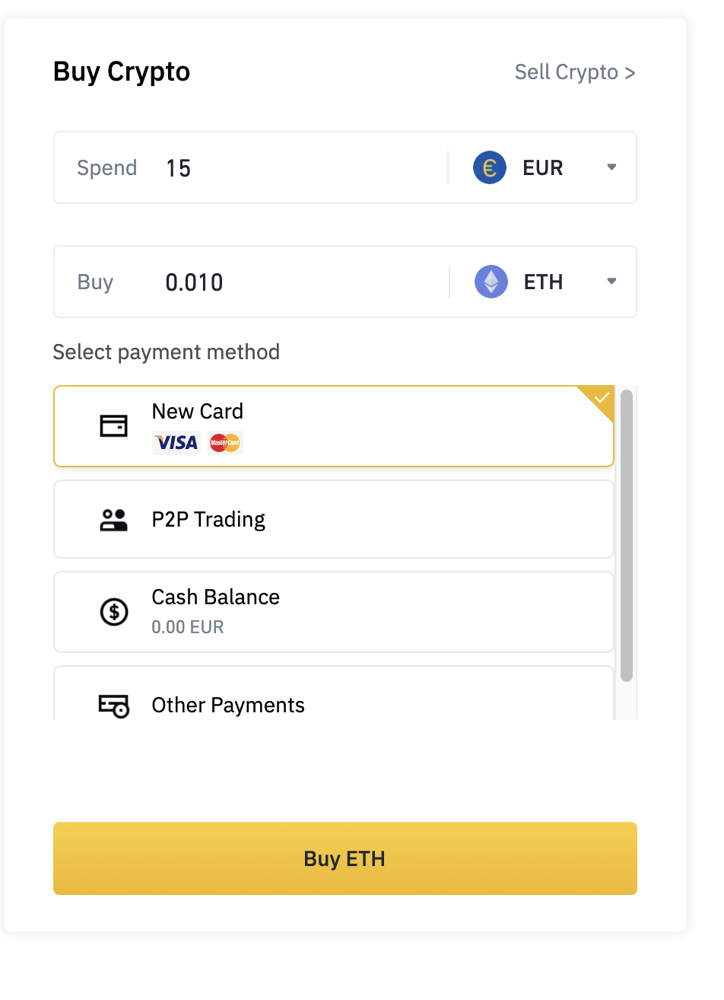
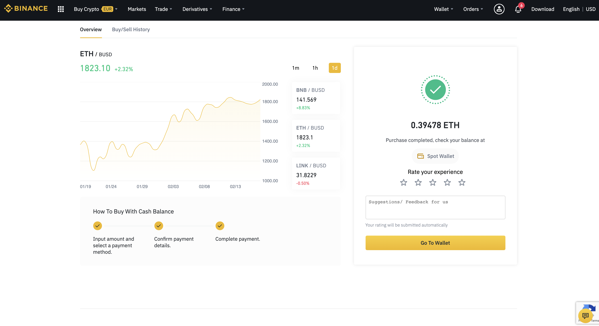

# Step by step intro to buy Cryptoart

*Source:*

## Table of Contents

- [Step by step intro to buy Cryptoart](#step-by-step-intro-to-buy-cryptoart)
  - [Table of Contents](#table-of-contents)
  - [Hop in](#hop-in)
    - [Install metamask](#install-metamask)
    - [Initialize your wallet](#initialize-your-wallet)
    - [Configure wallet for Binance](#configure-wallet-for-binance)
    - [Verifiying yourself](#verifiying-yourself)
  - [Get some Ethereum](#get-some-ethereum)
    - [Verify Address Ownership (Binance)](#verify-address-ownership-binance)
    - [Buy with credit card](#buy-with-credit-card)
    - [Buy with bank transfer](#buy-with-bank-transfer)
    - [Convert to ETH](#convert-to-eth)
  - [Send to Metamask Wallet](#send-to-metamask-wallet)
    - [Check wallet on Etherscan](#check-wallet-on-etherscan)
  - [Buy some crypto art](#buy-some-crypto-art)
  - [Disclaimer](#disclaimer)
  - [About](#about)

## Hop in

Many people right now are talking about NFTs, buying and selling them. Here is a starter on how to buy your first crypto art using metamask and binance.

You will find a detailled tutorial on their [docs](https://academy.binance.com/en/articles/how-to-use-metamask)

Be aware that this is just a starter. Be careful to inform yourself more about the concepts if you plan on investing higher amounts. I will use **Metamask** and **Binance** for the tutorial steps.

### Install metamask

Install the metamask from their homepage https://metamask.io/
I simply use it as a chrome browser extension.

A detailled step-through can be found [here](https://medium.com/@mark.lasia/how-to-set-up-an-erc20-compatible-ethereum-wallet-cda8dabc4b89)

### Initialize your wallet

There will be guided steps through the setup. Create a password and a seed phrase. Store them savely and you are ready with your own wallet. There are detailled instruction provided by metamask on how to do this.

### Configure wallet for Binance

To set it up with Binance we need to configure it in the settings.

If you are having troubles here, refer to the original [docs](https://academy.binance.com/en/articles/connecting-metamask-to-binance-smart-chain)

### Verifiying yourself

Along the process you will be asked to verify yourself with photo. Basically all payments companies will request this. Simply follow the steps, when asked.

You can do it manually in the [settings](https://www.binance.com/en/my/settings/profile?ref=62985194)

If the webversion is buggy (it was when I tried), do it over the mobile app. Then you will receive something like this:

## Get some Ethereum

You need a place where you can change traditional money, also called FIAT money (USD, EUR, etc) with digital money. I use  [Binance](https://www.binance.com/en/register?ref=62985194) here. But you can use other platforms as well (like [Bitpanda](https://www.bitpanda.com/?ref=195257848367289193)).

Be aware that there are scam sites out there, so I recommend to go with the bigger ones.

### Verify Address Ownership (Binance)

Start by verifying ownership [here](https://www.binance.com/en/my/wallet/verify-address-ownership?ref=62985194).

### Buy with credit card

Afterwards go to ["buy and sell crypto"](https://www.binance.com/en/buy-sell-crypto?ref=62985194)

It looks like this:

Then select what you want to buy and the amount. I will start with the minimum of 15EUR and a Visa card. For bank transfers (SEPA) there is a higher amount required. So you can start with a smaller amount and credit card and see if all transactions work well, and then you can move to higher amounts.

Make sure that you have added your credit card.

Afterwards:

### Buy with bank transfer

If you are in the EU you can use SEPA Transfer

You will see the payment details on the right. Simply head to your online banking and send the amount to the address (Binance). Do not forget the reference number. They need this one to reference your payment. After one or two days you will have the amount transferred to your Binance account.

Then you receive a confirmation per Email

Afterwards you will see the new amount at your "Fiat and Spot" Overview tab:

Now you have sent money to your Binance account. The next step is to convert it to the desired crypto currency.

### Convert to ETH

First you need to buy ETH in the "buy crypto" section. As you have already send FIAT money to your Binance Account you can choose "Cash balance":

After confirming you get:

Going to your SPOT Wallet you can now see that you have successfully converted EUR into ETH:

Now if you only want to have some ETH and make money by its increasing value you are already done and benefit from the rising. But if you want to have a little more risky investments you can buy some art. To do this read the following.

## Send to Metamask Wallet

Next you need to copy your Metamask wallet address:

The go to "withdraw" Crypto, fill in the address, transfer network and amount:

If you want to be careful you can send at first only a small amount to check if everything goes correctly. Be aware that you have to pay a fee for each transaction!

After your email and SMS validation you get:

The processing can take some time. You will recevie some email after successful withdraw:

and you can see it in your metamask as well:

### Check wallet on Etherscan

You can check your wallet on Etherscan as well. Just add your wallet address instead of mine: https://etherscan.io/address/0xc36b01231a8f857b8751431c8011b09130ef92ec

You can see the new amount and the corresponding transaction. Congrats! You just send ETH to your Metamask wallet.

## Buy some crypto art

I will buy something on Nifty Gateway

- First create an account
- Validate your account (phone authentication)

https://niftygateway.com/deposit

And after a while you have the new balance:

Afterwards select an art piece you like and confirm:

And you will see it on your nifty profile

Then you can withdraw your nifty to your metamask wallet:

and after a while it will be open on [Opensea](https://opensea.io?ref=0xc36b01231a8f857b8751431c8011b09130ef92ec).

https://opensea.io?ref=0xc36b01231a8f857b8751431c8011b09130ef92ec

## Disclaimer

I am not associated with any of the services I use in this article.

I do not consider myself an expert. I am not a blogger or something. I merely document things beside doing other things. Therefore the content does not represent the quality of any of my work, nor does it fully reflect my view on things. If you have the feeling that I am missing important steps or neglected something, consider pointing it out in the comment section or get in touch with me.

I am always happy for constructive input and how to improve.

This was written on **18.02.2021**.
I cannot monitor all of my articles. There is a high probability that when you read this article the tips are outdated and the processes have changed.

If you need more information on certain parts, feel free to point it out in the comments.

##

---

## About

Daniel is an artist, entrepreneur, software developer, and business law graduate. He has worked at various IT companies, tax advisory, management consulting, and at the Austrian court.

His knowledge and interests currently revolve around programming machine learning applications and all their related aspects. To the core, he considers himself a problem solver of complex environments, which is reflected in his various projects.

Don't hesitate to get in touch if you have ideas, projects, or problems.

You can support me on https://www.buymeacoffee.com/createdd or with crypto https://etherdonation.com/d?to=0xC36b01231a8F857B8751431c8011b09130ef92eC

**Connect on:**

- [Allmylinks](https://allmylinks.com/createdd)

Direct:
- [LinkedIn](https://www.linkedin.com/in/createdd)
- [Github](https://github.com/Createdd)
- [Medium](https://medium.com/@createdd)
- [Twitter](https://twitter.com/_createdd)
- [Instagram](https://www.instagram.com/create.dd/)
- [createdd.com](https://www.createdd.com/)

Art-related:
- [Medium/the-art-of-art](https://medium.com/the-art-of-art)
- [Instagram/art_and_ai](https://www.instagram.com/art_and_ai/)
- [Rarible](https://app.rarible.com/createdd/collectibles)
- [Open Sea](https://opensea.io/accounts/createdd?ref=0xc36b01231a8f857b8751431c8011b09130ef92ec )
- [Known Origin](https://knownorigin.io/profile/0xC36b01231a8F857B8751431c8011b09130ef92eC)
- [Devian Art](https://www.deviantart.com/createdd1010/)

<!-- Written by Daniel Deutsch -->