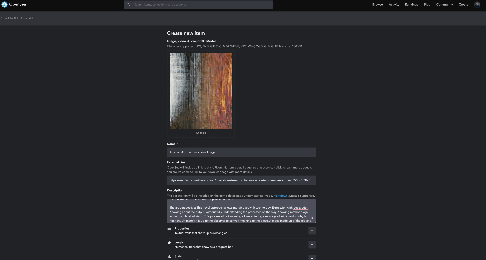
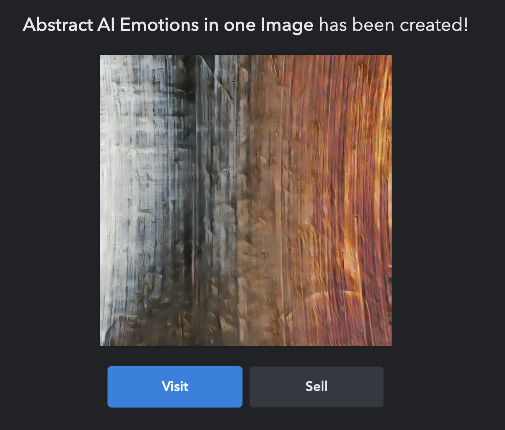
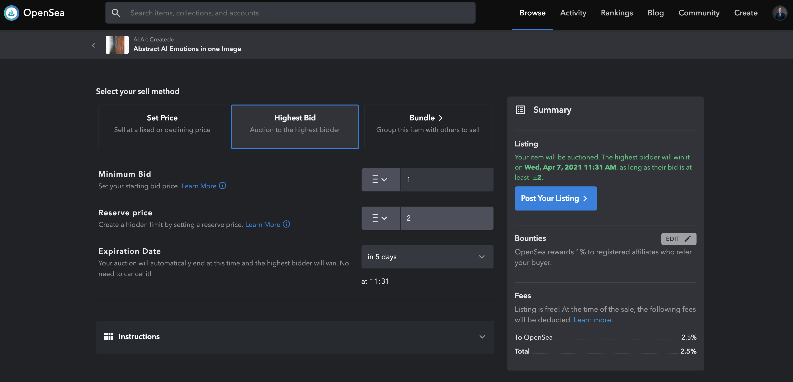
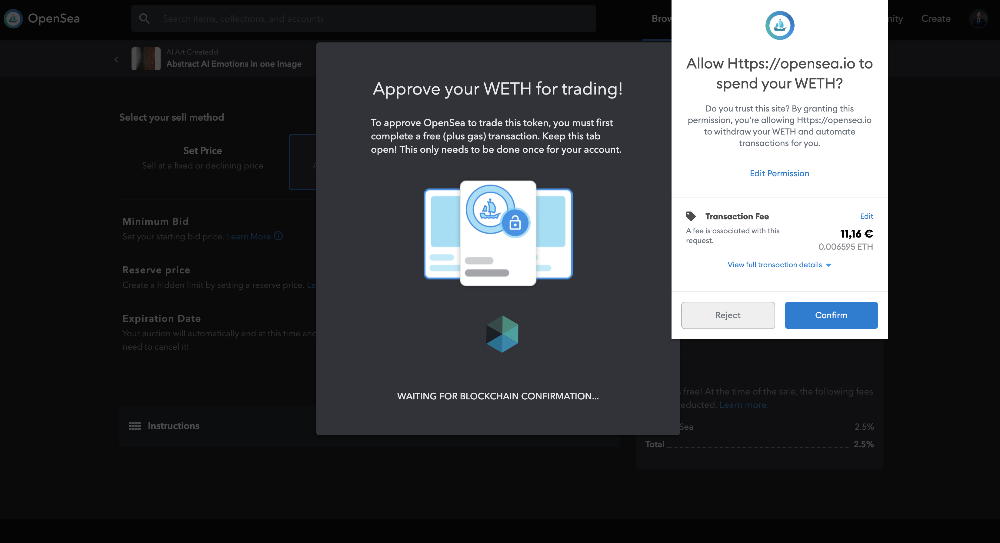
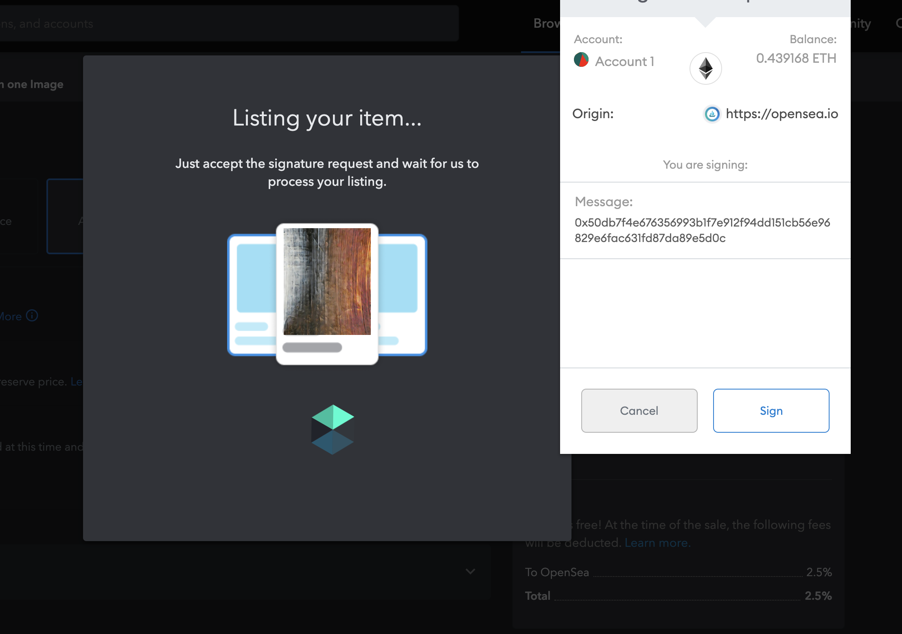
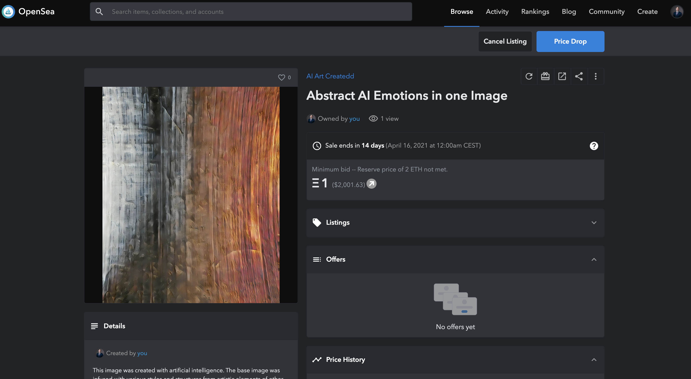

# How I create an NFT art piece for free

*AI created art by Author. [See on Opensea as NFT](https://opensea.io/accounts/createdd?ref=0xc36b01231a8f857b8751431c8011b09130ef92ec) inspired by [Piwnicki](https://unsplash.com/photos/JnXebVlsVrg)*

# Table of Contents

- [How I create an NFT art piece for free](#how-i-create-an-nft-art-piece-for-free)
- [Table of Contents](#table-of-contents)
- [About this article](#about-this-article)
- [1. Get Metamask for access to Opensea](#1-get-metamask-for-access-to-opensea)
- [2. Create an account on Opensea](#2-create-an-account-on-opensea)
- [3. Create an art piece](#3-create-an-art-piece)
- [4. Mint and sell your art piece](#4-mint-and-sell-your-art-piece)
- [Disclaimer](#disclaimer)
- [About](#about)

# About this article

In this article, I quickly want to show how easy it is to create and sell an NFT art piece on [Opensea](https://opensea.io/accounts/createdd?ref=0xc36b01231a8f857b8751431c8011b09130ef92ec). You only have to pay one time a gas fee and the rest is for free. So you can circumvent the high gas fees.

[Opensea](https://opensea.io/accounts/createdd?ref=0xc36b01231a8f857b8751431c8011b09130ef92ec) has their [own article](https://opensea.io/blog/guides/7-reasons-to-sell-your-nfts-on-opensea/?ref=0xc36b01231a8f857b8751431c8011b09130ef92ec) on why they consider their platform to be one of the best to create and sell NFTs. I agree and that's why I want to show how I do it.

If you want to have a more detailed guide, feel free to check out [my course on createddseries](https://www.createddseries.com/).

# 1. Get Metamask for access to Opensea

Install the metamask from their homepage https://metamask.io/
I simply use it as a chrome browser extension.

A detailled step-through can be found [here](https://medium.com/@mark.lasia/how-to-set-up-an-erc20-compatible-ethereum-wallet-cda8dabc4b89)

# 2. Create an account on Opensea

After you have set up your meta mask wallet you simply create your account.

A step by step guide can be found on their [help site](https://openseahelp.zendesk.com/hc/en-us/articles/360061676254-How-do-I-create-an-OpenSea-account-).

# 3. Create an art piece

How you create your digital art piece is up to you as an artist. Be creative. I wrote a detailed [article on how I do it](https://medium.com/the-art-of-art/how-ai-creates-art-with-neural-style-transfer-an-example-b350dc933fe8). Be aware that you don't have to be that technical. Check out other NFT marketplaces to see what other people are creating and get inspired. Creative new approach tend to be rewarded by the market ;)

# 4. Mint and sell your art piece

1. Navigate to [Opensea](https://opensea.io/accounts/createdd?ref=0xc36b01231a8f857b8751431c8011b09130ef92ec)
2. Go to Create -> My Collections
3. Create new collection
4. Add new Item
5. Upload content, add description and meta information and click "Create"
6. Visit your creation and go to "Sell"
7. Set fixed price or sell as auction. NOTE: If this is your first listing you will have to pay gas fee. This is the only time! If you choose auction (like I did in the screenshot) you will have to pay a small transaction fee.
8. Post your listing
9. Pay fee if necessary
10. Sign transaction
11. View your creation and share on social media and with friends

# Disclaimer

Through this article I use a referal link for Opensea (https://opensea.io/accounts/createdd?ref=0xc36b01231a8f857b8751431c8011b09130ef92ec). Many platforms offer affiliate links. I chose to show this tutorial with [Opensea](https://opensea.io/accounts/createdd?ref=0xc36b01231a8f857b8751431c8011b09130ef92ec) because currently, it has the best workflow for getting started with NFTs in my opinion.

I do not consider myself an expert. I merely document things besides doing other things. Therefore the content does not represent the quality of any of my professional work, nor does it fully reflect my view on things. If you have the feeling that I am missing important steps or neglected something, consider pointing it out in the comment section or get in touch with me.

This was written on **2.4.2021**.
I cannot monitor all of my articles. There is a high probability that when you read this article the tips are outdated and the processes have changed.

I am always happy for constructive input and how to improve.

---

# About

Daniel is an artist, entrepreneur, software developer, and business law graduate. His knowledge and interests currently revolve around programming machine learning applications and all their related aspects. To the core, he considers himself a problem solver of complex environments, which is reflected in his various projects.

You can support me on https://www.buymeacoffee.com/createdd or with crypto https://etherdonation.com/d?to=0xC36b01231a8F857B8751431c8011b09130ef92eC

**Connect on:**

- [Allmylinks](https://allmylinks.com/createdd)

Direct:
- [LinkedIn](https://www.linkedin.com/in/createdd)
- [Github](https://github.com/Createdd)
- [Medium](https://medium.com/@createdd)
- [Twitter](https://twitter.com/_createdd)
- [Instagram](https://www.instagram.com/create.dd/)
- [createdd.com](https://www.createdd.com/)
- [courses](https://www.createddseries.com/)

Art-related:
- [Medium/the-art-of-art](https://medium.com/the-art-of-art)
- [Instagram/art_and_ai](https://www.instagram.com/art_and_ai/)
- [Rarible](https://app.rarible.com/createdd/collectibles)
- [Open Sea](https://opensea.io/accounts/createdd?ref=0xc36b01231a8f857b8751431c8011b09130ef92ec)
- [Known Origin](https://knownorigin.io/profile/0xC36b01231a8F857B8751431c8011b09130ef92eC)
- [Devian Art](https://www.deviantart.com/createdd1010/)

<!-- Written by Daniel Deutsch -->