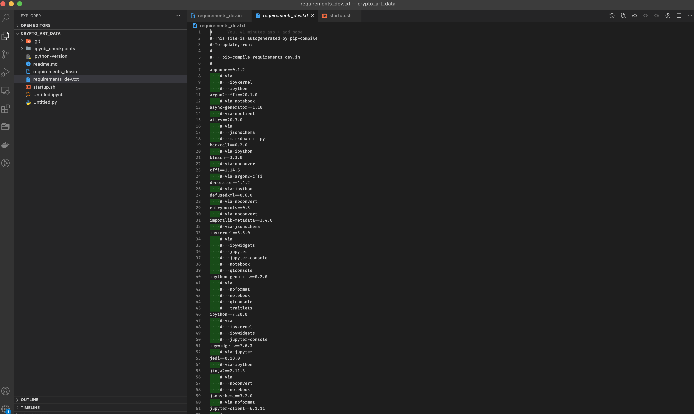
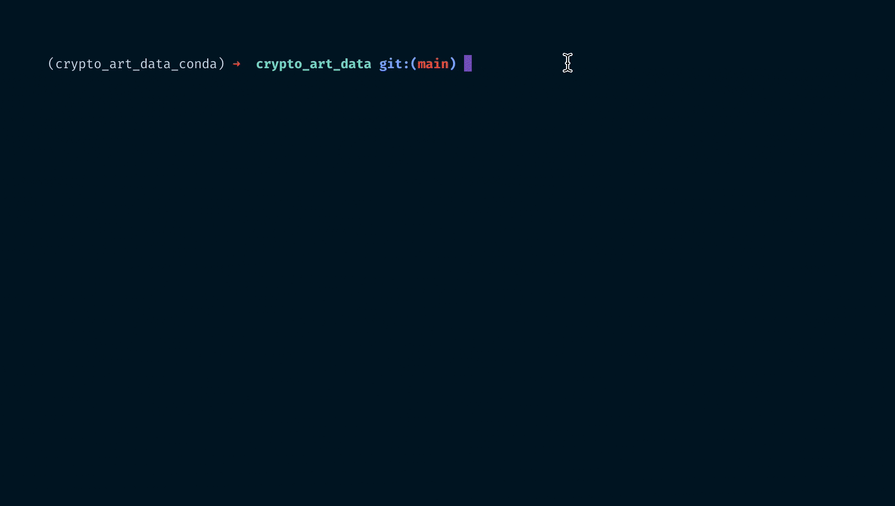
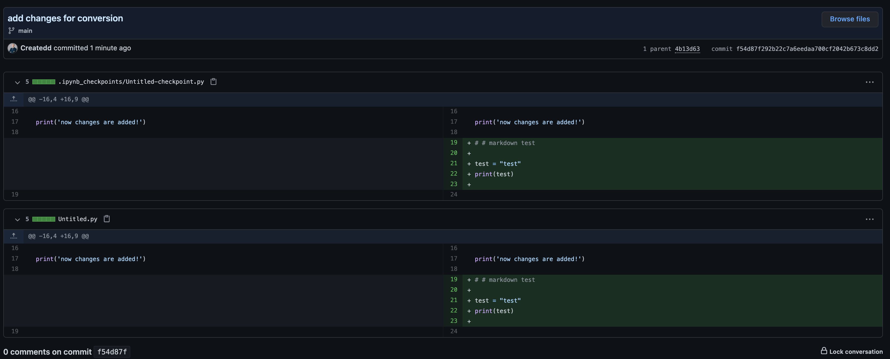

# How to start a data science project boilerplate in 2021?


*AI created Art by Author. More examples on https://www.instagram.com/art_and_ai/; inspired by Shannon Potter https://unsplash.com/photos/bHlZX1D4I8g*

# Table of Contents

- [How to start a data science project boilerplate in 2021?](#how-to-start-a-data-science-project-boilerplate-in-2021)
- [Table of Contents](#table-of-contents)
- [Why](#why)
- [1. Create project formalities](#1-create-project-formalities)
- [2. Dependency Management](#2-dependency-management)
  - [Install dependencies in a better way](#install-dependencies-in-a-better-way)
  - [Bundle in single startup script](#bundle-in-single-startup-script)
- [3. Tracking jupyter notebook changes properly](#3-tracking-jupyter-notebook-changes-properly)
  - [Convert to python files](#convert-to-python-files)
  - [Install githook for jupytext](#install-githook-for-jupytext)
- [Disclaimer](#disclaimer)
- [About](#about)


# Why

Every data science project I start has its different outcomes, but the start is always the same. In this article I want to show three steps how I prepare a data science project. It covers the main areas of
- dealing with a virtual environment
- managing dependencies and
- tracking jupyter notebook changes properly

I want to cover those aspects as I did not find a proper boilerplate that does this for me. I am aware of the cookiecutter project. However, I am not looking for a folder structure, because this can easily be adapted. I am looking for automated  steps that ensure me to keep a proper standard during development.

The bare boilerplate setup is available on:
 :arrow_forward:  https://github.com/Createdd/data_science_boilerplate

It is focused on developing a proof of concept within jupyter notebook and not production. If you would like a production setup as well let me know.

# 1. Create project formalities

The local setup steps. I use a Conda environment and Git + Github. And do it along these steps:

1. Create a local folder `mkdir NAME`
2. Create a new repository on Github with `NAME`
3. Create conda environment `conda create --name NAME python=3.7`
4. Register new environment in jupyter `ipython kernel install --name NAME--user`
5. Activate conda environment `conda activate PATH_TO_ENVIRONMENT`
6. Create git repo `git init`
7. Connect to Github repo. Add Readme file, commit it and

```sh
git remote add origin URL_TO_GIT_REPO
git branch -M main
git push -u origin main
```

# 2. Dependency Management

I develop for quite a while in Python and still improve the dependency managment setup. This is how I currently do it.

Pip doesn't provide its own proper dependency management, as
- requirements file with pip freeze provide no structure
- installed versions are not pinnend, which leads to different installs every single time
- there is no dependency resolution


There are helpful additional libraries:

- [pipdeptree](https://github.com/naiquevin/pipdeptree) which allows to show dependencies in a hierarchie view
- [pip-tools](https://github.com/jazzband/pip-tool) which allows to pin dependencies


## Install dependencies in a better way


I use an automated workflow in regards of dependency listing and compiling.

- `pip-compile` will update the requirements file with pinned sub-dependencies and create the requirements file.

Therefore we need to install the library with

```sh
python -m pip install pip-tools
```

To use it, instead of writing the conventional `pip install jupyter jupytext`,

we create an `requirements_dev.in` file by

```sh
touch requirements_dev.in
```

Then we open this file and add the libaries we want to add. We will follow this style in the whole repository!

Let's start with dependencies
- jupyter notebook
- jupytext (for conversion of .ipynb files)
- pipdeptree (for showing dependency tree)
- when-changed (watcher for compiling and installing packages)


Then run

```sh
pip-compile requirements_dev.in
pip install -r requirements_dev.txt
```

This generates a nice `requirements_dev.txt` file with nice formatting, and then installs everything



So every time we added a library we need to run the compile command. This is a step that can be automated as well.

We will use the [when-changed](https://github.com/joh/when-changed) library. As we have it installed with the previous list. We now can do the following:

```sh
when-changed requirements_dev.in pip-compile requirements_dev.in;pip install -r requirements_dev.txt
```

Now, everytime you add a package and save it to the `.in` file the compile and install command is triggered.

## Bundle in single startup script

Having an own terminal window for jupyter notebook and the change watcher can be annoying. One solution is to bundle the commands in an own bash script.

```sh
touch startup.sh
```

Then insert the executing commands, like

```sh
#!/bin/bash

jupyter notebook &
when-changed requirements_dev.in pip-compile requirements_dev.in;pip install -r requirements_dev.txt
```

Then make the file executable (on mac) and start the script.

```sh
chmod +x startup.sht
```

```sh
bash startup.sh
```

Now both commands run parallel in the same terminal window.



# 3. Tracking jupyter notebook changes properly

## Convert to python files

We will use jupytext to convert the `.ipynb` files into `.py` files. This allows proper tracking of changes in Git.

We have already installed the package in the previous steps. Now we simply need to add a githook to automatically do the conversion.


## Install githook for jupytext


set a hook in  `.git/hooks/pre-commit` for tracking the notebook changes in git properly:

```sh
touch .git/hooks/pre-commit
code  .git/hooks/pre-commit
```

copy this in the file
```sh
#!/bin/sh
# For every ipynb file in the git index, add a Python representation
jupytext --from ipynb --to py:light --pre-commit
```

afterward for making the hook executable (on mac)
```sh
chmod +x .git/hooks/pre-commit
```

Now, before commiting changes of a jupyter notebook the file is converted to a python file and the changes will be reflected beautifully as it should be:



---


The bare boilerplate setup is available on:
 :arrow_forward:  https://github.com/Createdd/data_science_boilerplate

---

# Disclaimer

I am not associated with any of the services I use in this article.

I do not consider myself an expert. I am not a blogger or something. I merely document workflows. Therefore the content does not represent the quality of any of my work, nor does it fully reflect my view on things.

I am always happy for constructive input and how to improve.

This was written on **20.02.2021**.
I cannot monitor all of my articles. There is a high probability that when you read this article after time has past, the tips are outdated and the processes have changed.

---

# About

Daniel is an artist, entrepreneur, software developer, and business law graduate. He has worked at various IT companies, tax advisory, management consulting, and at the Austrian court.

His knowledge and interests currently revolve around programming machine learning applications and all their related aspects. To the core, he considers himself a problem solver of complex environments, which is reflected in his various projects.

Don't hesitate to get in touch if you have ideas, projects, or problems.


You can support me on https://www.buymeacoffee.com/createdd or with crypto https://etherdonation.com/d?to=0xC36b01231a8F857B8751431c8011b09130ef92eC


**Connect on:**

- [Allmylinks](https://allmylinks.com/createdd)

Direct:
- [LinkedIn](https://www.linkedin.com/in/createdd)
- [Github](https://github.com/Createdd)
- [Medium](https://medium.com/@createdd)
- [Twitter](https://twitter.com/_createdd)
- [Instagram](https://www.instagram.com/create.dd/)
- [createdd.com](https://www.createdd.com/)

Art-related:
- [Medium/the-art-of-art](https://medium.com/the-art-of-art)
- [Instagram/art_and_ai](https://www.instagram.com/art_and_ai/)
- [Rarible](https://app.rarible.com/createdd/collectibles)
- [Open Sea](https://opensea.io/accounts/createdd?ref=0xc36b01231a8f857b8751431c8011b09130ef92ec)
- [Known Origin](https://knownorigin.io/profile/0xC36b01231a8F857B8751431c8011b09130ef92eC)
- [Devian Art](https://www.deviantart.com/createdd1010/)

<!-- Written by Daniel Deutsch -->