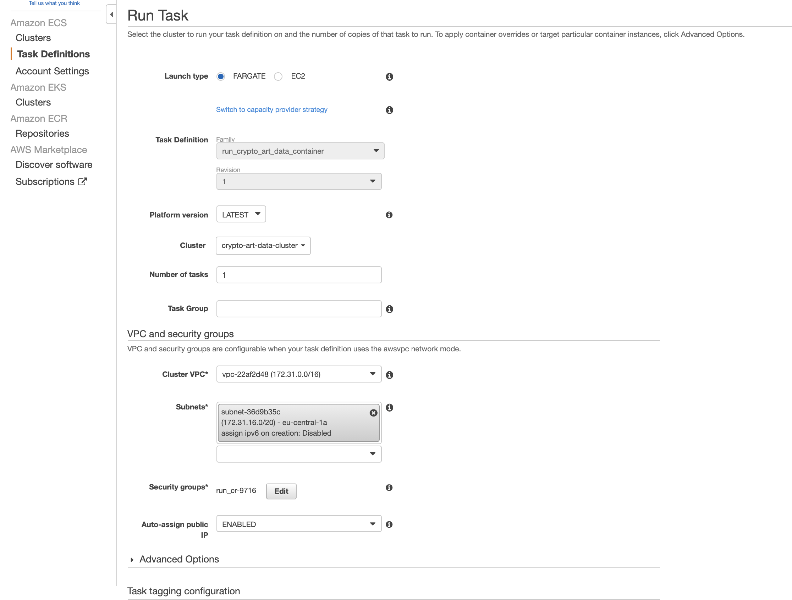
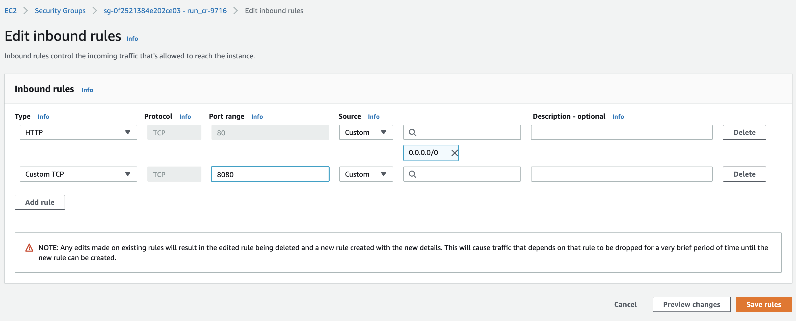

# Deploy your Python app with AWS Fargate


*AI created art by Author. More examples on https://www.instagram.com/art_and_ai/; inspired by Jakob Owens https://unsplash.com/photos/1HFzTWbWA-A

# Table of Contents

- [Deploy your Python app with AWS Fargate](#deploy-your-python-app-with-aws-fargate)
- [Table of Contents](#table-of-contents)
- [About this article](#about-this-article)
- [What AWS infrastructure type should I use](#what-aws-infrastructure-type-should-i-use)
- [AWS account](#aws-account)
- [Set up AWS credentials](#set-up-aws-credentials)
    - [AWS credentials](#aws-credentials)
      - [Set up credentials with users and roles in IAM](#set-up-credentials-with-users-and-roles-in-iam)
      - [Add credentials in your project](#add-credentials-in-your-project)
- [Create a Repository in Elastic Container Registry (ECR)](#create-a-repository-in-elastic-container-registry-ecr)
- [Configure a cluster](#configure-a-cluster)
- [Create task to run Docker container in AWS](#create-task-to-run-docker-container-in-aws)
- [Execute Task](#execute-task)
- [Expose defined port within webpage](#expose-defined-port-within-webpage)
- [Watch your app online](#watch-your-app-online)
- [Bonus: Investigate Errors](#bonus-investigate-errors)
- [Disclaimer](#disclaimer)
- [About](#about)

# About this article

In this article I will go over the steps to launch a sample web app within AWS.
In my last articles, I talked about creating an own web app with python and also how to deploy it with AWS Lambda:

- [Develop and sell a machine learning app](https://towardsdatascience.com/develop-and-sell-a-machine-learning-app-from-start-to-end-tutorial-ed5b5a2b6b2b)
- [Develop and sell a python app](https://towardsdatascience.com/develop-and-sell-a-python-api-from-start-to-end-tutorial-9a038e433966)

Now I want to test out another infrastructure type. This article assumes that you are familiar with building and containerizing a web app. In a python setting I always use Flask and Docker (see previous articles). However, this article focuses on the "devops" perspective of deploying such an app. There are still more aspects that I will cover in following articles, like setting up a proper domain name and use additional services like load balancing.

I use AWS because I already got into it in my last projects and find it well documented and intuitive to handle even though there are so many options to choose from.

As you can see from the table of contens the main parts of this article will be:
- set up and connect local development with AWS credentials
- create a repository in an Elastic Container Registry (AWS ECR)
- create cluster and task to run a docker container in the cloud


# What AWS infrastructure type should I use

Here is a fantastic article I want to recommend: https://medium.com/thundra/getting-it-right-between-ec2-fargate-and-lambda-bb42220b8c79

He summarized it perfectly in my opinion. So what I want is to deploy my container, but do not want to get any deeper into the infrastructure.  That's why I go with AWS Fargate.

# AWS account


First you need to create a AWS account. They will guide you through the process and there are no difficulties to be expected.


# Set up AWS credentials

### AWS credentials

First, you need te get an AWS `access key id` and `access key`


#### Set up credentials with users and roles in IAM

I break it down as simple as possible:

1.  Create a user
2.  Back at the IAM Dashboard, create a new user with the "Users" left-hand menu option and the "Add User" button.
3.  In the Add user screen, give your new user a name and select the Access Type for Programmatic access. Then click the "Next: Permissions" button.
4.  In the Set permissions screen, select the the permission for AmazonEC2ContainerRegistryReadOnly, AmazonEC2ContainerRegistryFullAccess, AmazonEC2ContainerRegistryPowerUser.
5.  Tags are optional. Add tags if you want, then click "Next: Review".
6.  Review the user details and click "Create user"
7.  Copy the user's keys
8.  Don't close the AWS IAM window yet. In the next step, you will copy and paste these keys into a file. At this point, it's not a bad idea to copy and save these keys into a text file in a secure location. Make sure you don't save keys under version control.


#### Add credentials in your project

Create a `.aws/credentials` folder in your root with

```sh
mkdir ~/.aws
code ~/.aws/credentials
```
and paste your credentials from AWS
```py
[dev]
aws_access_key_id = YOUR_KEY
aws_secret_access_key = YOUR_KEY
```
Same with the `config`
```sh
code ~/.aws/config
```

```py
[default]
region = YOUR_REGION (eg. eu-central-1)
```

Note that `code` is for opening a folder with vscode, my editor of choice.


Save the AWS access key id and secret access key assigned to the User you created in the file ~/.aws/credentials. Note the .aws/ directory needs to be in your home directory and the credentials file has no file extension.


# Create a Repository in Elastic Container Registry (ECR)


Search for ECR and then you will get to the page where you can create your new repository.


Afterward you have your new repo visible:


Next we want to get the push commands:


Just follow those instructions to set up your local repo for the AWS connection. Be aware that you are in the root of your project so everything works out smoothly.

Make sure that you have installed the AWS CLI or just follow the installing according to the [official docs](https://docs.aws.amazon.com/cli/latest/userguide/install-macos.html).

If you have problems here, just google the error message. Often there is an issue with policies and your user. This SO question helped me: https://stackoverflow.com/questions/38587325/aws-ecr-getauthorizationtoken


After executing the push commands you will have the image online:


# Configure a cluster

<!-- First, go to your IAM section. Create a new role for EKS-Fargate pod.

 -->


Next, go to "clusters" (under Amazon ECS not EKS!) in the menu.

- Choose "Network only" template
- add a name
- create


In this section I sometimes got buggy error messages. If this happens to you you can simply re-create the cluster. If everything is set up correctly it should work.

# Create task to run Docker container in AWS


Go to "task definitions" and create a new task with Fargate compatibility.


then
- add a name
- specify task size (I use the smallest options)
- add container


- add the name of your container
- copy the image address you got from the CLI command where the image is pushed
- add the exposed port (specified in your Dockerfile)


Then create the task


Now you should have defined a task within Fargate and connected your container.

# Execute Task

Now you can run your defined task:


Select Fargate as lunch type and add the provided dropdown options within the form (cluster VPC and subnets)



Afterward you can run the task and it should work like:


# Expose defined port within webpage

As we defined a specific port we now need to expose it through the security tab.

- Click your defined task
- Click on ENI Id to get to the network interface
- click on your network ID
- go to "security groups"
- add your port as custom tcp in inbound rules





# Watch your app online

In the task tab you will see your public IP displayed. Simply navigate to the page with the corresponding port and you will see your website


The IP address shown in the screenshot is not working anymore to avoid AWS costs. However, this article is part of a larger project, which I will launch under www.shouldibuycryptoart.com. The app is under development. If you wish to follow its development feel free to reach out to me.


# Bonus: Investigate Errors

Due to some specific flags I run on my local container development I get some errors for specific functions within my app.

In your task overview under containers you can check the logs in cloudwatch. click on the link and it shows you why your app crashes:


Now you can debug your app.

Happy coding!


# Disclaimer

I am not associated with any of the services I use in this article.

I do not consider myself an expert. I merely document things besides doing other things. Therefore the content does not represent the quality of any of my professional work, nor does it fully reflect my view on things. If you have the feeling that I am missing important steps or neglected something, consider pointing it out in the comment section or get in touch with me.

This was written on **6.3.2021**.
I cannot monitor all of my articles. There is a high probability that when you read this article the tips are outdated and the processes have changed.

I am always happy for constructive input and how to improve.


---

# About

Daniel is an artist, entrepreneur, software developer, and business law graduate. His knowledge and interests currently revolve around programming machine learning applications and all their related aspects. To the core, he considers himself a problem solver of complex environments, which is reflected in his various projects.


You can support me on https://www.buymeacoffee.com/createdd or with crypto https://etherdonation.com/d?to=0xC36b01231a8F857B8751431c8011b09130ef92eC


**Connect on:**

- [Allmylinks](https://allmylinks.com/createdd)

Direct:
- [LinkedIn](https://www.linkedin.com/in/createdd)
- [Github](https://github.com/Createdd)
- [Medium](https://medium.com/@createdd)
- [Twitter](https://twitter.com/_createdd)
- [Instagram](https://www.instagram.com/create.dd/)
- [createdd.com](https://www.createdd.com/)

Art-related:
- [Medium/the-art-of-art](https://medium.com/the-art-of-art)
- [Instagram/art_and_ai](https://www.instagram.com/art_and_ai/)
- [Rarible](https://app.rarible.com/createdd/collectibles)
- [Open Sea](https://opensea.io/accounts/createdd?ref=0xc36b01231a8f857b8751431c8011b09130ef92ec)
- [Known Origin](https://knownorigin.io/profile/0xC36b01231a8F857B8751431c8011b09130ef92eC)
- [Devian Art](https://www.deviantart.com/createdd1010/)

<!-- Written by Daniel Deutsch -->