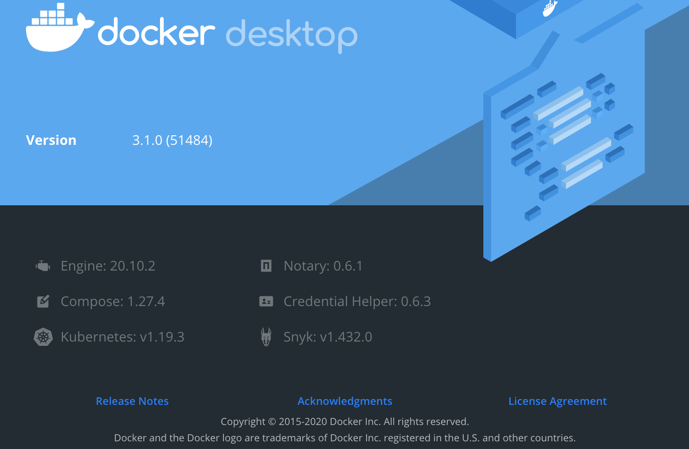
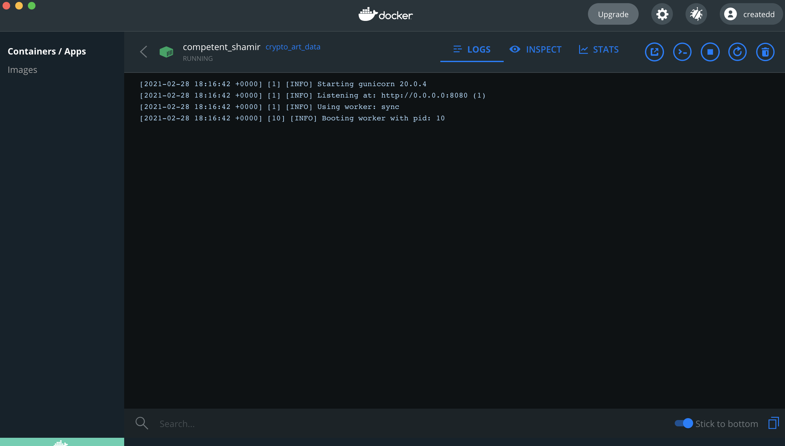

# Deploy your webscraping with Docker


*Source: AI created Art by Author. More examples on https://www.instagram.com/art_and_ai/; inspired by Lina Silivanova https://unsplash.com/photos/9wLq0zC_sOE*

# Table of Contents

- [Deploy your webscraping with Docker](#deploy-your-webscraping-with-docker)
- [Table of Contents](#table-of-contents)
- [Why dockerizing your scraper](#why-dockerizing-your-scraper)
- [Versions](#versions)
- [Scraping sample](#scraping-sample)
  - [Flask file](#flask-file)
  - [Scraping script](#scraping-script)
  - [Dockerfile](#dockerfile)
- [Run everything](#run-everything)
- [Summarizing and problem related links](#summarizing-and-problem-related-links)
  - [Stackoverflow links for detailed research](#stackoverflow-links-for-detailed-research)
- [Disclaimer](#disclaimer)
- [About](#about)


# Why dockerizing your scraper

Webscraping is one of the most often used methods to get data for further analysis. Lately, I used it as well and realized that there are various issues when containerizing (ie using Docker) your scraping function. However, as you need to deploy your webscraping when you need the most recent data, you will face different issues. I want to summarize my solution to save everyone the time of endless hours of online research.

I am using:
- Python
- Conda environment
- Pip for installing
- Docker for building images and containers
- Selenium and the chromebrowser for web scraping

# Versions

This works with the following versions:



- Python 3.7
- selenium==3.141.0
- gunicorn==20.0.4
- flask==1.1.2

# Scraping sample

I will first show the file and explain afterwards why I chose the setup like this.

## Flask file

```py
from flask import Flask

URL = 'https://google.com/'

app = Flask(__name__)


@app.route('/')
def home():
    result = scrape_site(URL)

    return result

if __name__ == '__main__':
    app.run(debug=False)
```

## Scraping script

```py
def scrape_site(SAMPLE_URL):
    options = webdriver.ChromeOptions()
    options.headless = True
    options.add_argument("window-size=1920x1080")
    options.add_argument('--no-sandbox')
    options.add_argument('--disable-gpu')
    # options.add_argument('--disable-dev-shm-usage') # Not used but can be an option
    driver = webdriver.Chrome(options=options)

    driver.get(SAMPLE_URL)


    time.sleep(5)


    for t in range(10):
        driver.find_element_by_tag_name('body').send_keys(Keys.PAGE_DOWN)

    for t in range(10):
        time.sleep(1)
        driver.find_element_by_css_selector('.additional_data').click()

    src = driver.page_source
    parser = BeautifulSoup(src, "html.parser")

    driver.close()

    return src, parser
```

First of all we define various driver options. We want to have it headless when we run it in the cloud. Yet we need the other flags as well to avoid multiple issues concerning
- not finding elements
- having startup issues
- having tab crashing issues

The argument '--disable-dev-shm-usage' is a workable option, but I solve it differently in this siutation, namely by adding the flags "-v /dev/shm:/dev/shm --shm-size=2gb" when calling `docker run`. (Details below)


## Dockerfile

```sh
FROM python:3.7

ENV PYTHONDONTWRITEBYTECODE=1
ENV PYTHONUNBUFFERED=1

ENV FLASK_APP=app.py
ENV FLASK_ENV=development

# install system dependencies
RUN apt-get update \
    && apt-get -y install gcc make \
    && rm -rf /var/lib/apt/lists/*s


# install google chrome
RUN wget -q -O - https://dl-ssl.google.com/linux/linux_signing_key.pub | apt-key add -
RUN sh -c 'echo "deb [arch=amd64] http://dl.google.com/linux/chrome/deb/ stable main" >> /etc/apt/sources.list.d/google-chrome.list'
RUN apt-get -y update
RUN apt-get install -y google-chrome-stable

# install chromedriver
RUN apt-get install -yqq unzip
RUN wget -O /tmp/chromedriver.zip http://chromedriver.storage.googleapis.com/`curl -sS chromedriver.storage.googleapis.com/LATEST_RELEASE`/chromedriver_linux64.zip
RUN unzip /tmp/chromedriver.zip chromedriver -d /usr/local/bin/

RUN python3 --version
RUN pip3 --version

RUN pip install --no-cache-dir --upgrade pip

WORKDIR /app

COPY ./requirements.txt /app/requirements.txt

RUN pip3 install --no-cache-dir -r requirements.txt

COPY . .

EXPOSE 8080

CMD ["gunicorn", "--bind", "0.0.0.0:8080","--timeout", "90", "app:app"]
```

When you scrape larger sites or data you might run into a **timeout error**. That's why we add the '"--timeout", "90"' flag in the Dockerfile CMD section.


# Run everything

```sh
docker build -t YOUR_IMAGE_NAME .
```

```sh
docker run -v /dev/shm:/dev/shm --shm-size=2gb -d -p 80:8080 YOUR_IMAGE_NAME
```

Then go to your localhost and check what the response is.

You can inspect your progress in the Docker Dashboard:



When you have followed all the previous steps your containerized webscraper with flask should work.

# Summarizing and problem related links

To summarize the problems I faced issues related to
- not having the chrome driver (that's why we need to install it separately within the Dockerfile)
- startup and scraping issues (that's why we add several chromedriver options)
- certain elements are not found. most of the time those are loading issues (that's why we add time.sleep() during the scraping)
- too small shared memory (That's we we use the shm related flags)


## Stackoverflow links for detailed research

- https://stackoverflow.com/questions/45323271/how-to-run-selenium-with-chrome-in-docker
- https://stackoverflow.com/questions/53902507/unknown-error-session-deleted-because-of-page-crash-from-unknown-error-cannot
- https://stackoverflow.com/questions/10855197/gunicorn-worker-timeout-error


# Disclaimer

I am not associated with any of the services I use in this article.

I do not consider myself an expert. I merely document things besides doing other things. Therefore the content does not represent the quality of any of my professional work, nor does it fully reflect my view on things. If you have the feeling that I am missing important steps or neglected something, consider pointing it out in the comment section or get in touch with me.

This was written on **28.02.2021**.
I cannot monitor all of my articles. There is a high probability that when you read this article the tips are outdated and the processes have changed.

I am always happy for constructive input and how to improve.

---

# About

Daniel is an artist, entrepreneur, software developer, and business law graduate. His knowledge and interests currently revolve around programming machine learning applications and all their related aspects. To the core, he considers himself a problem solver of complex environments, which is reflected in his various projects.


You can support me on https://www.buymeacoffee.com/createdd or with crypto https://etherdonation.com/d?to=0xC36b01231a8F857B8751431c8011b09130ef92eC


**Connect on:**

- [Allmylinks](https://allmylinks.com/createdd)

Direct:
- [LinkedIn](https://www.linkedin.com/in/createdd)
- [Github](https://github.com/Createdd)
- [Medium](https://medium.com/@createdd)
- [Twitter](https://twitter.com/_createdd)
- [Instagram](https://www.instagram.com/create.dd/)
- [createdd.com](https://www.createdd.com/)

Art-related:
- [Medium/the-art-of-art](https://medium.com/the-art-of-art)
- [Instagram/art_and_ai](https://www.instagram.com/art_and_ai/)
- [Rarible](https://app.rarible.com/createdd/collectibles)
- [Open Sea](https://opensea.io/accounts/createdd?ref=0xc36b01231a8f857b8751431c8011b09130ef92ec)
- [Known Origin](https://knownorigin.io/profile/0xC36b01231a8F857B8751431c8011b09130ef92eC)
- [Devian Art](https://www.deviantart.com/createdd1010/)

<!-- Written by Daniel Deutsch -->