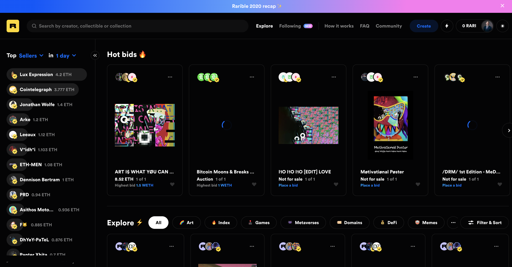
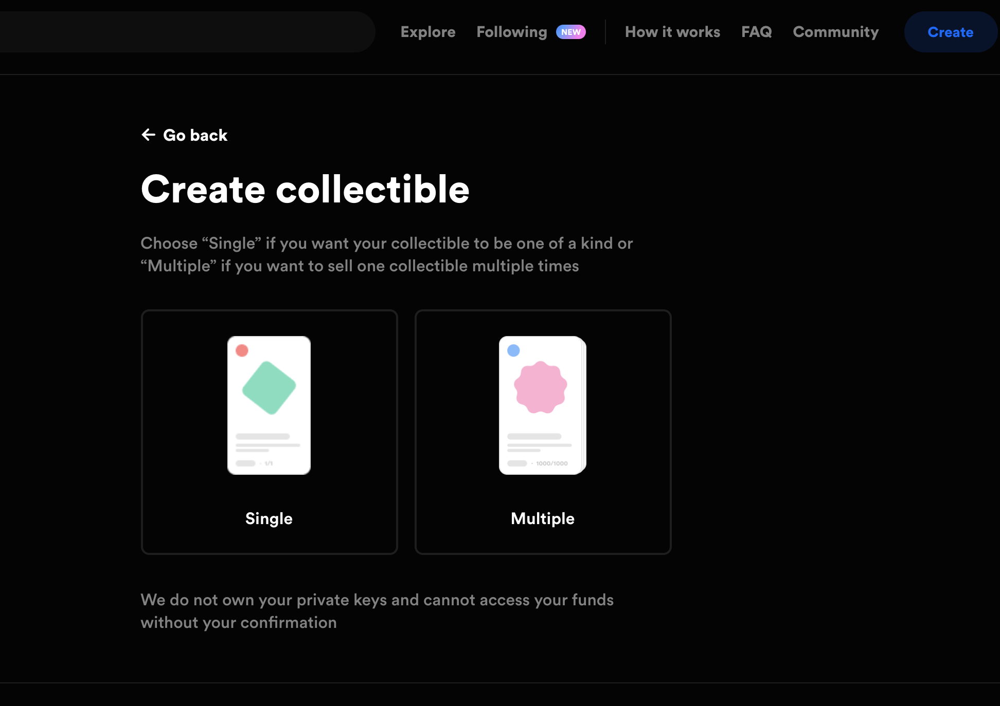
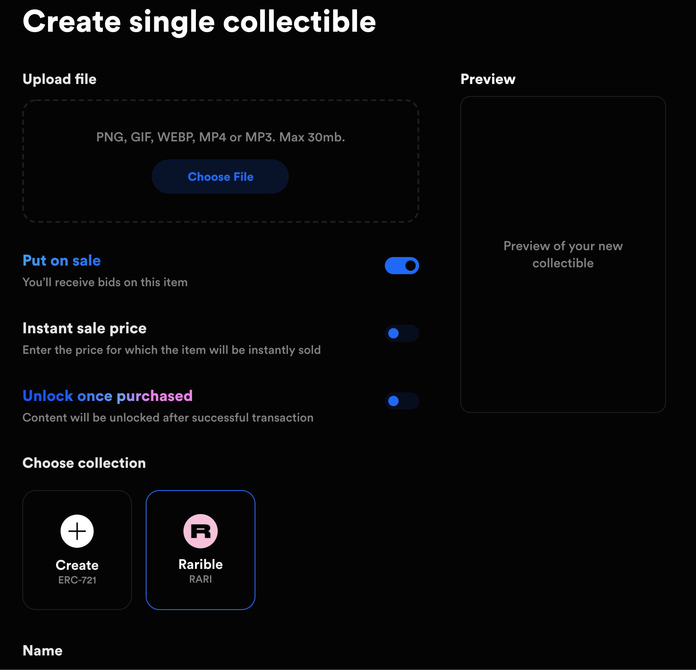
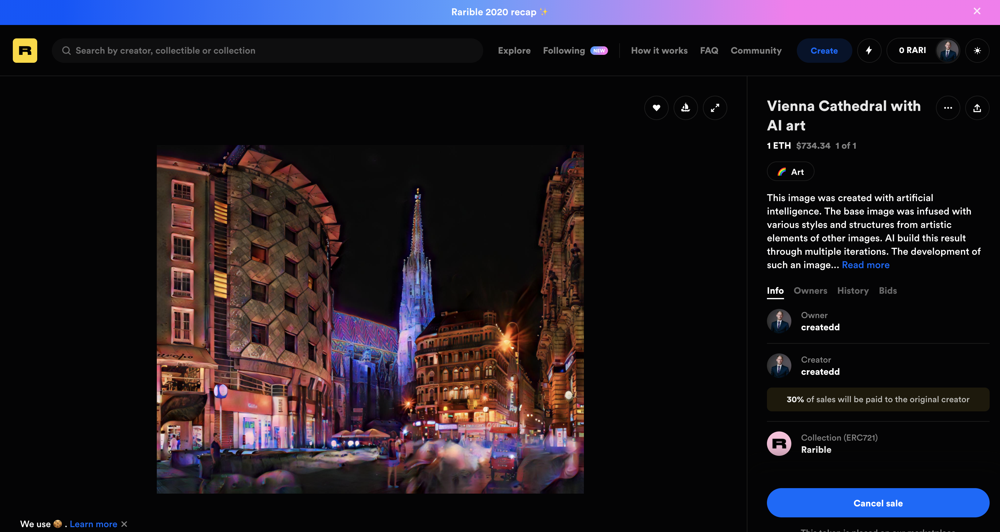

# Make money with Crypto Art - A starter

*Source: Photo by Alexander Schimmeck on Unsplash - https://unsplash.com/photos/ineC_oi7NHs*

## Table of Contents

- [Make money with Crypto Art - A starter](#make-money-with-crypto-art---a-starter)
  - [Table of Contents](#table-of-contents)
  - [Disclaimer](#disclaimer)
  - [Crypto is hot and crazy?](#crypto-is-hot-and-crazy)
  - [1. Be an artist](#1-be-an-artist)
  - [2. Get a wallet for your crypto currency](#2-get-a-wallet-for-your-crypto-currency)
  - [3. Send some money to your wallet](#3-send-some-money-to-your-wallet)
  - [4. Choose an art platform to sell](#4-choose-an-art-platform-to-sell)
  - [5. Set up on the platform (Here: Rarible.com)](#5-set-up-on-the-platform-here-rariblecom)
    - [Mintbase](#mintbase)
  - [Further Reading](#further-reading)
  - [About](#about)

## Disclaimer

This is NOT financial advice in any sense. I reference multiple other articles. Go and do your own research before investing your money. I describe my experiences within the industry and it shall inspire you to experiment on your own.

I am not associated with any of the services I use in this article.

I do not consider myself an expert. I am not a blogger or something. I merely document things beside doing other things. Therefore the content does not represent the quality of any of my work, nor does it fully reflect my view on things. If you have the feeling that I am missing important steps or neglected something, consider pointing it out in the comment section or get in touch with me.

I am always happy for constructive input and how to improve.

This was written on **1.1.2021**.
I cannot monitor all of my articles. There is a high probability that when you read this article the tips are outdated and the processes have changed.

If you need more information on certain parts, feel free to point it out in the comments.

## Crypto is hot and crazy?

Currently the value of cryptocurrency is rising. The crypto world has its own community and for sure has its own rules on how things are sold.

Things like [selling tweets](https://www.artnome.com/news/2020/12/21/i-made-300-selling-my-tweets-as-art), [selling memes](https://archetype.mx/) or [selling a pixel for 15000 USD](https://test.steemfiles.com/nft/@stellabelle/my-latest-nft-alpha-tears-just-dropped-on-nft-showroom) are just some examples on what is possible with new technology.

I do not consider myself an expert in neither blockchain technology nor art. However I conider myself an opportunity driven entrepreneur that is why I checked it out. In the following lines I want to show how easy it is to get started in this hot industry and how you can make some money.

Of course, as in everything art related, it still depends a lot on you as artist (how you market and sell your craft) if you will be recognized and successful. However, I encourage everyone to at least try those new platforms arising from the blockchain technology.

## 1. Be an artist

This can be hard and simple at the same time. It is simple because everyone can be an artist, however, it can be hard to define yourself and the type of art that you create by selling it.

There are many great artists that nobody knows about because they cannot market and sell themselves.

In my case I create art with AI. I have worked a lot of time refining the processes and the algorithms to create unique images. [Here is a primer on how I do it](https://medium.com/the-art-of-art/how-ai-creates-art-with-neural-style-transfer-an-example-b350dc933fe8)

## 2. Get a wallet for your crypto currency

Again I am not an expert. I chose the most easy and straight forward way to get the job done.

I use the [metamask plugin for the chrome browser](https://metamask.io/).
Here is an [official tutorial](https://metamask.zendesk.com/hc/en-us/articles/360015489531-Getting-Started-With-MetaMask-Part-1-) that shows how easy it is to set it up.

## 3. Send some money to your wallet

As blockchain transactions cost money, you would need get some crypto currency first.

A friend of mine sent me some Ether from the Etherium blockchain.
Check out [this guide](https://medium.com/verasity/how-to-transfer-ethereum-to-metamask-wallet-security-67ff0a415c88) on how to get some Ether to your metamask wallet.

If you want a more detailed guide on how you can send some money to your wallet, check out [this one](https://medium.com/@mark.lasia/how-to-buy-eth-metamask-bc52076a67ff).

## 4. Choose an art platform to sell

There are many platforms. Many of them are already overrun and you would have to apply and they need to accept you as an artist.
Easy to start with are Rarible or Mintbase.

Rarible is super easy. You basically only need to create an account (connect your wallet) and upload your art.

Check out this small [article](https://coincodex.com/article/6324/introduction-to-crypto-art-and-5-popular-brokers-that-will-sell-your-digital-creations/) on other platforms to sell your art.

## 5. Set up on the platform (Here: Rarible.com)

First you need to connect your wallet via the chrome metamask plugin. After that you will come to the market place.

On top you will find "create", to create a single piece or a collection on the rarible platform.

Afterwards, you have to upload your art and put in detials (like price, description, etc):

Then simply pay the transaction fee via metamask (window will pop up), and you already have an item on rarible:

https://app.rarible.com/token/0x60f80121c31a0d46b5279700f9df786054aa5ee5:86740:0xc36b01231a8f857b8751431c8011b09130ef92ec

And that's it. That's how fast you can sell your art online via rarible. I was amazed how easy and fast it is.

One note though: Currently the Ether "gas fees" (transaction fees) are quite high. Those fees are dependent on the current value of ETH and the processing time. Those are the only costs that arise when you provide your art on a blockchain platform.

### Mintbase

Originally I wanted to write about the Mintbase platform.
Unfortunately, at the time of writing, there were always some issues with their homepage. The interactions were at various points buggy and I was not even able to create a market.

On this platform you can mint your own tokens, create (smart) contracts and create own markets. It seems quite interesting.

Maybe it works for you. Here are some starters to get going on their platform:

This youtube video was also helpful for me: https://www.youtube.com/watch?v=j-f9bs86t_U&ab_channel=NateGeier

Here is a [small tutorial](https://medium.com/mintbase/selling-music-art-with-hidden-files-312c5ca4da5f) you can also check out.

## Further Reading

- https://hazmus.medium.com/one-way-to-become-a-cryptoartist-4b3217b60369
- [The Complacency of Crypto Art
](https://powerdada.medium.com/the-complacency-of-crypto-art-b7d026546e8a)
- [Selling Tweets](https://www.artnome.com/news/2020/12/21/i-made-300-selling-my-tweets-as-art)
- https://fivethirtyeight.com/features/blockchain-is-just-another-way-make-art-all-about-money/

---

## About

Daniel is an artist, entrepreneur, software developer, and business law graduate. He has worked at various IT companies, tax advisory, management consulting, and at the Austrian court.

His knowledge and interests currently revolve around programming machine learning applications and all their related aspects. To the core, he considers himself a problem solver of complex environments, which is reflected in his various projects.

Don't hesitate to get in touch if you have ideas, projects, or problems.

You can support me on https://www.buymeacoffee.com/createdd or with crypto https://etherdonation.com/d?to=0xC36b01231a8F857B8751431c8011b09130ef92eC

**Connect on:**
- [LinkedIn](https://www.linkedin.com/in/createdd)
- [Github](https://github.com/Createdd)
- [Medium](https://medium.com/@createdd)
- [Twitter](https://twitter.com/_createdd)
- [Instagram](https://www.instagram.com/create.dd/)
- [createdd.com](https://www.createdd.com/)

Art-related:
- [Medium/the-art-of-art](https://medium.com/the-art-of-art)
- [Instagram/art_and_ai](https://www.instagram.com/art_and_ai/)
- [Open Sea](https://opensea.io/accounts/createdd )
- [Known Origin](https://knownorigin.io/profile/0xC36b01231a8F857B8751431c8011b09130ef92eC)
- [Rarible](https://app.rarible.com/createdd/collectibles)
- [Devian Art](https://www.deviantart.com/createdd1010/)

<!-- Written by Daniel Deutsch -->