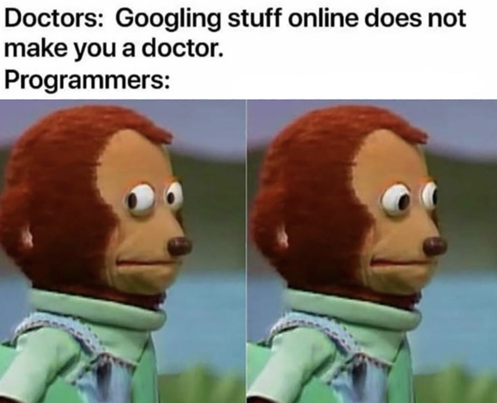
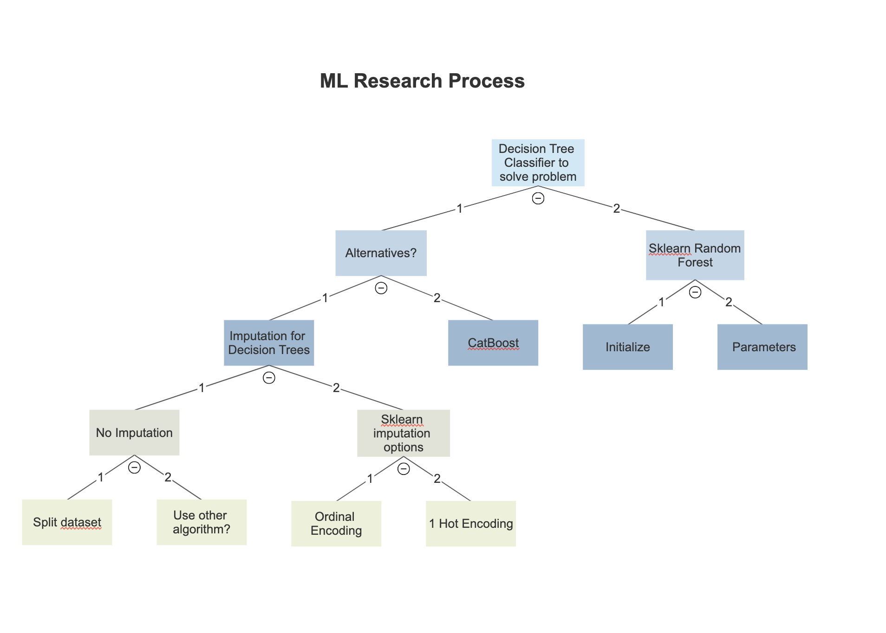
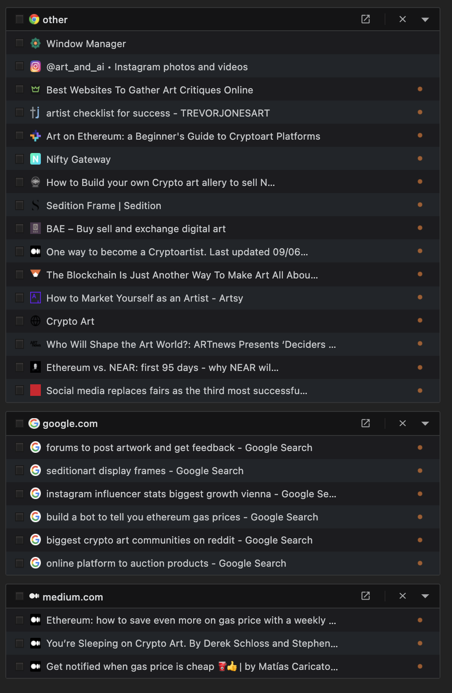
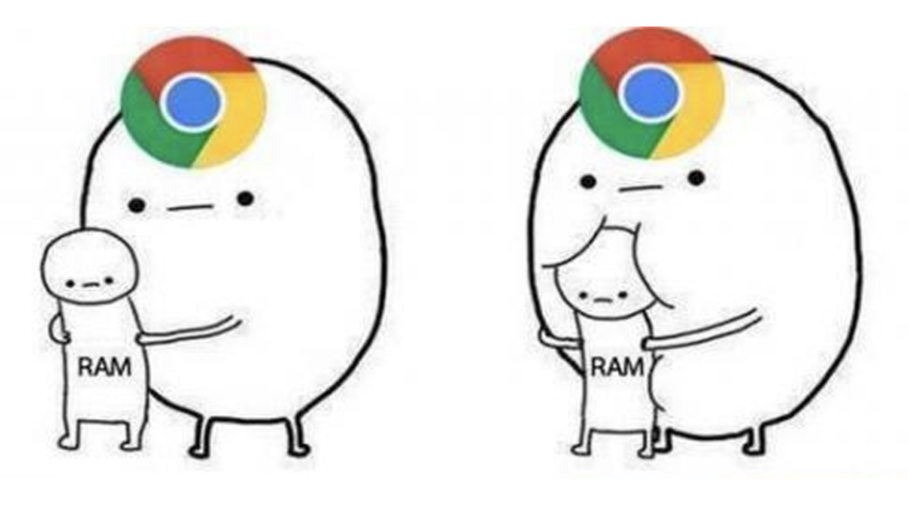
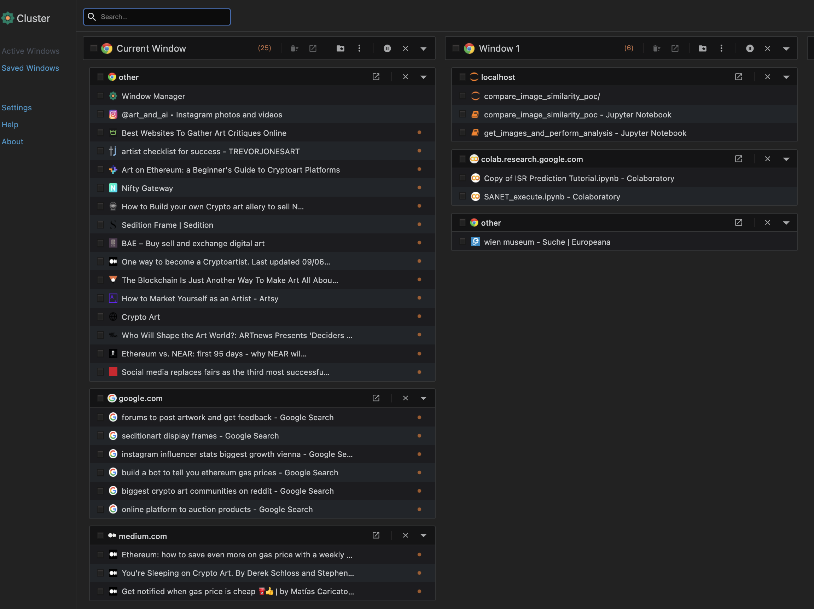
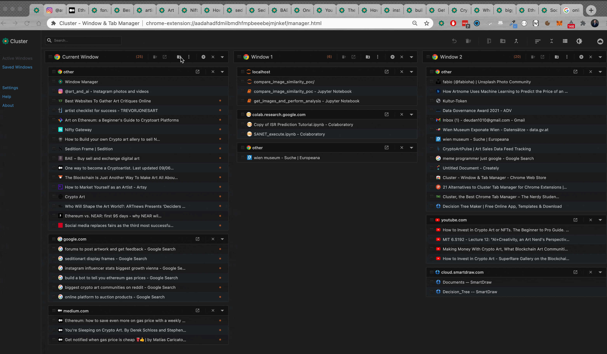

# The most effective but hidden productivity tool for a data scientist

*AI created Art. More examples on https://www.instagram.com/art_and_ai/*

I am have been working as a developer for quite some time now. In nearly all positions and specializations there are discussion on what are the best tools to use. It goes with software tools like IDEs (VSCode, Webstorm, Vim, etc), or hardware tools (mac, pc, linux). It is always nice to discuss, however at the end everyone discovers his own style that fits his workflow best. As everyone does some things a little different this makes perfect sense. There is one tool that I had never discussed so far but helped me enormously at my work.

## Table of Contents

  - [Key aspects of productivity](#key-aspects-of-productivity)
  - [The problem](#the-problem)
    - [Research on the job](#research-on-the-job)
  - [The solution](#the-solution)
    - [Clustering of tabs](#clustering-of-tabs)
    - [Suspending tabs/windows](#suspending-tabswindows)
    - [Saving tabs/windows](#saving-tabswindows)
  - [Why I think this is important](#why-i-think-this-is-important)
  - [Disclaimer](#disclaimer)
  - [About](#about)

## Key aspects of productivity

First I want to state why this tool is important. The key work of what I am doing is solving problems. As a data scientist I have a big range of problems to deal with. It starts with theoretical and planning approaches, goes over implementation process and ends with a presentation or deployment.

There is never a perfect person that knows anything. This is especially true when dealing with different problems all the time. Every dataset is a little different. Has its own quirks to solve. Same goes with ML implementations. You have always your favorite ML algorithms but you often test out different approaches to make sure you get the best result metric.

So every problem needs an approach to be solved in a time efficient manner, yet produces reliable results.

The tool of choice is almost always a browser (chrome) and google. I love the memes that talk about googleing as being the only real skill of programmers.

However, the older I get, the truer I valuate it. In fact I even see it as a skill during interviews. Am not a fan of memorized algorithms. It is actually the other way around. I value the fast and best implementation and not a memorized one.

I did not want to talk about how to google things. Every gets a feeling for it in the industry after a while. (But there are also articles in that as well).

I talk about the browser and tabs.

## The problem

It doesn't matter if I check off TODOs or research on a certain problem. I always end up having multiple tabs open.

It looks like this:

In this example I want to work on further ideas in the cryptoart world. As you can see it gets messy very quickly. As you can see I have various thoughts that need to be elaborated on. Things like, what are the best platforms to sell your art, how to get more followers, articles on the development of crypto etc. Those are necessary things to consider when researching a topic.

### Research on the job

The same goes for researching a ML implementation. I decide on an algorithm and during this research there come up new ideas or even better approaches.

So, for example here I start with the idea of implementing a decision tree classifier. Along the research process there are multiple other aspects that need to be considered. As you can see in the last leaf on the left. There is the question if a different algorithm might be better if too much imputation need to be conducted.

Done with [Smartdraw](https://www.smartdraw.com/)

## The solution

### Clustering of tabs

is to manage tabs with a chrome extension called [Cluster - Window & Tab Manager
](https://chrome.google.com/webstore/detail/cluster-window-tab-manage/aadahadfdmiibmdhfmpbeeebejmjnkef).

It allows you to cluster your tabs and browser windows in an own tab.

This allows a perfect overview over all your tabs and windows.

You can **Sort tabs to domain** where related tabs are clustered.

In this case it is clustered to google, medium and other.

This is tremendously helpful especially when you look up various implementation questions on Stackoverflow. Often I find that I have similar questions already open. This clustering helps me.

Also with articles I read. Often I read something and while reading investigate a thought. This helps me to keep the elaboration on track with corresponding article.

### Suspending tabs/windows

This is also huge. You probably came to the realization that chrome takes quite some memory now when numerous tabs are opened.

This is a performance issue.

Not only does it get slower, but also crashes sometimes. This happens to me in my data science work because I research content and also have jupyter notebook/lab open. Or google colab. All of this is done with chrome.

As you can see, window 1 has execution related notebooks open.

To help here you can suspend unused tabs.

You can do this with individual tabs or groups.

### Saving tabs/windows

The last cool feature is to save windows and tabs. If you work on multiple things interdisciplinary you will have multiple windows for different work groups. This tool helps you by allowing to save tabs and closing them when not needed for the moment. Restoring is fast and easy if you need them later again.

## Why I think this is important

I see proper work with browser and google as one of the most important skills of a data scientist these days. It is often overlooked and I have seen weird problems arising in this areas. People having hundreds of tabs and windows open. Crashing the browser multiple times. Losing valuable progress along the way.

I found this a major help in my work so far and I hope it does for you as well.

I also think that the future of productivity related work circles around things like this. It is not the amount of information that is valuable, but the quality. Separating nonsene from important information is the most important skill you can have these days.

There is much more to discuss in this area. Let me know your thoughts on this.

## Disclaimer

I am not associated with any of the services I use in this article.

I do not consider myself an expert. I am not a blogger or something. I merely document things beside doing other things. Therefore the content does not represent the quality of any of my work, nor does it fully reflect my view on things. If you have the feeling that I am missing important steps or neglected something, consider pointing it out in the comment section or get in touch with me.

I am always happy for constructive input and how to improve.

This was written on **12.02.2021**.
I cannot monitor all of my articles. There is a high probability that when you read this article the tips are outdated and the processes have changed.

If you need more information on certain parts, feel free to point it out in the comments.

---

## About

Daniel is an artist, entrepreneur, software developer, and business law graduate. He has worked at various IT companies, tax advisory, management consulting, and at the Austrian court.

His knowledge and interests currently revolve around programming machine learning applications and all their related aspects. To the core, he considers himself a problem solver of complex environments, which is reflected in his various projects.

Don't hesitate to get in touch if you have ideas, projects, or problems.

You can support me on https://www.buymeacoffee.com/createdd or with crypto https://etherdonation.com/d?to=0xC36b01231a8F857B8751431c8011b09130ef92eC

**Connect on:**

- [Allmylinks](https://allmylinks.com/createdd)

Direct:
- [LinkedIn](https://www.linkedin.com/in/createdd)
- [Github](https://github.com/Createdd)
- [Medium](https://medium.com/@createdd)
- [Twitter](https://twitter.com/_createdd)
- [Instagram](https://www.instagram.com/create.dd/)
- [createdd.com](https://www.createdd.com/)

Art-related:
- [Medium/the-art-of-art](https://medium.com/the-art-of-art)
- [Instagram/art_and_ai](https://www.instagram.com/art_and_ai/)
- [Rarible](https://app.rarible.com/createdd/collectibles)
- [Open Sea](https://opensea.io/accounts/createdd )
- [Known Origin](https://knownorigin.io/profile/0xC36b01231a8F857B8751431c8011b09130ef92eC)
- [Devian Art](https://www.deviantart.com/createdd1010/)

<!-- Written by Daniel Deutsch -->