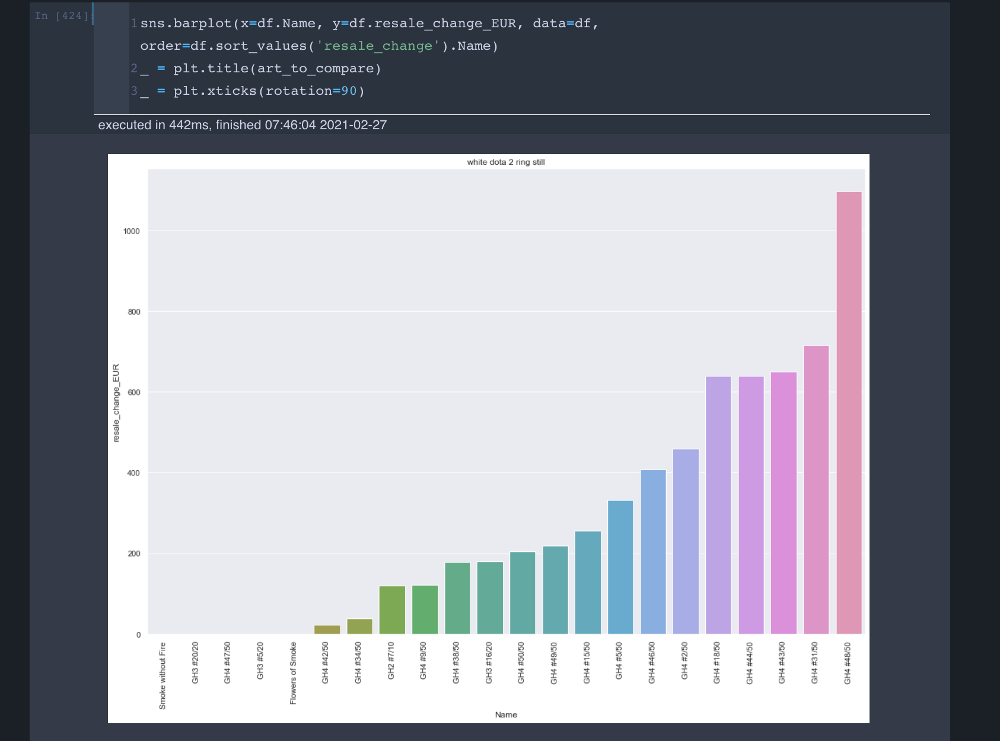
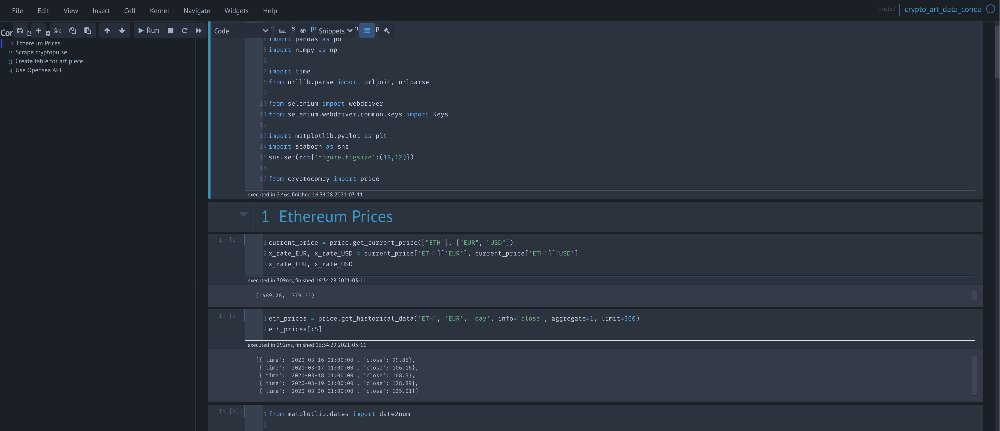
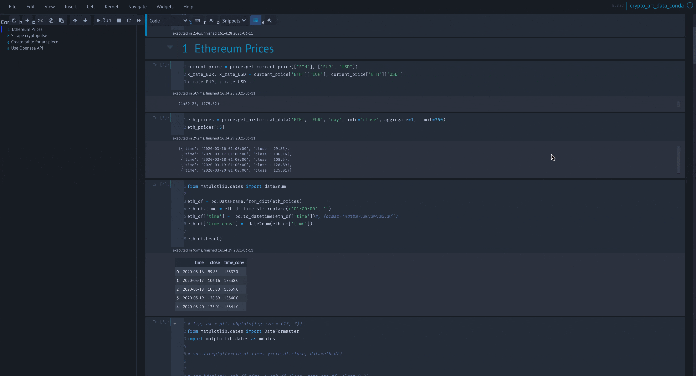

# Jupyter Notebook or Lab? Why you do not need to decide


*Source:*

I am working with various IDEs for my Python development over the last years. Recently I asked myself if it would make sense to check if it is useful to update my current practice and see if alternatives offer better productivity. There is often the question if one IDE is better than the other. In this article, I want to show that the best way is to use the best tool for a specific task.


# Table of Contents

- [Jupyter Notebook or Lab? Why you do not need to decide](#jupyter-notebook-or-lab-why-you-do-not-need-to-decide)
- [Table of Contents](#table-of-contents)
- [Why you don't need to decide which is better](#why-you-dont-need-to-decide-which-is-better)
- [Jupyter Notebook](#jupyter-notebook)
  - [Theming and syntax highlighting](#theming-and-syntax-highlighting)
  - [Notebook configs](#notebook-configs)
  - [NB extensions](#nb-extensions)
- [Disclaimer](#disclaimer)
- [About](#about)

# Why you don't need to decide which is better

Currently, I use a mix of
- Jupyter Notebook
- Jupyter Lab
- VS Code

I am always asking myself if Jupyter Lab is already so far developed that it can replace my Jupyter Notebook (NB) workflow. The short answer is no. There are still many advantages of NB over Lab, which I will elaborate in the following. However, and this is important to understand, it doesn't need to be replaced. You can easily use both of them for the tasks they are good in.

Therefore I use
- NB for developing a Data Science Proof-of-concept (POC)
- Jupyter Lab for managing and re-arranging my POCs
- VS Code for everything that is not Jupyter related.

In essence, I use all three tools to various degrees in a data science project.


# Jupyter Notebook

I still use the NB for most of my POC work.
Here are some reasons why:

## Theming and syntax highlighting

With jupyterthemes you can easily adapt the theme to your needs. I used a lot the "chesterish" theme (`jt -t chesterish -T -N`) which looks like



You can specify a with various jupyterthemes flags. Currently I use it with `!jt -t chesterish -f fira -fs 10 -nf ptsans -nfs 11 -N -kl -cursw 2 -cursc r -cellw 95% -T` ( you will find similar setups on other articles). Check the official [website](https://github.com/dunovank/jupyter-themes) to see a full list of the flags and their meanings. This setup looks like this:





I prefer the dark theme because I work quite a lot in front of the monitor and whatever helps to reduce strain on my eyes is very welcome.


## Notebook configs

I use some specific NB configuartions which might be helpful for you as well.

```py

%load_ext autoreload
%autoreload 2
%matplotlib inline
%config IPCompleter.greedy = True

pd.options.display.max_columns = None
pd.options.display.max_rows = 200

sns.set_palette("bright")
sns.set(style="darkgrid")
sns.set(rc={'figure.figsize':(30,30)})

InteractiveShell.ast_node_interactivity = "all"

ip = get_ipython()
ip.register_magics(jupyternotify.JupyterNotifyMagics)
%autonotify -a 120
```

- The autoreload allows me to reload imported .py files when I evaluate a cell. Due to interaction between Jupyter NB and VS Code files I need to develop in both environments and want everything up to date in my notebook
- The greedy IP completer allows me to list all options in python dictionaries and tab throught them instead of looking up every option. Be careful though, as having too many big objects in a NB might slow down everything.
- The pandas (pd) and seaborn (sns) options are simply a preference setup of mine. I do not want to have truncated rows within pandas dataframes often and also prefer a bigger figuresize within seaborn
- The node interactivity "all" simply outputs all statements instead of the last one. This allows me to not allways have to type "print" for my statements and can simply type variable names. Be aware that this also leads to different behavior for plotting figures.
- Last one is jupyternotify. It is very helpful as some calculations need time (for example training a model, or optimizing hyperparameters). With this option you can set a timer and notifies you when the calculation is done. Extremely helpful when you want to work on other parts while caluclation.


## NB extensions


# Disclaimer

I am not associated with any of the services I use in this article.

I do not consider myself an expert. I am not a blogger or something. I merely document things besides doing other things. Therefore the content does not represent the quality of any of my work, nor does it fully reflect my view on things. If you have the feeling that I am missing important steps or neglected something, consider pointing it out in the comment section or get in touch with me.

I am always happy for constructive input and how to improve.


This was written on XXXXXXXDATEXXXXXXXXXX.
I cannot monitor all of my articles. There is a high probability that when you read this article the tips are outdated and the processes have changed.

If you need more information on certain parts, feel free to point it out in the comments.


---

# About

Daniel is an artist, entrepreneur, software developer, and business law graduate. He has worked at various IT companies, tax advisory, management consulting, and at the Austrian court.

His knowledge and interests currently revolve around programming machine learning applications and all their related aspects. To the core, he considers himself a problem solver of complex environments, which is reflected in his various projects.

Don't hesitate to get in touch if you have ideas, projects, or problems.


You can support me on https://www.buymeacoffee.com/createdd or with crypto https://etherdonation.com/d?to=0xC36b01231a8F857B8751431c8011b09130ef92eC


**Connect on:**

- [Allmylinks](https://allmylinks.com/createdd)

Direct:
- [LinkedIn](https://www.linkedin.com/in/createdd)
- [Github](https://github.com/Createdd)
- [Medium](https://medium.com/@createdd)
- [Twitter](https://twitter.com/_createdd)
- [Instagram](https://www.instagram.com/create.dd/)
- [createdd.com](https://www.createdd.com/)

Art-related:
- [Medium/the-art-of-art](https://medium.com/the-art-of-art)
- [Instagram/art_and_ai](https://www.instagram.com/art_and_ai/)
- [Rarible](https://app.rarible.com/createdd/collectibles)
- [Open Sea](https://opensea.io/accounts/createdd?ref=0xc36b01231a8f857b8751431c8011b09130ef92ec)
- [Known Origin](https://knownorigin.io/profile/0xC36b01231a8F857B8751431c8011b09130ef92eC)
- [Devian Art](https://www.deviantart.com/createdd1010/)

<!-- Written by Daniel Deutsch -->