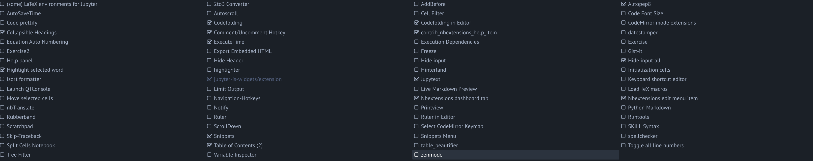
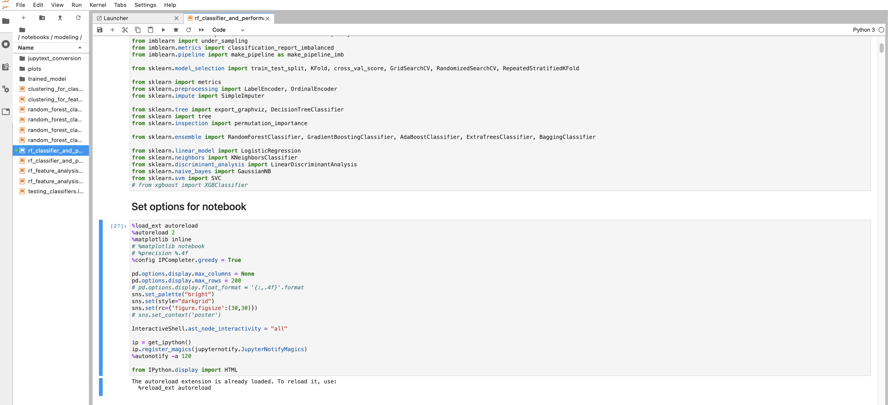
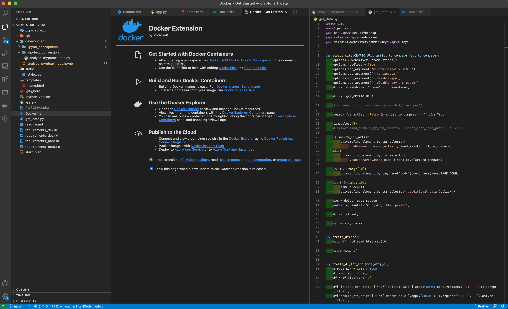

# Jupyter Notebook or Lab or VS Code? Why not all?


*Source:*

I am working with various IDEs for my Python development over the last years. Recently I asked myself if it would make sense to check if it is useful to update my current practice and see if alternatives offer better productivity. There is often the question if one IDE is better than the other. In this article, I want to show that the best way is to use the best tool for a specific task.


# Table of Contents

- [Jupyter Notebook or Lab or VS Code? Why not all?](#jupyter-notebook-or-lab-or-vs-code-why-not-all)
- [Table of Contents](#table-of-contents)
- [Why you don't need to decide which is better](#why-you-dont-need-to-decide-which-is-better)
- [Why Jupyter Notebook](#why-jupyter-notebook)
  - [Theming and syntax highlighting](#theming-and-syntax-highlighting)
  - [Notebook configs](#notebook-configs)
  - [NB extensions](#nb-extensions)
- [Why Jupyter Lab](#why-jupyter-lab)
- [Why VS Code](#why-vs-code)
- [Disclaimer](#disclaimer)
- [About](#about)

# Why you don't need to decide which is better

Currently, I use a mix of
- Jupyter Notebook
- Jupyter Lab
- VS Code

I am always asking myself if Jupyter Lab is already so far developed that it can replace my Jupyter Notebook (NB) workflow. The short answer is no. There are still many advantages of NB over Lab, which I will elaborate in the following. However, and this is important to understand, it doesn't need to be replaced. You can easily use both of them for the tasks they are good in.

Therefore I use
- NB for developing a Data Science Proof-of-concept (POC)
- Jupyter Lab for managing and re-arranging my POCs
- VS Code for everything that is not notebook related.

In essence, I use all three tools to various degrees in a data science project.


# Why Jupyter Notebook

I still use the NB for most of my POC work.
Here are some reasons why:

## Theming and syntax highlighting

With jupyterthemes you can easily adapt the theme to your needs. I used a lot the "chesterish" theme (`jt -t chesterish -T -N`) which looks like


You can specify a with various jupyterthemes flags. Currently I use it with `!jt -t chesterish -f fira -fs 10 -nf ptsans -nfs 11 -N -kl -cursw 2 -cursc r -cellw 95% -T` ( you will find similar setups on other articles). Check the official [website](https://github.com/dunovank/jupyter-themes) to see a full list of the flags and their meanings. This setup looks like this:


I prefer the dark theme because I work quite a lot in front of the monitor and whatever helps to reduce strain on my eyes is very welcome.


## Notebook configs

I use some specific NB configuartions which might be helpful for you as well.

```py

%load_ext autoreload
%autoreload 2
%matplotlib inline
%config IPCompleter.greedy = True

pd.options.display.max_columns = None
pd.options.display.max_rows = 200

sns.set_palette("bright")
sns.set(style="darkgrid")
sns.set(rc={'figure.figsize':(30,30)})

InteractiveShell.ast_node_interactivity = "all"

ip = get_ipython()
ip.register_magics(jupyternotify.JupyterNotifyMagics)
%autonotify -a 120
```

- The autoreload allows me to reload imported .py files when I evaluate a cell. Due to interaction between Jupyter NB and VS Code files I need to develop in both environments and want everything up to date in my notebook
- The greedy IP completer allows me to list all options in python dictionaries and tab throught them instead of looking up every option. Be careful though, as having too many big objects in a NB might slow down everything.
- The pandas (pd) and seaborn (sns) options are simply a preference setup of mine. I do not want to have truncated rows within pandas dataframes often and also prefer a bigger figuresize within seaborn
- The node interactivity "all" simply outputs all statements instead of the last one. This allows me to not allways have to type "print" for my statements and can simply type variable names. Be aware that this also leads to different behavior for plotting figures.
- Last one is jupyternotify. It is very helpful as some calculations need time (for example training a model, or optimizing hyperparameters). With this option you can set a timer and notifies you when the calculation is done. Extremely helpful when you want to work on other parts while caluclation.


## NB extensions

There are various [notebook extensions](https://github.com/ipython-contrib/jupyter_contrib_nbextensions) for jupyter NB. Here are the ones I use:




- [autopep8](https://jupyter-contrib-nbextensions.readthedocs.io/en/latest/nbextensions/code_prettify/README_autopep8.html) for formatting code and making it more readable
- [hide input](https://jupyter-contrib-nbextensions.readthedocs.io/en/latest/nbextensions/hide_input_all/readme.html)  and [collapsible headings](https://jupyter-contrib-nbextensions.readthedocs.io/en/latest/nbextensions/collapsible_headings/readme.html) for  showing the results of the cells and not the code. And also focusing on certain parts in the notebook. Helpful for presentations
- [highlight selected word](https://jupyter-contrib-nbextensions.readthedocs.io/en/latest/nbextensions/highlight_selected_word/README.html) for showing me where I used the same variable I want to edit
- [code folding](https://jupyter-contrib-nbextensions.readthedocs.io/en/latest/nbextensions/codefolding/readme.html#) for more complex and longer functions in cells
- [table of contents](https://jupyter-contrib-nbextensions.readthedocs.io/en/latest/nbextensions/toc2/README.html) for showing the headings of the notebook. Absolutely essential for navigating through the notebook and making it more readable.
- [execution time](https://jupyter-contrib-nbextensions.readthedocs.io/en/latest/nbextensions/execute_time/readme.html) for knowing how long an execution took. Very useful in training and comparing ML models and parameter optimization.
- finally [comment hotkey](https://jupyter-contrib-nbextensions.readthedocs.io/en/latest/nbextensions/comment-uncomment/readme.html) this is a must if you are using a different keyboard layout than the english one. I use a german keyboard within macOS and therefore the code comment key shortcut does not work. with jupyter NB you have the option to set a different hotkey. this is one big reason why I still do not use jupyter lab. Because there you still do not have this option and there is no way for commenting/uncommenting code parts apart from manually typing "#". This is unbearable if you want proper efficient coding.

I do not use the "Hinterland" extension for code completion. I have used it in the past, but the performance is not good and it also slows down the whole notebook.

Same goes for "Variable Inspector". As soon as you have a few more dataframes or models stored it will slow down the notebook and make it unusable. It took me a while to figure out that those extensions are causing problems. Therefore I do not use it anymore and can recommend not using it if your notebooks are larger.


# Why Jupyter Lab

Currently, I only use Jupyter Lab for notebook organization. My repository is managed with VS Code but sometimes I need to re-arange notebooks. This can not be done within VS Code and is cumbersome with Jupyter NB. Either I want to check what steps I have done in similar notebooks or I want to copy certain cells. Also splitting notebooks is  much easier within Juypter Lab, where you have
- a nice overview of your notebooks,
- open multiple notebooks within one tab
- copy and drag multiple cells within a notebook




# Why VS Code

For everything that is not done in Jupyter NB I use VS Code. I am aware that VS Code supports .ipynb files with a "notebook style" approach. However, until now, it comes not close to the benefits of real Jupyter NB (see my list above) and is also extremely slow. The loading always takes so long that I am already annoyed by it.

But as soon as I leave the notebook environment I do everything in VS Code. I have been using it for many years and it is still the best option in my opinion.

Reasons for this are:
- Syntax highlighting
- Code completion and suggestions
- Navigation through functions and files
- Extensions and Integrations (eg Docker, linting, formatting, testing, snippets)
- Git



Basically everything that is needed when developing an app after the notebook proof of concept is great in VS Code.

If you are using another IDE (eg PyCharm) instead of VS Code it will also be sufficient I would say. If you have developed a certain workflow with an IDE and it works it doesn't make too much sense to switch in my opinion. The reason I prefer VS Code is the lightweight and customizability. It is extremely intuitive and easy to get started with. You don't need to create projects or whatever. Just add the extensions you need and start programming. You can add as much as you like or you can keep it super slim. It can also support many other languages which makes it great to use if you have bigger projects.


# Disclaimer

I am not associated with any of the services I use in this article.

I do not consider myself an expert. I am not a blogger or something. I merely document things besides doing other things. Therefore the content does not represent the quality of any of my work, nor does it fully reflect my view on things. If you have the feeling that I am missing important steps or neglected something, consider pointing it out in the comment section or get in touch with me.

I am always happy for constructive input and how to improve.


This was written on **16.03.2021**.
I cannot monitor all of my articles. There is a high probability that when you read this article the tips are outdated and the processes have changed.

If you need more information on certain parts, feel free to point it out in the comments.


---

# About

Daniel is an artist, entrepreneur, software developer, and business law graduate. He has worked at various IT companies, tax advisory, management consulting, and at the Austrian court.

His knowledge and interests currently revolve around programming machine learning applications and all their related aspects. To the core, he considers himself a problem solver of complex environments, which is reflected in his various projects.

Don't hesitate to get in touch if you have ideas, projects, or problems.


You can support me on https://www.buymeacoffee.com/createdd or with crypto https://etherdonation.com/d?to=0xC36b01231a8F857B8751431c8011b09130ef92eC


**Connect on:**

- [Allmylinks](https://allmylinks.com/createdd)

Direct:
- [LinkedIn](https://www.linkedin.com/in/createdd)
- [Github](https://github.com/Createdd)
- [Medium](https://medium.com/@createdd)
- [Twitter](https://twitter.com/_createdd)
- [Instagram](https://www.instagram.com/create.dd/)
- [createdd.com](https://www.createdd.com/)

Art-related:
- [Medium/the-art-of-art](https://medium.com/the-art-of-art)
- [Instagram/art_and_ai](https://www.instagram.com/art_and_ai/)
- [Rarible](https://app.rarible.com/createdd/collectibles)
- [Open Sea](https://opensea.io/accounts/createdd?ref=0xc36b01231a8f857b8751431c8011b09130ef92ec)
- [Known Origin](https://knownorigin.io/profile/0xC36b01231a8F857B8751431c8011b09130ef92eC)
- [Devian Art](https://www.deviantart.com/createdd1010/)

<!-- Written by Daniel Deutsch -->