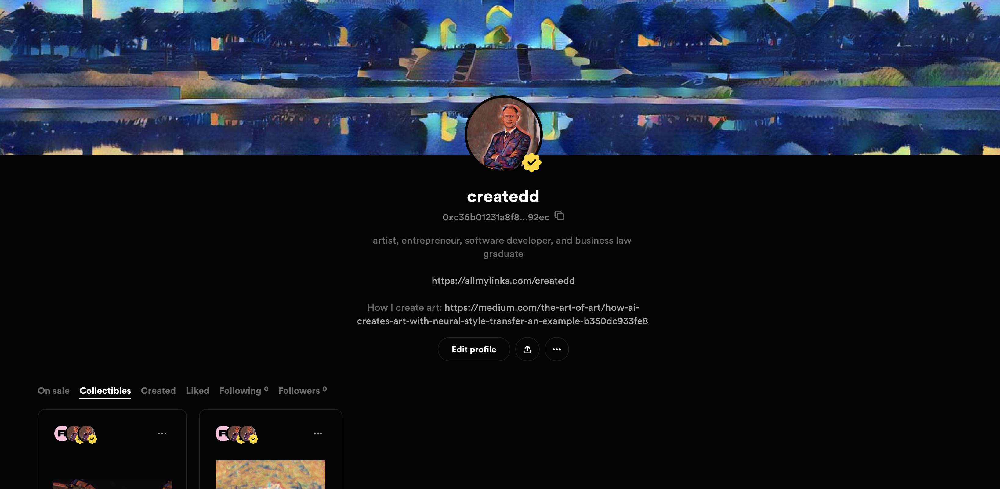
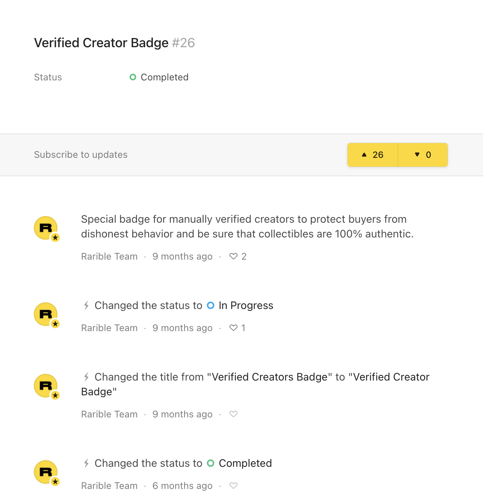
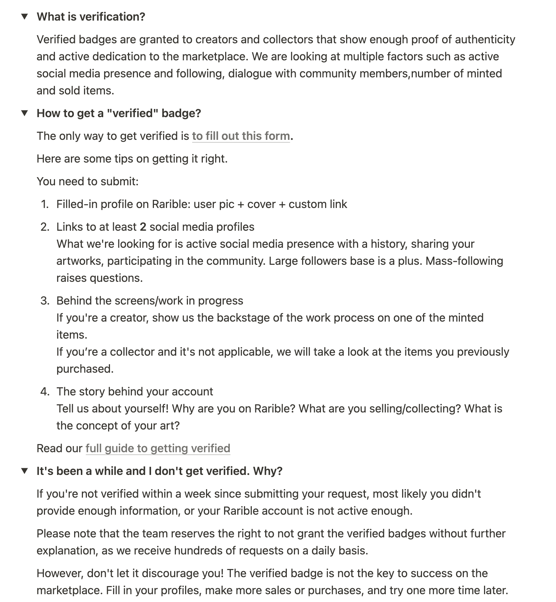
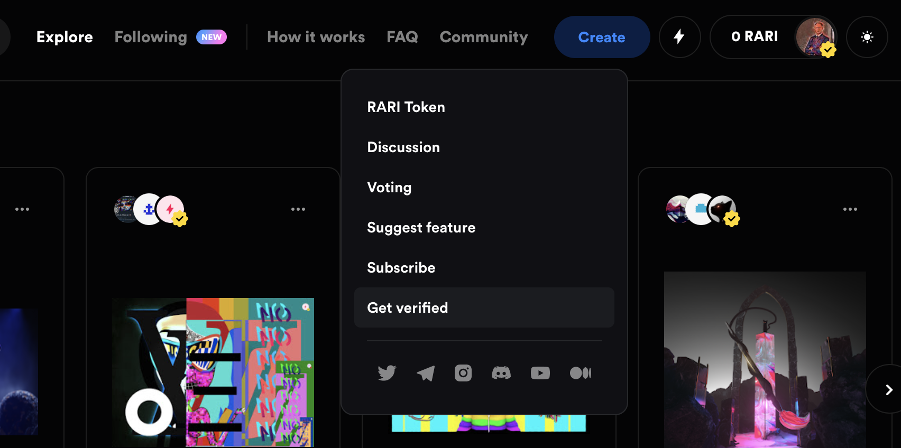
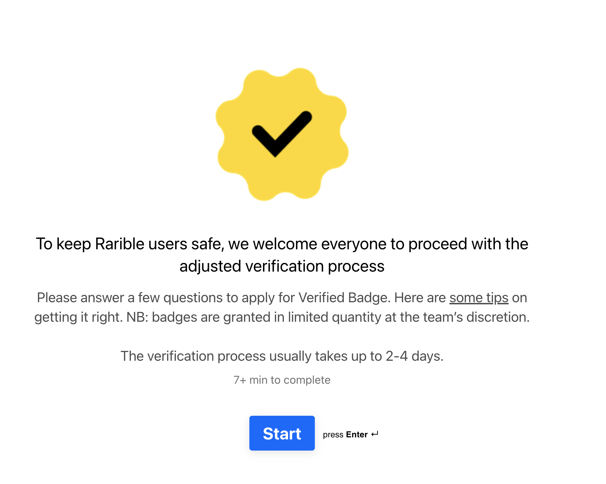

# How I got verified on Rarible

*Source: https://unsplash.com/photos/bj8U389A9N8*

As with other online platforms, the verified badge shows others that your profile was somehow checked by some people of the platform to verify if your profile and content is authentic.

As I recently got into Rarible more and more and enjoy the platform I thought I give a quick look on how I did it.

## Table of Contents

# Disclaimer

I am not associated with any of the services I use in this article. I simply enjoy the platform.

I do not consider myself an expert. I am not a blogger or something. I merely document things beside doing other things. Therefore the content does not represent the quality of any of my work, nor does it fully reflect my view on things. If you have the feeling that I am missing important steps or neglected something, consider pointing it out in the comment section or get in touch with me.

I am always happy for constructive input and how to improve.

This was written on **6.1.2021**.
I cannot monitor all of my articles. There is a high probability that when you read this article the tips are outdated and the processes have changed.

If you need more information on certain parts, feel free to point it out in the comments.

## What and why

Some platforms rank verified profiles better than others. I don't know if this is the case for rarible. However, it helps as a sort of social proof. So if you are a creator on this platform I would suggest to go throught the very short and precise process of getting your badge.

From there [FAQ page](https://www.notion.so/rarible-com-FAQ-a47b276aa1994f7c8e3bc96d700717c5):

## How to

The way to get verified is well explained and straight forward.

In the community tab you will find a "Get verified" section.

Which will send you to a typeform page:

After that you will have to provide links to your online presence. May it be social media or other homepages. There are also some questions on how you create your art.

After you have filled out everything you will get an email after a few days if you are verified.

And that's about it. I love how uncomplicated they made the whole procedure. Well done!

Any questions left? Send me a message ;)

---

## About

Daniel is an artist, entrepreneur, software developer, and business law graduate. He has worked at various IT companies, tax advisory, management consulting, and at the Austrian court.

His knowledge and interests currently revolve around programming machine learning applications and all their related aspects. To the core, he considers himself a problem solver of complex environments, which is reflected in his various projects.

Don't hesitate to get in touch if you have ideas, projects, or problems.

You can support me on https://www.buymeacoffee.com/createdd or with crypto https://etherdonation.com/d?to=0xC36b01231a8F857B8751431c8011b09130ef92eC

**Connect on:**
- [LinkedIn](https://www.linkedin.com/in/createdd)
- [Github](https://github.com/Createdd)
- [Medium](https://medium.com/@createdd)
- [Twitter](https://twitter.com/_createdd)
- [Instagram](https://www.instagram.com/create.dd/)
- [createdd.com](https://www.createdd.com/)

Art-related:
- [Medium/the-art-of-art](https://medium.com/the-art-of-art)
- [Instagram/art_and_ai](https://www.instagram.com/art_and_ai/)
- [Rarible](https://app.rarible.com/createdd/collectibles)
- [Open Sea](https://opensea.io/accounts/createdd )
- [Known Origin](https://knownorigin.io/profile/0xC36b01231a8F857B8751431c8011b09130ef92eC)
- [Devian Art](https://www.deviantart.com/createdd1010/)

<!-- Written by Daniel Deutsch -->