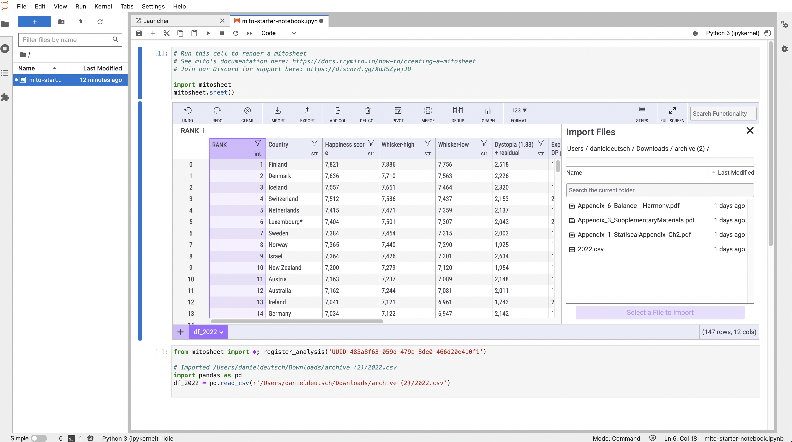

# The easiest way you can switch from Excel to Python


*AI created art by Author. [See on Opensea as NFT](https://opensea.io/accounts/createdd?ref=0xc36b01231a8f857b8751431c8011b09130ef92ec) inspired by [Peter Herrmann](https://unsplash.com/@tama66)*

# Table of Contents

- [The easiest way you can switch from Excel to Python](#the-easiest-way-you-can-switch-from-excel-to-python)
- [Table of Contents](#table-of-contents)
- [Intro](#intro)
- [Analyze a data set](#analyze-a-data-set)
  - [1 Install Libraries](#1-install-libraries)
  - [2 Add mitosheet](#2-add-mitosheet)
  - [3 Get and work with Dataset](#3-get-and-work-with-dataset)
- [Construct the graph and style it. Further customize your graph by editing this code.](#construct-the-graph-and-style-it-further-customize-your-graph-by-editing-this-code)
- [See Plotly Documentation for help: https://plotly.com/python/plotly-express/](#see-plotly-documentation-for-help-httpsplotlycompythonplotly-express)
- [Disclaimer](#disclaimer)
- [About](#about)


# Intro

There is one problem faced very often when working in the data analysis field. And that is that people know Excel but not can program in Python. At one point it becomes necessary to transition from an Excel analysis into a more scalable and flexible programming solution like Python. 


How do you close that gap? 


Slowly and step by step. 

Let's talk about a way to ease into python programming when all you can do is Excel. 
Install Anaconda, a Python programming environment
Create an environment
Install Mito to close the gap between excel sheets and python


[Mito](https://docs.trymito.io/ ) allows you to do Excel calculations within Python and generates the [Pandas](https://pandas.pydata.org/ ) code for you. In essence, it is like a guide to your Python coding.


Let's have a look at an example

# Analyze a data set

## 1 Install Libraries

Through the terminal just type in those commands:

```
conda create -n YOUR_ENV python=3.9
conda activate YOUR_ENV
pip install mitoinstaller
python -m mitoinstaller install
```

## 2 Add mitosheet

Afterward, a Jupyter Lab (python environment) will be started
2 Analyze a dataset

Put this in a cell and it will open your interface to work in
```
import mitosheet
mitosheet.sheet()
```

## 3 Get and work with Dataset

I wanted to have a quick look at the latest happiness dataset https://www.kaggle.com/datasets/mathurinache/world-happiness-report-2022 to see where it is nice to live right now. 


So, first I sort the column with happiness score in descending order. I know this from Excel.

Immediately afterward, the python code with comments is generated. 

```# Sorted Happiness score in df_2022 in descending order
df_2022 = df_2022.sort_values(by='Happiness score', ascending=False, na_position='last')
```


This is fantastic.
Executing the provided cell and calling the DataFrame leads me to show the pandas data frame:

I can see that Austria is still quite high in the happiness ranking, which satisfies me to some degree. (As I live in Austria right now) 
I thought about moving to a warmer country, so I need to look for something else. I want to check out Tenerife. However, it is not here:

So I rather look for Spain:

Its rank is 29. So, not bad either. 
I want to have a closer look at healthy life expectations, which is very important for me. So I go and do some plotting

Now, this is too much for me. I want to get into some python code now. Which I easily can after copying the code snippet for this. When executing the snippet I get 
 - 
I want to re-sort the y-axis. So I check out the plotly docs. And see on https://plotly.com/python/bar-charts/#bar-chart-with-sorted-or-ordered-categories that I can just pass some arguments.
So I add 
`import plotly.express as px
# Construct the graph and style it. Further customize your graph by editing this code.
# See Plotly Documentation for help: https://plotly.com/python/plotly-express/
fig = px.strip(df_2022, x='Country', y='Explained by: Healthy life expectancy')
fig.update_layout(
 title='Country, Explained by: Healthy life expectancy strip',
 xaxis=dict(
 rangeslider=dict(
 visible=True,
 thickness=.05
 )
 ),
 yaxis=dict(
 categoryorder='category ascending'
 )
)
fig.show(renderer="iframe")`

This leads to the sorting I desire:
graph_sorted
I can see that Austria performs still quite well. I see that the "cold" countries in the North are extremely good in this regard. Looking at Spain, I can see that this is not bad either. I have other options like Malta, Italy, Costa Rica. This inspires me to to go one of those countries.

Now, let's add more information in form of a line chart.
 - 
And then export the code with sorted y-axis:
 - 
I want to know how those numbers correlate. I want to dive into more Pandas now. I re-format the numbers as the dataset did not provide them as numbers. And calculate the Pearson correlation with the Pandas function. As we can see clearly that health life expectancy and freedom of choice correlate strongly with happiness score, those two correlate only around 43% here. Looking at the graphs, we can see that in the higher-ranked countries both values are quite high, whereas in the lower end both of those variables seem to sometimes compensate each other. This is quite interesting to see and would be something worth elaborating on in more detail. 

3 Why is this valuable
There is a certain challenge in getting qualified developers and people who are able to work with code. 
You can either hire experienced people, which is often very hard and expensive, or you can try democratize the process of dealing with data and allow non-coders to get into coding. 
As I experienced often, many people consider themselves either programmers or non-programmers. Often I hear "I am not a developer, I cannot do this". However, with little introduction, anyone is able to work with code syntax. Step by step. Once at a time. And libraries like this one showed helps in this process. They allow people to feed on skills they already have, expand them and acquire new ones that will improve their work. 
I am glad that there is such a strong open source community that makes day-to-day lives easier. I think that one of the best ways to align the competencies of people in a company/project is when strengths can be shared like in this example. There is always a need for strong expertise. Distributing expertise is one of the keys to growing in a team and making projects yield outstanding results.


# Disclaimer

I am not associated with any of the services I use in this article.

I do not consider myself an expert. I merely document things besides doing other things. Therefore the content does not represent the quality of any of my professional work, nor does it fully reflect my view on things. If you have the feeling that I am missing important steps or neglected something, consider pointing it out in the comment section or get in touch with me.

This was written on **XXXXXXXX**.
I cannot monitor all of my articles. There is a high probability that when you read this article the tips are outdated and the processes have changed.

I am always happy for constructive input and how to improve.


---

# About

Daniel is an artist, entrepreneur, software developer, and business law graduate. His knowledge and interests currently revolve around programming machine learning applications and all their related aspects. To the core, he considers himself a problem solver of complex environments, which is reflected in his various projects.


You can support me on https://www.buymeacoffee.com/createdd or with crypto https://etherdonation.com/d?to=0xC36b01231a8F857B8751431c8011b09130ef92eC


-> subscribe here on https://medium.com/subscribe/@createdd or read more on medium
-> https://medium.com/@createdd/membership


**Connect on:**

- [Allmylinks](https://allmylinks.com/createdd)

Direct:
- [LinkedIn](https://www.linkedin.com/in/createdd)
- [Github](https://github.com/Createdd)
- [Medium](https://medium.com/@createdd)
- [Twitter](https://twitter.com/_createdd)
- [Instagram](https://www.instagram.com/create.dd/)
- [createdd.com](https://www.createdd.com/)

Art-related:
- [Open Sea](https://opensea.io/accounts/createdd?ref=0xc36b01231a8f857b8751431c8011b09130ef92ec)
- [Instagram/art_and_ai](https://www.instagram.com/art_and_ai/)
- [Rarible](https://app.rarible.com/createdd/collectibles)
- [Known Origin](https://knownorigin.io/profile/0xC36b01231a8F857B8751431c8011b09130ef92eC)
- [Medium/the-art-of-art](https://medium.com/the-art-of-art)
- [Devian Art](https://www.deviantart.com/createdd1010/)

<!-- Written by Daniel Deutsch -->


