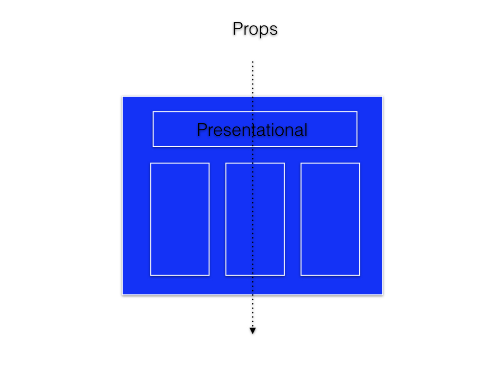
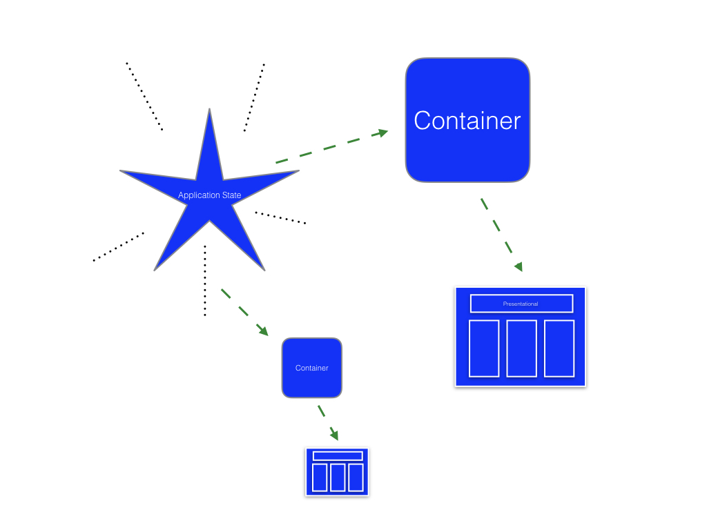

# Components, Components, Components - React/Redux

https://unsplash.com/photos/oThnHPkb3p8

Thinking in React lays out how to structure components in React. When using Redux it's even more important to know how to structure your components. Therefore a small reminder in form of an article. :D

## 📄 Table of contents

<!-- toc orderedList:0 depthFrom:1 depthTo:6 -->

* [Components, Components, Components - React/Redux](#components-components-components-reactredux)
  * [📄 Table of contents](#table-of-contents)
  * [Why to layout the components before writing code](#why-to-layout-the-components-before-writing-code)
  * [Presentational components](#presentational-components)
      * [Logical presentation](#logical-presentation)
      * [Pure presentation](#pure-presentation)
  * [Container components](#container-components)

<!-- tocstop -->

---
>"Plans are only good intentions unless they immediately degenerate into hard work." - Peter Drucker
---

## Why to layout the components before writing code

Planning your application and components before you start writing code will help you save a lot of time later on. With all the possible features React components can have, they clutter very fast and become soon not manageable. Dividing the purpose and functionality of your components will significantly improve your workflow when your app starts to grow.

- presentational components (how things look)
- container components (how things work)

Make sure to read the [article from Dan Abramov](https://medium.com/@dan_abramov/smart-and-dumb-components-7ca2f9a7c7d0), where he explains the key ideas between those components in detail.

<table>
    <thead>
        <tr>
            <th></th>
            <th scope="col" style="text-align:left">Presentational Components</th>
            <th scope="col" style="text-align:left">Container Components</th>
        </tr>
    </thead>
    <tbody>
        <tr>
          <th scope="row" style="text-align:right">Purpose</th>
          <td>How things look (markup, styles)</td>
          <td>How things work (data fetching, state updates)</td>
        </tr>
        <tr>
          <th scope="row" style="text-align:right">Aware of Redux</th>
          <td>No</th>
          <td>Yes</th>
        </tr>
        <tr>
          <th scope="row" style="text-align:right">To read data</th>
          <td>Read data from props</td>
          <td>Subscribe to Redux state</td>
        </tr>
        <tr>
          <th scope="row" style="text-align:right">To change data</th>
          <td>Invoke callbacks from props</td>
          <td>Dispatch Redux actions</td>
        </tr>
        <tr>
          <th scope="row" style="text-align:right">Are written</th>
          <td>By hand</td>
          <td>Usually generated by React Redux</td>
        </tr>
    </tbody>
</table>

*Source: https://github.com/reactjs/redux/blob/master/docs/basics/UsageWithReact.md*

## Presentational components

#### Logical presentation
- React Component
- Manage own State
- May take place in React Lifecycle

#### Pure presentation
- Stateless
- Rely on Props
- Pure functions
- Don't take place in React Lifecycle

>"I call components encapsulated React components that are driven solely by props and don't talk to Redux. Same as “dumb components”. They should stay the same regardless of your router, data fetching library, etc." - Dan Abramov

## Container components

See [this article](https://medium.com/@learnreact/container-components-c0e67432e005) for a great example.

>"I call containers React components that are aware of Redux, Router, etc. They are more coupled to the app. Same as “smart components”." - Dan Abramov

If you gained something from this article let me know with a comment or heart. Make sure to follow for more :)

<!-- Written by Daniel Deutsch (deudan1010@gmail.com) -->
