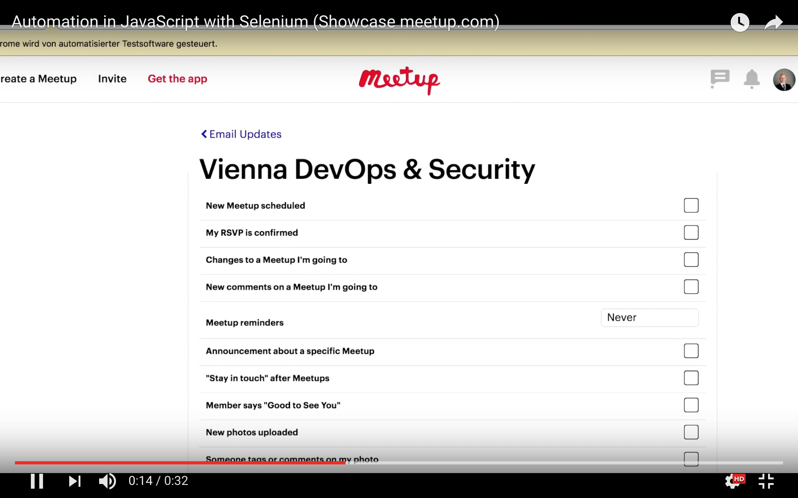

# Automate email settings with JavaScript
[](
https://unsplash.com/photos/Ya3FqJdKVaw)
https://unsplash.com/photos/Ya3FqJdKVaw Photo by Samuele Errico Piccarini

In my previous article I described how to use JavaScript in the browser console to get tedious tasks on the web much faster done. Of course this approach is limited. A way to go much further and beyond is to use a automation framework like Selenium. In this article I show how flexible and fast you can program a script that helps you save a lot of time.

[➡️ Github Repo is available here ⬅️](https://github.com/DDCreationStudios/seleniumExample)


## 📄 Table of contents

<!-- toc orderedList:0 depthFrom:1 depthTo:6 -->

* [Automate email settings with JavaScript](#automate-email-settings-with-javascript)
  * [📄 Table of contents](#table-of-contents)
  * [What I will do](#what-i-will-do)
  * [Automate with Selenium webdriver](#automate-with-selenium-webdriver)
  * [Using it on clicking SPAM checkboxes on meetup.com](#using-it-on-clicking-spam-checkboxes-on-meetupcom)
    * [Setup](#setup)
    * [Going to the settings](#going-to-the-settings)
    * [Identify the elements and iterate over them](#identify-the-elements-and-iterate-over-them)
  * [See the result in Youtube](#see-the-result-in-youtube)

<!-- tocstop -->


---
>"The first rule of any technology used in a business is that automation applied to an efficient operation will magnify the efficiency. The second is that automation applied to an inefficient operation will magnify the inefficiency." - Bill Gates
---

## What I will do

The Meetup.com page requires me to check on/off each checkbox for an email notification of each group.


I don't waste my time clicking through all my groups. Meetup.com offers an option to disable all notifications, but I want to receive updates from some selected groups.
Another thing is that they have "Reminders", that require even more clicking with a dropdown menu. This dropdown menu can't even be handled by the console code, that I have shown in the previous article.

Therefore I decided to write an automated script that does all that for me.


## Automate with Selenium webdriver

[Selenium](http://www.seleniumhq.org/) allows to use a webdriver to go through the browser and performs actions, that a human being could also do (like clicking on elements).

The process of automating is simple:

- find the element with the inspector in your browser

- get the element with  `driver.findElement`
- perform actions on that element with `.then` (promises in JS) or functions from the framework like `.click()`
- after performing the tasks, be sure to `driver.quit();` to end the driver

## Using it on clicking SPAM checkboxes on meetup.com

### Setup

In this example I am using the [Selenium webdriver](https://github.com/SeleniumHQ/selenium/tree/master/javascript/node/selenium-webdriver).

The setup in Node.js is pretty easy:

```javascript
var webdriver = require('selenium-webdriver'),
	By = webdriver.By,
	until = webdriver.until;

var driver = new webdriver.Builder().forBrowser('chrome').build();
driver.manage().window().maximize();
```

### Going to the settings

To get to the notifications section I simply go to their login page, send my credentials to log in and click all the way to the settings.

```javascript
driver.get('https://secure.meetup.com/login/');

var mail = driver.findElement(webdriver.By.id('email'));
var pass = driver.findElement(webdriver.By.id('password'));

mail.sendKeys(cred.cred.user);
pass.sendKeys(cred.cred.pass);

driver.findElement(webdriver.By.name('submitButton')).click();
driver
	.findElement(
		webdriver.By.className(
			'valign--middle display--none atMedium_display--inline'
		)
	)
	.click();
driver.findElement(webdriver.By.xpath('//a[text()="Settings"]')).click();
driver.findElement(webdriver.By.xpath('//a[text()="Email Updates"]')).click();
```

### Identify the elements and iterate over them

I identify all checkboxes and dropdowns and call a function (`clickingAll`) on each element.

```javascript
const list = driver.findElements(
	webdriver.By.xpath('//li[@class="list-item"]/a')
);

list.then(function(elements) {
	var links = elements.map(elem => {
		return elem.getAttribute('href');
	});
	promise.all(links).then(linkRefs => {
		linkRefs.forEach(element => {
			driver.navigate().to(element);
			clickingAll();
		});
	});
});
```

The `clickingAll()` function actually clicks the elements and tests if the boxes are already unchecked (since we don't want to simply click everything, but rather uncheck all boxes).

```javascript
var clickingAll = () => {
	driver
		.findElements(
			webdriver.By.xpath('//i[@class="icon-s icon-checkbox pseudocheckbox "]')
		)
		.then(elements => {
			elements.map(elem => {
				elem.getAttribute('aria-checked').then(check => {
					if (check === 'true') {
						elem.click();
					}
				});
			});
		});
	driver
		.findElement(webdriver.By.xpath('//select[@class="j-selectbox"]'))
		.click();
	driver
		.findElement(webdriver.By.xpath('//option[@value="NO_RECEIVE"]'))
		.click();

	try {
		driver
			.findElement(webdriver.By.xpath('//option[@value="OFF]'))
			.then(null, err => {
				if (err) {
					return false;
				}
			})
			.click();
	} catch (e) {
		return false;
	}
	driver.navigate().back();
};
```

## See the result in Youtube

[](https://youtu.be/-fPcsgR6uHk)


If you gained something from this article let me know with a comment or heart. Make sure to follow for more :)


<!-- Written by Daniel Deutsch (deudan1010@gmail.com) -->
