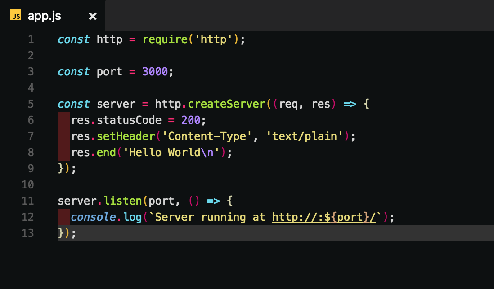
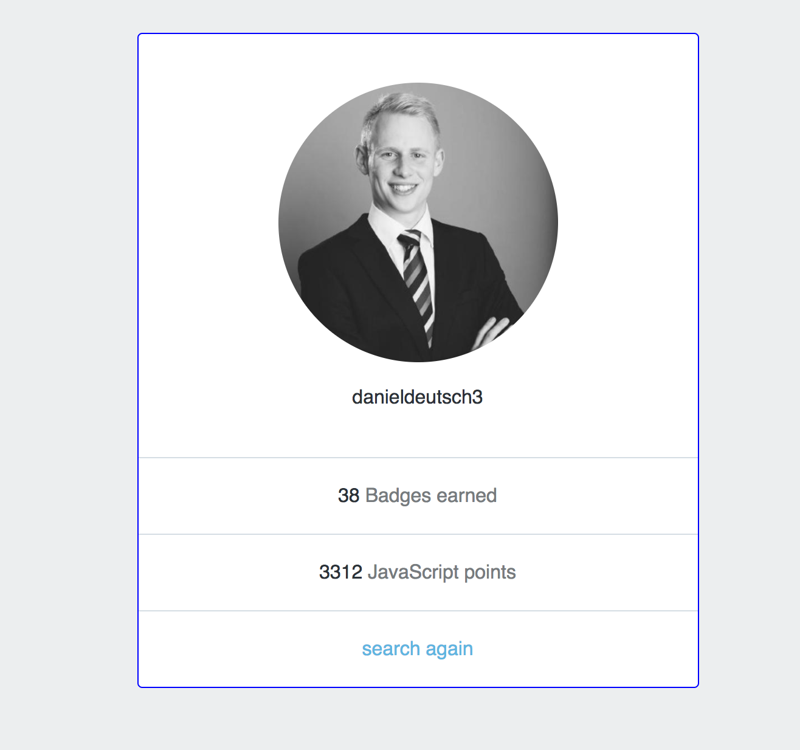

# Simple Dynamic Node.js Site

[](
https://unsplash.com/photos/QdAAasrZhdk)
https://unsplash.com/photos/QdAAasrZhdk

This is a tutorial for a small dynamic Node.js application. The full tutorial is available at [Treehouse.com](https://teamtreehouse.com/). This article is designed to provide some insights for the great JavaScript Path from Treehouse.com, but also to help beginners build a small app for themselves.


## 📄 Table of contents

  * [Start](#start)
  * [Prepare](#prepare)
  * [Plan](#plan)
  * [Perform](#perform)
      * [Basic Webserver](#basic-webserver)
      * [Handle HTTP Home Route](#handle-http-home-route)
      * [Handle HTTP Username Route](#handle-http-username-route)
      * [Structure according to the DRY (Don't repeat yourself) principle](#structure-according-to-the-dry-dont-repeat-yourself-principle)
      * [Create functions to read the data and output it in our app](#create-functions-to-read-the-data-and-output-it-in-our-app)
      * [Get data from body and send POST request to route accordingly](#get-data-from-body-and-send-post-request-to-route-accordingly)
  * [Conclusion](#conclusion)

---

>“If you can't explain it to a six year old, you don't understand it yourself.”
― Albert Einstein

---

## Start

Treehouse encourage you to start with the 4 P's of Problem Solving:

- Preperation
- Plan
- Perform
- Perfect


I read about this solving strategy multiple times and like the approach when tackling building applications.

## Prepare

Problem:
We want to look at a user's badge count and his points in JavaScript.

Solution:
Using Node.js to look up profiles and get the data via http

## Plan

- Create a web server
- Handle HTTP home route GET and POST
- Handle HTTP rout GET of the username
- Function to read the data and output it in our app

Go through the [Node.js docs](https://nodejs.org/dist/latest-v7.x/docs/api/synopsis.html) to see examples and get help if you're stuck.

## Perform

#### Basic Webserver
- Copy the webserver example from the [Node.js docs](https://nodejs.org/dist/latest-v7.x/docs/api/synopsis.html)
- Read and understand what's written in the docs
- Adapt the webserver example to your needs


Should look like that and work properly.


#### Handle HTTP Home Route

- Create a function that handles a URL with "/" ([see docs](https://nodejs.org/dist/latest-v7.x/docs/api/http.html#http_message_url))
- Set statusCode, Header and "end" response
- Call the function as callback function when creating the server, and pass it's arguments as parameters


Should look like that and work properly.

#### Handle HTTP Username Route

- Create a function that takes the `url` parameter and replace the "/" with ""
- Execute function when the user types in a username (`username.length > 0`)
- Create a new profile object when you receive a response (`... .on("end", function ...)`)
- Store the values of the data in an object
- Write out your values
- Add an error handler
- Since the app.js file is getting too big, store routing code in an own "router"-file. (Be sure to use import and export syntax properly)


Should look like that and work properly.


---
Now you have the very basics of getting and handling JSON data!

---

#### Structure according to the DRY (Don't repeat yourself) principle

- Create your HTML and CSS layouts
- Structure your folders accordingly (1 file for designs/styles)
- For simplicity I'll style the components in the HTML file, however, normally you should create own CSS files
- Keep everything dynamic with creation of an own "views" folder, that connects different parts of your designs
- create a render function file to bring everything together
  - use the `readFile` method from the fs object ([see docs](https://nodejs.org/dist/latest-v7.x/docs/api/fs.html#fs_fs_readfile_file_options_callback))
- use the render function in your routes to render all your html instead writing simple responses


#### Create functions to read the data and output it in our app

- Create a `mergeValues`function, that replaces your placeholders with the actual values generated from the API
- Make sure to encode your files in a "utf8"-string instead using the raw buffer ([see docs](https://nodejs.org/dist/latest-v7.x/docs/api/fs.html#fs_fs_readfile_file_options_callback))
- Refactor code creating a common header
- Set the response head to HTML content type


By now the render file should look like this.

#### Get data from body and send POST request to route accordingly

- Be sure that your search HTML performs a POST action
- Handle the POST request ([see docs](https://nodejs.org/dist/latest-v7.x/docs/api/http.html#http_class_http_incomingmessage)) with a querystring ([see docs](https://nodejs.org/dist/latest-v7.x/docs/api/querystring.html))
- Use the http header "location" to with the response of 303 to redirect to the typed in username

---
⭐ Now the functionality of your dynamic site is fully established!

---

This is how it looks:


Checkout my [repo on github](https://github.com/DDCreationStudios/simpleDynamicNodeJS) for the code.

## Conclusion

This is a great example how easy a simple application can be build in Node.js. So far I am really happy with the course on Treehouse. It breaks complex topics down and explains them very well.

Start for [free here]("http://referrals.trhou.se/danieldeutsch3"):

<a href="http://referrals.trhou.se/danieldeutsch3" target="_blank"></a>

```
If you gained something from this article let me know with a comment or heart. Make sure to follow for more :)
```

<!-- Written by Daniel Deutsch (deudan1010@gmail.com) -->
