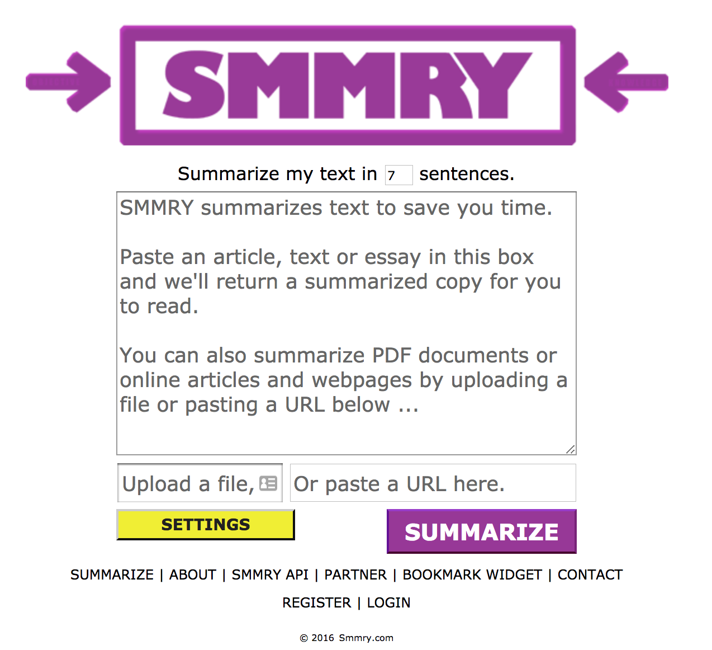
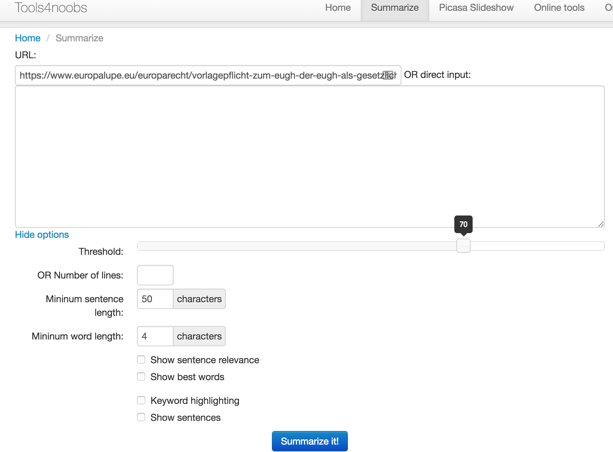
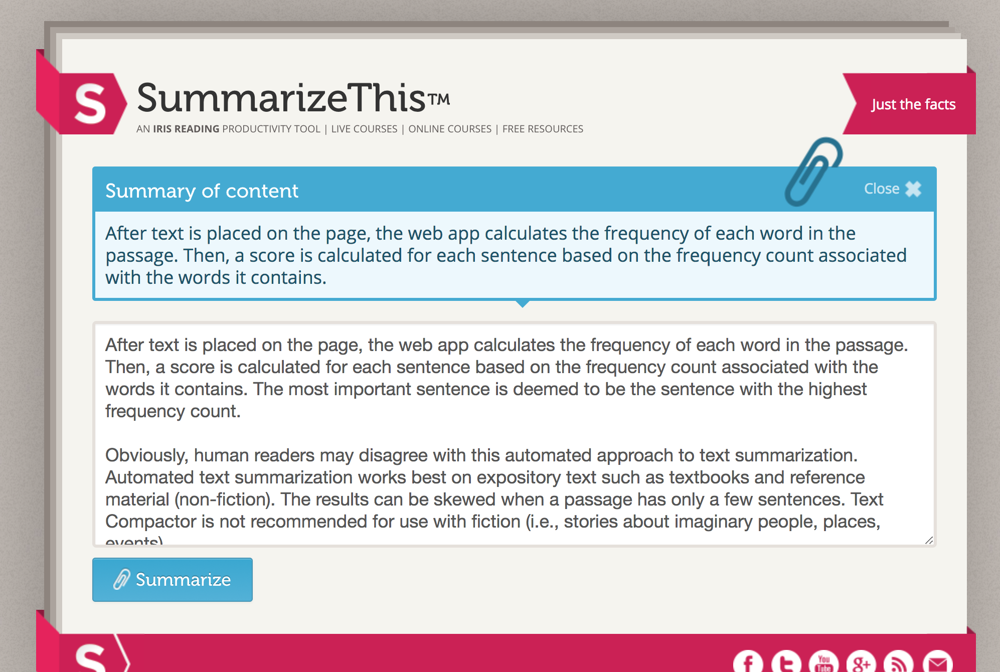
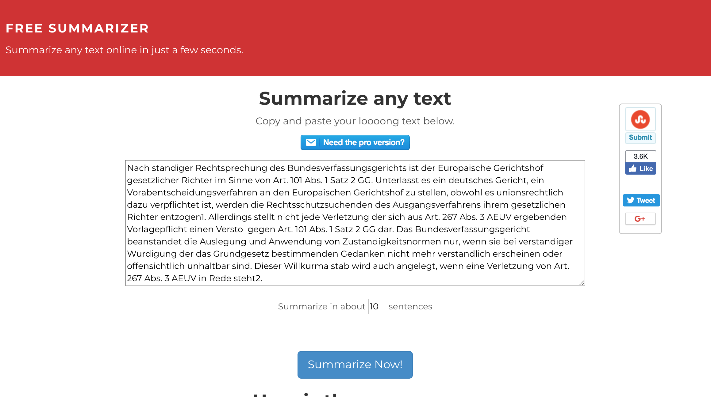

# Online Text Summarizers 2017

Photo by Daniil Kuželev on Unsplash - https://unsplash.com/photos/QRawWgV6gmo

I am a law student and always need to go through huge amounts of text. On my way to learn more natural language processing I came across text summarizing. Here is a list of some online summarizers. Enjoy.

## 📄 Table of contents

  - [SMMRY](#smmry)
      - [What it does](#what-it-does)
      - [How it works](#how-it-works)
  - [Autosummarizer](#autosummarizer)
  - [Summarize Tool (tools4noobs)](#summarize-tool-tools4noobs)
  - [Text Compactor](#text-compactor)
      - [How it works (according to their page)](#how-it-works-according-to-their-page)
  - [SummerizeThis](#summerizethis)
      - [How it works (according to their page)](#how-it-works-according-to-their-page-1)
  - [Fee Summarizer](#fee-summarizer)

---
>"The ability to simplify means to eliminate the unnecessary so that the necessary may speak." - Hans Hofmann
---

## SMMRY

[SMMRY](http://smmry.com/)

#### What it does

- Ranking sentences by importance using the core algorithm.
- Reorganizing the summary to focus on a topic; by selection of a keyword.
- Removing transition phrases.
- Removing unnecessary clauses.
- Removing excessive examples.

#### How it works

- Associate words with their grammatical counterparts. (e.g. "city" and "cities")
- Calculate the occurrence of each word in the text.
- Assign each word with points depending on their popularity.
- Detect which periods represent the end of a sentence. (e.g "Mr." does not).
- Split up the text into individual sentences.
- Rank sentences by the sum of their words' points.
- Return X of the most highly ranked sentences in chronological order.

[Source](http://smmry.com/about) 

## Autosummarizer

[Autosummarizer](http://autosummarizer.com/)

The project is under development according to the homepage. 

As the homepage states: 

>"The project is in development. Summarize your articles, splitting the most important sentences and ranking a sentence based on importance."

I assume that the core algorithm is similar to the one used in [SMMRY](#how-it-works) (since there are some core and widely used libraries)

## Summarize Tool (tools4noobs)

[Online summarize tool](https://www.tools4noobs.com/summarize/)

This tool is a little bit more sophisticated then the previous systems.
Here you can choose to add additional criteria like:
- Setting a threshold
- Setting a minimum for sentence or word length
- Show most important words and highlight them
- Show most important sentences and highlight them

## Text Compactor

[Text Compactor](http://www.textcompactor.com/)

#### How it works (according to their page)

>After text is placed on the page, the web app calculates the frequency of each word in the passage. Then, a score is calculated for each sentence based on the frequency count associated with the words it contains. The most important sentence is deemed to be the sentence with the highest frequency count.

>Obviously, human readers may disagree with this automated approach to text summarization. Automated text summarization works best on expository text such as textbooks and reference material (non-fiction). The results can be skewed when a passage has only a few sentences. Text Compactor is not recommended for use with fiction (i.e., stories about imaginary people, places, events).

## SummerizeThis

[SummerizeThis](https://www.summarizethis.com/)

#### How it works (according to their page)

>After text is placed on the page, the web app calculates the frequency of each word in the passage. Then, a score is calculated for each sentence based on the frequency count associated with the words it contains.

## Fee Summarizer

[Fee Summarizer](http://freesummarizer.com/)

Possibility to set to output to a certain number of sentences.
Core algorithm is assumable similar to the previous mentioned websites.

---

Thanks for reading my article! Feel free to leave any feedback!

---

<!-- Written by Daniel Deutsch (deudan1010@gmail.com) -->